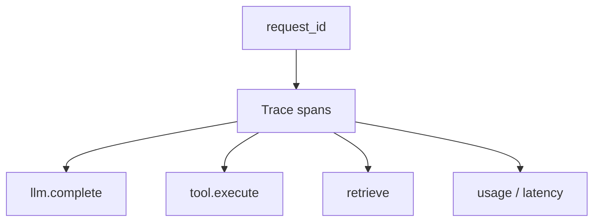
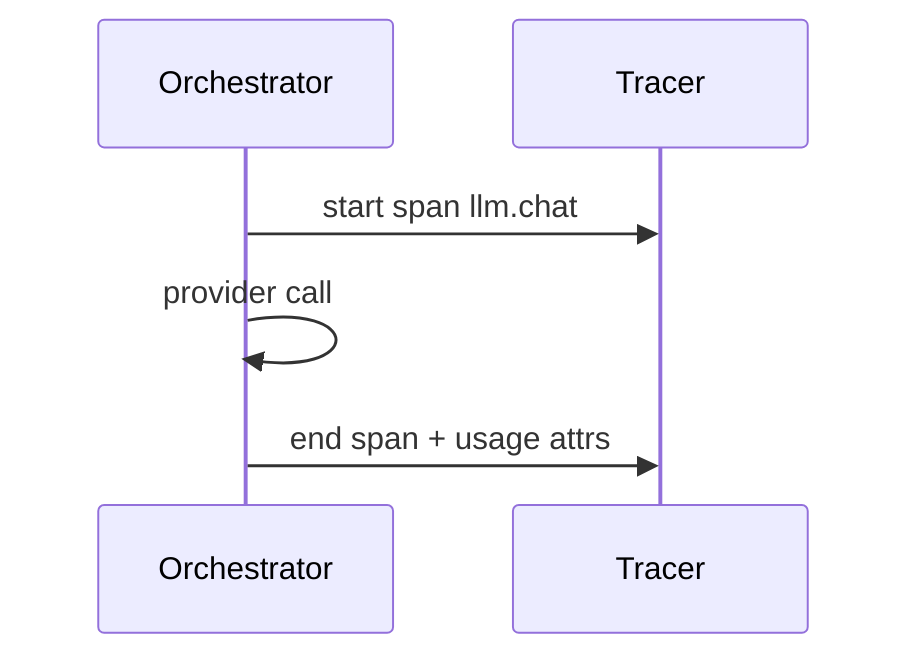

# Observability Hooks

> Observability hooks make LLM apps debuggable — traces across orchestrator steps, usage metrics, and redacted logs.

## Table of Contents

- [Overview](#overview)
- [Definition](#definition)
- [Why it matters](#why-it-matters)
- [Uses](#uses)
- [How it works](#how-it-works)
- [Worked examples / scenarios](#worked-examples-scenarios)
- [Python Examples](#python-examples)
- [Production Considerations](#production-considerations)
- [Performance Considerations](#performance-considerations)
- [Cost Considerations](#cost-considerations)
- [Security Considerations](#security-considerations)
- [Best Practices](#best-practices)
- [Common Mistakes](#common-mistakes)
- [Interview Preparation](#interview-preparation)
- [Navigation](#navigation)

---

## Overview

You cannot improve what you cannot see. LLM apps need request traces spanning retrieval, model calls, and tools — plus usage/cost metrics and privacy-safe logs.



> **Prerequisites:** [Request Lifecycle](../../foundations/02-request-lifecycle.md) · [LLM App Building Checklist](01-llm-app-building-checklist.md)

---

## Definition

**Observability hooks** are instrumentation points in the LLM request lifecycle that emit traces, metrics, and logs (with redaction) so teams can debug quality, latency, cost, and failures.

---

## Why it matters

| Blind | Instrumented |
|-------|--------------|
| "Model bad today" | Span shows retrieval empty |
| Cost mystery | Per-tenant TPM dashboards |
| Slow chat | TTFT vs tool time split |

---

## Uses

| Signal | Examples |
|--------|----------|
| Trace spans | `orch.turn`, `llm.chat`, `tool.refund` |
| Metrics | TTFT, tokens, cost, error rate, cancel rate |
| Logs | Redacted errors, route decisions |
| Eval sample | Online score / LLM-as-judge sample |

---

## How it works

### Minimum spans

- Edge request
- Each LLM call (model, tokens, latency)
- Each tool (name, latency, status)
- Retrieval (hit count, latency)

### Redaction

Strip API keys, secrets, and configure PII scrubbing before export.



---

## Worked examples / scenarios

### Empty retrieval

Users say answers are generic. Trace shows `retrieve` returned 0 hits due to bad tenant filter — not a prompt issue.

### Canary attribution

Metric `quality_score` broken down by `flag_prompt_v3` shows regression.

---

## Python Examples

### Span decorator sketch

```python
from contextlib import asynccontextmanager
import time

@asynccontextmanager
async def span(name: str, **attrs):
    start = time.time()
    try:
        yield
        tracer.emit(name, ok=True, ms=(time.time()-start)*1000, **attrs)
    except Exception as e:
        tracer.emit(name, ok=False, error=type(e).__name__, ms=(time.time()-start)*1000, **attrs)
        raise

async def complete(messages, model):
    async with span("llm.chat", model=model):
        return await client.chat.completions.create(model=model, messages=messages)
```

### Usage metric

```python
async def record_usage(tenant_id, usage, request_id):
    await metrics.incr("llm_tokens", tenant_id=tenant_id, tokens=usage.total_tokens)
    await db.insert_usage(tenant_id, usage, request_id)
```

---

## Production Considerations

- Standard attribute names (`tenant_id`, `model`, `request_id`).
- Sample high-volume traces; always keep error traces.

## Performance Considerations

- Async export; do not block responses on slow collectors.
- Bound attribute payload size.

## Cost Considerations

- Dashboards for $ / tenant / feature.
- Alert on sudden TPM spikes.

## Security Considerations

- Default redact prompts in prod exports.
- Separate access control for raw generation stores.

---

## Best Practices

1. One request_id everywhere.
2. Span every external call.
3. Redact by default.
4. Tie canary flags into metric dimensions.

## Common Mistakes

- Logging raw prompts with secrets
- Metrics without tenant labels
- No TTFT metric for streaming
- Tracing only the HTTP edge

---

## Interview Preparation

**Q: What are the top three LLM metrics?**  
**A:** Quality (task-specific), latency (TTFT + total), and cost/tokens — plus error/cancel rates for reliability.


---

## Navigation

### This section — Production

| # | Topic | Document |
|---|-------|----------|
| 1 | LLM App Building Checklist | [LLM App Building Checklist](01-llm-app-building-checklist.md) |
| 2 | Config and Feature Flags | [Config and Feature Flags](02-config-and-feature-flags.md) |
| 3 | Release and Rollout | [Release and Rollout](03-release-and-rollout.md) |
| 4 | Observability Hooks | **You are here** |

### Path

- Previous: [Release and Rollout](03-release-and-rollout.md)
- Next: — (end of domain)
- Section hub: [Production](README.md)
- Domain hub: [LLM Application Development](../README.md)

### Related topics

- [MLOps & LLMOps](../../mlops-llmops/README.md)
- [Release and Rollout](03-release-and-rollout.md)

