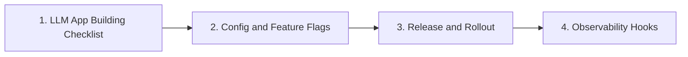

# Production

> Ship checklists, config/feature flags, rollout, and observability hooks.

**Parent:** [LLM Application Development](../README.md)

---

## Topics

| # | Topic | Document |
|---|-------|----------|
| 1 | LLM App Building Checklist | [01-llm-app-building-checklist.md](01-llm-app-building-checklist.md) |
| 2 | Config and Feature Flags | [02-config-and-feature-flags.md](02-config-and-feature-flags.md) |
| 3 | Release and Rollout | [03-release-and-rollout.md](03-release-and-rollout.md) |
| 4 | Observability Hooks | [04-observability-hooks.md](04-observability-hooks.md) |

---

## Learning path

