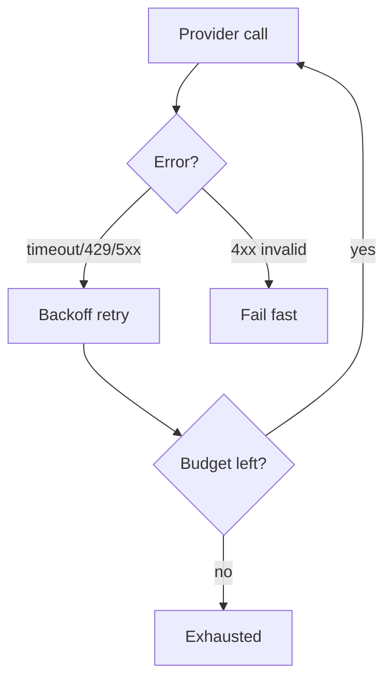
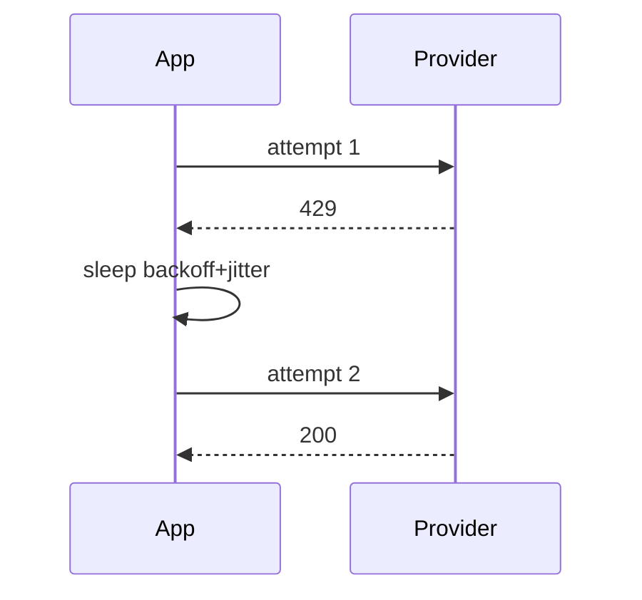

# Retries and Timeouts

> Retry transient LLM failures with backoff and budgets — never blindly retry non-idempotent or invalid requests.

## Table of Contents

- [Overview](#overview)
- [Definition](#definition)
- [Why it matters](#why-it-matters)
- [Uses](#uses)
- [How it works](#how-it-works)
- [Worked examples / scenarios](#worked-examples-scenarios)
- [Python Examples](#python-examples)
- [Production Considerations](#production-considerations)
- [Performance Considerations](#performance-considerations)
- [Cost Considerations](#cost-considerations)
- [Security Considerations](#security-considerations)
- [Best Practices](#best-practices)
- [Common Mistakes](#common-mistakes)
- [Interview Preparation](#interview-preparation)
- [Navigation](#navigation)

---

## Overview

Providers fail with 429s and 503s. Naive retries amplify outages and duplicate side effects. Pair an error taxonomy with timeouts, exponential backoff, and jitter.



> **Prerequisites:** [Cancellation and Timeouts](../apis-and-ux/04-cancellation-and-timeouts.md)

---

## Definition

**Retries and timeouts** are reliability controls that bound how long each LLM/tool attempt may run and whether failed attempts are safely re-executed under a policy driven by error type and idempotency.

---

## Why it matters

| Policy | Outcome |
|--------|---------|
| Retry everything | Duplicate tools / cost spikes |
| Retry nothing | Fragile UX on blips |
| Timeout only at client | Orphaned server work |

---

## Uses

| Error | Action |
|-------|--------|
| 429 rate limit | Retry-After / exponential backoff |
| 503 unavailable | Retry with jitter |
| 400 bad request | Do not retry |
| Tool side effect unknown | Dedup key or compensate |

---

## How it works

### Attempt budget

Cap total attempts and total wall time. Example: 3 attempts, 30s overall.

### Jitter

Add random jitter to avoid synchronized retry storms.



---

## Worked examples / scenarios

### Double charge

Retrying `create_refund` tool without idempotency key refunds twice. Fix: tool-level idempotency or no retry on success-unknown without probe.

### Latency budget

Chat turn must finish in 60s; retries must leave time for a final attempt.

---

## Python Examples

### Retry helper

```python
import asyncio, random
from typing import Callable, Awaitable

async def with_retries(fn: Callable[[], Awaitable], *, attempts=3, base=0.5, retry_on=(RateLimited, ProviderUnavailable)):
    last = None
    for i in range(attempts):
        try:
            return await fn()
        except retry_on as e:
            last = e
            if i == attempts - 1:
                break
            await asyncio.sleep(base * (2 ** i) + random.random() * 0.1)
    raise last
```

### Per-call timeout

```python
async def complete_with_timeout(messages):
    return await asyncio.wait_for(llm.complete(messages), timeout=45)
```

---

## Production Considerations

- Centralize retry policy; do not scatter magic numbers.
- Honor `Retry-After` when present.

## Performance Considerations

- Retries increase tail latency — measure p95/p99 with retries enabled.
- Use hedged requests only with idempotency.

## Cost Considerations

- Count retried tokens in cost dashboards.
- Back off harder on 429 to protect budgets.

## Security Considerations

- Do not retry on auth errors with alternate credentials automatically without audit.

---

## Best Practices

1. Classify errors first.
2. Exponential backoff + jitter.
3. Overall deadline.
4. Idempotency for unsafe retries.

## Common Mistakes

- Retrying validation errors
- No max attempts
- Synchronized retries without jitter
- Ignoring tool idempotency

---

## Interview Preparation

**Q: Should you retry all LLM 500 errors?**  
**A:** Usually yes with backoff and a budget, but only if the operation is safe to repeat or guarded by idempotency; stop on client errors.


---

## Navigation

### This section — Reliability

| # | Topic | Document |
|---|-------|----------|
| 1 | Retries and Timeouts | **You are here** |
| 2 | Idempotency and Dedup | [Idempotency and Dedup](02-idempotency-and-dedup.md) |
| 3 | Fallbacks and Circuit Breakers | [Fallbacks and Circuit Breakers](03-fallbacks-and-circuit-breakers.md) |
| 4 | Graceful Degradation | [Graceful Degradation](04-graceful-degradation.md) |

### Path

- Previous: [Cancellation and Timeouts](../apis-and-ux/04-cancellation-and-timeouts.md)
- Next: [Idempotency and Dedup](02-idempotency-and-dedup.md)
- Section hub: [Reliability](README.md)
- Domain hub: [LLM Application Development](../README.md)

### Related topics

- [Idempotency and Dedup](02-idempotency-and-dedup.md)
- [Fallbacks and Circuit Breakers](03-fallbacks-and-circuit-breakers.md)

