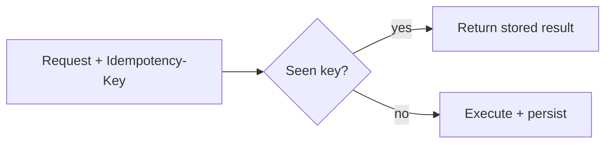
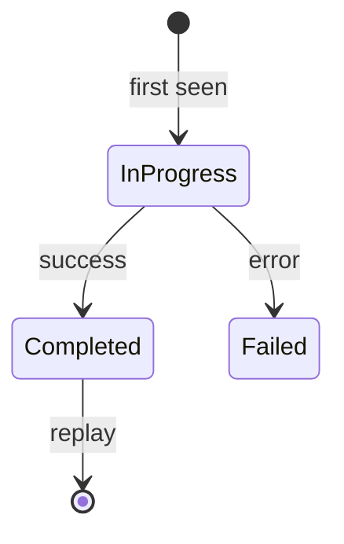

# Idempotency and Dedup

> Idempotency keys and dedup stores keep retries and double-clicks from duplicating LLM turns and tool side effects.

## Table of Contents

- [Overview](#overview)
- [Definition](#definition)
- [Why it matters](#why-it-matters)
- [Uses](#uses)
- [How it works](#how-it-works)
- [Worked examples / scenarios](#worked-examples-scenarios)
- [Python Examples](#python-examples)
- [Production Considerations](#production-considerations)
- [Performance Considerations](#performance-considerations)
- [Cost Considerations](#cost-considerations)
- [Security Considerations](#security-considerations)
- [Best Practices](#best-practices)
- [Common Mistakes](#common-mistakes)
- [Interview Preparation](#interview-preparation)
- [Navigation](#navigation)

---

## Overview

Networks retry. Users double-submit. Workers redeliver. LLM apps need idempotency for turns and for tools that mutate external systems.



> **Prerequisites:** [Retries and Timeouts](01-retries-and-timeouts.md) · [Chat APIs](../apis-and-ux/01-chat-apis.md)

---

## Definition

**Idempotency** means performing the same logical request multiple times has the same effect as once. **Dedup** is the mechanism (usually a keyed store) that detects repeats and replays the original result.

---

## Why it matters

| Without idempotency | With |
|---------------------|------|
| Duplicate assistant messages | One turn |
| Double ticket create | One ticket |
| Inflated bills | Stable usage |

---

## Uses

| Operation | Key scope |
|-----------|-----------|
| Chat turn | user + thread + Idempotency-Key |
| Job enqueue | tenant + key |
| Tool mutate | tool + natural key / key header |

---

## How it works

### Store semantics

For key K: if in-progress, wait or return 409; if completed, return cached response; else execute and write.

TTL keys long enough to cover client retries (e.g., 24h).



---

## Worked examples / scenarios

### Streaming turns

Idempotency is trickier mid-stream: store the final message id; retries attach to the same turn resource rather than starting a new generation if completed.

### Provider-level

Some vendors support idempotency headers — still keep your app-level key for tools and DB writes.

---

## Python Examples

### Redis idempotency sketch

```python
async def idempotent(key: str, fn):
    existing = await redis.get(f"idem:{key}")
    if existing:
        return json.loads(existing)
    ok = await redis.set(f"idem:{key}:lock", "1", nx=True, ex=60)
    if not ok:
        raise HTTPException(409, "request in progress")
    result = await fn()
    await redis.set(f"idem:{key}", json.dumps(result), ex=86400)
    await redis.delete(f"idem:{key}:lock")
    return result
```

---

## Production Considerations

- Document required idempotency headers in OpenAPI.
- Include request hash optional validation (same key, different body → 422).

## Performance Considerations

- Use Redis/memory store with TTL; avoid heavy DB rows if possible.

## Cost Considerations

- Dedup prevents duplicate provider spend on client retries.

## Security Considerations

- Namespace keys by tenant.
- Authorize replay to the same principal.

---

## Best Practices

1. Client-generated UUIDs for keys.
2. Compare body hash on conflict.
3. Apply to mutating tools.
4. Metrics for dedup hit rate.

## Common Mistakes

- Keys without tenant prefix
- Infinite TTL growth
- Assuming GET-only needs no care for job creation side paths
- Deduping before authz

---

## Interview Preparation

**Q: How do idempotency keys interact with streaming?**  
**A:** Key the logical turn; if a prior turn completed, return/reconnect to that message instead of starting a new provider call.


---

## Navigation

### This section — Reliability

| # | Topic | Document |
|---|-------|----------|
| 1 | Retries and Timeouts | [Retries and Timeouts](01-retries-and-timeouts.md) |
| 2 | Idempotency and Dedup | **You are here** |
| 3 | Fallbacks and Circuit Breakers | [Fallbacks and Circuit Breakers](03-fallbacks-and-circuit-breakers.md) |
| 4 | Graceful Degradation | [Graceful Degradation](04-graceful-degradation.md) |

### Path

- Previous: [Retries and Timeouts](01-retries-and-timeouts.md)
- Next: [Fallbacks and Circuit Breakers](03-fallbacks-and-circuit-breakers.md)
- Section hub: [Reliability](README.md)
- Domain hub: [LLM Application Development](../README.md)

### Related topics

- [Chat APIs](../apis-and-ux/01-chat-apis.md)
- [Retries and Timeouts](01-retries-and-timeouts.md)

