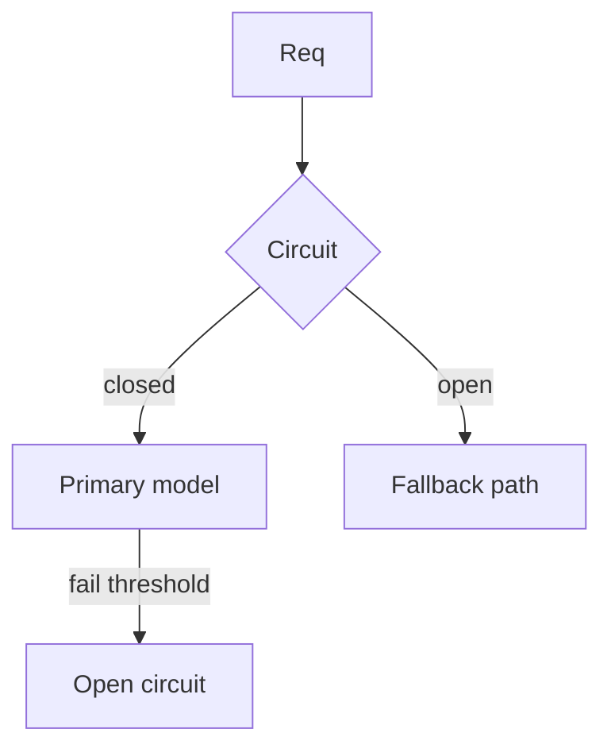
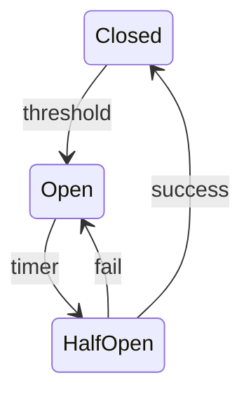

# Fallbacks and Circuit Breakers

> Circuit breakers stop calling a sick provider; fallbacks keep the product useful with alternate models or degraded modes.

## Table of Contents

- [Overview](#overview)
- [Definition](#definition)
- [Why it matters](#why-it-matters)
- [Uses](#uses)
- [How it works](#how-it-works)
- [Worked examples / scenarios](#worked-examples-scenarios)
- [Python Examples](#python-examples)
- [Production Considerations](#production-considerations)
- [Performance Considerations](#performance-considerations)
- [Cost Considerations](#cost-considerations)
- [Security Considerations](#security-considerations)
- [Best Practices](#best-practices)
- [Common Mistakes](#common-mistakes)
- [Interview Preparation](#interview-preparation)
- [Navigation](#navigation)

---

## Overview

When error rates spike, continue hammering the provider hurts everyone. Open a circuit, fail fast, and route to fallbacks.



> **Prerequisites:** [Provider Adapters and Gateways](../architecture/03-provider-adapters-and-gateways.md)

---

## Definition

A **circuit breaker** temporarily blocks calls to an unhealthy dependency after consecutive failures. A **fallback** is an alternate path (secondary model, cache, or reduced feature) used when the primary cannot serve.

---

## Why it matters

| Always call primary | With breaker + fallback |
|---------------------|-------------------------|
| Cascading latency | Fail fast |
| Total outage UX | Partial service |
| Meltdown retries | Controlled recovery |

---

## Uses

| Fallback | Example |
|----------|---------|
| Secondary vendor | Anthropic if OpenAI down |
| Smaller model | Quality dip, availability up |
| Cached answer | FAQ hot questions |
| Non-LLM path | Template / search-only |

---

## How it works

### Breaker states

Closed → Open (after N failures) → Half-open (trial request) → Closed on success.

### Fallback policy

Map feature → ordered candidates. Not every feature should silently change models — flag it in response metadata.



---

## Worked examples / scenarios

### Provider regional outage

Primary error rate 40%. Breaker opens in 30s; traffic shifts to secondary; clients see `fallback_model` in metadata.

### Tool dependency down

Search tool circuit opens → RAG answers with "limited context" degradation path.

---

## Python Examples

### Tiny circuit breaker

```python
import time

class CircuitBreaker:
    def __init__(self, threshold=5, reset_after=30):
        self.failures = 0
        self.threshold = threshold
        self.reset_after = reset_after
        self.opened_at = None

    def allow(self) -> bool:
        if self.opened_at is None:
            return True
        if time.time() - self.opened_at > self.reset_after:
            return True  # half-open trial
        return False

    def record(self, ok: bool):
        if ok:
            self.failures = 0
            self.opened_at = None
        else:
            self.failures += 1
            if self.failures >= self.threshold:
                self.opened_at = time.time()
```

---

## Production Considerations

- Alert on open circuits.
- Include fallback metadata for support.

## Performance Considerations

- Fail fast when open — do not wait full timeout.
- Separate breakers per dependency.

## Cost Considerations

- Secondary may be pricier — cap fallback volume.
- Prefer cache fallbacks for hot FAQs.

## Security Considerations

- Fallback models must honor same safety policy.
- Do not fall back to an unauthenticated tool path.

---

## Best Practices

1. Breaker per provider/model.
2. Explicit fallback order in config.
3. Half-open probes.
4. UX honesty when degraded.

## Common Mistakes

- One global breaker for all models
- Silent quality drops without telemetry
- Fallback to unsafe tools
- Never resetting open circuits

---

## Interview Preparation

**Q: How is a circuit breaker different from retries?**  
**A:** Retries help with rare blips; breakers stop calling a dependency that is actively unhealthy so the system can shed load and use fallbacks.


---

## Navigation

### This section — Reliability

| # | Topic | Document |
|---|-------|----------|
| 1 | Retries and Timeouts | [Retries and Timeouts](01-retries-and-timeouts.md) |
| 2 | Idempotency and Dedup | [Idempotency and Dedup](02-idempotency-and-dedup.md) |
| 3 | Fallbacks and Circuit Breakers | **You are here** |
| 4 | Graceful Degradation | [Graceful Degradation](04-graceful-degradation.md) |

### Path

- Previous: [Idempotency and Dedup](02-idempotency-and-dedup.md)
- Next: [Graceful Degradation](04-graceful-degradation.md)
- Section hub: [Reliability](README.md)
- Domain hub: [LLM Application Development](../README.md)

### Related topics

- [Graceful Degradation](04-graceful-degradation.md)
- [Provider Adapters and Gateways](../architecture/03-provider-adapters-and-gateways.md)

