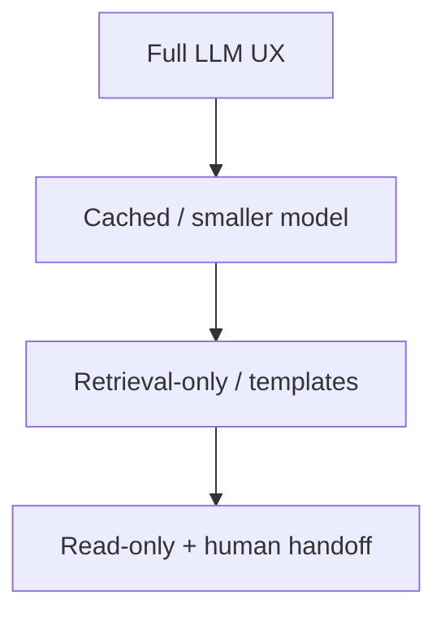
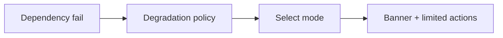

# Graceful Degradation

> Graceful degradation keeps a useful subset of the product alive when LLMs or dependencies fail — with honest UX.

## Table of Contents

- [Overview](#overview)
- [Definition](#definition)
- [Why it matters](#why-it-matters)
- [Uses](#uses)
- [How it works](#how-it-works)
- [Worked examples / scenarios](#worked-examples-scenarios)
- [Python Examples](#python-examples)
- [Production Considerations](#production-considerations)
- [Performance Considerations](#performance-considerations)
- [Cost Considerations](#cost-considerations)
- [Security Considerations](#security-considerations)
- [Best Practices](#best-practices)
- [Common Mistakes](#common-mistakes)
- [Interview Preparation](#interview-preparation)
- [Navigation](#navigation)

---

## Overview

Full outages are rare; partial failures are common: embeddings up, generator down; tools failing; latency exceeding SLO. Plan degraded modes before you need them.



> **Prerequisites:** [Fallbacks and Circuit Breakers](03-fallbacks-and-circuit-breakers.md)

---

## Definition

**Graceful degradation** is a deliberate reduction in feature richness or quality that preserves core user value and safety when dependencies fail or budgets are exceeded.

---

## Why it matters

| Hard fail all features | Degrade |
|------------------------|---------|
| Blank error page | Still search docs |
| Angry churn | Trust via honesty |
| Support spike | Guided handoff |

---

## Uses

| Trigger | Degraded mode |
|---------|----------------|
| Generator down | Show top retrieved chunks |
| Tools down | Answer without actions |
| Budget exceeded | Queue / slower model |
| Safety uncertainty | Refuse + escalate |

---

## How it works

### Feature matrix

Define must-have vs nice-to-have. Example: "view history" must work without LLM; "auto-refund" must not degrade to unsupervised mode.

### UX honesty

Banner: "Limited mode: answers may be less precise." Include `degraded_reason` in API.



---

## Worked examples / scenarios

### Black Friday load

TPM caps hit → router sends FAQ intents to cached answers; complex intents get "try again" with ETA.

### RAG outage

Generator still up → answer with stronger "I may lack docs" grounding disclaimer and lower confidence.

---

## Python Examples

### Degradation policy

```python
class Mode(str, Enum):
    FULL = "full"
    SMALL_MODEL = "small_model"
    RETRIEVE_ONLY = "retrieve_only"
    HANDOFF = "handoff"

def select_mode(health: dict, budget: dict) -> Mode:
    if not health.get("generator"):
        return Mode.RETRIEVE_ONLY if health.get("retriever") else Mode.HANDOFF
    if budget["tpm_remaining"] < 1_000:
        return Mode.SMALL_MODEL
    return Mode.FULL
```

---

## Production Considerations

- Run game days that force each degraded mode.
- Document modes in status page language.

## Performance Considerations

- Degraded paths should be faster/cheaper, not slower dumps.

## Cost Considerations

- Use degradation to shed cost under budget pressure.

## Security Considerations

- Never degrade by disabling authz or safety filters.
- Handoff channels must not leak context across tenants.

---

## Best Practices

1. Write a degradation matrix in the design doc.
2. Signal mode to clients.
3. Keep read paths alive.
4. Prefer refuse over unsafe automation.

## Common Mistakes

- Silent quality drops
- Degrading into unrestricted tools
- No handoff path
- Coupling 'degraded' to 'unauthenticated'

---

## Interview Preparation

**Q: What must never degrade?**  
**A:** Authentication, authorization, and safety/policy enforcement. Degrade capabilities, not controls.


---

## Navigation

### This section — Reliability

| # | Topic | Document |
|---|-------|----------|
| 1 | Retries and Timeouts | [Retries and Timeouts](01-retries-and-timeouts.md) |
| 2 | Idempotency and Dedup | [Idempotency and Dedup](02-idempotency-and-dedup.md) |
| 3 | Fallbacks and Circuit Breakers | [Fallbacks and Circuit Breakers](03-fallbacks-and-circuit-breakers.md) |
| 4 | Graceful Degradation | **You are here** |

### Path

- Previous: [Fallbacks and Circuit Breakers](03-fallbacks-and-circuit-breakers.md)
- Next: [LLM App Building Checklist](../production/01-llm-app-building-checklist.md)
- Section hub: [Reliability](README.md)
- Domain hub: [LLM Application Development](../README.md)

### Related topics

- [Fallbacks and Circuit Breakers](03-fallbacks-and-circuit-breakers.md)
- [Routers and Classifiers](../orchestration/03-routers-and-classifiers.md)

