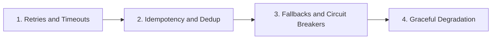

# Reliability

> Retries, idempotency, circuit breakers, fallbacks, and graceful degradation.

**Parent:** [LLM Application Development](../README.md)

---

## Topics

| # | Topic | Document |
|---|-------|----------|
| 1 | Retries and Timeouts | [01-retries-and-timeouts.md](01-retries-and-timeouts.md) |
| 2 | Idempotency and Dedup | [02-idempotency-and-dedup.md](02-idempotency-and-dedup.md) |
| 3 | Fallbacks and Circuit Breakers | [03-fallbacks-and-circuit-breakers.md](03-fallbacks-and-circuit-breakers.md) |
| 4 | Graceful Degradation | [04-graceful-degradation.md](04-graceful-degradation.md) |

---

## Learning path

