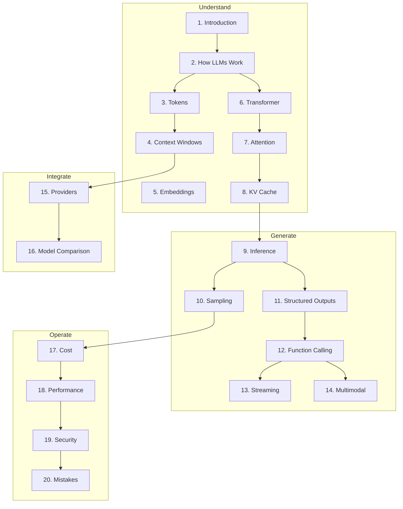

# LLM Engineering

> Production-oriented handbook for understanding, integrating, optimizing, and deploying Large Language Models.
> **Prerequisites:** [Foundations](../foundations/README.md) · [Backend Engineering](../backend-engineering/README.md)

---

## Module Overview

This handbook is the core LLM reference for the entire playbook. Later modules (Prompt Engineering, RAG, Agents, Evaluation) build directly on this module.

---

## Documents

### Core Concepts (Sections 1–8)

| Section | Document | Description |
|---------|----------|-------------|
| 1 | [Introduction to LLM Engineering](introduction-to-llm-engineering.md) | What LLMs are, ecosystem, end-to-end architecture |
| 2 | [How LLMs Work](how-llms-work.md) | Text → tokens → transformer → output pipeline |
| 3 | [Tokens and Tokenization](tokens-and-tokenization.md) | BPE, counting, cost calculation |
| 4 | [Context Windows](context-windows.md) | Budgeting, truncation, lost-in-the-middle |
| 5 | [Embeddings — LLM Perspective](embeddings-llm-perspective.md) | Vectors and similarity (RAG deep dive in this handbook+) |
| 6 | [Transformer Intuition](transformer-intuition.md) | Decoder architecture for engineers |
| 7 | [Attention Mechanism](attention-mechanism.md) | Q/K/V, quality and latency impact |
| 8 | [KV Cache](kv-cache.md) | Prefill, decode, memory, streaming |

### Generation & Integration (Sections 9–14)

| Section | Document | Description |
|---------|----------|-------------|
| 9 | [LLM Inference](llm-inference.md) | Batching, streaming, latency, throughput |
| 10 | [Sampling and Decoding](sampling-and-decoding.md) | Temperature, top-p, penalties |
| 11 | [Structured Outputs](structured-outputs.md) | JSON mode, Pydantic, multi-provider |
| 12 | [Function Calling and Tools](function-calling-and-tools.md) | Tool orchestration and security |
| 13 | [LLM Streaming](llm-streaming.md) | SSE, UX, FastAPI patterns |
| 14 | [Vision and Multimodal Models](vision-and-multimodal-models.md) | Images, audio, video workflows |

### Providers (Section 15)

| Provider | Document |
|----------|----------|
| OpenAI | [providers/openai.md](providers/openai.md) |
| Google Gemini | [providers/google-gemini.md](providers/google-gemini.md) |
| Anthropic Claude | [providers/anthropic-claude.md](providers/anthropic-claude.md) |
| Groq | [providers/groq.md](providers/groq.md) |
| OpenRouter | [providers/openrouter.md](providers/openrouter.md) |
| Ollama | [providers/ollama.md](providers/ollama.md) |

### Production (Sections 16–20)

| Section | Document | Description |
|---------|----------|-------------|
| 16 | [Model Comparison Guide](model-comparison-guide.md) | 9 model families compared |
| 17 | [LLM Cost Optimization](llm-cost-optimization.md) | Token reduction, caching, monitoring |
| 18 | [LLM Performance Optimization](llm-performance-optimization.md) | Latency, routing, parallel requests |
| 19 | [LLM Security Fundamentals](llm-security-fundamentals.md) | Prompt injection, secrets, tool security |
| 20 | [LLM Engineering Mistakes](llm-engineering-mistakes.md) | 12 failure patterns with fixes |

---

## Code Examples

[examples/llm-applications/](../../examples/llm-applications/) — 12 provider integration examples

## Cheat Sheets

- [Sampling Parameters](../../cheat-sheets/llm-sampling-parameters.md)
- [Provider APIs](../../cheat-sheets/llm-provider-apis.md)
- [Token Limits & Pricing](../../cheat-sheets/llm-token-limits-pricing.md)

---

## Learning Path

1. **Understand** — Introduction → How LLMs Work → Tokens → Context Windows
2. **Architecture intuition** — Transformer → Attention → KV Cache
3. **Generate** — Inference → Sampling → Structured Outputs → Function Calling
4. **Integrate** — Streaming → pick a provider guide → hands-on examples
5. **Operate** — Model Comparison → Cost → Performance → Security → Mistakes

**Milestone:** Streaming chat API with structured outputs, tool calling, provider fallback, and cost controls.

---

## Completion Checklist

- [ ] Read Sections 1–14 in order
- [ ] Run at least 3 provider examples (OpenAI + one alternative)
- [ ] Implement streaming with SSE in FastAPI
- [ ] Build a function-calling agent loop with error handling
- [ ] Add token counting and cost estimation to your service
- [ ] Configure model fallback (primary + cheap fallback)
- [ ] Review [LLM Engineering Mistakes](llm-engineering-mistakes.md) against your code

**What this unlocks:**
- [Prompt Engineering](../prompt-engineering/README.md)
- [Context Engineering](../context-engineering/README.md)
- [RAG](../rag/README.md)
- [AI Agents](../ai-agents/README.md)

---

## See Also

- [Master Index](../../meta/indexes/MASTER-INDEX.md)
- [Glossary](../../meta/glossary.md)
- [Learning Roadmap](../../meta/roadmap.md)
