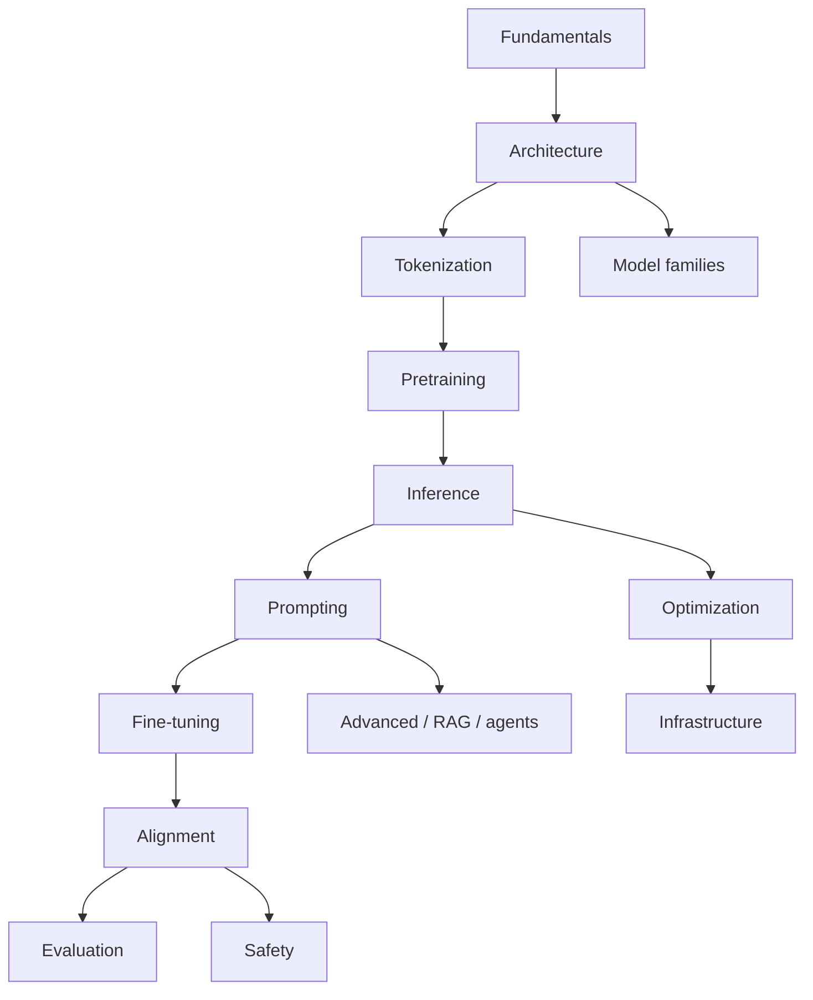

# Large Language Models (LLMs)

> End-to-end LLM curriculum — fundamentals through pretraining, inference, alignment, safety, and infrastructure.

**Prerequisites:** [Deep Learning](../deep-learning/README.md) · [Transformers](../transformers/README.md) · [Natural Language Processing](../natural-language-processing/README.md)  
**Unlocks:** [Prompt Engineering](../prompt-engineering/README.md) · [RAG](../rag/README.md) · [LLM Fine-Tuning](../llm-fine-tuning/README.md) · [AI Agents](../ai-agents/README.md)

Start with a section hub below (or expand **8. Large Language Models** in the left sidebar).

---

## Sections

| # | Section | What you will learn | Hub |
|---|---------|---------------------|-----|
| 1 | **LLM Fundamentals** | What LLMs are, scale, context | [llm-fundamentals/](llm-fundamentals/README.md) |
| 2 | **LLM Architecture** | Decoder-only guts, attention, KV cache | [llm-architecture/](llm-architecture/README.md) |
| 3 | **Tokenization** | BPE/WordPiece/SentencePiece, special tokens | [tokenization/](tokenization/README.md) |
| 4 | **LLM Pretraining** | Data pipelines, CLM, scaling laws | [llm-pretraining/](llm-pretraining/README.md) |
| 5 | **LLM Inference** | Decoding, sampling, batching | [llm-inference/](llm-inference/README.md) |
| 6 | **Prompting** | Zero/few-shot, CoT, chat roles | [prompting/](prompting/README.md) |
| 7 | **LLM Fine-Tuning** | SFT, LoRA/QLoRA, datasets | [llm-fine-tuning/](llm-fine-tuning/README.md) |
| 8 | **LLM Alignment** | RLHF, DPO, preferences | [llm-alignment/](llm-alignment/README.md) |
| 9 | **LLM Evaluation** | Metrics, judges, hallucination | [llm-evaluation/](llm-evaluation/README.md) |
| 10 | **LLM Optimization** | Quant, FlashAttn, speculative decode | [llm-optimization/](llm-optimization/README.md) |
| 11 | **LLM Architectures** | GPT/LLaMA/Mistral/…, MoE, SLMs | [llm-model-families/](llm-model-families/README.md) |
| 12 | **Advanced LLM Concepts** | Long context, RAG, tools, agents | [advanced-llm-concepts/](advanced-llm-concepts/README.md) |
| 13 | **LLM Safety** | Hallucination, injection, guardrails | [llm-safety/](llm-safety/README.md) |
| 14 | **LLM Infrastructure** | Parallelism, serving, deployment | [llm-infrastructure/](llm-infrastructure/README.md) |

```mermaid
flowchart TB
  F[Fundamentals] --> Arch[Architecture]
  Arch --> Tok[Tokenization]
  Tok --> PT[Pretraining]
  PT --> Inf[Inference]
  Inf --> Prompt[Prompting]
  Prompt --> FT[Fine-tuning]
  FT --> Align[Alignment]
  Align --> Eval[Evaluation]
  Inf --> Opt[Optimization]
  Arch --> Fam[Model families]
  Prompt --> Adv[Advanced / RAG / agents]
  Align --> Safe[Safety]
  Opt --> Infra[Infrastructure]
```

---

## Hierarchy

### 1. LLM Fundamentals

| # | Topic |
|---|-------|
| 1 | [What are LLMs](llm-fundamentals/01-what-are-llms.md) |
| 2 | [Evolution of Language Models](llm-fundamentals/02-evolution-of-language-models.md) |
| 3 | [LLM vs NLP vs Generative AI](llm-fundamentals/03-llm-vs-nlp-vs-generative-ai.md) |
| 4 | [Foundation Models](llm-fundamentals/04-foundation-models.md) |
| 5 | [Parameters & Model Size](llm-fundamentals/05-parameters-and-model-size.md) |
| 6 | [Context Window](llm-fundamentals/06-context-window.md) |

### 2. LLM Architecture

| # | Topic |
|---|-------|
| 1 | [Decoder-Only Architecture](llm-architecture/01-decoder-only-architecture.md) |
| 2 | [Transformer Blocks](llm-architecture/02-transformer-blocks.md) |
| 3 | [Self-Attention](llm-architecture/03-self-attention.md) |
| 4 | [Multi-Head Attention](llm-architecture/04-multi-head-attention.md) |
| 5 | [Feed-Forward Networks](llm-architecture/05-feed-forward-networks.md) |
| 6 | [Layer Normalization](llm-architecture/06-layer-normalization.md) |
| 7 | [Residual Connections](llm-architecture/07-residual-connections.md) |
| 8 | [Positional Encoding](llm-architecture/08-positional-encoding.md) |
| 9 | [KV Cache](llm-architecture/09-kv-cache.md) |

### 3. Tokenization

| # | Topic |
|---|-------|
| 1 | [Tokenization](tokenization/01-tokenization.md) |
| 2 | [Subword Tokenization](tokenization/02-subword-tokenization.md) |
| 3 | [BPE](tokenization/03-bpe.md) |
| 4 | [WordPiece](tokenization/04-wordpiece.md) |
| 5 | [SentencePiece](tokenization/05-sentencepiece.md) |
| 6 | [Token Vocabulary](tokenization/06-token-vocabulary.md) |
| 7 | [Special Tokens](tokenization/07-special-tokens.md) |
| 8 | [Token Embeddings](tokenization/08-token-embeddings.md) |

### 4. LLM Pretraining

| # | Topic |
|---|-------|
| 1 | [Pretraining Data](llm-pretraining/01-pretraining-data.md) |
| 2 | [Data Collection](llm-pretraining/02-data-collection.md) |
| 3 | [Data Cleaning](llm-pretraining/03-data-cleaning.md) |
| 4 | [Data Deduplication](llm-pretraining/04-data-deduplication.md) |
| 5 | [Data Filtering](llm-pretraining/05-data-filtering.md) |
| 6 | [Causal Language Modeling](llm-pretraining/06-causal-language-modeling.md) |
| 7 | [Next-Token Prediction](llm-pretraining/07-next-token-prediction.md) |
| 8 | [Training Objectives](llm-pretraining/08-training-objectives.md) |
| 9 | [Distributed Training](llm-pretraining/09-distributed-training.md) |
| 10 | [Scaling Laws](llm-pretraining/10-scaling-laws.md) |

### 5. LLM Inference

| # | Topic |
|---|-------|
| 1 | [Autoregressive Generation](llm-inference/01-autoregressive-generation.md) |
| 2 | [Decoding](llm-inference/02-decoding.md) |
| 3 | [Greedy Decoding](llm-inference/03-greedy-decoding.md) |
| 4 | [Beam Search](llm-inference/04-beam-search.md) |
| 5 | [Temperature](llm-inference/05-temperature.md) |
| 6 | [Top-K](llm-inference/06-top-k.md) |
| 7 | [Top-P](llm-inference/07-top-p.md) |
| 8 | [Repetition Penalty](llm-inference/08-repetition-penalty.md) |
| 9 | [KV Caching](llm-inference/09-kv-caching.md) |
| 10 | [Batch Inference](llm-inference/10-batch-inference.md) |

### 6. Prompting

| # | Topic |
|---|-------|
| 1 | [Prompt Engineering](prompting/01-prompt-engineering.md) |
| 2 | [Zero-Shot Prompting](prompting/02-zero-shot-prompting.md) |
| 3 | [Few-Shot Prompting](prompting/03-few-shot-prompting.md) |
| 4 | [Chain-of-Thought](prompting/04-chain-of-thought.md) |
| 5 | [Role Prompting](prompting/05-role-prompting.md) |
| 6 | [Structured Prompting](prompting/06-structured-prompting.md) |
| 7 | [System/User/Assistant Messages](prompting/07-system-user-assistant-messages.md) |
| 8 | [Prompt Templates](prompting/08-prompt-templates.md) |

### 7. LLM Fine-Tuning

| # | Topic |
|---|-------|
| 1 | [Pretraining vs Fine-Tuning](llm-fine-tuning/01-pretraining-vs-fine-tuning.md) |
| 2 | [Supervised Fine-Tuning](llm-fine-tuning/02-supervised-fine-tuning.md) |
| 3 | [Instruction Tuning](llm-fine-tuning/03-instruction-tuning.md) |
| 4 | [Parameter-Efficient Fine-Tuning](llm-fine-tuning/04-parameter-efficient-fine-tuning.md) |
| 5 | [LoRA](llm-fine-tuning/05-lora.md) |
| 6 | [QLoRA](llm-fine-tuning/06-qlora.md) |
| 7 | [Adapters](llm-fine-tuning/07-adapters.md) |
| 8 | [Full Fine-Tuning](llm-fine-tuning/08-full-fine-tuning.md) |
| 9 | [Fine-Tuning Dataset Preparation](llm-fine-tuning/09-fine-tuning-dataset-preparation.md) |

### 8. LLM Alignment

| # | Topic |
|---|-------|
| 1 | [RLHF](llm-alignment/01-rlhf.md) |
| 2 | [Reward Models](llm-alignment/02-reward-models.md) |
| 3 | [PPO](llm-alignment/03-ppo.md) |
| 4 | [DPO](llm-alignment/04-dpo.md) |
| 5 | [Preference Optimization](llm-alignment/05-preference-optimization.md) |
| 6 | [Constitutional AI](llm-alignment/06-constitutional-ai.md) |
| 7 | [AI Alignment](llm-alignment/07-ai-alignment.md) |

### 9. LLM Evaluation

| # | Topic |
|---|-------|
| 1 | [Intrinsic Evaluation](llm-evaluation/01-intrinsic-evaluation.md) |
| 2 | [Extrinsic Evaluation](llm-evaluation/02-extrinsic-evaluation.md) |
| 3 | [Perplexity](llm-evaluation/03-perplexity.md) |
| 4 | [Accuracy](llm-evaluation/04-accuracy.md) |
| 5 | [BLEU](llm-evaluation/05-bleu.md) |
| 6 | [ROUGE](llm-evaluation/06-rouge.md) |
| 7 | [Human Evaluation](llm-evaluation/07-human-evaluation.md) |
| 8 | [LLM-as-a-Judge](llm-evaluation/08-llm-as-a-judge.md) |
| 9 | [Benchmarking](llm-evaluation/09-benchmarking.md) |
| 10 | [Hallucination Evaluation](llm-evaluation/10-hallucination-evaluation.md) |

### 10. LLM Optimization

| # | Topic |
|---|-------|
| 1 | [Quantization](llm-optimization/01-quantization.md) |
| 2 | [Pruning](llm-optimization/02-pruning.md) |
| 3 | [Distillation](llm-optimization/03-distillation.md) |
| 4 | [Model Compression](llm-optimization/04-model-compression.md) |
| 5 | [Mixed Precision](llm-optimization/05-mixed-precision.md) |
| 6 | [Flash Attention](llm-optimization/06-flash-attention.md) |
| 7 | [Speculative Decoding](llm-optimization/07-speculative-decoding.md) |
| 8 | [Inference Optimization](llm-optimization/08-inference-optimization.md) |

### 11. LLM Architectures

| # | Topic |
|---|-------|
| 1 | [GPT](llm-model-families/01-gpt.md) |
| 2 | [LLaMA](llm-model-families/02-llama.md) |
| 3 | [Mistral](llm-model-families/03-mistral.md) |
| 4 | [Gemma](llm-model-families/04-gemma.md) |
| 5 | [Qwen](llm-model-families/05-qwen.md) |
| 6 | [DeepSeek](llm-model-families/06-deepseek.md) |
| 7 | [Mixture-of-Experts Models](llm-model-families/07-mixture-of-experts-models.md) |
| 8 | [Small Language Models](llm-model-families/08-small-language-models.md) |

### 12. Advanced LLM Concepts

| # | Topic |
|---|-------|
| 1 | [Long-Context LLMs](advanced-llm-concepts/01-long-context-llms.md) |
| 2 | [Reasoning Models](advanced-llm-concepts/02-reasoning-models.md) |
| 3 | [Multilingual LLMs](advanced-llm-concepts/03-multilingual-llms.md) |
| 4 | [Multimodal LLMs](advanced-llm-concepts/04-multimodal-llms.md) |
| 5 | [Retrieval-Augmented LLMs](advanced-llm-concepts/05-retrieval-augmented-llms.md) |
| 6 | [Tool-Using LLMs](advanced-llm-concepts/06-tool-using-llms.md) |
| 7 | [Agentic LLMs](advanced-llm-concepts/07-agentic-llms.md) |

### 13. LLM Safety

| # | Topic |
|---|-------|
| 1 | [Hallucination](llm-safety/01-hallucination.md) |
| 2 | [Bias](llm-safety/02-bias.md) |
| 3 | [Toxicity](llm-safety/03-toxicity.md) |
| 4 | [Prompt Injection](llm-safety/04-prompt-injection.md) |
| 5 | [Jailbreaking](llm-safety/05-jailbreaking.md) |
| 6 | [Content Safety](llm-safety/06-content-safety.md) |
| 7 | [Guardrails](llm-safety/07-guardrails.md) |
| 8 | [Alignment & Safety](llm-safety/08-alignment-and-safety.md) |

### 14. LLM Infrastructure

| # | Topic |
|---|-------|
| 1 | [GPU Computing](llm-infrastructure/01-gpu-computing.md) |
| 2 | [Distributed Training](llm-infrastructure/02-distributed-training.md) |
| 3 | [Model Parallelism](llm-infrastructure/03-model-parallelism.md) |
| 4 | [Data Parallelism](llm-infrastructure/04-data-parallelism.md) |
| 5 | [Tensor Parallelism](llm-infrastructure/05-tensor-parallelism.md) |
| 6 | [Pipeline Parallelism](llm-infrastructure/06-pipeline-parallelism.md) |
| 7 | [LLM Serving](llm-infrastructure/07-llm-serving.md) |
| 8 | [Inference Servers](llm-infrastructure/08-inference-servers.md) |
| 9 | [Model Deployment](llm-infrastructure/09-model-deployment.md) |

---

## Definition

**Large language models (LLMs)** are transformer language models trained at scale to predict tokens, then adapted with prompting, fine-tuning, and alignment for helpful applications. This handbook covers how they are built, run, evaluated, secured, and served.

---

## Learning path

| Stage | Sections | Focus |
|-------|----------|-------|
| Core ideas | 1–3 | What/why + architecture + tokens |
| Build & run | 4–5 | Pretrain + inference decoding |
| Adapt | 6–8 | Prompts, FT, alignment |
| Ship | 9–11, 14 | Eval, optimize, families, infra |
| Risk & frontier | 12–13 | Agents/RAG + safety |

---

## Reference notes (earlier handbook pages)

| Note | Document |
|------|----------|
| Introduction to LLM engineering | [introduction-to-llm-engineering.md](introduction-to-llm-engineering.md) |
| How LLMs work | [how-llms-work.md](how-llms-work.md) |
| Tokens and tokenization | [tokens-and-tokenization.md](tokens-and-tokenization.md) |
| Context windows | [context-windows.md](context-windows.md) |
| KV cache | [kv-cache.md](kv-cache.md) |
| Inference | [llm-inference.md](llm-inference.md) |
| Sampling and decoding | [sampling-and-decoding.md](sampling-and-decoding.md) |
| Structured outputs | [structured-outputs.md](structured-outputs.md) |
| Function calling | [function-calling-and-tools.md](function-calling-and-tools.md) |
| Streaming | [llm-streaming.md](llm-streaming.md) |
| Multimodal | [vision-and-multimodal-models.md](vision-and-multimodal-models.md) |
| Cost / performance / security | [llm-cost-optimization.md](llm-cost-optimization.md) · [llm-performance-optimization.md](llm-performance-optimization.md) · [llm-security-fundamentals.md](llm-security-fundamentals.md) |
| Providers | [providers/](providers/) |

---

## Related topics

- [Prompt Engineering](../prompt-engineering/README.md)
- [LLM Fine-Tuning](../llm-fine-tuning/README.md)
- [LLM Evaluation](../ai-evaluation/README.md)
- [RAG](../rag/README.md)
- [AI Agents](../ai-agents/README.md)
- [MLOps & LLMOps](../mlops-llmops/README.md)

---

## See also

- [Domains overview](../README.md)
- [Learning Roadmap](../../meta/roadmap.md)
