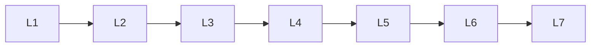

# Advanced Llm Concepts

> Deep lessons for **Advanced Llm Concepts** in the Large Language Models handbook.

## Lessons

| # | Lesson |
|---|--------|
| 1 | [Long-Context LLMs](01-long-context-llms.md) |
| 2 | [Reasoning Models](02-reasoning-models.md) |
| 3 | [Multilingual LLMs](03-multilingual-llms.md) |
| 4 | [Multimodal LLMs](04-multimodal-llms.md) |
| 5 | [Retrieval-Augmented LLMs](05-retrieval-augmented-llms.md) |
| 6 | [Tool-Using LLMs](06-tool-using-llms.md) |
| 7 | [Agentic LLMs](07-agentic-llms.md) |

**Topic hub:** [../README.md](../README.md)
