# Attention Mechanism — Engineering Deep Dive

> **Section 7 of Phase 4: LLM Fundamentals.** Attention is the mechanism that lets LLMs weigh context. This document explains Query/Key/Value, how scores become weights, and why attention dominates both quality and latency — especially at long context lengths.

## Table of Contents

- [Why Attention Matters](#why-attention-matters)
- [The Attention Intuition](#the-attention-intuition)
- [Query, Key, and Value (Q/K/V)](#query-key-and-value-qkv)
- [Attention Scores and Softmax](#attention-scores-and-softmax)
- [Scaled Dot-Product Attention](#scaled-dot-product-attention)
- [Self-Attention](#self-attention)
- [Causal Masking in Decoders](#causal-masking-in-decoders)
- [Multi-Head Attention](#multi-head-attention)
- [Cross-Attention Overview](#cross-attention-overview)
- [Attention and Context Quality](#attention-and-context-quality)
- [Long Context Challenges](#long-context-challenges)
- [Latency and Memory Impact](#latency-and-memory-impact)
- [Attention Optimizations (Overview)](#attention-optimizations-overview)
- [Common Mistakes](#common-mistakes)
- [Interview Preparation](#interview-preparation)
- [Navigation](#navigation)

---

## Why Attention Matters

Every token the model generates (or every embedding it produces) is shaped by **how much it attends to every other token** in context. Attention is:

| Role | Impact |
|------|--------|
| Quality driver | Retrieves relevant prior context for coreference, reasoning, code |
| Cost driver | Dominates compute during long prompt prefill |
| Memory driver | KV cache stores keys and values per token per layer |
| Context bottleneck | O(n²) naive scaling limits practical sequence length |

> **Production Standard:** When users report "the model ignored my document," the failure is often attention dilution, wrong context placement, or truncation — not mystical AI caprice. Engineer context deliberately.

---

## The Attention Intuition

Imagine reading a sentence: *"The trophy didn't fit in the suitcase because it was too big."* To resolve *"it"*, you mentally search backward for relevant nouns. Attention formalizes this search as **differentiable weighted lookup**.

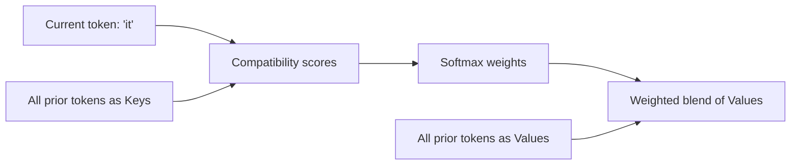

**Output:** A new vector for *"it"* that blends information from attended tokens (likely *"trophy"*).

---

## Query, Key, and Value (Q/K/V)

Each token's hidden state is projected into three vectors via learned weight matrices:

| Vector | Role | Analogy |
|--------|------|---------|
| **Query (Q)** | "What am I looking for?" | Search query |
| **Key (K)** | "What do I contain?" | Index entry |
| **Value (V)** | "What information do I provide if selected?" | Document content |

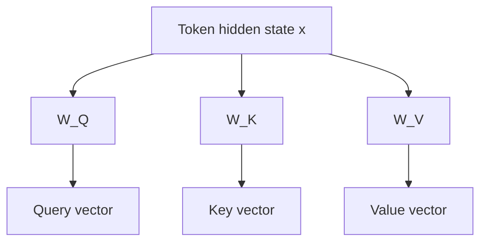

For a sequence of length `n` and model dimension `d_model`:

| Tensor | Shape (per head) |
|--------|-----------------|
| Q | `[n, head_dim]` |
| K | `[n, head_dim]` |
| V | `[n, head_dim]` |

Projections are **linear** — the learned magic is in the weight matrices refined during training.

```python
# Conceptual (not optimized) single-head attention
import math


def attention(q, k, v, mask=None):
    # q, k, v: [seq_len, head_dim]
    scores = q @ k.T  # [seq_len, seq_len]
    scores = scores / math.sqrt(q.shape[-1])
    if mask is not None:
        scores = scores + mask  # mask invalid positions with -inf
    weights = softmax(scores, axis=-1)
    return weights @ v  # [seq_len, head_dim]
```

---

## Attention Scores and Softmax

**Attention score** between query token `i` and key token `j`:

\[
\text{score}(i, j) = \frac{Q_i \cdot K_j}{\sqrt{d_k}}
\]

The scale factor `√d_k` prevents dot products from growing too large (which would push softmax into vanishing gradients).

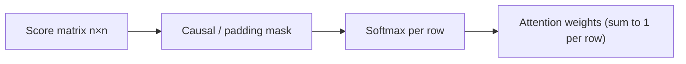

**Softmax** converts scores to a probability distribution over keys — each query token distributes 100% of its attention across allowed positions.

| Property | Implication |
|----------|-------------|
| Non-negative weights | Interpretable as "how much each token contributes" |
| Rows sum to 1 | Output is convex combination of value vectors |
| Differentiable | Enables end-to-end training |

### Reading Attention Weights (Debugging)

Some tools visualize attention maps. Useful for research; **limited production value** — you cannot easily "fix" weights at inference. Instead, restructure prompts, reduce noise, or use retrieval.

---

## Scaled Dot-Product Attention

The standard attention formula (one head):

\[
\text{Attention}(Q, K, V) = \text{softmax}\left(\frac{QK^T}{\sqrt{d_k}} + M\right) V
\]

Where `M` is an optional mask matrix.

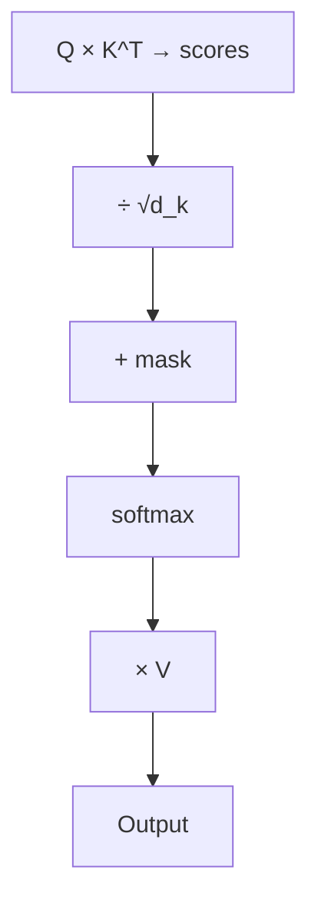

| Component | Purpose |
|-----------|---------|
| `QK^T` | All pairwise compatibilities in one matrix multiply |
| Scaling | Stabilize softmax |
| Mask | Enforce causality or ignore padding |
| `× V` | Produce weighted output vectors |

---

## Self-Attention

**Self-attention** means Q, K, and V all come from the **same sequence** — tokens attend to other tokens in the same input.

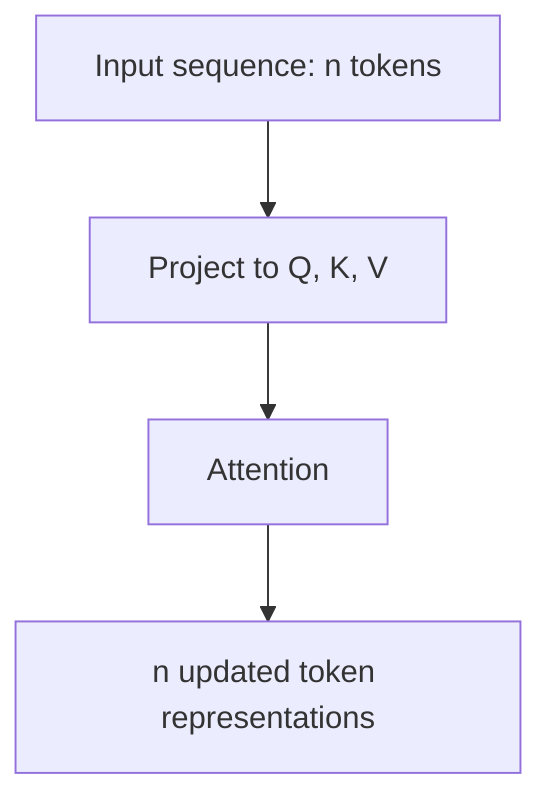

| Variant | Mask | Use |
|---------|------|-----|
| Full self-attention | None (or padding only) | Encoder — bidirectional context |
| Masked self-attention | Causal (lower triangular) | Decoder — autoregressive generation |

**Why self:** Each layer builds progressively richer contextualized representations. Early layers may capture syntax; deeper layers capture semantics and reasoning patterns.

---

## Causal Masking in Decoders

Decoder-only LLMs apply a **causal mask** so position `i` can only attend to positions `≤ i`.

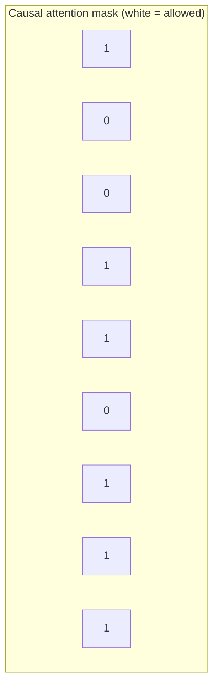

Without causal masking, the model could "see" future tokens during training — cheating on the next-token prediction objective.

**Engineering note:** At decode time, you only compute attention for the **new** query token against all prior keys — this is where [KV Cache](kv-cache.md) provides massive savings.

---

## Multi-Head Attention

Multiple heads run **in parallel** with separate `W_Q`, `W_K`, `W_V` projections.

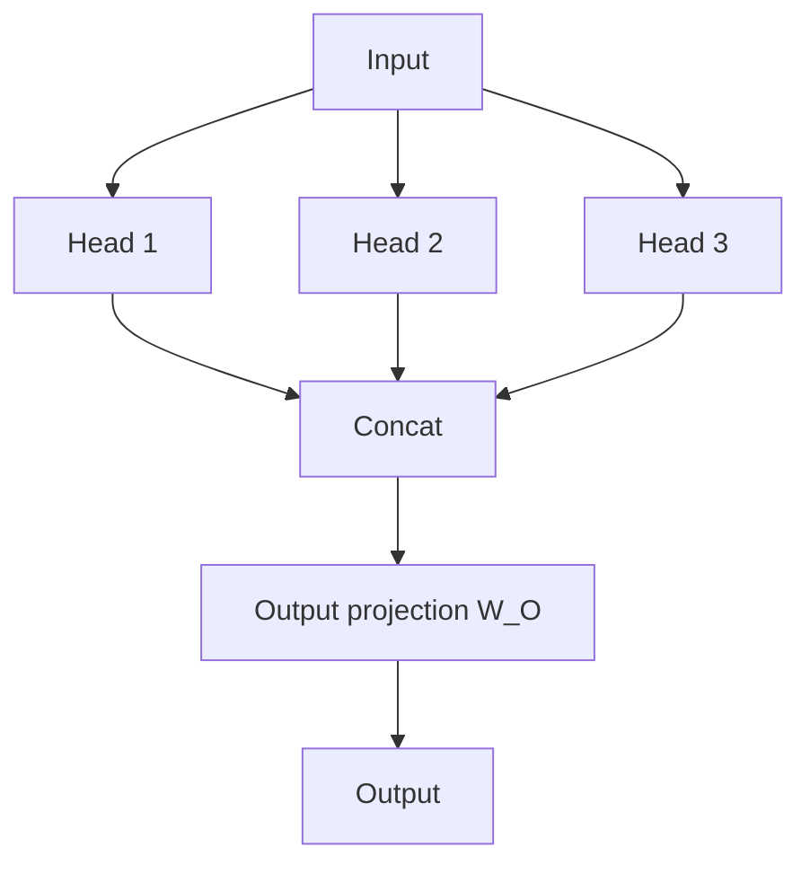

| Parameter | Typical Relationship |
|-----------|-------------------|
| `num_heads` | 8–64 depending on model |
| `head_dim` | `d_model / num_heads` |
| Total compute | Similar to single head with full `d_model` — split across heads |

### Why Multiple Heads

| Head (hypothetical specialization) | Example Behavior |
|-----------------------------------|-----------------|
| Local patterns | Adjacent token dependencies |
| Syntactic | Subject-verb agreement |
| Coreference | Pronoun → antecedent |
| Positional | Nearby vs distant context |

Head specialization is emergent — not hand-designed — but multi-head structure provides capacity for diverse relationship types.

---

## Cross-Attention Overview

**Cross-attention** uses queries from one sequence and keys/values from **another** sequence.

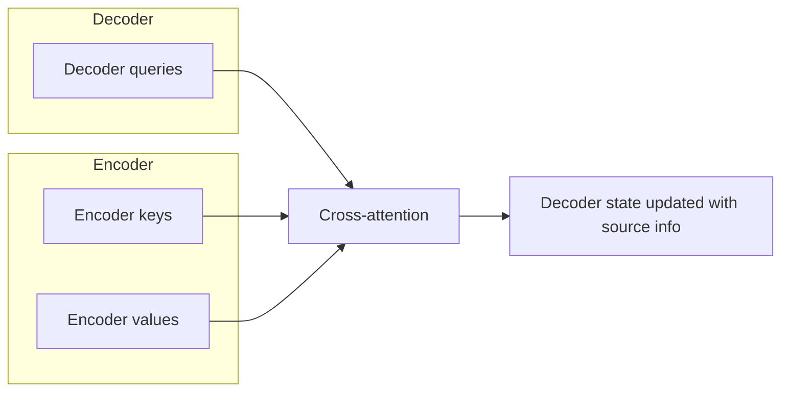

| Setting | Q from | K, V from |
|---------|--------|-----------|
| Self-attention | Same sequence | Same sequence |
| Cross-attention | Decoder (target) | Encoder (source) |

**Where you encounter it:**

| Context | Relevance to AI Engineers |
|---------|--------------------------|
| Encoder-decoder models (T5) | Summarization, translation |
| Multimodal models | Text queries attend to image patches |
| Some tool-use internals | Not exposed at API level — but conceptually similar |

Most chat LLM APIs are decoder-only and use **self-attention only**. Cross-attention matters when you work with multimodal or seq2seq architectures.

---

## Attention and Context Quality

How you structure context changes what attention can do.

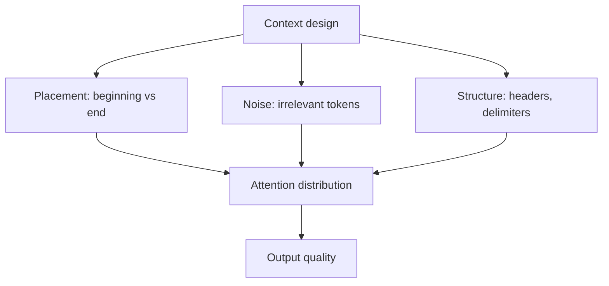

### Practical Patterns

| Pattern | Rationale |
|---------|-----------|
| Put critical instructions at **start and end** | Mitigates "lost in the middle" effect |
| Use clear delimiters (`###`, XML tags) | Helps model segment attention regions |
| Reduce irrelevant tokens | Less attention dilution |
| Repeat key constraints in long prompts | Re-anchors attention in deep contexts |

### "Lost in the Middle"

Research shows models may under-weight information buried in the middle of long contexts. Attention is uniform in capacity but not in effective utilization.

| Symptom | Mitigation |
|---------|-----------|
| Model ignores middle documents | Reorder; summarize; retrieve fewer chunks |
| Forgets system prompt | Re-inject constraints; use shorter system prompt |
| Degrades with many examples | Curate few-shot examples; don't max-fill context |

---

## Long Context Challenges

Advertising 128k or 1M tokens does not mean uniform quality across all positions.

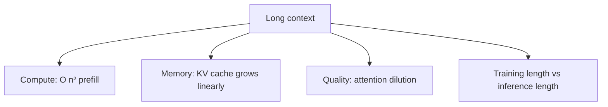

| Challenge | Description |
|-----------|-------------|
| **Quadratic prefill** | Doubling context length ≈ 4× attention compute |
| **KV cache memory** | Linear growth with context × layers × heads |
| **Attention sink / dilution** | Probability mass spreads thin over many tokens |
| **Position extrapolation** | RoPE models may degrade beyond training length |
| **Retrieval vs full context** | Stuffing 500 docs < targeted retrieval |

### Context Length vs Effective Context

| Metric | Meaning |
|--------|---------|
| **Context window** | Hard limit — API rejects beyond this |
| **Effective context** | Range where quality remains acceptable |
| **Needle-in-haystack** | Benchmark for finding buried facts — not real-world proxy |

> **Production Standard:** For RAG, prefer retrieving 3–10 high-quality chunks over dumping entire corpora into context. Attention is not a database scan.

---

## Latency and Memory Impact

Attention dominates the inference profile.

### Prefill Phase

All prompt tokens processed in parallel (with causal mask).

| Input Tokens | Relative Attention Cost |
|-------------|------------------------|
| 1k | Baseline |
| 4k | ~16× (n²) |
| 32k | ~1024× |

Real systems use kernels (FlashAttention), parallelism, and quantization — but scaling remains unfavorable.

### Decode Phase

One new token per step; attends to all prior tokens.

| Factor | Impact |
|--------|--------|
| Context length | More keys/values to attend to per step |
| KV cache | Avoids recomputing prior K/V — see [KV Cache](kv-cache.md) |
| Batch size | Multiple sequences multiply memory |

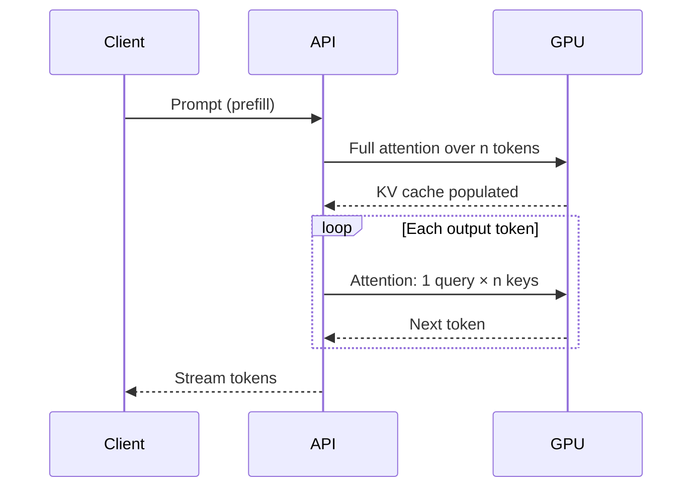

### Quality vs Latency Tradeoff

| Strategy | Quality | Latency |
|----------|---------|---------|
| Shorter context | May miss info | Faster prefill and decode |
| Longer context | More info available | Slower; possible dilution |
| RAG retrieval | Focused relevant context | Extra retrieval step; often net win |
| Summarize then attend | Compression loss | Faster attention on shorter text |

---

## Attention Optimizations (Overview)

Production inference stacks implement optimizations you do not call directly but benefit from:

| Technique | What It Does |
|-----------|-------------|
| **FlashAttention** | IO-aware tiled attention — faster, less memory |
| **Grouped-query attention (GQA)** | Share K/V heads across Q heads — smaller KV cache |
| **Multi-query attention (MQA)** | Single K/V head — even smaller cache |
| **Sliding window** | Local attention only — linear scaling (Mistral-style) |
| **Sparse attention** | Attend to subset of positions |
| **KV cache quantization** | Compress cached K/V — memory savings |

These explain why two models with the same parameter count can have different throughput and context economics.

---

## Common Mistakes

| Mistake | Fix |
|---------|-----|
| Maxing out context window "because we can" | Measure quality; retrieve selectively |
| Assuming uniform attention to all prompt sections | Place critical info at edges; use structure |
| Ignoring prefill latency in UX | Show progress; stream; chunk large prompts |
| Confusing context window with memory | KV cache memory is separate budget on GPU |
| Debugging generation by inspecting attention weights | Fix prompt structure and retrieval instead |

---

## Interview Preparation

### Conceptual Questions

**Q1: Explain Query, Key, and Value in attention.**

> **Strong answer:** Each token is projected into Q (what it seeks), K (what it advertises), and V (what it contributes). Scores between Q and K determine weights; weighted sum of V produces the output. It is differentiable content-based addressing.

**Q2: What is the difference between self-attention and cross-attention?**

> **Strong answer:** Self-attention: Q, K, V from the same sequence — tokens attend to each other. Cross-attention: Q from one sequence (e.g., decoder), K and V from another (e.g., encoder output) — used in seq2seq and multimodal models.

**Q3: Why is attention O(n²) and why does it matter?**

> **Strong answer:** Each token attends to every other token — n×n score matrix per head per layer. Prefill cost grows quadratically with prompt length, affecting latency and cost. KV caching makes decode linear per step in n but memory still grows with context.

**Q4: What is causal masking?**

> **Strong answer:** In decoder models, position i can only attend to positions ≤ i. Prevents peeking at future tokens during training and inference. Enables autoregressive generation.

**Q5: Why might a model "ignore" part of a long prompt?**

> **Strong answer:** Attention dilution — weights spread across many tokens. Lost-in-the-middle effect. Possible truncation. Mitigations: better retrieval, shorter focused context, structural delimiters, placing key info at start/end.

### System Design Prompt

**Users complain the model misses facts buried in uploaded 100-page PDFs. Diagnose and fix.**

> **Discussion points:** Check truncation; measure needle-in-haystack on your data; implement chunking + retrieval instead of full-doc context; reorder chunks; evaluate smaller high-quality context vs large low-quality context; log `input_tokens` and latency.

### Coding Exercise

**Implement scaled dot-product attention with an optional causal mask.**

> **Criteria:** Correct shapes, scaling by √d_k, mask positions set to -inf before softmax, softmax row-wise, return weighted V.

---

## Navigation

### Prerequisites

- [Transformer Intuition](transformer-intuition.md) — Section 6: block architecture overview
- [How LLMs Work](how-llms-work.md) — context windows and tokenization

### Phase 4: LLM Fundamentals (This Series)

| Section | Document | Topic |
|---------|----------|-------|
| 1–4 | [How LLMs Work](how-llms-work.md) | Tokens, context, temperature, APIs |
| 5 | [Embeddings — LLM Perspective](embeddings-llm-perspective.md) | Vectors and similarity |
| 6 | [Transformer Intuition](transformer-intuition.md) | Architecture building blocks |
| **7** | **This document** | Attention mechanism |
| 8 | [KV Cache](kv-cache.md) | Prefill, decode, cache reuse |

### Related Topics

- [KV Cache](kv-cache.md) — next in series; memory and decode optimization
- [Context Engineering](../context-engineering/README.md) — prompt and context design
- [Inference Optimization](../inference-optimization/README.md) — serving at scale

### Next Topics

- [KV Cache](kv-cache.md) — how inference engines cache keys and values

---

## See Also

- [LLM Engineering Domain Index](README.md)
- [Learning Roadmap](../../meta/roadmap.md)

## Changelog

| Version | Date | Changes |
|---------|------|---------|
| 1.0 | 2026-07-13 | Initial version — Section 7: attention mechanism |
