# Context Windows

> The context window is the model's working memory — how you fill it determines quality, cost, latency, and whether your application works at all in production.

## Table of Contents

- [Overview](#overview)
- [What Is a Context Window?](#what-is-a-context-window)
- [Context Window Anatomy](#context-window-anatomy)
- [Conversation History](#conversation-history)
- [Truncation Strategies](#truncation-strategies)
- [Sliding Window Approaches](#sliding-window-approaches)
- [Long-Context Models](#long-context-models)
- [Lost in the Middle](#lost-in-the-middle)
- [Context Compression](#context-compression)
- [RAG and Context Budgeting](#rag-and-context-budgeting)
- [Production Strategies](#production-strategies)
- [Why It Matters](#why-it-matters)
- [Production Considerations](#production-considerations)
- [Performance Considerations](#performance-considerations)
- [Cost Considerations](#cost-considerations)
- [Security Considerations](#security-considerations)
- [Best Practices](#best-practices)
- [Common Mistakes](#common-mistakes)
- [Python Examples](#python-examples)
- [Interview Preparation](#interview-preparation)
- [Navigation](#navigation)

---

## Overview

The **context window** is the maximum number of tokens a model can process in a single request — including system prompt, conversation history, retrieved documents, tool results, and the user's current message. Input and output tokens typically share this budget.

Managing context is one of the highest-impact skills in LLM engineering. Poor context management causes confused responses, runaway costs, API errors, and the "model forgot what I said" user experience.

> **Prerequisites:** [Tokens and Tokenization](tokens-and-tokenization.md) · [How LLMs Work](how-llms-work.md) · [Backend Engineering](../backend-engineering/README.md)

---

## What Is a Context Window?

The context window is a hard limit on the total tokens the model attends to in one inference call.

```
total_tokens = system_prompt + history + rag_chunks + tools + user_message + output
total_tokens ≤ context_window
```

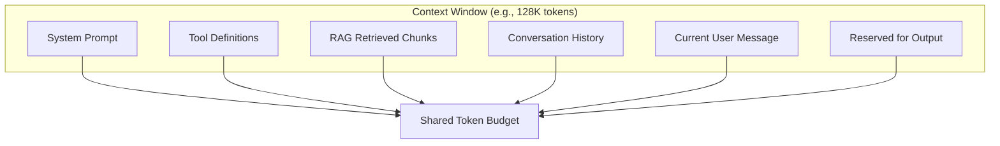

### Context Window Sizes (2026)

| Model | Context Window | Notes |
|-------|---------------|-------|
| GPT-4o / GPT-4o-mini | 128K | Standard production choice |
| Claude Sonnet 4 | 200K | Strong long-context performance |
| Claude Opus 4 | 200K | Highest quality long-context |
| Gemini 2.0 Pro | 1M+ | Very long but verify quality at extremes |
| Llama 3.1 70B | 128K | Self-hosted long context |
| Mistral Large | 128K | European provider option |

### Key Properties

| Property | Implication |
|----------|-------------|
| **Shared budget** | Input and output compete for the same limit |
| **Stateless** | Model has no memory between API calls — you resend history |
| **Attention over all tokens** | Every input token adds prefill latency and cost |
| **Not all positions equal** | Middle tokens receive less effective attention (see [Lost in the Middle](#lost-in-the-middle)) |

---

## Context Window Anatomy

A production request fills the context window with multiple components.

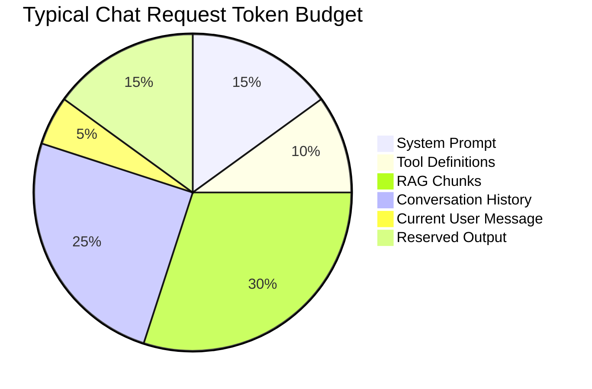

### Component Breakdown

| Component | Typical Size | Grows Over Session? |
|-----------|-------------|---------------------|
| System prompt | 200–3,000 tokens | No (static per deployment) |
| Tool/function definitions | 500–5,000 tokens | No (unless dynamic tools) |
| RAG retrieved chunks | 1,000–8,000 tokens | Per query |
| Conversation history | 500–100,000+ tokens | **Yes — unbounded** |
| Current user message | 10–2,000 tokens | Per request |
| Output reservation | 256–4,096 tokens | Fixed per endpoint |

The **history component** is the primary source of context overflow in multi-turn applications.

---

## Conversation History

In chat applications, your backend stores messages and resends them on every request.

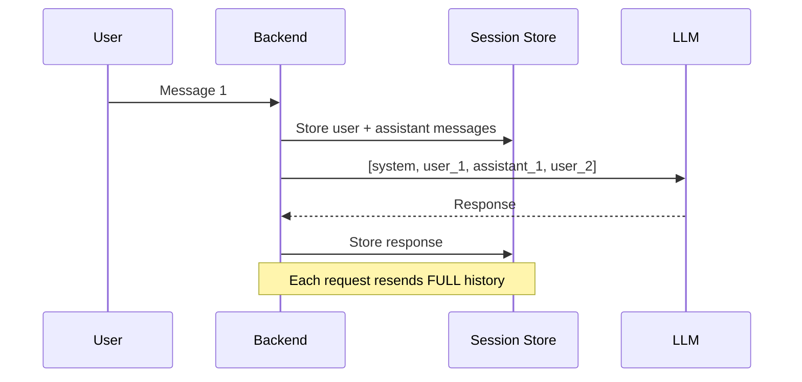

### History Storage Options

| Store | Pros | Cons |
|-------|------|------|
| PostgreSQL JSONB | Durable, queryable, transactional | Manual truncation needed |
| Redis | Fast reads for active sessions | Volatile without persistence |
| Object storage (S3) | Cheap for long archives | Higher read latency |
| Provider threads (OpenAI Assistants) | Managed history | Vendor lock-in, less control |

> **Production Standard:** Own your history in your database. Provider-managed threads reduce control over truncation and cost optimization. See [Backend Architecture for AI](../backend-engineering/backend-architecture-for-ai.md).

### Message Format

```python
history = [
    {"role": "system", "content": "You are a helpful assistant."},
    {"role": "user", "content": "What is a context window?"},
    {"role": "assistant", "content": "A context window is the maximum..."},
    {"role": "user", "content": "How do I manage it?"},
]
```

Each message adds tokens. A 50-turn conversation can easily exceed 20,000 tokens.

---

## Truncation Strategies

When context exceeds the budget, you must remove or compress content. **Never silently fail** — log what was truncated.

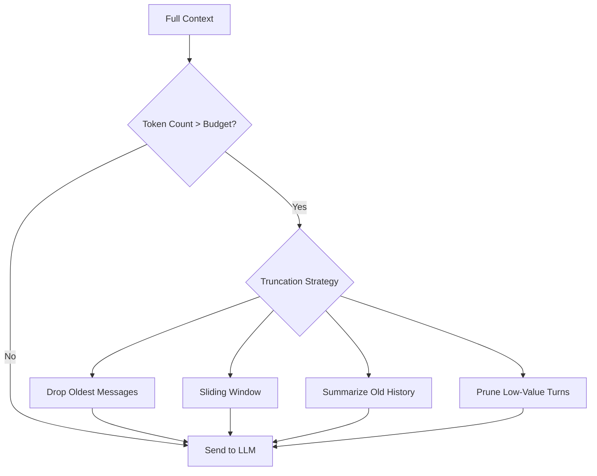

### Strategy Comparison

| Strategy | Preserves Recent Context | Preserves Early Context | Cost | Complexity |
|----------|-------------------------|------------------------|------|------------|
| **Drop oldest (FIFO)** | Yes | No | Low | Low |
| **Sliding window (N turns)** | Yes | No | Low | Low |
| **Summarization** | Yes | Partially (via summary) | Medium (extra LLM call) | Medium |
| **Token-budget packing** | Yes | Selective | Low | Medium |
| **Hierarchical memory** | Yes | Via layered summaries | High | High |
| **Vector retrieval of history** | Relevant turns | Relevant turns | Medium | High |

### FIFO Truncation

Remove the oldest non-system messages until the context fits.

```python
def truncate_fifo(messages: list[dict], max_tokens: int, count_fn) -> list[dict]:
    system = [m for m in messages if m["role"] == "system"]
    rest = [m for m in messages if m["role"] != "system"]
    while rest and count_fn(system + rest) > max_tokens:
        rest.pop(0)  # remove oldest
    return system + rest
```

**Pros:** Simple, predictable. **Cons:** Loses all early context including important setup.

### Priority-Based Truncation

Assign priority to messages and drop lowest-priority first.

| Priority | Content | Drop Order |
|----------|---------|------------|
| 1 (keep) | System prompt | Never |
| 2 (keep) | Current user message | Never |
| 3 | Recent 5 turns | Last |
| 4 | RAG chunks | Before history |
| 5 | Old history | First to drop |
| 6 | Tool results | Before old history |

---

## Sliding Window Approaches

A **sliding window** keeps only the most recent N turns of conversation.

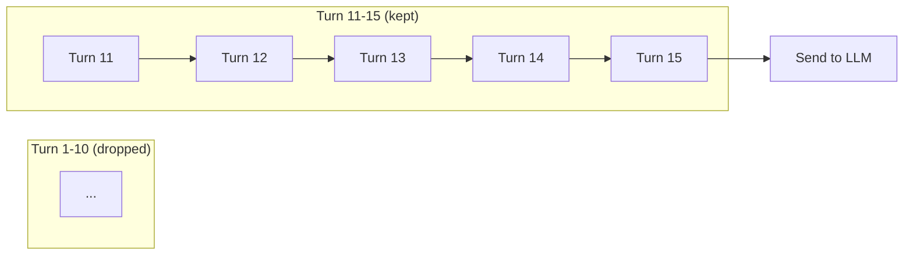

### Fixed Turn Window

```python
def sliding_window(messages: list[dict], max_turns: int = 10) -> list[dict]:
    system = [m for m in messages if m["role"] == "system"]
    conversation = [m for m in messages if m["role"] != "system"]
    keep = conversation[-(max_turns * 2):]  # user + assistant per turn
    return system + keep
```

### Fixed Token Window

More precise — keep as many recent messages as fit within a token budget.

```python
def token_sliding_window(
    messages: list[dict],
    max_tokens: int,
    count_fn,
) -> list[dict]:
    system = [m for m in messages if m["role"] == "system"]
    conversation = [m for m in messages if m["role"] != "system"]
    kept: list[dict] = []
    for msg in reversed(conversation):
        candidate = system + list(reversed(kept)) + [msg]
        if count_fn(candidate) > max_tokens:
            break
        kept.append(msg)
    kept.reverse()
    return system + kept
```

### Sliding Window with Summary Anchor

Keep a rolling summary of dropped history plus recent turns.

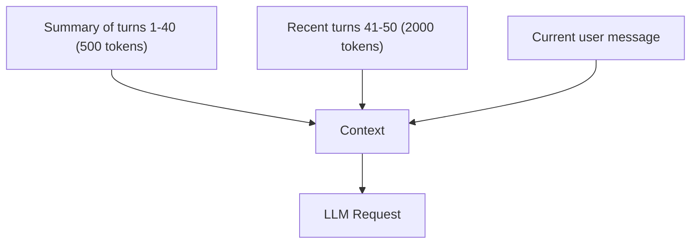

This is the most common production pattern for long conversations.

---

## Long-Context Models

Models with 128K–1M+ token windows promise to fit entire codebases, books, or transcripts in one request.

### When Long Context Helps

| Use Case | Why Long Context |
|----------|-----------------|
| Full document Q&A | Entire PDF in one request |
| Codebase analysis | Multiple files without chunking |
| Long meeting transcripts | Complete transcript analysis |
| Multi-document comparison | Several docs side by side |

### When Long Context Misleads

| Assumption | Reality |
|-----------|---------|
| "200K context = perfect recall" | Lost-in-the-middle degrades quality |
| "Bigger window = no truncation needed" | Cost and latency scale linearly |
| "Just fit everything" | Noise dilutes signal; more tokens ≠ better answers |
| "Same quality at 1K and 100K" | Attention degrades at extremes |

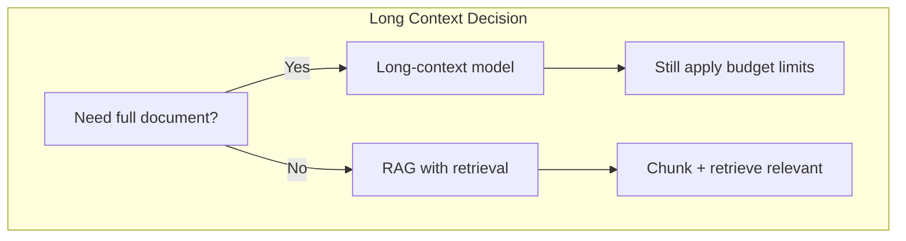

> **Production Standard:** Even with 128K+ context, apply budget limits. Use long context for convenience, not as a substitute for retrieval. See [Embeddings](../embeddings/README.md) for RAG patterns.

---

## Lost in the Middle

The **lost in the middle** phenomenon (Liu et al., 2023) shows that LLMs recall information at the **beginning and end** of context better than information in the **middle**.

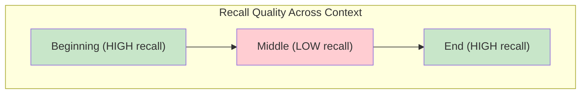

### Practical Implications

| Finding | Engineering Action |
|---------|-------------------|
| System prompt at start is well-attended | Put critical instructions in system prompt |
| Recent user message at end is well-attended | Current question naturally at end (good) |
| RAG chunks in the middle may be ignored | Place most relevant chunks near start or end |
| Long history buries important facts | Summarize or retrieve, do not just append |
| 50 retrieved chunks ≠ 50 useful chunks | Rerank and limit to top 3–5 |

### Optimal Context Layout

```
[SYSTEM PROMPT — critical instructions]
[MOST RELEVANT RAG CHUNK — high priority context]
[SUMMARY OF OLDER HISTORY — compressed background]
[RECENT CONVERSATION TURNS — last 5-10]
[CURRENT USER MESSAGE — always last]
```

---

## Context Compression

Compression reduces token count while preserving semantic content.

### Compression Techniques

| Technique | Token Reduction | Quality Impact | Extra LLM Call? |
|-----------|----------------|----------------|-----------------|
| **Summarization** | 70–90% | Moderate | Yes |
| **Extractive selection** | 30–60% | Low (if good selection) | Optional |
| **LLMLingua / prompt compression** | 50–80% | Low-moderate | No (local model) |
| **Remove filler turns** | 10–30% | Low | No |
| **Structured extraction** | 60–80% | Depends on task | Yes |
| **Prompt caching** | 0% (reuses compute) | None | No |

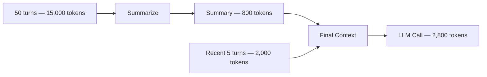

### Rolling Summarization Pattern

After every N turns, summarize older history into a single assistant message.

```python
SUMMARY_PROMPT = """Summarize the following conversation concisely.
Preserve: key facts, user preferences, decisions made, open questions.
Omit: greetings, filler, repeated information.

Conversation:
{history}
"""

async def maybe_summarize(
    history: list[dict],
    llm_client,
    trigger_turns: int = 20,
) -> list[dict]:
    if len(history) < trigger_turns:
        return history
    system = [m for m in history if m["role"] == "system"]
    old = history[len(system):-10]  # summarize all but last 10 messages
    recent = history[-10:]
    summary_text = await llm_client.complete(
        SUMMARY_PROMPT.format(history=format_messages(old))
    )
    summary_msg = {
        "role": "system",
        "content": f"Previous conversation summary:\n{summary_text}",
    }
    return system + [summary_msg] + recent
```

### Prompt Caching

Some providers (OpenAI, Anthropic) cache identical prompt prefixes, reducing latency and cost for repeated system prompts.

| Provider | Caching | Benefit |
|----------|---------|---------|
| OpenAI | Automatic prefix caching | 50% discount on cached input tokens |
| Anthropic | Explicit `cache_control` | 90% discount on cache reads |

Structure prompts with **static content first** (system prompt, tools) and **dynamic content last** (history, user message) to maximize cache hits.

---

## RAG and Context Budgeting

RAG (Retrieval-Augmented Generation) injects retrieved documents into context. Budget allocation is critical.

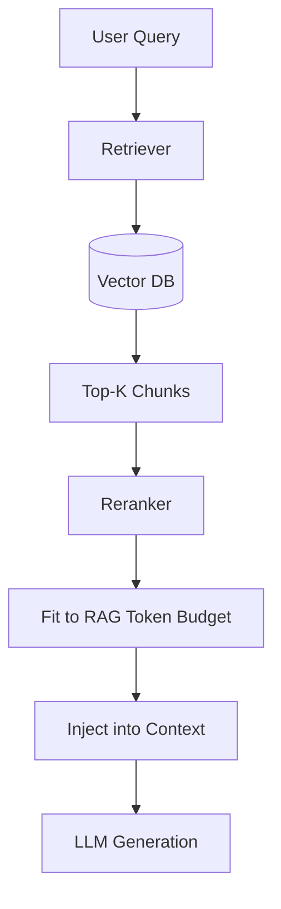

### RAG Budget Allocation

| Component | Recommended % of Input Budget |
|-----------|------------------------------|
| System prompt + tools | 10–20% |
| RAG chunks | 30–50% |
| Conversation history | 15–30% |
| User message | 5–10% |
| Headroom / safety margin | 10% |

### Chunk Count vs Chunk Size

| Approach | Tokens | Tradeoff |
|----------|--------|----------|
| 3 chunks × 1,000 tokens | 3,000 | Focused, less noise |
| 10 chunks × 500 tokens | 5,000 | More coverage, lost-in-middle risk |
| 1 chunk × 8,000 tokens | 8,000 | Full section context, may include noise |

> **Rule of thumb:** Retrieve generously, rerank aggressively, inject sparingly (top 3–5 chunks).

See [Embeddings](../embeddings/README.md) for retrieval pipeline details.

---

## Production Strategies

### Strategy Matrix by Application Type

| Application | History Strategy | RAG Strategy | Context Target |
|-------------|-----------------|--------------|----------------|
| Simple chatbot | Sliding window (10 turns) | None | 4K–8K tokens |
| Support agent | Summary + recent 10 | Top 3 chunks | 8K–16K tokens |
| Document Q&A | None (single turn) | Top 5 chunks | 8K–32K tokens |
| Code assistant | File context + recent 5 | Symbol search results | 16K–64K tokens |
| Long-form analysis | Long-context model | Full document | 64K–128K tokens |
| Multi-agent | Per-agent context | Agent-specific retrieval | Varies |

### Production Context Pipeline

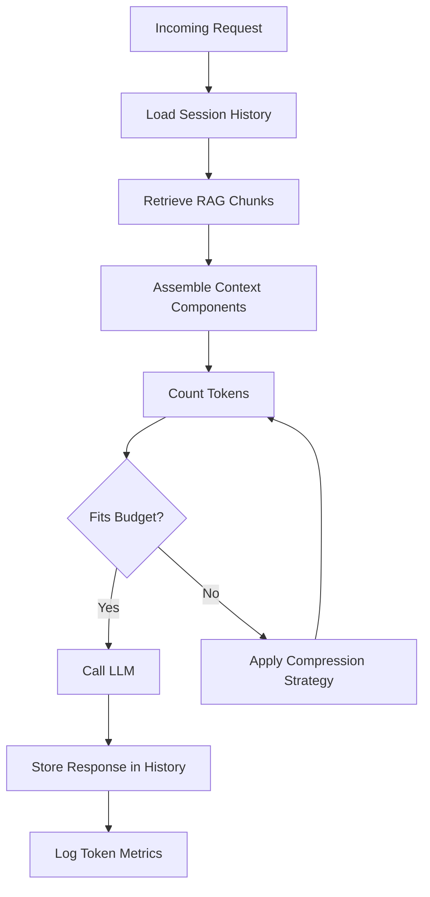

### Context Service Architecture

```python
# Conceptual production context service
class ContextService:
    def __init__(self, token_counter, budget: int, output_reserve: int):
        self._counter = token_counter
        self._max_input = budget - output_reserve

    async def build_context(
        self,
        session_id: str,
        user_message: str,
        rag_chunks: list[str] | None = None,
    ) -> list[dict]:
        system = await self._load_system_prompt()
        history = await self._load_history(session_id)
        messages = self._assemble(system, history, rag_chunks, user_message)
        messages = self._truncate(messages)
        return messages
```

---

## Why It Matters

Context management is the difference between a demo chatbot and a production assistant.

| Failure Mode | User Experience | Root Cause |
|-------------|----------------|------------|
| Context overflow | Error or silent failure | No pre-flight counting |
| "Forgot" earlier context | Frustration, repetition | History truncated without summary |
| Wrong answers from RAG | Hallucination or confusion | Too many chunks, lost in middle |
| Slow responses | Perceived broken app | Context too large (prefill latency) |
| Cost spike | Budget exceeded | Unbounded history growth |
| Inconsistent behavior | Unpredictable quality | No fixed context strategy |

---

## Production Considerations

| Area | Practice |
|------|----------|
| **Pre-flight token count** | Count before every LLM call |
| **Output reservation** | Reserve `max_tokens` from budget upfront |
| **Truncation logging** | Log what was dropped and why |
| **System prompt stability** | Keep static for prompt caching |
| **History persistence** | Store full history in DB; truncate only for LLM call |
| **Configurable budgets** | Per-endpoint and per-tier token limits |
| **Graceful degradation** | Summarize when truncate is insufficient |
| **User notification** | Optionally inform when old context was compressed |

```python
@dataclass
class ContextConfig:
    context_window: int = 128_000
    max_output_tokens: int = 4_096
    max_history_turns: int = 20
    max_rag_tokens: int = 8_000
    summarize_after_turns: int = 30
    safety_margin_tokens: int = 500

    @property
    def max_input_tokens(self) -> int:
        return self.context_window - self.max_output_tokens - self.safety_margin_tokens
```

---

## Performance Considerations

| Factor | Impact | Mitigation |
|--------|--------|------------|
| Large context | Slower prefill (TTFT) | Trim aggressively |
| Long history | More DB read + tokenization time | Cache recent history in Redis |
| Summarization | Extra LLM call latency | Async background summarization |
| RAG retrieval | Added retrieval latency | Parallel retrieval + generation pipeline |
| Prompt caching | Faster prefill for static prefix | Static system prompt first |

### TTFT vs Context Size

| Input Tokens | Approximate TTFT Impact |
|-------------|----------------------|
| 1,000 | Baseline |
| 4,000 | 2–4× baseline |
| 16,000 | 8–16× baseline |
| 64,000 | 30–60× baseline |

Smaller context is faster. Do not use 128K context when 8K suffices.

---

## Cost Considerations

Context size is the primary driver of per-request input cost.

| Strategy | Cost Savings |
|----------|-------------|
| Sliding window (10 turns vs full) | 50–90% input reduction |
| Rolling summarization | 70–85% on old history |
| RAG top-3 vs top-10 | 50–70% on retrieval tokens |
| Prompt caching | 50–90% on cached prefix |
| Smaller model for summarization | 10× cheaper summary calls |
| Per-user daily token cap | Prevents runaway spend |

### Monthly Cost Projection

| Avg Context Size | Requests/Day | GPT-4o-mini Input Cost/Month |
|-----------------|-------------|------------------------------|
| 2,000 tokens | 10,000 | ~$90 |
| 8,000 tokens | 10,000 | ~$360 |
| 32,000 tokens | 10,000 | ~$1,440 |

Context management is cost management.

---

## Security Considerations

| Risk | Context-Related Vector | Mitigation |
|------|----------------------|------------|
| Context injection | Attacker fills history with malicious instructions | Validate and sanitize stored messages |
| History poisoning | Prior turn injects prompt override | Role validation, output filtering |
| PII accumulation | Sensitive data grows in history | PII scrubbing before storage and injection |
| Cross-user leakage | Wrong session history loaded | Strict session isolation, auth checks |
| Context exfiltration | Model tricked to repeat full context | Limit what goes in context; output guardrails |
| Unbounded growth DoS | Attacker sends huge messages | Per-message and per-session token limits |

---

## Best Practices

1. **Count tokens before every call** — Never guess. Use [Tokens and Tokenization](tokens-and-tokenization.md) patterns.
2. **Reserve output tokens upfront** — `max_input = window - max_output - margin`.
3. **Store full history, truncate for LLM** — DB has everything; LLM gets a budget-fit version.
4. **Put critical instructions in system prompt** — Best attention at context start.
5. **Place relevant RAG chunks near start or end** — Avoid lost-in-the-middle.
6. **Summarize, do not just delete** — Rolling summaries preserve context cheaply.
7. **Use sliding window as baseline** — Add summarization when conversations exceed 20 turns.
8. **Apply per-user token budgets** — Prevent single user from consuming entire context.
9. **Log truncation events** — Debug quality issues by knowing what was dropped.
10. **Test with realistic conversation lengths** — Not just single-turn happy paths.
11. **Structure for prompt caching** — Static prefix, dynamic suffix.
12. **Do not trust long-context at extremes** — Validate quality at your actual context sizes.

---

## Common Mistakes

| Mistake | Impact | Fix |
|---------|--------|-----|
| Sending full history always | Context overflow, high cost | Sliding window + summarization |
| No output token reservation | Input fills entire window | Reserve max_output from budget |
| Silent truncation | Model loses critical context | Log truncation; notify if needed |
| RAG chunks in middle of context | Lost-in-the-middle misses them | Position near start or end |
| 50 RAG chunks injected | Noise, cost, confusion | Rerank to top 3–5 |
| Assuming 128K = unlimited | Quality degrades, costs soar | Apply explicit budgets |
| No summarization for long chats | Early context lost entirely | Rolling summary pattern |
| Storing history only in LLM thread | No control, vendor lock-in | Own history in your DB |
| Same context strategy for all endpoints | Over/under-provisioning | Per-endpoint ContextConfig |
| Ignoring prompt caching layout | Higher cost and latency | Static content first |
| Not testing multi-turn flows | Production-only discovery | Integration tests with 30+ turns |

---

## Python Examples

### Complete Context Manager

```python
from dataclasses import dataclass, field
import tiktoken
import logging

logger = logging.getLogger(__name__)


@dataclass
class ContextConfig:
    model: str = "gpt-4o-mini"
    context_window: int = 128_000
    max_output_tokens: int = 4_096
    max_history_turns: int = 20
    max_rag_tokens: int = 6_000
    safety_margin: int = 500


@dataclass
class ContextResult:
    messages: list[dict]
    input_tokens: int
    was_truncated: bool
    dropped_messages: int = 0


class ContextManager:
    def __init__(self, config: ContextConfig):
        self._config = config
        self._enc = tiktoken.encoding_for_model(config.model)

    @property
    def max_input_tokens(self) -> int:
        return (
            self._config.context_window
            - self._config.max_output_tokens
            - self._config.safety_margin
        )

    def count_messages(self, messages: list[dict]) -> int:
        total = 3
        for msg in messages:
            total += 3
            for value in msg.values():
                total += len(self._enc.encode(str(value)))
        return total

    def build(
        self,
        system_prompt: str,
        history: list[dict],
        user_message: str,
        rag_chunks: list[str] | None = None,
    ) -> ContextResult:
        messages: list[dict] = [{"role": "system", "content": system_prompt}]

        if rag_chunks:
            rag_text = "\n\n---\n\n".join(rag_chunks)
            rag_tokens = len(self._enc.encode(rag_text))
            if rag_tokens > self._config.max_rag_tokens:
                rag_text = self._truncate_text(rag_text, self._config.max_rag_tokens)
            messages.append({
                "role": "system",
                "content": f"Retrieved context:\n{rag_text}",
            })

        recent = history[-(self._config.max_history_turns * 2):]
        messages.extend(recent)
        messages.append({"role": "user", "content": user_message})

        dropped = 0
        was_truncated = len(history) > len(recent)
        while self.count_messages(messages) > self.max_input_tokens and len(messages) > 3:
            if messages[1]["role"] != "system" or "Retrieved" not in messages[1].get("content", ""):
                messages.pop(1)
            else:
                messages.pop(2)
            dropped += 1
            was_truncated = True

        if was_truncated:
            logger.warning(
                "context_truncated",
                extra={"dropped_messages": dropped, "final_tokens": self.count_messages(messages)},
            )

        return ContextResult(
            messages=messages,
            input_tokens=self.count_messages(messages),
            was_truncated=was_truncated,
            dropped_messages=dropped,
        )

    def _truncate_text(self, text: str, max_tokens: int) -> str:
        tokens = self._enc.encode(text)
        if len(tokens) <= max_tokens:
            return text
        return self._enc.decode(tokens[:max_tokens]) + "\n[... truncated]"
```

### Session History with PostgreSQL

```python
from dataclasses import dataclass
from datetime import datetime
from uuid import UUID


@dataclass
class StoredMessage:
    id: UUID
    session_id: str
    role: str
    content: str
    token_count: int
    created_at: datetime


class SessionHistoryStore:
    async def load_history(self, session_id: str, limit: int = 100) -> list[dict]:
        rows = await self._db.fetch(
            "SELECT role, content FROM messages "
            "WHERE session_id = $1 ORDER BY created_at DESC LIMIT $2",
            session_id,
            limit,
        )
        messages = [{"role": r["role"], "content": r["content"]} for r in reversed(rows)]
        return messages

    async def append_message(
        self,
        session_id: str,
        role: str,
        content: str,
        token_count: int,
    ) -> None:
        await self._db.execute(
            "INSERT INTO messages (session_id, role, content, token_count) "
            "VALUES ($1, $2, $3, $4)",
            session_id,
            role,
            content,
            token_count,
        )
```

### Context Budget Dashboard Metrics

```python
from dataclasses import dataclass


@dataclass
class ContextMetrics:
    session_id: str
    input_tokens: int
    output_tokens: int
    history_turns: int
    rag_chunks: int
    was_truncated: bool
    context_utilization_pct: float  # input_tokens / max_input * 100


def compute_utilization(input_tokens: int, max_input: int) -> ContextMetrics:
    return ContextMetrics(
        session_id="",
        input_tokens=input_tokens,
        output_tokens=0,
        history_turns=0,
        rag_chunks=0,
        was_truncated=False,
        context_utilization_pct=round(input_tokens / max_input * 100, 1),
    )
```

---

## Interview Preparation

### Frequently Asked Questions

**Q1: What is a context window and how is it shared between input and output?**

> **Strong answer:** The context window is the maximum tokens a model processes in one request. Input tokens (system, history, RAG, user) and output tokens (generation) share this budget. If the window is 128K and input is 127K, only 1K remains for output. The model is stateless — history must be resent each call.

**Q2: How do you handle conversation history that exceeds the context window?**

> **Strong answer:** Store full history in DB. For the LLM call: apply sliding window (keep recent N turns), rolling summarization (compress old turns into a summary message), and priority-based truncation (never drop system prompt or current message). Always count tokens pre-flight and log what was truncated.

**Q3: What is "lost in the middle" and how does it affect RAG?**

> **Strong answer:** LLMs attend better to context at the beginning and end than the middle. In RAG, injecting many chunks means middle chunks may be ignored. Mitigate by reranking to top 3–5, placing critical chunks near start or end, and not relying on 50-chunk injection.

**Q4: When would you use a long-context model vs RAG?**

> **Strong answer:** Long context for analyzing a known, bounded document set (one codebase, one report). RAG for large, dynamic knowledge bases where retrieval selects relevant content. In practice, combine both: RAG for selection, moderate context for injection. Long context does not eliminate the need for retrieval at scale.

**Q5: How does context size affect latency and cost?**

> **Strong answer:** Input tokens drive prefill latency (TTFT grows linearly). Output tokens drive decode latency. Both are billed. A 32K context request costs ~16× more input than 2K. Mitigate with sliding windows, summarization, prompt caching, and right-sizing context per use case.

### Real-World Scenario

**Scenario:** Users report the chatbot "forgets" they already provided their account number after 15 minutes of conversation.

> **Discussion points:** History truncation dropping early messages. Check truncation logs. Implement rolling summary that preserves key facts (account number, preferences). Consider structured memory (extract entities to DB, inject as system context). Test with 30+ turn conversations in CI.

---

## Navigation

### Prerequisites

- [Introduction to LLM Engineering](introduction-to-llm-engineering.md)
- [How LLMs Work](how-llms-work.md)
- [Tokens and Tokenization](tokens-and-tokenization.md)
- [Backend Engineering](../backend-engineering/README.md)

### — LLM Engineering

| # | Topic | Document |
|---|-------|----------|
| 1 | Introduction to LLM Engineering | [introduction-to-llm-engineering.md](introduction-to-llm-engineering.md) |
| 2 | How LLMs Work | [how-llms-work.md](how-llms-work.md) |
| 3 | Tokens and Tokenization | [tokens-and-tokenization.md](tokens-and-tokenization.md) |
| 4 | Context Windows | **You are here** |

### Related Topics

- [Tokens and Tokenization](tokens-and-tokenization.md) — counting and cost calculation
- [AI Backend Reference Architecture](../backend-engineering/ai-backend-reference-architecture.md) — chat and RAG patterns
- [Embeddings](../embeddings/README.md) — retrieval for RAG context 

### Next Topics 

- [Embeddings](../embeddings/README.md) — vector representations for retrieval
- [RAG](../rag/README.md) — retrieval-augmented generation
- [Prompt Engineering](../prompt-engineering/README.md) — prompt design and optimization

### Future Reading

- [Model Integration](../model-integration/README.md)
- [AI Evaluation](../ai-evaluation/README.md)
- [Context Engineering](../context-engineering/README.md)

---

## See Also

- [Lost in the Middle (Liu et al., 2023)](https://arxiv.org/abs/2307.03172)
- [Anthropic Prompt Caching](https://docs.anthropic.com/en/docs/build-with-claude/prompt-caching)
- [OpenAI Prompt Caching](https://platform.openai.com/docs/guides/prompt-caching)

## Changelog

| Version | Date | Changes |
|---------|------|---------|
| 1.0 | 2026-07-13 | Initial publication |
