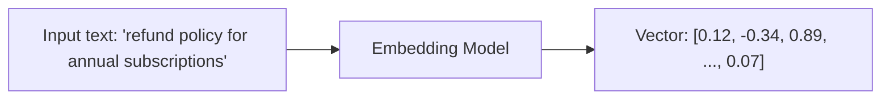
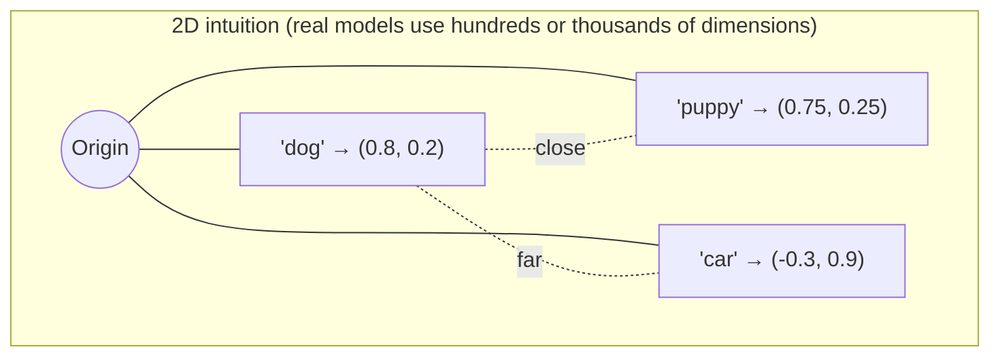
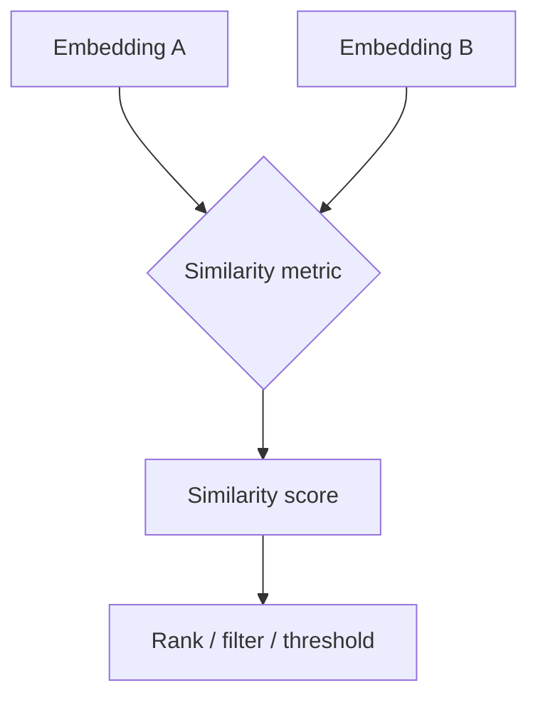
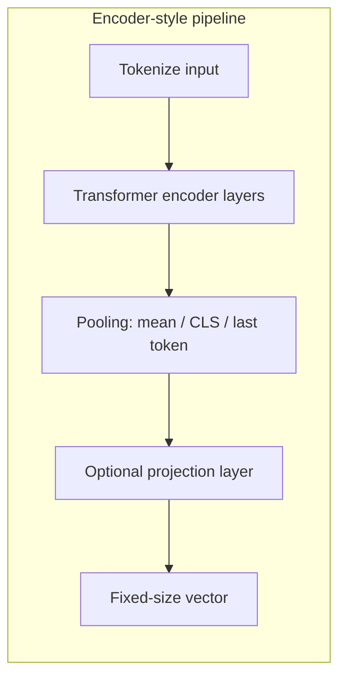
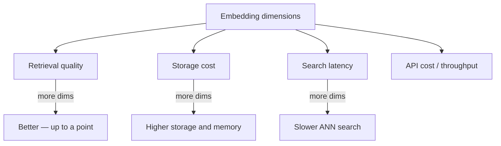
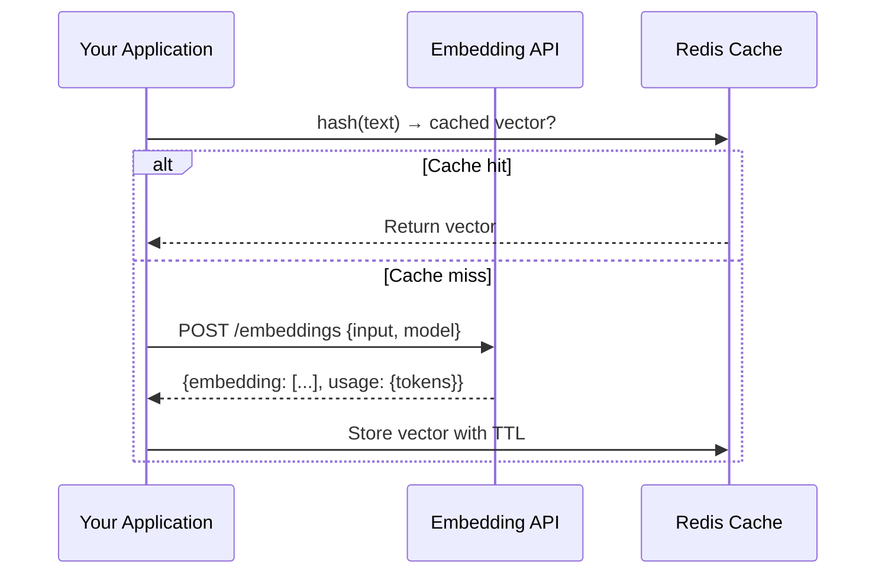
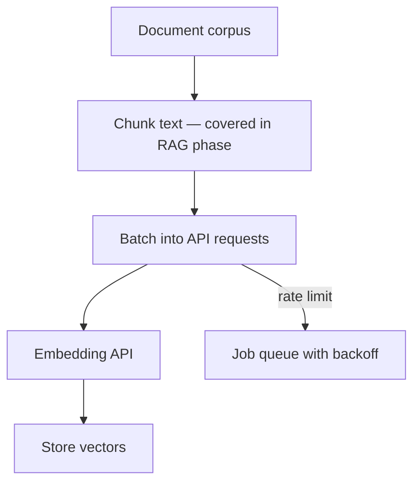

# Embeddings — An LLM Engineer's Perspective

> **Section 5 of this handbook: LLM Fundamentals.** Embeddings are the bridge between human language and machine-readable math. This document explains what embeddings are, how similarity works, and how to use embedding APIs in production — without yet building retrieval pipelines (RAG comes in a later phase).

## Table of Contents

- [Why Embeddings Matter for AI Engineers](#why-embeddings-matter-for-ai-engineers)
- [What Is an Embedding](#what-is-an-embedding)
- [Vectors and Vector Space](#vectors-and-vector-space)
- [Similarity Measures](#similarity-measures)
- [Cosine Similarity vs Dot Product](#cosine-similarity-vs-dot-product)
- [Semantic Similarity](#semantic-similarity)
- [Embedding Models](#embedding-models)
- [Dimensions and Tradeoffs](#dimensions-and-tradeoffs)
- [Embedding APIs in Practice](#embedding-apis-in-practice)
- [Normalization and Distance Metrics](#normalization-and-distance-metrics)
- [Batching and Throughput](#batching-and-throughput)
- [Cost and Latency Considerations](#cost-and-latency-considerations)
- [Common Mistakes](#common-mistakes)
- [Interview Preparation](#interview-preparation)
- [Navigation](#navigation)

---

## Why Embeddings Matter for AI Engineers

LLMs generate text token by token. Embeddings solve a different problem: they convert text (or images, code, audio) into fixed-size numerical vectors that capture meaning. Once text lives in vector space, you can compare, cluster, search, and rank by semantic similarity.

As an AI engineer, you will encounter embeddings in:

| Use Case | Role of Embeddings |
|----------|-------------------|
| Semantic search | Find documents similar to a query |
| Deduplication | Detect near-duplicate content |
| Classification | Features for downstream ML models |
| Clustering | Group support tickets, logs, or feedback |
| Recommendation | Match users to content by meaning |
| RAG (later phase) | Retrieve relevant context before generation |

> **Production Standard:** Treat embeddings as a first-class infrastructure dependency — like a database or cache. Version your embedding model, cache results, and monitor latency and cost per million tokens embedded.

This document focuses on the **embedding primitive itself**. Retrieval architecture, chunking strategies, and RAG orchestration are covered in the [RAG Systems](../rag/README.md) domain.

---

## What Is an Embedding

An **embedding** is a dense vector — a list of floating-point numbers — that represents the semantic content of an input.



**Key properties:**

| Property | Description |
|----------|-------------|
| Fixed dimensionality | Every input maps to the same number of floats (e.g., 1536) |
| Dense representation | Most values are non-zero (unlike sparse bag-of-words) |
| Learned semantics | Similar meanings produce nearby vectors |
| Model-dependent | Vectors from different models are not directly comparable |

Embeddings are produced by neural networks — often transformer-based encoders — trained to place semantically related inputs close together in vector space.

```python
# Conceptual shape after calling an embedding API
embedding: list[float]  # length == model dimension (e.g., 1536)
assert len(embedding) == 1536
assert all(isinstance(x, float) for x in embedding)
```

---

## Vectors and Vector Space

A vector is an ordered list of numbers that defines a point (or direction) in high-dimensional space.



In production embedding models, dimensionality ranges from 384 to 3072+. You cannot visualize 1536 dimensions, but the math works identically:

- Each dimension is one axis.
- Each embedding is one point in that space.
- **Distance** or **angle** between points approximates semantic relatedness.

### Engineering Implications

| Concern | Implication |
|---------|-------------|
| Storage | `num_vectors × dimensions × 4 bytes` for float32 |
| Indexing | Vector databases optimize nearest-neighbor search in this space |
| Comparison | Only meaningful within the same model and normalization scheme |
| Serialization | Store as JSON arrays, binary float32 blobs, or DB-native vector types |

---

## Similarity Measures

To compare two embeddings, you need a **similarity** or **distance** metric. Higher similarity (or lower distance) means the inputs are more semantically related.

| Metric | Range / Behavior | Common Use |
|--------|-----------------|------------|
| Cosine similarity | -1 to 1 (often 0 to 1 for text) | Default for normalized embeddings |
| Dot product | Unbounded; higher = more similar | When vectors are L2-normalized |
| Euclidean (L2) distance | 0 = identical; larger = farther | Some ANN indexes; clustering |
| Manhattan (L1) distance | Sum of absolute differences | Rare for embeddings |



For most AI engineering work, **cosine similarity** is the default mental model.

---

## Cosine Similarity vs Dot Product

### Cosine Similarity

Cosine similarity measures the **angle** between two vectors, ignoring magnitude:

\[
\text{cosine}(A, B) = \frac{A \cdot B}{\|A\| \|B\|}
\]

```python
import math


def cosine_similarity(a: list[float], b: list[float]) -> float:
    dot = sum(x * y for x, y in zip(a, b))
    norm_a = math.sqrt(sum(x * x for x in a))
    norm_b = math.sqrt(sum(x * x for x in b))
    if norm_a == 0 or norm_b == 0:
        return 0.0
    return dot / (norm_a * norm_b)
```

**Interpretation:**

| Score | Approximate Meaning |
|-------|-------------------|
| 1.0 | Identical direction (often near-duplicates) |
| 0.7 – 0.9 | Strong semantic overlap |
| 0.3 – 0.6 | Related topic, partial overlap |
| < 0.3 | Likely unrelated (model-dependent) |

Thresholds are **not universal** — calibrate on your data and model.

### Dot Product

Dot product is the raw sum of element-wise products:

\[
A \cdot B = \sum_{i=1}^{n} A_i B_i
\]

When both vectors are **L2-normalized** (unit length), dot product equals cosine similarity. Many providers return normalized embeddings specifically so dot product can be used as a fast proxy.

| Aspect | Cosine Similarity | Dot Product |
|--------|------------------|-------------|
| Magnitude sensitivity | Ignores vector length | Sensitive unless normalized |
| Compute cost | Slightly higher (norm calculation) | Faster — single pass |
| ANN index support | Cosine distance indexes | Inner product indexes |
| When to prefer | General semantic comparison | Optimized retrieval at scale |

> **Production Standard:** Know whether your embedding provider returns L2-normalized vectors. OpenAI's `text-embedding-3-*` models return normalized vectors — dot product and cosine are equivalent.

---

## Semantic Similarity

**Semantic similarity** means similarity of *meaning*, not surface form.

```mermaid
graph LR
  subgraph "High semantic similarity"
    Q1["'How do I cancel my subscription?'"]
    Q2["'Steps to terminate an annual plan'"]
  end

  subgraph "Low semantic similarity"
    Q3["'What is the capital of France?'"]
  end

  Q1 -. ~0.85 .- Q2
  Q1 -. ~0.15 .- Q3
```

Embeddings capture this because the model was trained on co-occurrence, contrastive pairs, or instruction-following objectives that reward placing paraphrases near each other.

### What Embeddings Get Right

- Paraphrase detection ("refund" ≈ "money back")
- Topical clustering (billing questions group together)
- Cross-lingual similarity (multilingual models)
- Short-to-long text matching (query vs document)

### What Embeddings Struggle With

| Limitation | Example |
|-----------|---------|
| Negation | "I love this" vs "I don't love this" may still be close |
| Rare entities | Obscure product codes may embed poorly |
| Numerical precision | "Plan A costs $10" vs "$100" — context-dependent |
| Temporal reasoning | "current policy" vs "2022 policy" without metadata |
| Exact keyword needs | SKU lookups, legal clause IDs |

For keyword-exact needs, combine embeddings with lexical search (hybrid search — covered in RAG phase).

---

## Embedding Models

Embedding models are specialized neural networks (typically transformer encoders) trained to produce useful vectors.



### Model Families (Representative)

| Provider / Model | Dimensions | Notes |
|-----------------|------------|-------|
| OpenAI `text-embedding-3-small` | 1536 (or reduced) | Cost-effective default |
| OpenAI `text-embedding-3-large` | 3072 (or reduced) | Higher quality, higher cost |
| Cohere `embed-v3` | 1024 | Strong multilingual |
| Voyage AI models | 512–1024 | Domain-tuned variants available |
| `sentence-transformers` (self-hosted) | 384–1024 | Open source; run on your infra |
| `bge-*`, `e5-*` (open) | 768–1024 | Popular for self-hosted RAG |

### Choosing a Model

| Factor | Guidance |
|--------|----------|
| Task domain | General vs code vs legal — some models are fine-tuned |
| Language | English-only vs multilingual |
| Hosting | API (managed) vs self-hosted (GPU/CPU) |
| Dimension | Higher ≠ always better; affects storage and search cost |
| Latency SLA | Smaller models and dimensions are faster |
| Lock-in | Abstract behind an interface; models change over time |

> **Key insight:** The embedding model is part of your system's contract. Changing models usually requires re-embedding all stored vectors.

---

## Dimensions and Tradeoffs

**Dimensions** are the length of the embedding vector. More dimensions can capture finer distinctions but cost more everywhere downstream.



### Dimension Reduction

Some APIs support **Matryoshka**-style models or explicit dimension parameters:

```python
# OpenAI example: request fewer dimensions for storage savings
response = client.embeddings.create(
    model="text-embedding-3-small",
    input="refund policy for annual subscriptions",
    dimensions=512,  # default 1536; reduced with modest quality tradeoff
)
vector = response.data[0].embedding
```

| Dimensions | Typical Tradeoff |
|-----------|-----------------|
| 384–512 | Fast, cheap; good for coarse retrieval |
| 768–1024 | Balanced for many production RAG systems |
| 1536+ | Higher fidelity; higher storage and index cost |

**Rule of thumb:** Start with the provider's default. Reduce dimensions only after measuring retrieval quality on your eval set.

---

## Embedding APIs in Practice

Most AI engineers consume embeddings via HTTP APIs rather than running models locally.



### OpenAI-Compatible Pattern

```python
from openai import AsyncOpenAI

client = AsyncOpenAI()


async def embed_texts(texts: list[str], model: str = "text-embedding-3-small") -> list[list[float]]:
    response = await client.embeddings.create(
        model=model,
        input=texts,
    )
    # API returns embeddings in same order as input
    return [item.embedding for item in response.data]
```

### API Design Considerations

| Concern | Practice |
|---------|----------|
| Input limits | Respect max tokens per request; chunk long text before embedding |
| Batching | Send multiple strings per request (provider limits apply) |
| Idempotency | Same text + model → same vector; safe to cache |
| Error handling | Retry transient 429/5xx with exponential backoff |
| Observability | Log `model`, `input_tokens`, `latency_ms`, `cache_hit` |
| Abstraction | Hide provider behind `EmbeddingClient` interface |

### Self-Hosted Alternative

```python
# sentence-transformers — runs locally or on your GPU fleet
from sentence_transformers import SentenceTransformer

model = SentenceTransformer("BAAI/bge-small-en-v1.5")
vectors = model.encode(["refund policy", "billing FAQ"], normalize_embeddings=True)
```

| Deployment | When It Makes Sense |
|-----------|-------------------|
| Managed API | Default; low ops burden; pay per token |
| Self-hosted | Data residency, high volume, cost optimization at scale |
| Hybrid | API for dev; self-hosted for production batch jobs |

---

## Normalization and Distance Metrics

Providers differ in whether vectors are pre-normalized. This affects which metric and index type to use.

| Vector State | Best Metric | pgvector Operator | FAISS Index Type |
|-------------|-------------|-------------------|------------------|
| L2-normalized | Cosine or dot product | `<=>` (cosine distance) | `IndexFlatIP` |
| Not normalized | Cosine (explicit) | `<=>` after normalize | `IndexFlatL2` or normalize first |

```python
def l2_normalize(vec: list[float]) -> list[float]:
    norm = math.sqrt(sum(x * x for x in vec))
    return [x / norm for x in vec] if norm > 0 else vec
```

Always document in your codebase:

1. Which embedding model is used.
2. Whether vectors are stored normalized.
3. Which distance metric your vector index expects.

Mismatch between stored vectors and index metric is a common source of "search returns garbage" bugs.

---

## Batching and Throughput

Embedding workloads are often **batch-heavy** — indexing thousands of documents at once.



| Strategy | Benefit |
|----------|---------|
| Batch multiple texts per API call | Fewer HTTP round trips |
| Async job queue for bulk indexing | Decouples ingestion from API limits |
| Content-hash cache | Skip re-embedding unchanged text |
| Parallel workers with rate limiting | Maximize throughput without 429 storms |

**Token accounting:** Embedding APIs bill by input tokens. A 10,000-document corpus at 500 tokens each = 5M tokens. Estimate cost before kicking off a full re-index.

---

## Cost and Latency Considerations

| Variable | Impact |
|----------|--------|
| Model size | Larger models → higher quality, higher cost and latency |
| Dimensions | Linear effect on storage; sublinear on API cost |
| Batch size | Amortizes HTTP overhead |
| Caching | Near-zero marginal cost for repeated text |
| Self-hosting | Upfront GPU cost; predictable at very high volume |

### Latency Budget Example

| Operation | Typical Latency |
|-----------|----------------|
| Single short query embed (API) | 50–200 ms |
| Batch of 100 chunks (API) | 200–800 ms |
| Cache hit | 1–5 ms |
| ANN search (1M vectors) | 5–50 ms (index-dependent) |

For interactive features (e.g., typeahead semantic search), cache query embeddings aggressively.

---

## Common Mistakes

| Mistake | Impact | Fix |
|---------|--------|-----|
| Mixing embedding models | Incomparable vectors; broken search | One model per index; version in metadata |
| Ignoring normalization | Wrong similarity rankings | Match metric to vector format |
| Embedding overly long text | Truncation silently drops content | Chunk before embedding |
| No caching | Redundant API cost and latency | Cache by `hash(model + text)` |
| Treating similarity thresholds as universal | False positives/negatives | Calibrate on domain eval set |
| Storing raw text only | Cannot search semantically | Persist vectors alongside text |
| Skipping observability | Cost spikes go unnoticed | Log tokens, latency, cache hit rate |

---

## Interview Preparation

### Conceptual Questions

**Q1: What is an embedding and why does it matter for AI applications?**

> **Strong answer:** An embedding is a fixed-size vector that represents the semantic meaning of text. It matters because once text is in vector space, you can compute similarity, cluster, classify, and retrieve by meaning — not just keywords. It is the foundation for semantic search and RAG.

**Q2: Explain cosine similarity vs dot product.**

> **Strong answer:** Cosine similarity measures the angle between vectors, ignoring magnitude. Dot product measures aligned magnitude. For L2-normalized embeddings, they are equivalent. Dot product is faster and maps to inner-product ANN indexes; cosine is the interpretable default when normalization is uncertain.

**Q3: Why can't you mix embeddings from two different models?**

> **Strong answer:** Each model learns its own vector space geometry. A distance of 0.8 in model A is not comparable to 0.8 in model B. Switching models requires re-embedding all stored content and rebuilding indexes.

**Q4: How do you choose embedding dimensions?**

> **Strong answer:** Higher dimensions can improve retrieval quality up to a point but increase storage, memory, and search latency linearly. Start with the provider default, measure retrieval quality on an eval set, then try dimension reduction if cost or latency requires it.

**Q5: What are limitations of semantic embeddings?**

> **Strong answer:** They struggle with negation, rare entities, exact identifier lookup, and fine-grained numerical distinctions. Production systems often combine dense embeddings with lexical/BM25 search (hybrid) and metadata filters.

### System Design Prompt

**Design the embedding layer for a document search feature (no RAG generation yet).**

> **Discussion points:**
> - Abstract `EmbeddingClient` behind an interface
> - Cache embeddings by content hash + model version
> - Batch ingestion via job queue with rate limiting
> - Store vectors in pgvector or dedicated vector DB
> - Track model version in index metadata for migrations
> - Calibrate similarity thresholds on held-out queries
> - Monitor cost (tokens embedded), latency, and cache hit rate

### Coding Exercise

**Implement a function that returns the top-k most similar texts to a query from a precomputed list.**

> **Key criteria:** Correct cosine similarity, handle empty inputs, efficient enough for small corpora (numpy optional), clear interface for swapping in ANN later.

---

## Navigation

### Prerequisites

- [How LLMs Work (Practical)](how-llms-work.md) — Sections 1–4: tokens, context windows, sampling, model families

### LLM Fundamentals (This Series)

| Section | Document | Topic |
|---------|----------|-------|
| 1–4 | [How LLMs Work](how-llms-work.md) | Tokens, context, temperature, APIs |
| **5** | **This document** | Embeddings and similarity |
| 6 | [Transformer Intuition](transformer-intuition.md) | Architecture building blocks |
| 7 | [Attention Mechanism](attention-mechanism.md) | Q/K/V, scores, multi-head |
| 8 | [KV Cache](kv-cache.md) | Prefill, decode, inference optimization |

### Related Topics

- [Vector Databases](../vector-databases/README.md) — storing and querying embeddings at scale
- [Embeddings Domain](../embeddings/README.md) — chunking, fine-tuning, advanced patterns
- [RAG Systems](../rag/README.md) — retrieval pipelines (next phase after fundamentals)

### Next Topics

- [Transformer Intuition](transformer-intuition.md) — understand the architecture that produces embeddings and generations
- [Attention Mechanism](attention-mechanism.md) — deep dive into how models weigh context

---

## See Also

- [LLM Engineering Domain Index](README.md)
- [AI Engineering Overview](../foundations/ai-engineering-overview.md)
- [Learning Roadmap](../../meta/roadmap.md)

## Changelog

| Version | Date | Changes |
|---------|------|---------|
| 1.0 | 2026-07-13 | Initial version — Section 5: embeddings fundamentals |
