# How LLMs Work

> The full inference pipeline from text to output — explained for engineers who integrate LLMs in production, not for researchers deriving backpropagation by hand.

## Table of Contents

- [Overview](#overview)
- [The Complete Pipeline](#the-complete-pipeline)
- [Stage 1: Text Input](#stage-1-text-input)
- [Stage 2: Tokenization](#stage-2-tokenization)
- [Stage 3: Token IDs](#stage-3-token-ids)
- [Stage 4: Embedding Lookup](#stage-4-embedding-lookup)
- [Stage 5: Positional Encoding](#stage-5-positional-encoding)
- [Stage 6: Transformer Blocks](#stage-6-transformer-blocks)
- [Stage 7: Self-Attention](#stage-7-self-attention)
- [Stage 8: The Decoder and Causal Masking](#stage-8-the-decoder-and-causal-masking)
- [Stage 9: Output Head and Logits](#stage-9-output-head-and-logits)
- [Stage 10: Sampling and Prediction](#stage-10-sampling-and-prediction)
- [Stage 11: Autoregressive Generation](#stage-11-autoregressive-generation)
- [Stage 12: Detokenization and Output](#stage-12-detokenization-and-output)
- [Prefill vs Decode](#prefill-vs-decode)
- [Why It Matters](#why-it-matters)
- [Production Considerations](#production-considerations)
- [Performance Considerations](#performance-considerations)
- [Cost Considerations](#cost-considerations)
- [Security Considerations](#security-considerations)
- [Best Practices](#best-practices)
- [Common Mistakes](#common-mistakes)
- [Python Examples](#python-examples)
- [Interview Preparation](#interview-preparation)
- [Navigation](#navigation)

---

## Overview

When you call `client.chat.completions.create()`, a multi-stage pipeline runs on the provider's GPUs. Understanding each stage helps you debug latency spikes, context failures, unexpected outputs, and cost anomalies.

This document traces the path:

**Text → Tokenizer → Tokens → Embeddings → Transformer → Attention → Prediction → Sampling → Output**

We focus on **decoder-only models** (GPT, Claude, Llama) used in production chat and completion APIs. No heavy math — just the mental models you need to engineer reliable systems.

> **Prerequisites:** [Introduction to LLM Engineering](introduction-to-llm-engineering.md) · [Backend Engineering](../backend-engineering/README.md)

---

## The Complete Pipeline

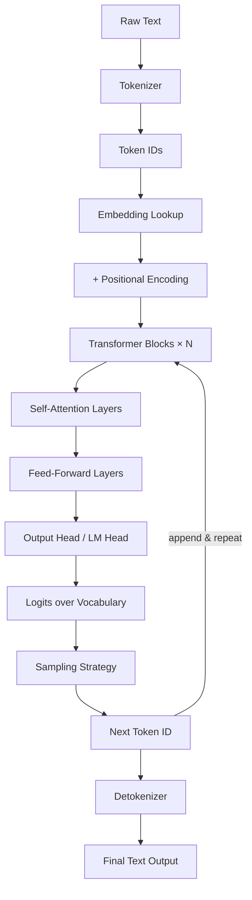

### Pipeline at a Glance

| Stage | Input | Output | Engineer Cares About |
|-------|-------|--------|---------------------|
| Tokenization | UTF-8 string | List of token IDs | Token count, special tokens |
| Embedding | Token IDs | Vectors (d_model) | — (internal) |
| Positional encoding | Embeddings | Position-aware vectors | Order matters |
| Transformer | Vectors | Refined representations | Layer count, context length |
| Attention | All prior tokens | Weighted combinations | Quadratic cost with context |
| LM head | Final vector | Logits (vocab size) | — (internal) |
| Sampling | Logits | One token ID | temperature, top_p |
| Autoregressive loop | Growing sequence | Full completion | Output token count = cost |
| Detokenization | Token IDs | UTF-8 string | Byte-level edge cases |

---

## Stage 1: Text Input

Your application sends structured messages to the API:

```python
messages = [
    {"role": "system", "content": "You are a helpful assistant."},
    {"role": "user", "content": "Explain how transformers work in 3 sentences."},
]
```

The provider serializes these into a single token sequence using a **chat template** — a formatting convention that inserts special tokens marking role boundaries. Different models use different templates; sending raw concatenated strings produces worse results.

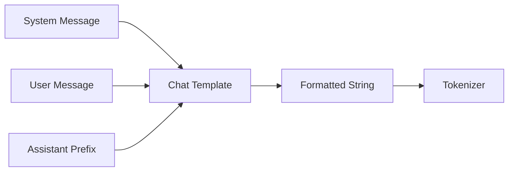

### Engineering Implications

- **Role separation matters** — System, user, and assistant content carry different weights in training; respect message roles.
- **Template is model-specific** — Llama, GPT, and Claude format conversations differently; use provider SDKs or official templates.
- **Hidden formatting tokens count** — Chat templates add tokens you do not see in your prompt text.

---

## Stage 2: Tokenization

The **tokenizer** splits text into subword units from a fixed vocabulary (typically 32K–200K tokens).

```
"Hello, world!" → ["Hello", ",", " world", "!"]
```

### Why Subwords?

| Approach | Problem |
|----------|---------|
| Word-level | Huge vocabulary; unknown words |
| Character-level | Sequences too long; weak semantics |
| **Subword (BPE, SentencePiece)** | Balance: common words whole, rare words split |

See [Tokens and Tokenization](tokens-and-tokenization.md) for BPE, SentencePiece, WordPiece deep dives.

### Tokenization Example

| Text | GPT-style Tokens | Count |
|------|-----------------|-------|
| `hello` | `hello` | 1 |
| `Hello` | `Hello` | 1 |
| `hello world` | `hello`, ` world` | 2 |
| `antidisestablishmentarianism` | `anti`, `dis`, `establishment`, `arian`, `ism` | 5 |
| `🎉` | varies by tokenizer | 1–3 |

---

## Stage 3: Token IDs

Each token maps to an integer ID in the model's vocabulary:

```
["Hello", ",", " world", "!"] → [9906, 11, 1917, 0]
```

The model never sees the string `"Hello"` during inference — only the integer `9906` and its corresponding embedding vector.

### Vocabulary Size

| Model Family | Approx. Vocab Size |
|--------------|-------------------|
| GPT-3.5 / GPT-4 (cl100k_base) | ~100,256 |
| Llama 3 | 128,256 |
| Claude | Proprietary (similar scale) |

Larger vocabularies mean fewer tokens per text (lower cost) but larger output head matrices.

---

## Stage 4: Embedding Lookup

Each token ID maps to a learned **embedding vector** — a dense float array (e.g., 4,096 dimensions for large models).

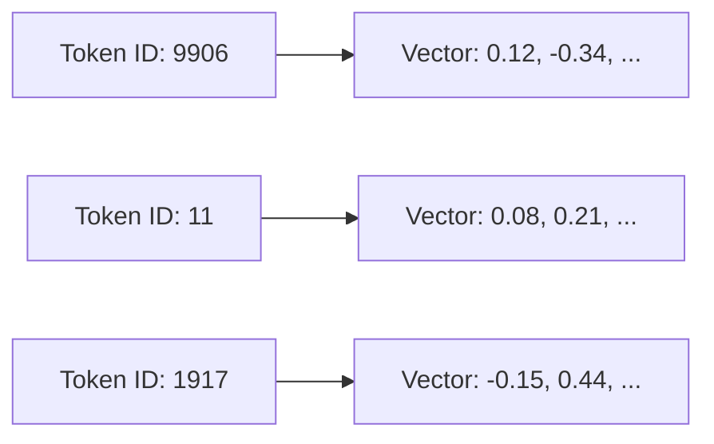

Think of embeddings as coordinates in a high-dimensional space where semantically similar tokens cluster together. These vectors are **learned during training**, not hand-crafted.

### Embedding Matrix

The model stores an embedding matrix of shape `[vocab_size, d_model]`. Lookup is an index operation:

```
embedding = embedding_matrix[token_id]
```

This is analogous to a database primary-key lookup — fast and deterministic.

---

## Stage 5: Positional Encoding

Transformers have no inherent sense of order. **Positional encoding** injects position information so the model distinguishes "dog bites man" from "man bites dog."

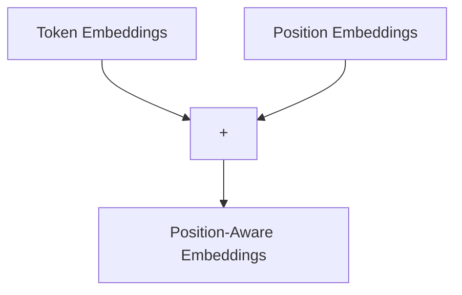

### Approaches

| Method | Used By | Idea |
|--------|---------|------|
| **Sinusoidal (absolute)** | Original Transformer | Fixed sine/cosine waves per position |
| **Learned absolute** | GPT-2, early models | Trainable position vectors |
| **RoPE (Rotary)** | Llama, Mistral, GPT-NeoX | Rotate query/key vectors by position |
| **ALiBi** | Some long-context models | Attention bias by distance |

Modern decoder-only models predominantly use **RoPE**, which generalizes better to longer sequences than fixed learned positions.

### Engineering Note

Position encoding is why **token order matters** in your prompt. Shuffling sentences changes model behavior even with identical words.

---

## Stage 6: Transformer Blocks

The core of the model is a stack of identical **transformer blocks** (layers) — typically 32–128 depending on model size.

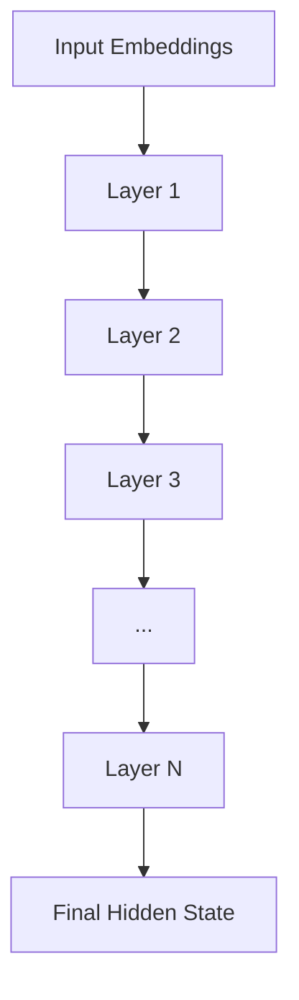

Each layer contains:

1. **Multi-head self-attention** — tokens communicate with each other
2. **Feed-forward network (FFN)** — per-token nonlinear transformation
3. **Residual connections** — add input to output (helps deep networks train)
4. **Layer normalization** — stabilize activations

### Layer Count and Model Size

| Model Class | Layers (approx.) | Parameters (approx.) |
|-------------|-----------------|---------------------|
| Small (7B) | 32 | 7 billion |
| Medium (70B) | 80 | 70 billion |
| Large (405B+) | 100+ | 400B+ |

More layers and wider FFNs → more capable but slower and more expensive. You do not choose layer count at inference — you choose the model.

---

## Stage 7: Self-Attention

Self-attention is the mechanism that lets each token "look at" other tokens and decide how much to incorporate their information.

### Intuitive Explanation

For each token, the model asks three questions via learned projections:

| Vector | Question |
|--------|----------|
| **Query (Q)** | "What am I looking for?" |
| **Key (K)** | "What do I contain?" |
| **Value (V)** | "What information do I offer?" |

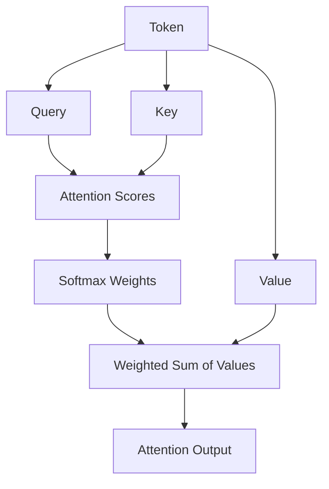

**Attention score** between token A and token B = how relevant B is to A. High score → B's value strongly influences A's output representation.

### Multi-Head Attention

Instead of one attention pass, the model runs **multiple heads** in parallel (e.g., 32–64 heads). Each head can learn different relationship types — syntax, coreference, topic continuity.

### Computational Cost

Attention cost scales as **O(n²)** with sequence length `n` because every token attends to every other token (within the causal mask). This is why long contexts are expensive.

| Context Length | Relative Attention Cost |
|----------------|------------------------|
| 4K tokens | 1× |
| 32K tokens | 64× |
| 128K tokens | 1,024× |

---

## Stage 8: The Decoder and Causal Masking

Decoder-only models use **causal (masked) self-attention** — each token can only attend to itself and tokens before it, never future tokens.

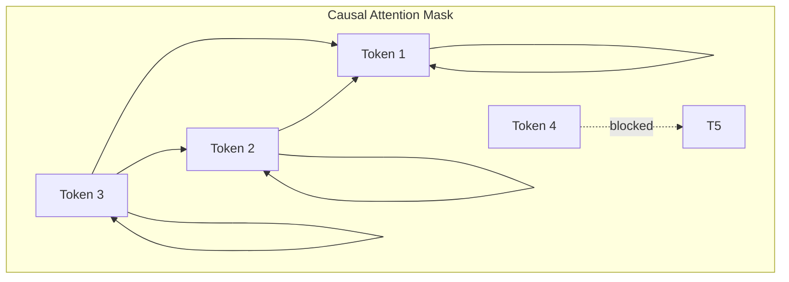

This mask enforces left-to-right generation. During training, the model sees full sequences but the mask simulates generating one token at a time. During inference, new tokens are appended and only attend backward.

### Why Causal Masking Matters for Engineers

- The model cannot "see the future" — it generates based only on prior context.
- Placing critical instructions **after** user content (wrong role assignment) changes attention patterns.
- Long contexts increase the attention field each new token must compute over.

---

## Stage 9: Output Head and Logits

After the final transformer layer, the hidden state of the **last token** passes through the **language model head** — a linear projection to vocabulary size.

```
hidden_state [d_model] → logits [vocab_size]
```

**Logits** are raw scores — one per vocabulary token. Higher logit = model considers that token more likely as the next token.

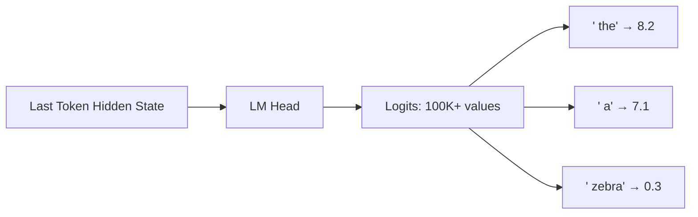

At this point, no text has been generated yet for the new position — just a ranked list of candidate next tokens.

---

## Stage 10: Sampling and Prediction

The model converts logits into a probability distribution, then **selects** the next token.

### Softmax

```
probability(token_i) = exp(logit_i) / sum(exp(logit_j) for all j)
```

### Sampling Strategies

| Parameter | Effect | Production Use |
|-----------|--------|----------------|
| **temperature** | Scales logits before softmax. Low (0.0–0.3) = deterministic/focused. High (0.8–1.2) = creative/random | 0 for extraction; 0.7 for chat |
| **top_p (nucleus)** | Sample from smallest set of tokens whose cumulative probability ≥ p | 0.9–0.95 typical |
| **top_k** | Sample only from k highest-probability tokens | 40–50 typical |
| **seed** | Reproducible sampling (where supported) | Testing, evals |

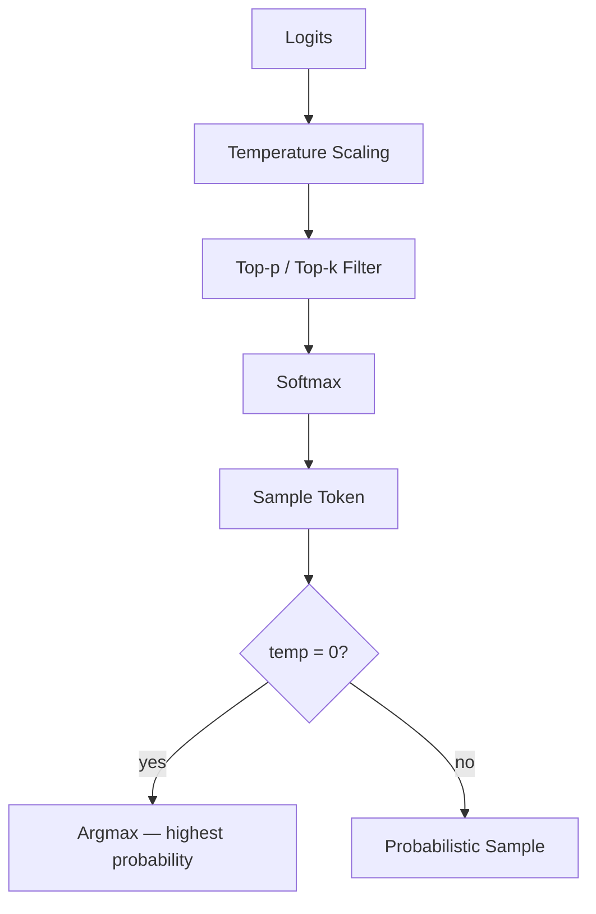

### Greedy vs Stochastic

- **Greedy (temperature=0):** Always pick highest-probability token. Deterministic but repetitive.
- **Stochastic (temperature>0):** Random sample weighted by probabilities. Varied but can hallucinate.

> **Production Standard:** Use `temperature=0` (or equivalent) for structured extraction and classification. Use moderate temperature (0.5–0.8) for conversational chat.

---

## Stage 11: Autoregressive Generation

The model generates text **one token at a time**, feeding each new token back as input.

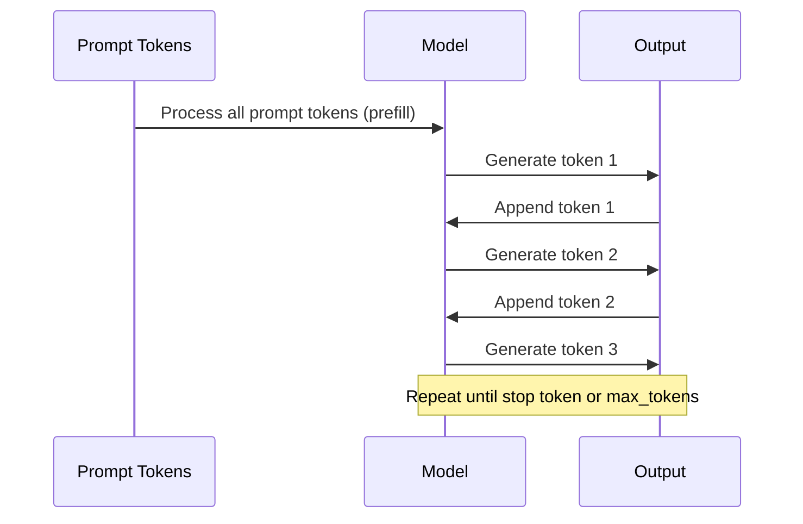

### Stop Conditions

| Condition | Description |
|-----------|-------------|
| **EOS token** | End-of-sequence special token generated |
| **max_tokens** | API parameter caps output length |
| **Stop sequences** | Custom strings (e.g., `"\n\nHuman:"`) |
| **Tool call token** | Model emits structured tool invocation |

Each generated token is an **output token** you pay for. A 500-token response = 500 decode steps.

### KV Cache Optimization

Recomputing attention over the entire sequence for every new token would be wasteful. Inference engines use a **KV cache** — storing key/value vectors from prior tokens so only the new token's attention is computed.

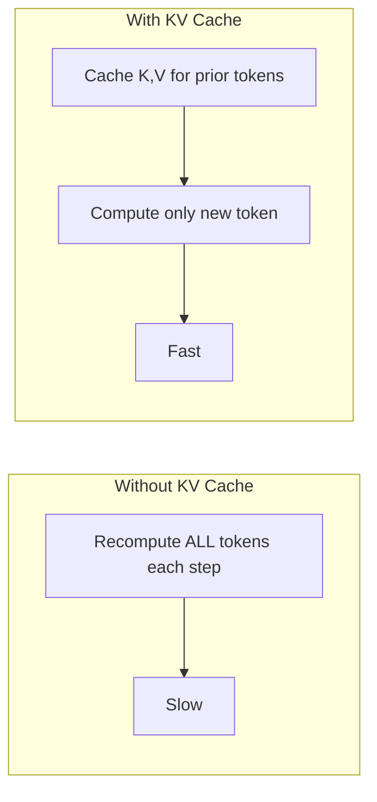

This is an infrastructure optimization but explains why **longer contexts increase memory** on the provider side and can affect throughput.

---

## Stage 12: Detokenization

The sequence of generated token IDs converts back to a UTF-8 string:

```
[9906, 11, 1917, 0] → "Hello, world!"
```

### Edge Cases

| Issue | Cause | Symptom |
|-------|-------|---------|
| Broken Unicode | Token splits mid-character | Replacement characters |
| Leading spaces | BPE merges space into next token | Unexpected whitespace |
| Incomplete generation | max_tokens hit mid-word | Truncated output |

Always validate output length and handle truncation gracefully in your application.

---

## Prefill vs Decode

Modern inference splits generation into two phases with different performance characteristics.

```mermaid
gantt
    title Inference Timeline
    dateFormat X
    axisFormat %s

    section Prefill
    Process input tokens (parallel) :0, 200

    section Decode
    Token 1 :200, 50
    Token 2 :250, 50
    Token 3 :300, 50
    Token N :350, 50
```

| Phase | What Happens | Latency Driver |
|-------|-------------|----------------|
| **Prefill** | Process entire input prompt in parallel | Input token count (context size) |
| **Decode** | Generate one output token per step | Output token count |

### Engineering Implications

- **Time to first token (TTFT)** ≈ prefill latency — dominated by context size.
- **Total response time** ≈ prefill + (output_tokens × per-token decode latency).
- Shrinking input context improves TTFT; limiting `max_tokens` improves total time.

---

## Why It Matters

Understanding the pipeline turns mysterious model behavior into debuggable engineering problems.

| Symptom | Pipeline Stage | Likely Cause |
|---------|---------------|--------------|
| Slow first response | Prefill | Context too large |
| Slow overall but fast start | Decode | `max_tokens` too high |
| Identical outputs | Sampling | temperature=0 (expected) |
| Incoherent rambling | Sampling | temperature too high |
| Cut-off mid-sentence | Stop condition | `max_tokens` limit hit |
| Different results same prompt | Sampling | Stochastic sampling (expected) |
| High cost | Tokenization + decode | Too many input/output tokens |
| "Forgot" early context | Attention + context window | Lost in the middle, truncation |

---

## Production Considerations

| Area | Practice |
|------|----------|
| **Sampling config** | Centralize temperature, top_p per use case in config |
| **max_tokens** | Set per endpoint; never use provider default blindly |
| **Stop sequences** | Define for agents to prevent runaway generation |
| **Reproducibility** | Use seed where supported for eval pipelines |
| **Streaming** | Stream decode tokens as they arrive (SSE) |
| **Truncation detection** | Check `finish_reason` (`length` vs `stop`) |
| **Model pinning** | Behavior changes across versions even with same params |

```python
response = await client.chat.completions.create(
    model="gpt-4o-mini",
    messages=messages,
    max_tokens=1024,
    temperature=0.7,
    top_p=0.9,
    stop=["\n\nUser:", "</tool>"],
)

finish_reason = response.choices[0].finish_reason
if finish_reason == "length":
    # Output was truncated — handle gracefully
    ...
```

---

## Performance Considerations

| Lever | Effect on Pipeline |
|-------|-------------------|
| Reduce input tokens | Faster prefill, lower attention cost |
| Reduce output tokens | Fewer decode steps |
| Smaller model | Faster per-layer computation |
| Streaming | Better perceived latency (TTFT unchanged) |
| Batching (provider-side) | Higher throughput for offline jobs |
| KV cache (provider-side) | Faster decode for long conversations |

### Latency Budget Example

| Component | Typical Range |
|-----------|--------------|
| Network round-trip | 20–100ms |
| Prefill (4K context) | 200–800ms |
| Per output token | 20–80ms |
| 200-token response decode | 4–16s total decode |

Use streaming so users see tokens after prefill completes (~TTFT) rather than waiting for full decode.

---

## Cost Considerations

Cost maps directly to pipeline stages:

```
cost = (input_tokens × input_price) + (output_tokens × output_price)
```

| Stage | Cost Impact |
|-------|-------------|
| Tokenization | Determines input token count |
| Prefill (input) | Billed as input tokens |
| Decode (output) | Each generated token billed as output token |
| Retries | Re-runs full prefill + decode |

Output tokens are often priced higher than input tokens (e.g., 3× on some models). Limiting `max_tokens` is a direct cost control on the decode phase.

---

## Security Considerations

| Stage | Risk | Mitigation |
|-------|------|------------|
| Text input | Prompt injection | Role separation, input validation |
| Tokenization | Token smuggling attacks | Normalize input, validate encoding |
| Sampling | Undesirable content generation | Output guardrails, content filters |
| Autoregressive loop | Runaway generation burning cost | `max_tokens`, stop sequences, timeouts |
| Output | Code injection, XSS | Never execute raw output; sanitize |

---

## Best Practices

1. **Set `max_tokens` intentionally** — Match to use case (50 for classification, 2000 for explanation).
2. **Check `finish_reason`** — Detect truncation vs natural stop.
3. **Use temperature=0 for deterministic tasks** — Extraction, classification, JSON.
4. **Stream decode tokens** — Improve UX for anything interactive.
5. **Minimize prefill size** — Trim context before the call (see [Context Windows](context-windows.md)).
6. **Log token counts per request** — Correlate with latency and cost.
7. **Understand chat templates** — Use SDK message format, not raw string concatenation.
8. **Test sampling params in evals** — Document what settings your eval suite uses.
9. **Handle detokenization edge cases** — Validate UTF-8, check for truncation artifacts.
10. **Pin model versions** — Sampling behavior can shift between releases.

---

## Common Mistakes

| Mistake | Impact | Fix |
|---------|--------|-----|
| Ignoring `finish_reason: length` | Truncated JSON, broken code | Increase max_tokens or chunk task |
| temperature=0.9 for extraction | Inconsistent structured output | temperature=0, JSON mode |
| Concatenating messages into one string | Wrong attention patterns | Use role-based message arrays |
| Not streaming long responses | Poor UX, timeout risk | SSE streaming |
| Assuming model sees raw text | Misunderstanding token limits | Count tokens, not characters |
| No stop sequences for agents | Runaway tool loops | Define stop tokens and iteration limits |
| Retrying without idempotency | Duplicate outputs, double cost | Idempotency keys, dedup |
| Huge system prompt on every call | Slow prefill, high cost | Cache static prefix where supported |

---

## Python Examples

### Inspecting the Full Request-Response Cycle

```python
import asyncio
from openai import AsyncOpenAI

client = AsyncOpenAI()


async def inspect_pipeline():
    messages = [
        {"role": "system", "content": "You are a concise technical writer."},
        {"role": "user", "content": "Explain self-attention in one paragraph."},
    ]

    response = await client.chat.completions.create(
        model="gpt-4o-mini",
        messages=messages,
        max_tokens=200,
        temperature=0.7,
        top_p=0.9,
    )

    choice = response.choices[0]
    usage = response.usage

    print(f"Model:           {response.model}")
    print(f"Finish reason:   {choice.finish_reason}")
    print(f"Input tokens:    {usage.prompt_tokens}")      # prefill cost
    print(f"Output tokens:   {usage.completion_tokens}")   # decode cost
    print(f"Total tokens:    {usage.total_tokens}")
    print(f"Content:         {choice.message.content}")


asyncio.run(inspect_pipeline())
```

### Streaming to Observe Decode Phase

```python
import asyncio
import time
from openai import AsyncOpenAI

client = AsyncOpenAI()


async def stream_decode():
    messages = [{"role": "user", "content": "Write a haiku about transformers."}]
    start = time.perf_counter()
    first_token_time = None
    token_count = 0

    stream = await client.chat.completions.create(
        model="gpt-4o-mini",
        messages=messages,
        max_tokens=100,
        stream=True,
    )

    async for chunk in stream:
        delta = chunk.choices[0].delta.content
        if delta:
            if first_token_time is None:
                first_token_time = time.perf_counter() - start
                print(f"TTFT (prefill done): {first_token_time:.2f}s")
            token_count += 1
            print(delta, end="", flush=True)

    total = time.perf_counter() - start
    print(f"\nDecode tokens: ~{token_count}, total time: {total:.2f}s")


asyncio.run(stream_decode())
```

### Sampling Configuration per Use Case

```python
from dataclasses import dataclass
from enum import Enum


class UseCase(Enum):
    CHAT = "chat"
    EXTRACTION = "extraction"
    CREATIVE = "creative"


@dataclass
class SamplingConfig:
    temperature: float
    top_p: float
    max_tokens: int


SAMPLING_PROFILES: dict[UseCase, SamplingConfig] = {
    UseCase.CHAT: SamplingConfig(temperature=0.7, top_p=0.9, max_tokens=2048),
    UseCase.EXTRACTION: SamplingConfig(temperature=0.0, top_p=1.0, max_tokens=500),
    UseCase.CREATIVE: SamplingConfig(temperature=1.0, top_p=0.95, max_tokens=4096),
}


def get_sampling_config(use_case: UseCase) -> SamplingConfig:
    return SAMPLING_PROFILES[use_case]
```

### Detecting Truncation

```python
from dataclasses import dataclass


@dataclass
class GenerationResult:
    content: str
    finish_reason: str
    was_truncated: bool


def parse_completion(choice) -> GenerationResult:
    content = choice.message.content or ""
    reason = choice.finish_reason or "unknown"
    return GenerationResult(
        content=content,
        finish_reason=reason,
        was_truncated=reason == "length",
    )
```

---

## Interview Preparation

### Frequently Asked Questions

**Q1: Walk through what happens when an LLM generates a response.**

> **Strong answer:** Text is tokenized into IDs, embedded with positional encoding, processed through N transformer layers with causal self-attention, projected to logits via the LM head, sampled for the next token, appended to the sequence, and repeated autoregressively until stop condition. Final token IDs are detokenized to text.

**Q2: What is the difference between prefill and decode?**

> **Strong answer:** Prefill processes all input tokens in parallel (determines TTFT). Decode generates one output token per step sequentially (determines total generation time). Input tokens affect prefill; output tokens affect decode. KV cache avoids recomputing prior tokens during decode.

**Q3: What does temperature do?**

> **Strong answer:** Temperature scales logits before softmax. Low temperature sharpens the distribution (more deterministic); high temperature flattens it (more random). temperature=0 is greedy argmax. Use 0 for extraction, moderate for chat.

**Q4: Why is attention O(n²) and why does it matter?**

> **Strong answer:** Each token attends to all prior tokens, so compute grows quadratically with sequence length. This makes long contexts expensive in both latency and cost. Mitigations include context compression, sliding windows, and efficient attention approximations (provider-side).

**Q5: What is causal masking?**

> **Strong answer:** In decoder-only models, each token can only attend to itself and previous tokens, not future ones. This enables autoregressive generation — the model predicts the next token based only on what came before.

### Real-World Scenario

**Scenario:** Your RAG chatbot is fast for short queries but takes 8+ seconds before the first token on long documents.

> **Discussion points:** Long prefill from large context (system + history + many RAG chunks). Profile input token count. Reduce retrieved chunks, summarize documents, use relevance filtering. Consider prompt caching for static system prefix. TTFT is a prefill problem, not decode.

---

## Navigation

### Prerequisites

- [Introduction to LLM Engineering](introduction-to-llm-engineering.md) — LLM concepts and ecosystem
- [Backend Engineering](../backend-engineering/README.md) — API integration patterns

### — LLM Engineering

| # | Topic | Document |
|---|-------|----------|
| 1 | Introduction to LLM Engineering | [introduction-to-llm-engineering.md](introduction-to-llm-engineering.md) |
| 2 | How LLMs Work | **You are here** |
| 3 | Tokens and Tokenization | [tokens-and-tokenization.md](tokens-and-tokenization.md) |
| 4 | Context Windows | [context-windows.md](context-windows.md) |

### Related Topics

- [Tokens and Tokenization](tokens-and-tokenization.md) — deep dive on BPE and token counting
- [Context Windows](context-windows.md) — managing input size for attention
- [Embeddings](../embeddings/README.md) — separate embedding models for RAG

### Next Topics

- [Tokens and Tokenization](tokens-and-tokenization.md) — BPE, cost calculation, special tokens
- [Context Windows](context-windows.md) — truncation and compression strategies

---

## See Also

- [Illustrated Transformer (Jay Alammar)](https://jalammar.github.io/illustrated-transformer/)
- [The Annotated Transformer](https://nlp.seas.harvard.edu/annotated-transformer/)
- [OpenAI Tokenizer Tool](https://platform.openai.com/tokenizer)

## Changelog

| Version | Date | Changes |
|---------|------|---------|
| 1.0 | 2026-07-13 | Initial publication |
