# Introduction to LLM Engineering

> What Large Language Models are, how they evolved, why they transformed software engineering, and the end-to-end architecture every production LLM application depends on.

## Table of Contents

- [Overview](#overview)
- [What Is a Large Language Model?](#what-is-a-large-language-model)
- [Evolution of Language Models](#evolution-of-language-models)
- [The GPT Family and Decoder-Only Models](#the-gpt-family-and-decoder-only-models)
- [Why LLMs Changed Software Engineering](#why-llms-changed-software-engineering)
- [AI Engineering vs LLM Engineering](#ai-engineering-vs-llm-engineering)
- [Common LLM Applications](#common-llm-applications)
- [The LLM Ecosystem](#the-llm-ecosystem)
- [End-to-End LLM Application Architecture](#end-to-end-llm-application-architecture)
- [Why It Matters](#why-it-matters)
- [Production Considerations](#production-considerations)
- [Performance Considerations](#performance-considerations)
- [Cost Considerations](#cost-considerations)
- [Security Considerations](#security-considerations)
- [Best Practices](#best-practices)
- [Common Mistakes](#common-mistakes)
- [Python Examples](#python-examples)
- [Interview Preparation](#interview-preparation)
- [Navigation](#navigation)

---

## Overview

Large Language Models (LLMs) are neural networks trained on vast text corpora to predict the next token in a sequence. At inference time, they generate human-like text, code, and structured outputs by repeatedly sampling from a probability distribution over their vocabulary.

LLM engineering is the discipline of building reliable production systems around these models — API integration, prompt design, context management, streaming, evaluation, cost control, and failure handling. This document is **Section 1** of this handbook.

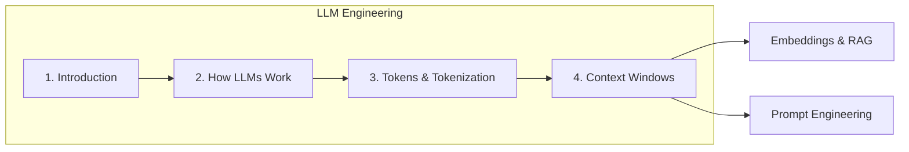

> **Prerequisites:** Complete [Foundations](../foundations/README.md) and [Backend Engineering](../backend-engineering/README.md) before starting this handbook.

---

## What Is a Large Language Model?

A **Large Language Model** is a deep neural network — typically a Transformer — trained with self-supervised learning on text data. The training objective is simple: given a sequence of tokens, predict the next token. Scale (parameters, data, compute) is what makes these models *large* and capable.

| Term | Definition |
|------|------------|
| **Token** | Atomic unit of text the model processes (word piece, subword, or character) |
| **Parameter** | Learned weight in the neural network (billions in modern LLMs) |
| **Context window** | Maximum number of tokens the model can attend to in one request |
| **Inference** | Running the trained model to generate outputs (as opposed to training) |
| **Completion** | Generated text continuation from a prompt |

### Mental Model for Engineers

Think of an LLM as a **stateless function with memory limits**:

```
f(system_prompt, conversation_history, user_message) → generated_text
```

The function has no persistent memory between API calls. Your backend owns session state, retrieval, and tool results. The model only sees what you put in the context window on each request.

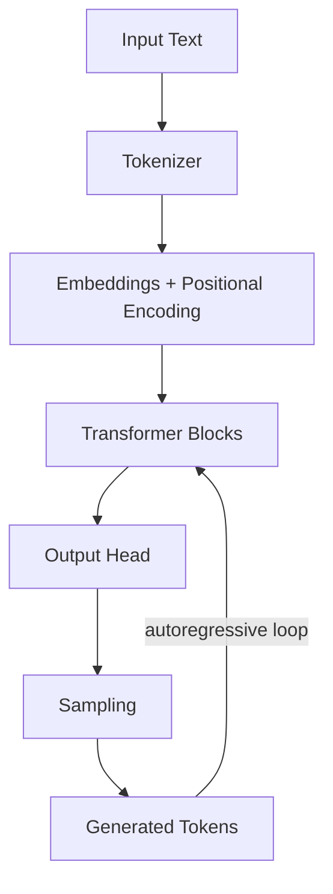

For the full pipeline breakdown, see [How LLMs Work](how-llms-work.md).

---

## Evolution of Language Models

Understanding the evolution helps you choose architectures, set expectations, and debug behavior.

### Timeline

| Era | Approach | Representative Models | Key Limitation |
|-----|----------|----------------------|----------------|
| **2013–2017** | Word embeddings, RNNs, LSTMs | Word2Vec, ELMo | Short context, slow training |
| **2017** | Transformer architecture | Original "Attention Is All You Need" | Research-scale only |
| **2018–2019** | Pre-training + fine-tuning | BERT (encoder), GPT-2 (decoder) | Task-specific heads |
| **2020–2022** | Scale + instruction tuning | GPT-3, PaLM, Claude 1 | API-only, expensive |
| **2023–2024** | Chat, tools, multimodal | GPT-4, Claude 3, Gemini, Llama 3 | Context, hallucination, cost |
| **2025–2026** | Agents, long context, reasoning | o-series, Claude 4, open-weight leaders | Reliability at scale |

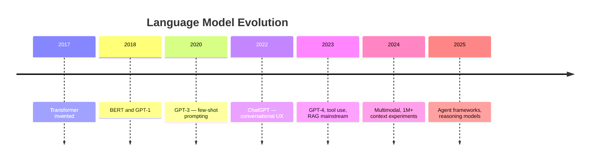

### Paradigm Shifts That Matter for Engineers

1. **Pre-training → fine-tuning → prompting** — Most production apps use prompting and RAG, not custom training.
2. **Encoder-only → decoder-only dominance** — Chat and code generation use decoder-only models almost exclusively.
3. **Batch API → streaming** — Interactive products stream tokens; batch jobs use synchronous completions.
4. **Single model → orchestrated systems** — Production apps combine LLMs with retrieval, tools, and guardrails.

---

## The GPT Family and Decoder-Only Models

**GPT** (Generative Pre-trained Transformer) models are **decoder-only** Transformers. They generate text left-to-right, one token at a time, using causal (masked) self-attention so each position only sees prior tokens.

### GPT Family Overview

| Model | Release | Context (approx.) | Notes |
|-------|---------|-------------------|-------|
| GPT-1 | 2018 | 512 | Proof of pre-training concept |
| GPT-2 | 2019 | 1,024 | First widely noticed generative quality |
| GPT-3 | 2020 | 4,096 | Few-shot prompting at scale |
| GPT-3.5 | 2022 | 16,384 | ChatGPT backbone |
| GPT-4 | 2023 | 128K | Multimodal, stronger reasoning |
| GPT-4o | 2024 | 128K | Optimized latency/cost multimodal |
| GPT-4.1 / o-series | 2025+ | 128K–1M | Reasoning-focused variants |

### Decoder-Only vs Encoder-Only vs Encoder-Decoder

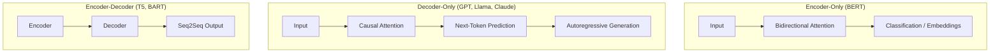

| Architecture | Best For | Production Examples |
|--------------|----------|---------------------|
| **Decoder-only** | Chat, code gen, agents, completion | GPT-4o, Claude, Llama, Mistral |
| **Encoder-only** | Classification, embeddings, NER | BERT, modern embedding models |
| **Encoder-decoder** | Translation, summarization (legacy) | T5, Flan-T5 |

> **Production Standard:** Decoder-only models power virtually all conversational AI products. Encoder-only models power [embeddings and RAG](../embeddings/README.md) retrieval pipelines.

### Open-Weight Alternatives

| Family | Maintainer | Typical Use |
|--------|-----------|-------------|
| Llama 3.x | Meta | Self-hosted chat, fine-tuning |
| Mistral / Mixtral | Mistral AI | Efficient self-hosted inference |
| Qwen | Alibaba | Multilingual, code |
| Gemma | Google | Lightweight open models |

Choosing between API-hosted (OpenAI, Anthropic) and self-hosted open weights is a production decision covered in [Production Considerations](#production-considerations).

---

## Why LLMs Changed Software Engineering

Before LLMs, software handled deterministic logic: `if balance >= amount then transfer`. LLMs introduced **probabilistic behavior** as a first-class building block.

### What Changed

| Before LLMs | After LLMs |
|-------------|------------|
| Hard-coded templates for text | Dynamic natural language generation |
| Regex and rules for classification | Zero-shot and few-shot classification |
| Fixed FAQ bots | Conversational support with context |
| Manual code for data extraction | Structured output from unstructured text |
| Search by keywords only | Semantic search + generation (RAG) |

### New Engineering Responsibilities

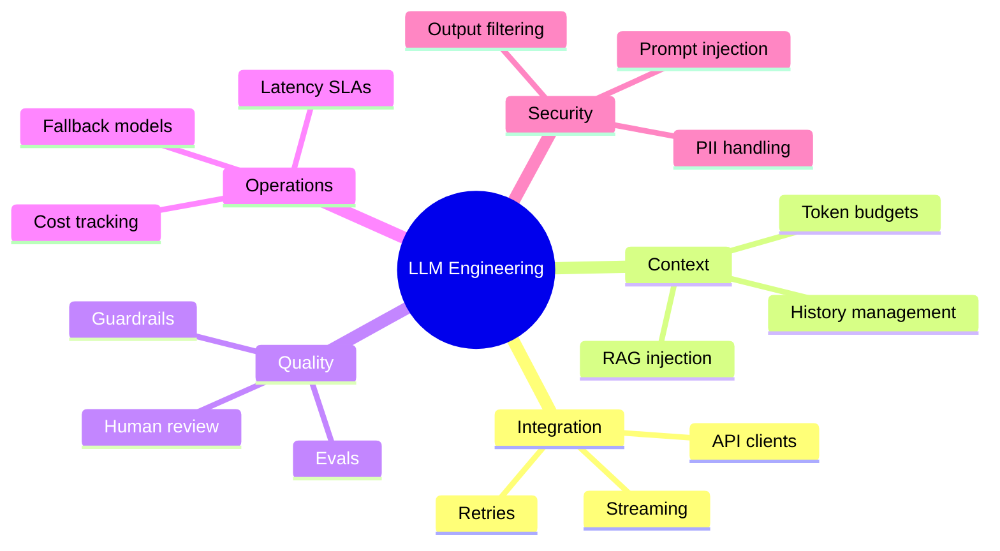

LLMs did not replace software engineering — they expanded it. You still need [layered architecture](../backend-engineering/backend-architecture-for-ai.md), [error handling](../backend-engineering/error-handling-for-ai-backends.md), [testing](../backend-engineering/testing-backend-for-ai.md), and [monitoring](../monitoring/monitoring-foundation-for-ai-backends.md). The model is one dependency in a larger system.

---

## AI Engineering vs LLM Engineering

These terms overlap but are not identical.

| Dimension | AI Engineering | LLM Engineering |
|-----------|---------------|-----------------|
| **Scope** | Full AI product lifecycle | Model interaction and inference layer |
| **Includes** | Data pipelines, ML training, deployment, evals | Prompts, tokens, context, streaming, provider APIs |
| **Typical stack** | Python, PyTorch, feature stores, model serving | OpenAI/Anthropic SDKs, LangChain/LlamaIndex, vector DBs |
| **Primary risk** | Data drift, model accuracy | Hallucination, cost blowout, prompt injection |
| **This playbook** | All domains | This handbook |

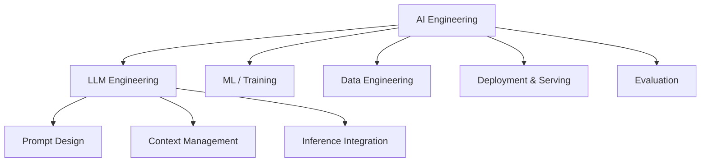

**Rule of thumb:** If your job is calling an API, managing conversation state, and shipping a chat product — you are doing LLM engineering within AI engineering. If you are training custom models or building feature pipelines — you are doing broader AI/ML engineering.

---

## Common LLM Applications

### Application Matrix

| Application | Pattern | LLM Role | Backend Needs |
|-------------|---------|----------|---------------|
| **Chat assistant** | Multi-turn conversation | Generate replies | Session store, streaming |
| **RAG Q&A** | Retrieve + generate | Synthesize grounded answers | Vector DB, chunking |
| **Code assistant** | Inline completion / agent | Generate and edit code | IDE integration, sandbox |
| **Summarization** | Single-shot or map-reduce | Compress long documents | Chunking, parallel calls |
| **Classification** | Structured output | Label text into categories | Schema validation |
| **Extraction** | JSON mode / tool calling | Pull fields from documents | Pydantic validation |
| **Agent workflows** | Tool loop | Plan, call tools, reason | Orchestrator, auth on tools |
| **Content generation** | Template + LLM | Marketing copy, emails | Brand guardrails, review |

### Architecture Patterns by Use Case

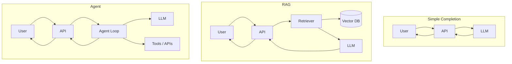

See [AI Backend Reference Architecture](../backend-engineering/ai-backend-reference-architecture.md) for production implementations of these patterns.

---

## The LLM Ecosystem

### Layered Ecosystem Map

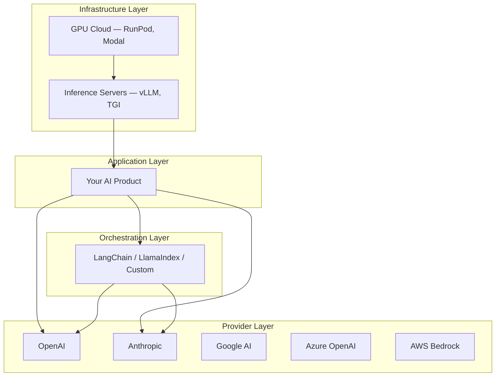

### Provider Comparison (Engineering Lens)

| Provider | Strengths | Watch Outs |
|----------|-----------|------------|
| **OpenAI** | Broad model lineup, tool calling, ecosystem | Rate limits, pricing changes |
| **Anthropic** | Long context, safety, Claude tool use | Smaller model variety |
| **Google (Gemini)** | Multimodal, long context | API surface evolution |
| **Azure OpenAI** | Enterprise compliance, private networking | Azure-specific config |
| **AWS Bedrock** | Multi-model, IAM integration | Cold start, model availability by region |
| **Self-hosted (vLLM)** | Data residency, cost at scale | Ops burden, hardware management |

### Key Libraries

| Library | Purpose | When to Use |
|---------|---------|-------------|
| `openai` | Official OpenAI SDK | Direct API integration |
| `anthropic` | Official Anthropic SDK | Claude integration |
| `tiktoken` | Token counting (OpenAI) | Cost estimation, budget enforcement |
| `httpx` | Async HTTP client | Custom provider clients |
| `instructor` | Structured outputs | Pydantic-validated LLM responses |
| LangChain / LlamaIndex | Orchestration | Complex chains — use judiciously |

> **Production Standard:** Prefer thin, testable wrappers over heavy frameworks. See [HTTP Clients for AI Backends](../backend-engineering/http-clients-for-ai-backends.md).

---

## End-to-End LLM Application Architecture

A production LLM application is never "just an API call." Here is the canonical architecture.

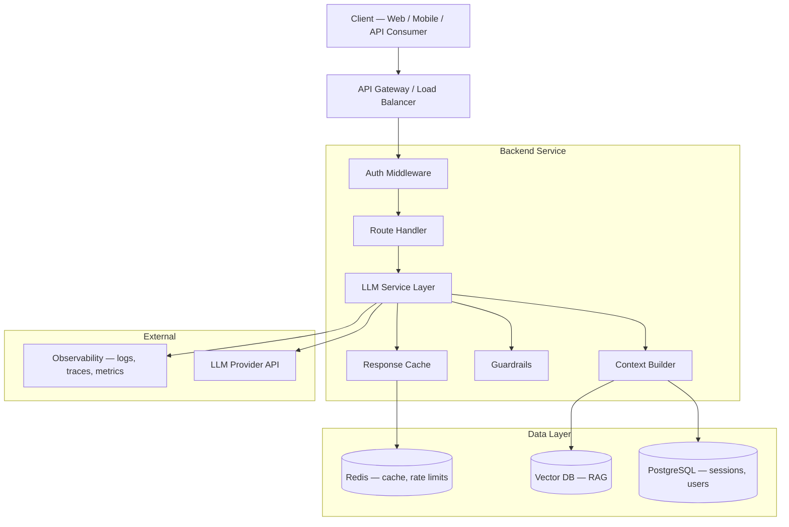

### Request Flow (Chat with History)

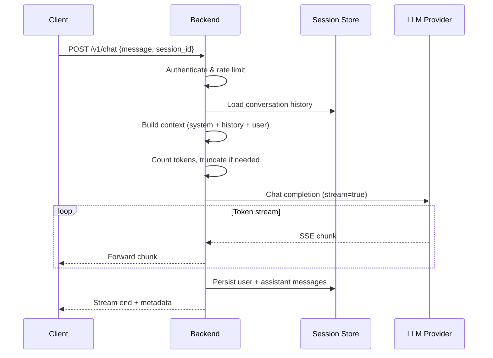

### Core Components

| Component | Responsibility |
|-----------|---------------|
| **Context builder** | Assembles system prompt, history, RAG chunks, tool results |
| **Token budget manager** | Enforces context window limits before the API call |
| **LLM client abstraction** | Provider-agnostic interface with retries and timeouts |
| **Guardrails** | Input/output filtering, PII redaction, policy checks |
| **Session store** | Persists conversation history between requests |
| **Observability** | Logs token usage, latency, model version per request |

---

## Why It Matters

LLM engineering is the bridge between backend skills and advanced AI capabilities (RAG, agents, evaluation). Without this foundation:

- You will misestimate **cost** (token math errors compound at scale).
- You will hit **context limits** silently (truncated history → confused model).
- You will ship **fragile integrations** (no retries, no streaming disconnect handling).
- You will confuse **model capabilities** with **system capabilities** (the backend owns reliability).

| Skill Gap | Production Symptom |
|-----------|-------------------|
| No token awareness | Surprise bills, failed requests over limit |
| No context strategy | Model "forgets" earlier conversation |
| No provider abstraction | Vendor lock-in, hard to test |
| No streaming handling | Poor UX, wasted tokens on disconnect |
| No eval baseline | Quality regressions go unnoticed |

---

## Production Considerations

| Area | Practice |
|------|----------|
| **Provider abstraction** | Interface in domain layer; swap OpenAI ↔ Anthropic in config |
| **Timeouts** | 60–120s for chat; shorter for classification |
| **Retries** | Exponential backoff on 429/5xx; never retry non-idempotent tool calls blindly |
| **Idempotency** | Idempotency keys for paid operations |
| **Graceful degradation** | Fallback model when primary is down |
| **Version pinning** | Pin model version in config; test before upgrading |
| **Health checks** | Probe LLM provider in `/ready` endpoint |
| **Circuit breaker** | Stop calling provider after sustained failures |

```python
# Production config pattern — pin models, set budgets
from pydantic_settings import BaseSettings


class LLMSettings(BaseSettings):
    provider: str = "openai"
    model: str = "gpt-4o-mini"
    fallback_model: str = "gpt-4o-mini"
    max_tokens: int = 4096
    request_timeout_seconds: float = 90.0
    max_retries: int = 3

    model_config = {"env_prefix": "LLM_"}
```

---

## Performance Considerations

| Factor | Impact | Mitigation |
|--------|--------|------------|
| **Time to first token (TTFT)** | Perceived latency | Streaming, smaller models for routing |
| **Tokens per second (TPS)** | Total response time | Model selection, output token limits |
| **Context size** | Pre-fill latency grows linearly | Trim history, summarize old turns |
| **Parallel calls** | Throughput for batch workloads | Async client, connection pooling |
| **Cold starts (self-hosted)** | First request slow | Warm pools, keep-alive |

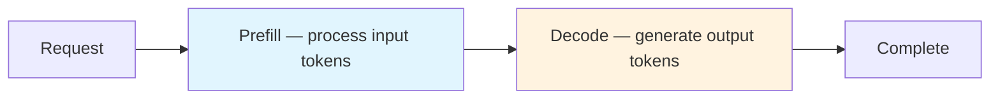

**Prefill** processes your prompt (input tokens). **Decode** generates output one token at a time. Large contexts slow prefill; long outputs slow decode.

---

## Cost Considerations

LLM cost = **input tokens × input price + output tokens × output price**.

| Cost Driver | Typical Range | Control Lever |
|-------------|--------------|---------------|
| Input tokens (system + history + RAG) | 60–90% of tokens | Shorter prompts, summarization |
| Output tokens | 10–40% of tokens | `max_tokens`, concise system prompts |
| Model tier | 10–50× price difference | Route simple queries to cheaper models |
| Failed retries | Wasted spend | Smart retry policy |
| Streaming disconnects | Orphaned generation | Cancel on client disconnect |

See [Tokens and Tokenization](tokens-and-tokenization.md) for counting and cost calculation patterns.

---

## Security Considerations

| Threat | Description | Mitigation |
|--------|-------------|------------|
| **Prompt injection** | User input overrides system instructions | Input sanitization, output validation, privilege separation for tools |
| **Data exfiltration** | Model tricked into leaking system prompt or data | Never put secrets in prompts; tool auth scoped per user |
| **PII in logs** | User data logged with prompts | Redact before logging; structured log fields |
| **API key exposure** | Keys in client-side code | Server-side proxy only |
| **Unsafe tool execution** | Agent calls destructive APIs | Allowlists, human-in-the-loop, sandboxing |
| **Model output as code** | Generated code executed unsandboxed | Never `eval()` LLM output |

See [Security for AI Backends](../security/security-for-ai-backends.md) for backend hardening patterns.

---

## Best Practices

1. **Treat the LLM as an unreliable dependency** — Wrap with timeouts, retries, fallbacks, and circuit breakers like any external API.
2. **Own the context** — Never assume the model remembers anything; your backend builds context every request.
3. **Count tokens before calling** — Prevent over-limit failures and budget overruns.
4. **Stream by default for chat** — Users perceive lower latency; handle disconnects to stop token burn.
5. **Pin model versions** — Document and test before upgrading; model behavior changes without notice.
6. **Log usage metadata** — `model`, `input_tokens`, `output_tokens`, `latency_ms`, `request_id` on every call.
7. **Separate system and user content** — Use provider message roles correctly; do not concatenate into one string.
8. **Abstract the provider** — Interface + DI enables testing and vendor migration.
9. **Start with the cheapest model that works** — Upgrade only when evals prove the need.
10. **Build evals early** — Even 20 golden Q&A pairs catch regressions before users do.

---

## Common Mistakes

| Mistake | Impact | Fix |
|---------|--------|-----|
| Calling LLM directly from route handlers | Untestable, no retry logic | Service layer + provider abstraction |
| Ignoring token limits | 400 errors or silent truncation | Pre-flight token count and budget manager |
| Storing full history verbatim | Cost explosion, context overflow | Summarize or sliding window |
| No streaming disconnect handling | Wasted tokens and money | Monitor `is_disconnected()`, cancel task |
| Hardcoding prompts in code | Hard to iterate and A/B test | Prompt templates in config or DB |
| Trusting model output without validation | Bad data in DB, XSS, wrong actions | Pydantic validation, guardrails |
| Using `max_tokens` without understanding | Cut-off mid-sentence or overpay | Set based on use case; monitor output length |
| Assuming all models behave the same | Broken prompts after migration | Re-eval on model change |
| No fallback model | Total outage when provider fails | Secondary provider or degraded mode |
| Logging full prompts in production | PII leakage, compliance violations | Log hashes and metadata only |

---

## Python Examples

### Minimal Provider-Agnostic LLM Client

```python
from abc import ABC, abstractmethod
from dataclasses import dataclass
from openai import AsyncOpenAI


@dataclass
class CompletionResult:
    content: str
    model: str
    input_tokens: int
    output_tokens: int
    latency_ms: float


class LLMProvider(ABC):
    @abstractmethod
    async def chat(
        self,
        messages: list[dict[str, str]],
        *,
        max_tokens: int = 1024,
        temperature: float = 0.7,
    ) -> CompletionResult:
        ...


class OpenAIProvider(LLMProvider):
    def __init__(self, api_key: str, model: str = "gpt-4o-mini"):
        self._client = AsyncOpenAI(api_key=api_key, timeout=90.0)
        self._model = model

    async def chat(
        self,
        messages: list[dict[str, str]],
        *,
        max_tokens: int = 1024,
        temperature: float = 0.7,
    ) -> CompletionResult:
        import time

        start = time.perf_counter()
        response = await self._client.chat.completions.create(
            model=self._model,
            messages=messages,
            max_tokens=max_tokens,
            temperature=temperature,
        )
        elapsed = (time.perf_counter() - start) * 1000

        choice = response.choices[0]
        usage = response.usage
        return CompletionResult(
            content=choice.message.content or "",
            model=response.model,
            input_tokens=usage.prompt_tokens if usage else 0,
            output_tokens=usage.completion_tokens if usage else 0,
            latency_ms=elapsed,
        )
```

### Context Builder with System Prompt and History

```python
from dataclasses import dataclass, field


@dataclass
class Message:
    role: str  # "system" | "user" | "assistant"
    content: str


@dataclass
class ContextBuilder:
    system_prompt: str
    max_history_turns: int = 20
    history: list[Message] = field(default_factory=list)

    def add_user_message(self, content: str) -> None:
        self.history.append(Message(role="user", content=content))

    def add_assistant_message(self, content: str) -> None:
        self.history.append(Message(role="assistant", content=content))

    def build_messages(self) -> list[dict[str, str]]:
        messages: list[dict[str, str]] = [
            {"role": "system", "content": self.system_prompt}
        ]
        recent = self.history[-(self.max_history_turns * 2) :]
        for msg in recent:
            messages.append({"role": msg.role, "content": msg.content})
        return messages
```

### Streaming with Usage Logging

```python
import logging
from fastapi import FastAPI
from fastapi.responses import StreamingResponse
from openai import AsyncOpenAI

logger = logging.getLogger(__name__)
app = FastAPI()
client = AsyncOpenAI()


async def stream_chat(messages: list[dict[str, str]]):
    stream = await client.chat.completions.create(
        model="gpt-4o-mini",
        messages=messages,
        stream=True,
    )
    async for chunk in stream:
        delta = chunk.choices[0].delta.content
        if delta:
            yield f"data: {delta}\n\n"


@app.post("/v1/chat/stream")
async def chat_stream(body: dict):
    messages = body["messages"]

    async def event_generator():
        try:
            async for event in stream_chat(messages):
                yield event
            yield "data: [DONE]\n\n"
        except Exception:
            logger.exception("stream_failed", extra={"message_count": len(messages)})
            yield "data: [ERROR]\n\n"

    return StreamingResponse(event_generator(), media_type="text/event-stream")
```

---

## Interview Preparation

### Frequently Asked Questions

**Q1: What is an LLM and how does it generate text?**

> **Strong answer:** An LLM is a neural network (typically a decoder-only Transformer) trained to predict the next token. At inference, it processes input tokens, outputs a probability distribution over the vocabulary, samples one token, appends it, and repeats autoregressively until a stop condition.

**Q2: What is the difference between AI engineering and LLM engineering?**

> **Strong answer:** AI engineering covers the full lifecycle — data, training, deployment, evaluation. LLM engineering focuses on integrating pre-trained models via APIs: context management, prompting, streaming, cost control, and production reliability. Most product engineers today are LLM engineers within broader AI engineering.

**Q3: Why are decoder-only models dominant for chat applications?**

> **Strong answer:** Decoder-only models use causal attention to generate text left-to-right, which matches conversational and code completion patterns. Encoder-only models excel at understanding tasks (embeddings, classification) but do not natively generate long coherent text.

**Q4: Describe the end-to-end architecture of a production chat application.**

> **Strong answer:** Client → API gateway → auth → route handler → service layer → context builder (loads history, RAG) → token budget check → LLM provider (streaming) → guardrails → persist messages → observability. Emphasize stateless model + stateful backend.

**Q5: How do you choose between OpenAI API and self-hosting an open-weight model?**

> **Strong answer:** API for speed-to-market, latest models, and low ops. Self-host for data residency, predictable high volume cost, or custom fine-tunes. Factor in GPU ops, inference server (vLLM), and SRE burden.

### Real-World Scenario

**Scenario:** Your startup's chat feature works in demos but costs 10× more than projected after launch.

> **Discussion points:** Audit token usage per request (system prompt bloat? full history?). Check if RAG injects too many chunks. Review model tier (GPT-4 vs mini). Look for retry loops and streaming disconnect waste. Implement per-user budgets and caching for repeated queries.

---

## Navigation

### Prerequisites

- [Foundations](../foundations/README.md) — software engineering, Python, databases
- [Backend Engineering](../backend-engineering/README.md) — FastAPI, HTTP clients, architecture, error handling

### — LLM Engineering (This Module)

| # | Topic | Document |
|---|-------|----------|
| 1 | Introduction to LLM Engineering | **You are here** |
| 2 | How LLMs Work | [how-llms-work.md](how-llms-work.md) |
| 3 | Tokens and Tokenization | [tokens-and-tokenization.md](tokens-and-tokenization.md) |
| 4 | Context Windows | [context-windows.md](context-windows.md) |

### Related Topics

- [HTTP Clients for AI Backends](../backend-engineering/http-clients-for-ai-backends.md) — retries, pooling, LLM API calls
- [AI Backend Reference Architecture](../backend-engineering/ai-backend-reference-architecture.md) — chat, RAG, agent patterns
- [Embeddings](../embeddings/README.md) — future RAG and semantic search 

### Next Topics

- [How LLMs Work](how-llms-work.md) — tokenizer through sampling pipeline
- [Tokens and Tokenization](tokens-and-tokenization.md) — BPE, counting, cost calculation
- [Context Windows](context-windows.md) — history management and truncation strategies

### Future Reading

- [Prompt Engineering](../prompt-engineering/README.md)
- [RAG](../rag/README.md)
- [Model Integration](../model-integration/README.md)
- [AI Evaluation](../ai-evaluation/README.md)
- [Inference Optimization](../inference-optimization/README.md)

---

## See Also

- [OpenAI API Documentation](https://platform.openai.com/docs)
- [Anthropic API Documentation](https://docs.anthropic.com)
- [Attention Is All You Need (2017)](https://arxiv.org/abs/1706.03762)

## Changelog

| Version | Date | Changes |
|---------|------|---------|
| 1.0 | 2026-07-13 | Initial publication |
