# KV Cache — Inference Engineering

> **Section 8 of this handbook: LLM Fundamentals.** Autoregressive LLMs generate one token at a time. Without caching, each step would recompute attention keys and values for the entire history. The KV cache is the critical optimization that makes real-time streaming chat economically and physically possible.

## Table of Contents

- [Why KV Cache Exists](#why-kv-cache-exists)
- [Prefill vs Decode](#prefill-vs-decode)
- [What Gets Cached](#what-gets-cached)
- [How KV Cache Works](#how-kv-cache-works)
- [Memory Model](#memory-model)
- [Latency Impact](#latency-impact)
- [Cache Reuse Patterns](#cache-reuse-patterns)
- [Streaming Implications](#streaming-implications)
- [Multi-Turn Conversations](#multi-turn-conversations)
- [Batching and Continuous Batching](#batching-and-continuous-batching)
- [KV Cache Optimizations](#kv-cache-optimizations)
- [Production Monitoring](#production-monitoring)
- [Common Mistakes](#common-mistakes)
- [Interview Preparation](#interview-preparation)
- [Navigation](#navigation)

---

## Why KV Cache Exists

During autoregressive generation, the model produces tokens sequentially: \(t_1, t_2, t_3, \ldots\)

At step `k`, token `k` attends to all prior tokens via attention. Prior tokens' **Key** and **Value** projections were already computed in previous steps. Recomputing them every step would waste the majority of GPU work.

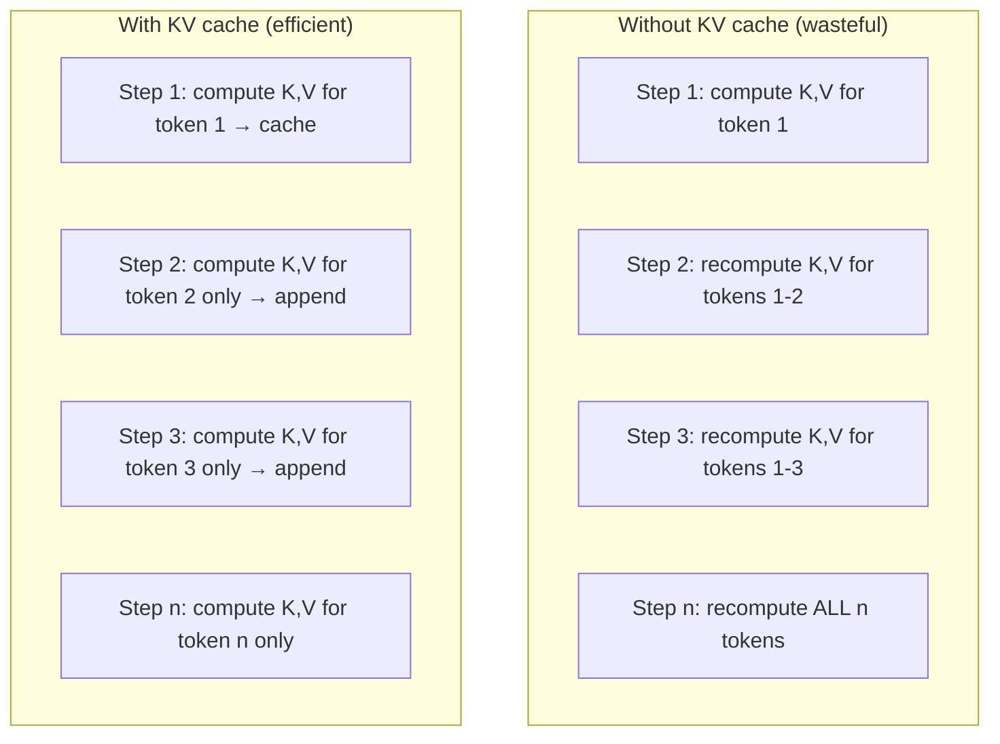

> **Production Standard:** Every production inference server (vLLM, TGI, TensorRT-LLM, llama.cpp) implements KV caching. Understanding it explains time-to-first-token, tokens-per-second, and memory limits.

---

## Prefill vs Decode

LLM inference splits into two distinct phases with different performance characteristics.

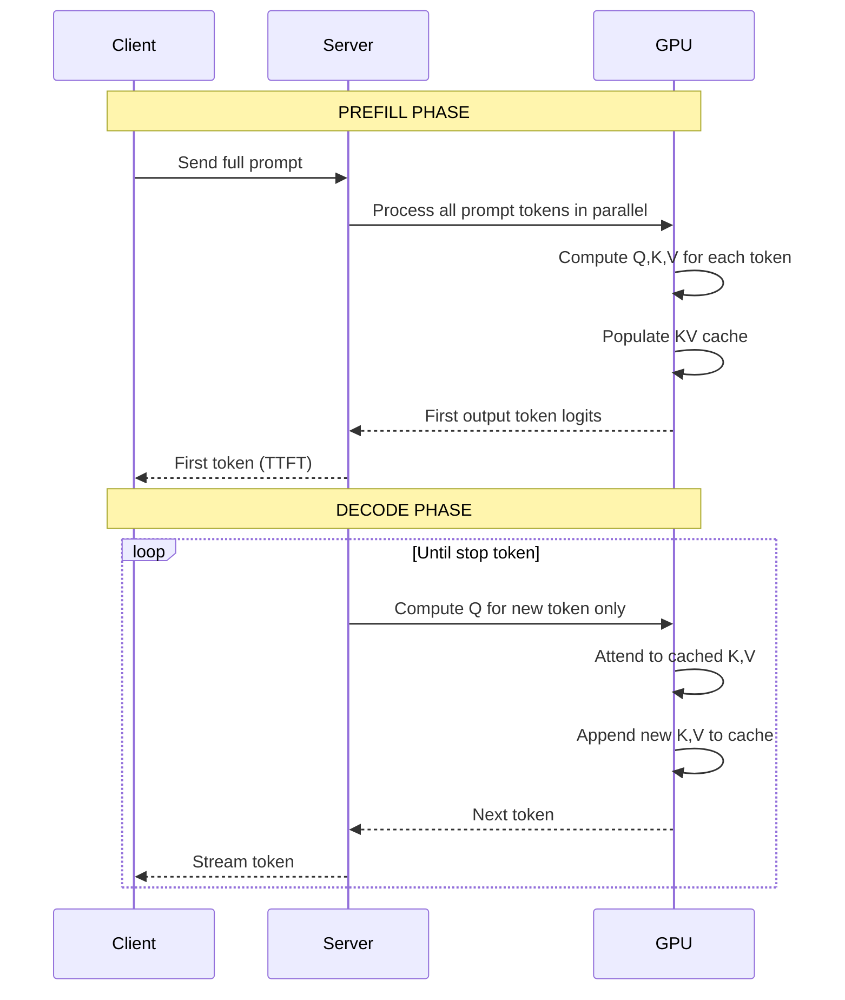

| Phase | Input | Parallelism | Dominant Cost | User-Visible Metric |
|-------|-------|-------------|---------------|---------------------|
| **Prefill** | Entire prompt | High — all prompt tokens at once | O(n²) attention on prompt length | Time to first token (TTFT) |
| **Decode** | One new token per step | Sequential across generated tokens | O(n) attention per step vs context | Tokens per second (TPS) |

### Engineering Intuition

| Scenario | Bottleneck |
|----------|-----------|
| Very long prompt, short answer | Prefill (TTFT high) |
| Short prompt, long generation | Decode (TPS matters) |
| Long chat history | Growing KV cache → memory + slower decode |

---

## What Gets Cached

During attention, each token at each layer produces Key and Value vectors. The cache stores them for reuse.

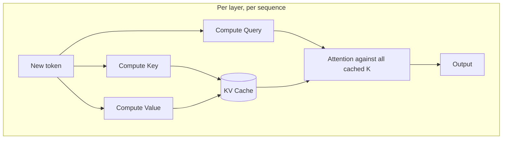

| Cached | Not Cached (recomputed each step) |
|--------|----------------------------------|
| Keys (K) per token per layer | Query (Q) for current token |
| Values (V) per token per layer | Output projections, FFN for current token |

**Query is not cached** because each new token issues a fresh query against all prior keys.

See [Attention Mechanism](attention-mechanism.md) for Q/K/V fundamentals.

---

## How KV Cache Works

### Step-by-Step (Single Layer, Simplified)

**Prefill** (prompt: "Hello world"):

1. Process tokens `Hello`, `world` in parallel (with causal mask).
2. For each token, compute K and V.
3. Store all K/V tensors in cache buffer.

**Decode** (generating "!" next):

1. Compute Q, K, V for new token `!` only.
2. Append new K, V to cache.
3. Compute attention: `Q_new` × all cached `K` → weights → weighted sum of all cached `V`.
4. Continue through FFN and remaining layers.

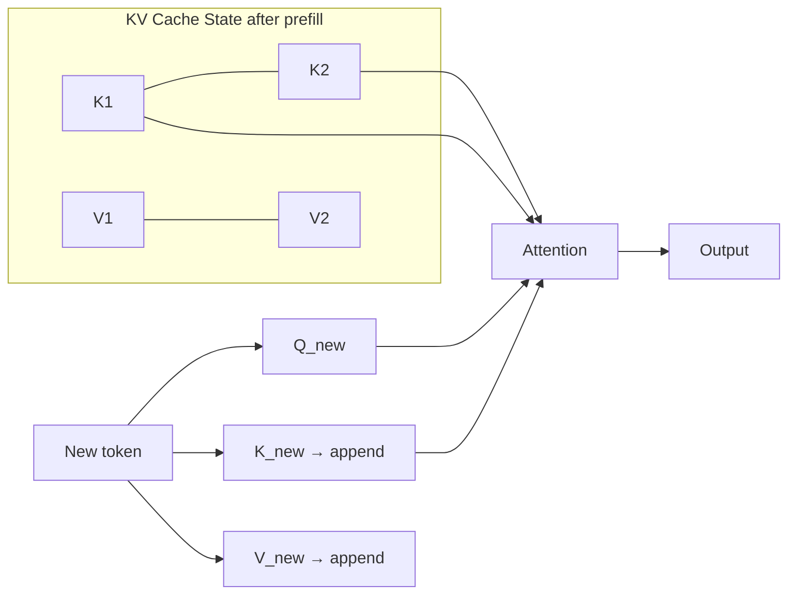

### Per-Layer, Per-Head Storage

For each sequence being generated, the cache holds tensors shaped roughly:

```
cache_k, cache_v: [num_layers, seq_len, num_kv_heads, head_dim]
```

Exact layout varies by framework (paged, contiguous, quantized).

---

## Memory Model

KV cache memory is often the **binding constraint** for concurrent users on a GPU.

### Approximate Formula

\[
\text{KV memory} \approx 2 \times L \times T \times H_{kv} \times D \times \text{bytes\_per\_elem}
\]

| Variable | Meaning |
|----------|---------|
| `2` | Both K and V |
| `L` | Number of layers |
| `T` | Sequence length (prompt + generated tokens) |
| `H_kv` | Number of KV heads (may differ from Q heads in GQA) |
| `D` | Head dimension |
| `bytes_per_elem` | 2 for FP16, 1 for INT8, etc. |

### Worked Example

| Parameter | Value |
|-----------|-------|
| Layers | 32 |
| Context | 8192 tokens |
| KV heads (GQA) | 8 |
| Head dim | 128 |
| Precision | FP16 (2 bytes) |

```
Memory = 2 × 32 × 8192 × 8 × 128 × 2
       ≈ 1.07 GB per sequence
```

Ten concurrent 8k-context chats ≈ 10+ GB **just for KV cache** — before model weights and activations.

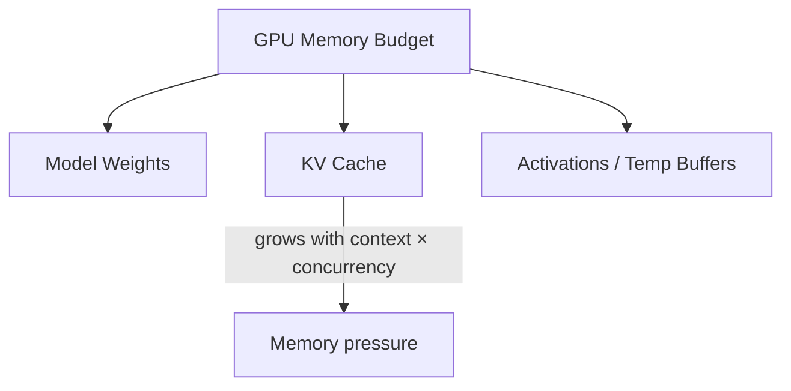

---

## Latency Impact

### Time to First Token (TTFT)

Dominated by **prefill** — processing the full prompt to populate the cache and produce the first output token.

| Factor | Effect on TTFT |
|--------|---------------|
| Prompt length | Quadratic attention cost (mitigated by kernels) |
| Model size | More layers → more compute |
| Hardware | GPU tier, batching |
| Queue wait | Server load |

### Tokens Per Second (TPS)

Dominated by **decode** — each token requires a full forward pass using cached KV.

| Factor | Effect on TPS |
|--------|--------------|
| Context length | More K/V to attend to each step |
| Model size | Larger FFN and attention |
| Batch size | Higher batch → better GPU utilization |
| Quantization | Faster compute, smaller cache |

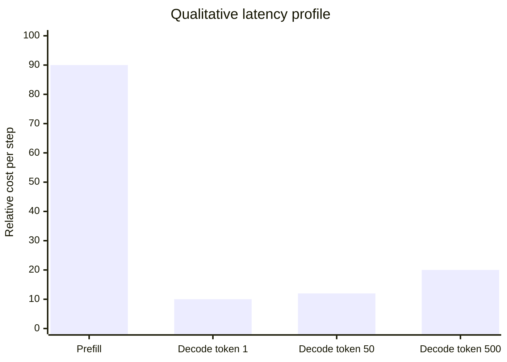

*Decode cost creeps up as cache grows — longer generations slow slightly per token.*

---

## Cache Reuse Patterns

KV cache enables optimizations beyond single-request streaming.

### Prefix Caching

When multiple requests share an identical prompt prefix (system prompt, RAG context, few-shot examples), reuse the cached K/V for that prefix.

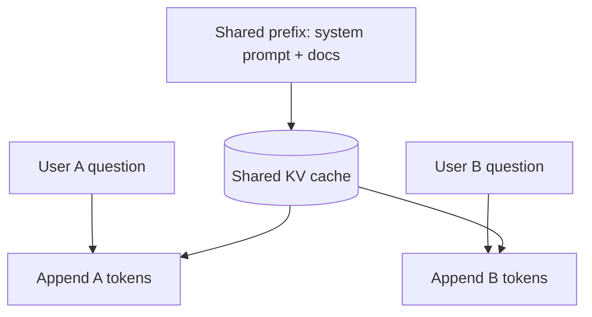

| Pattern | Savings |
|---------|---------|
| Shared system prompt | Skip prefill for repeated prefix |
| RAG with same retrieved chunks | Cache document K/V across users |
| Multi-turn (partial) | Cache prior turns if framework supports it |

> **Production Standard:** Prefix caching can cut TTFT dramatically in multi-tenant RAG. Verify your inference provider or self-hosted stack supports it.

### Prompt Caching (API-Level)

Some providers (e.g., Anthropic prompt caching, OpenAI automatic caching on repeated prefixes) expose cache semantics at the API layer — billing reduced rates for cached input tokens.

| Concept | Engineering Action |
|---------|-------------------|
| Cache breakpoints | Place stable content in cacheable prefix |
| Volatile suffix | User query, dynamic context at end |
| TTL | Cached prefixes expire — design for refresh |

---

## Streaming Implications

Streaming is not just UX — it interacts directly with decode-phase KV cache behavior.

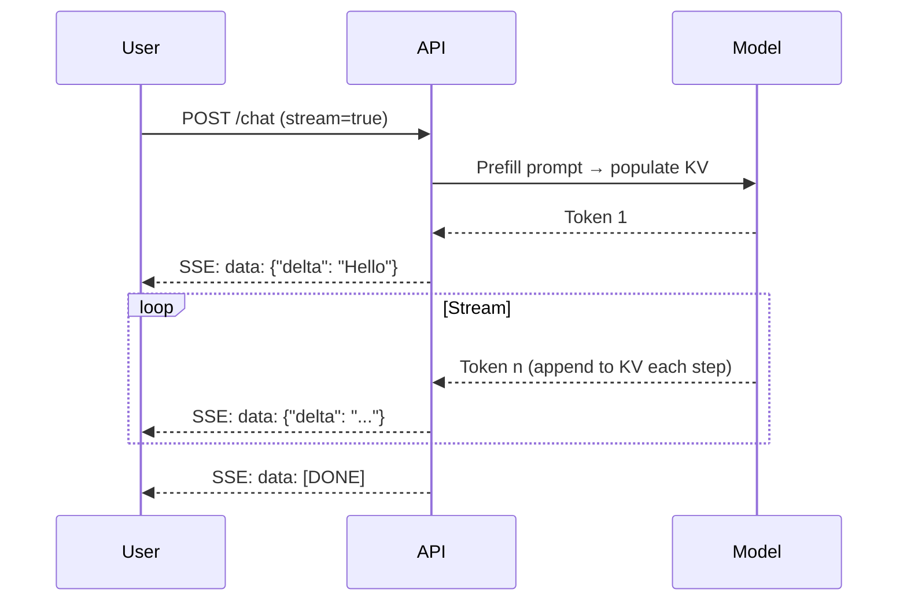

| Streaming Concern | KV Cache Connection |
|------------------|---------------------|
| TTFT | Prefill must complete before first streamed token |
| Mid-stream cancel | Discard partial cache; stop compute — saves FFN/attention on ungenerated tokens |
| Backpressure | Slow clients don't slow GPU — but open connections hold cache memory |
| Reconnection | Cannot resume mid-generation without server-side state |

### Client Disconnect

When the user closes the tab, cancel the upstream generation immediately. Each decode step consumes GPU cycles and holds KV memory until the request ends.

```python
# Conceptual: cancel on disconnect
async def stream_chat(request: Request, prompt: str):
    async for token in llm.generate_stream(prompt):
        if await request.is_disconnected():
            await llm.cancel()  # free KV slot
            break
        yield token
```

---

## Multi-Turn Conversations

Each turn appends to the conversation history — the KV cache (or effective context) grows.

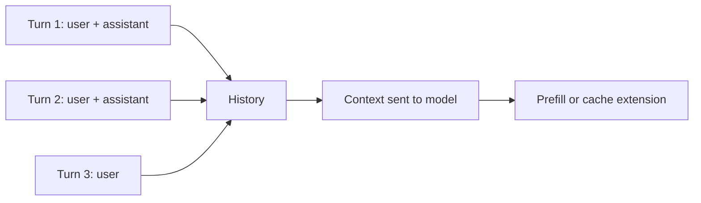

| Strategy | Tradeoff |
|----------|----------|
| Send full history each request | Simple; prefill cost grows each turn |
| Server-side session cache | Lower TTFT; stateful servers |
| Summarize old turns | Lose verbatim detail; save memory |
| Sliding window | Drop old turns; bounded cost |

Most stateless API integrations re-send full history — **prefill cost increases linearly with conversation length** (with quadratic attention inside prefill).

---

## Batching and Continuous Batching

Inference servers batch multiple requests to improve GPU utilization.

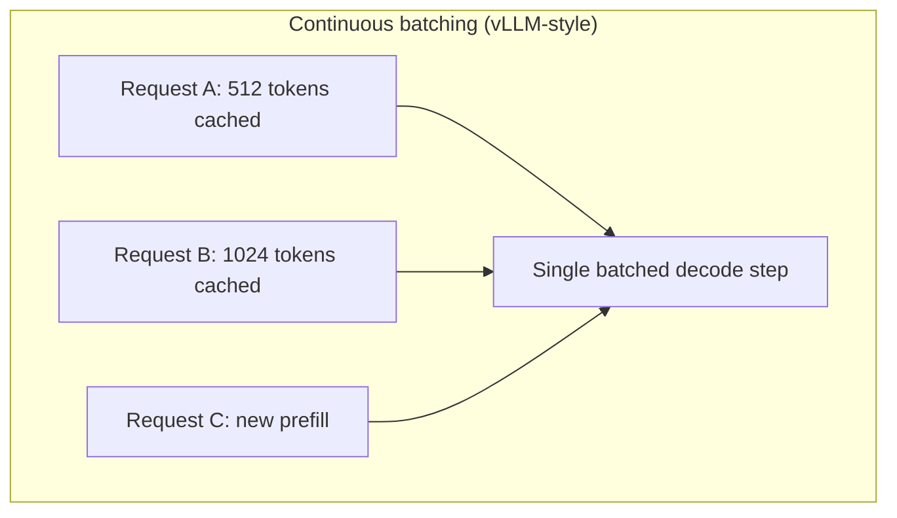

| Technique | Benefit |
|-----------|---------|
| Static batching | Simple; all requests wait for longest |
| **Continuous batching** | Add/remove requests between decode steps |
| **PagedAttention** | Non-contiguous KV storage — less fragmentation |

KV cache memory fragmentation was a major barrier to efficient multi-tenant serving — paged attention (vLLM) treats KV like virtual memory pages.

---

## KV Cache Optimizations

| Optimization | Mechanism | Tradeoff |
|-------------|-----------|----------|
| **GQA / MQA** | Fewer KV heads than Q heads | Slight quality impact; major memory savings |
| **FP8 / INT8 KV** | Quantize cached K/V | Memory ↓; possible quality ↓ |
| **Sliding window cache** | Only cache last W tokens | Bounded memory; limited context |
| **Prefix caching** | Reuse shared prompt K/V | Requires identical prefix bytes |
| **Speculative decoding** | Draft model + verify | Extra logic; higher TPS |

### Grouped-Query Attention (GQA)

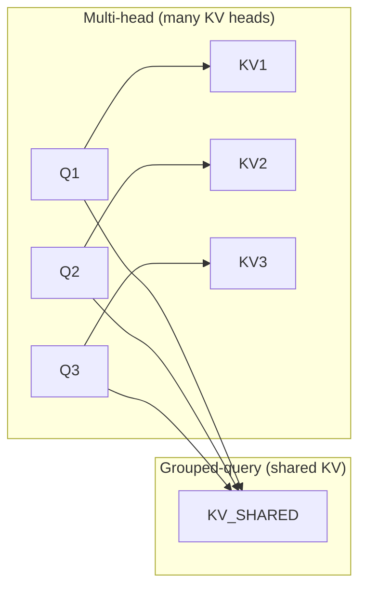

Llama 3, Mistral, and other modern models use GQA — explicitly trading a small amount of expressiveness for smaller KV footprint.

---

## Production Monitoring

Track metrics that map to prefill and decode behavior.

| Metric | Indicates |
|--------|-----------|
| `ttft_ms` p50/p95 | Prefill health |
| `tokens_per_second` | Decode throughput |
| `kv_cache_usage_bytes` | Memory pressure |
| `batch_size` | Utilization |
| `prefill_tokens` vs `decode_tokens` | Workload shape |
| `gpu_memory_used` | Capacity planning |
| `concurrent_requests` | KV memory × concurrency |

### Alerting Thresholds

| Signal | Action |
|--------|--------|
| TTFT p95 spike | Check prompt lengths; enable prefix caching |
| OOM kills | Reduce max context; limit concurrency |
| TPS degradation | Context too long; consider summarization |
| Cache hit rate low | Restructure prompts for stable prefixes |

---

## Common Mistakes

| Mistake | Impact | Fix |
|---------|--------|-----|
| Ignoring TTFT in SLA | Users perceive "slow start" | Measure prefill separately from TPS |
| Unbounded chat history | Memory and latency creep | Summarize, truncate, or window |
| No cancel on disconnect | Wasted GPU on abandoned streams | Wire client disconnect to cancel |
| Assuming streaming is "free" | Each token is a decode step | Set `max_tokens` guardrails |
| Same context for every user without prefix cache | Redundant prefill cost | Shared system/RAG prefix caching |
| Undersized GPU for concurrency | OOM at peak | Model KV memory math before launch |

---

## Interview Preparation

### Conceptual Questions

**Q1: What is the KV cache and why is it necessary?**

> **Strong answer:** During autoregressive generation, keys and values for prior tokens don't change. The KV cache stores them per layer so each new token only computes its own Q, K, V — attending to cached K/V instead of recomputing the full sequence. Without it, generation would be O(n²) per step instead of O(n).

**Q2: Explain prefill vs decode.**

> **Strong answer:** Prefill processes the entire prompt in parallel, populates the KV cache, and produces the first output token — dominates TTFT. Decode generates one token at a time, appending to the cache each step — dominates TPS and streaming behavior.

**Q3: How does KV cache memory scale?**

> **Strong answer:** Linearly with sequence length, number of layers, KV head count, head dimension, and bytes per element — doubled for K and V. Also multiplied by concurrent sequences. Often the limiting factor for multi-tenant GPU serving.

**Q4: What is prefix caching?**

> **Strong answer:** When multiple requests share an identical prompt prefix, reuse the precomputed KV for that prefix instead of re-running prefill. Common for system prompts and shared RAG context. Reduces TTFT and compute cost.

**Q5: How does streaming relate to KV cache?**

> **Strong answer:** Streaming exposes decode-phase tokens as they are generated. Each streamed token corresponds to one decode step that appends to KV cache. TTFT reflects prefill completing; canceling mid-stream should abort decode and free cache resources.

### System Design Prompt

**Design inference infrastructure for a chat product with 10k concurrent users and RAG.**

> **Discussion points:** KV memory per session, continuous batching, prefix cache for retrieved docs, max context limits, TTFT vs TPS SLAs, cancel on disconnect, GPU sizing, optional session affinity for cache reuse, quantize KV at scale.

### Estimation Exercise

**How much KV cache memory for Llama 3 70B, 32k context, FP16, batch of 8?**

> **Approach:** Identify L, T, H_kv, D from model card. Apply formula × batch size. Discuss GQA reducing H_kv vs MHA. Compare to GPU VRAM (80GB) — likely need quantization or context limits.

---

## Navigation

### Prerequisites

- [Attention Mechanism](attention-mechanism.md) — Section 7: Q/K/V and attention scores
- [Transformer Intuition](transformer-intuition.md) — Section 6: decoder blocks and layers

### LLM Fundamentals (This Series)

| Section | Document | Topic |
|---------|----------|-------|
| 1–4 | [How LLMs Work](how-llms-work.md) | Tokens, context, temperature, APIs |
| 5 | [Embeddings — LLM Perspective](embeddings-llm-perspective.md) | Vectors and similarity |
| 6 | [Transformer Intuition](transformer-intuition.md) | Architecture building blocks |
| 7 | [Attention Mechanism](attention-mechanism.md) | Q/K/V deep dive |
| **8** | **This document** | KV cache and inference |

### Related Topics

- [Inference Optimization](../inference-optimization/README.md) — quantization, serving frameworks
- [How LLMs Work](how-llms-work.md) — streaming APIs and token accounting
- [Context Engineering](../context-engineering/README.md) — designing prompts for cache efficiency

### Next Topics

- [Prompt Engineering](../prompt-engineering/README.md)
- [RAG Systems](../rag/README.md) — retrieval with prefix caching considerations
- [Model Serving](../model-serving/README.md) — deployment patterns

---

## See Also

- [LLM Engineering Domain Index](README.md)
- [Learning Roadmap](../../meta/roadmap.md)

## Changelog

| Version | Date | Changes |
|---------|------|---------|
| 1.0 | 2026-07-13 | Initial version — Section 8: KV cache and inference |
