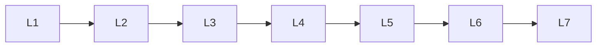

# Llm Alignment

> Deep lessons for **Llm Alignment** in the Large Language Models handbook.

## Lessons

| # | Lesson |
|---|--------|
| 1 | [RLHF](01-rlhf.md) |
| 2 | [Reward Models](02-reward-models.md) |
| 3 | [PPO](03-ppo.md) |
| 4 | [DPO](04-dpo.md) |
| 5 | [Preference Optimization](05-preference-optimization.md) |
| 6 | [Constitutional AI](06-constitutional-ai.md) |
| 7 | [AI Alignment](07-ai-alignment.md) |

**Topic hub:** [../README.md](../README.md)
