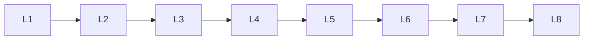

# Llm Architecture

> Deep lessons for **Llm Architecture** in the Large Language Models handbook.

## Lessons

| # | Lesson |
|---|--------|
| 1 | [Decoder-Only Architecture](01-decoder-only-architecture.md) |
| 2 | [Transformer Blocks](02-transformer-blocks.md) |
| 3 | [Self-Attention](03-self-attention.md) |
| 4 | [Multi-Head Attention](04-multi-head-attention.md) |
| 5 | [Feed-Forward Networks](05-feed-forward-networks.md) |
| 6 | [Layer Normalization](06-layer-normalization.md) |
| 7 | [Residual Connections](07-residual-connections.md) |
| 8 | [Positional Encoding](08-positional-encoding.md) |
| 9 | [KV Cache](09-kv-cache.md) |

**Topic hub:** [../README.md](../README.md)
