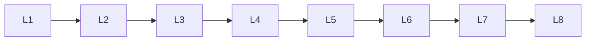

# Llm Evaluation

> Deep lessons for **Llm Evaluation** in the Large Language Models handbook.

## Lessons

| # | Lesson |
|---|--------|
| 1 | [Intrinsic Evaluation](01-intrinsic-evaluation.md) |
| 2 | [Extrinsic Evaluation](02-extrinsic-evaluation.md) |
| 3 | [Perplexity](03-perplexity.md) |
| 4 | [Accuracy](04-accuracy.md) |
| 5 | [BLEU](05-bleu.md) |
| 6 | [ROUGE](06-rouge.md) |
| 7 | [Human Evaluation](07-human-evaluation.md) |
| 8 | [LLM-as-a-Judge](08-llm-as-a-judge.md) |
| 9 | [Benchmarking](09-benchmarking.md) |
| 10 | [Hallucination Evaluation](10-hallucination-evaluation.md) |

**Topic hub:** [../README.md](../README.md)
