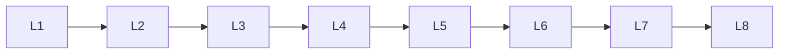

# Llm Fine Tuning

> Deep lessons for **Llm Fine Tuning** in the Large Language Models handbook.

## Lessons

| # | Lesson |
|---|--------|
| 1 | [Pretraining vs Fine-Tuning](01-pretraining-vs-fine-tuning.md) |
| 2 | [Supervised Fine-Tuning](02-supervised-fine-tuning.md) |
| 3 | [Instruction Tuning](03-instruction-tuning.md) |
| 4 | [Parameter-Efficient Fine-Tuning](04-parameter-efficient-fine-tuning.md) |
| 5 | [LoRA](05-lora.md) |
| 6 | [QLoRA](06-qlora.md) |
| 7 | [Adapters](07-adapters.md) |
| 8 | [Full Fine-Tuning](08-full-fine-tuning.md) |
| 9 | [Fine-Tuning Dataset Preparation](09-fine-tuning-dataset-preparation.md) |

**Topic hub:** [../README.md](../README.md)
