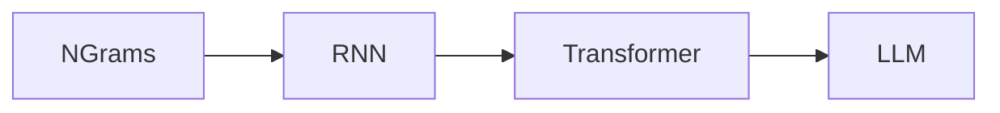

# 2. Evolution of Language Models

> From n-grams and RNNs to transformers and frontier LLMs.

## Timeline (compressed)

| Era | Idea |
|-----|------|
| Classical | n-gram / count LMs |
| Neural | RNNs / LSTMs |
| Transformer | Attention parallelism |
| Pretrained LMs | BERT / GPT |
| LLMs | Scale + instruction + alignment |

---

## Continue

- **Section hub:** [LLM Fundamentals](README.md)
- **LLM overview:** [Large Language Models](../README.md)
