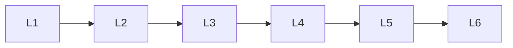

# Llm Fundamentals

> Deep lessons for **Llm Fundamentals** in the Large Language Models handbook.

## Lessons

| # | Lesson |
|---|--------|
| 1 | [What are LLMs](01-what-are-llms.md) |
| 2 | [Evolution of Language Models](02-evolution-of-language-models.md) |
| 3 | [LLM vs NLP vs Generative AI](03-llm-vs-nlp-vs-generative-ai.md) |
| 4 | [Foundation Models](04-foundation-models.md) |
| 5 | [Parameters & Model Size](05-parameters-and-model-size.md) |
| 6 | [Context Window](06-context-window.md) |

**Topic hub:** [../README.md](../README.md)
