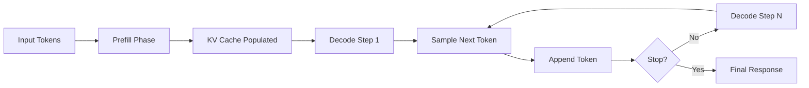
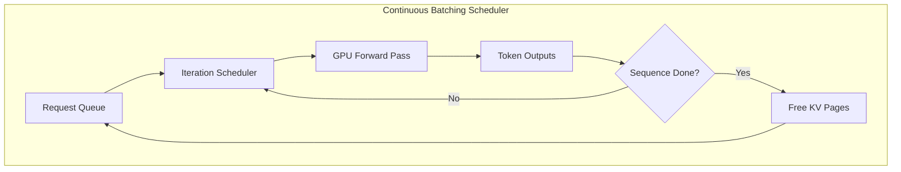
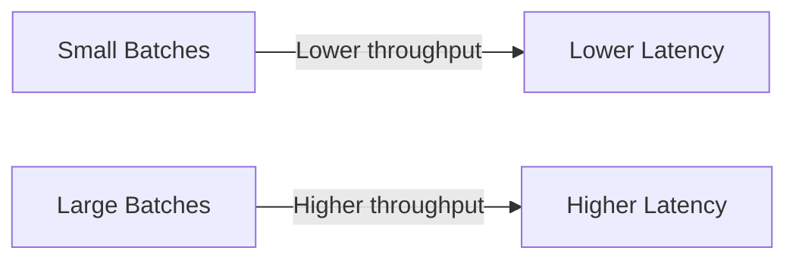

# LLM Inference

> Section 9 of this handbook — the mechanics behind every token your application generates. Understanding the inference pipeline is what separates engineers who tune API parameters from engineers who design systems that meet latency SLOs under load.

## Table of Contents

- [Why Inference Mechanics Matter](#why-inference-mechanics-matter)
- [The Inference Pipeline](#the-inference-pipeline)
- [Prefill Phase](#prefill-phase)
- [Decoding Phase](#decoding-phase)
- [Sampling in the Generation Loop](#sampling-in-the-generation-loop)
- [The Generation Loop](#the-generation-loop)
- [Batch Inference](#batch-inference)
- [Continuous Batching](#continuous-batching)
- [Streaming Inference](#streaming-inference)
- [Latency](#latency)
- [Throughput](#throughput)
- [GPU Execution (High Level)](#gpu-execution-high-level)
- [Production Considerations](#production-considerations)
- [Common Mistakes](#common-mistakes)
- [Interview Preparation](#interview-preparation)
- [Navigation](#navigation)

---

## Why Inference Mechanics Matter

When you call `client.chat.completions.create()`, you are triggering a multi-phase computation on specialized hardware. The API abstracts away the details, but production decisions — streaming vs batch, model size, context length, concurrency limits — all depend on how inference actually works.

| Symptom in Production | Inference Root Cause |
|-----------------------|---------------------|
| First token slow, rest fast | Long prefill on large context |
| Throughput collapses under load | Static batching with padding waste |
| GPU utilization low | Batch size too small or memory-bound |
| Cost spikes on long conversations | KV cache growth with context length |
| Streaming feels "chunky" | Server-side batching delays token flush |

> **Production Standard:** Measure time-to-first-token (TTFT) and time-per-output-token (TPOT) separately. They are governed by different phases and require different optimizations.

---

## The Inference Pipeline

Autoregressive LLM inference has two distinct computational phases executed in a loop until a stop condition is met.



### End-to-End Flow

1. **Tokenization** — Input text is converted to token IDs using the model's tokenizer (BPE, SentencePiece, etc.).
2. **Prefill** — All input tokens are processed in parallel through the transformer layers. This populates the **KV cache**.
3. **Decode loop** — One new token is generated per iteration. Each step attends to the full cached context plus the latest token.
4. **Sampling** — Logits from the final layer are converted to a probability distribution; a token is selected (see [Sampling and Decoding](sampling-and-decoding.md)).
5. **Detokenization** — Token IDs are converted back to text, often streamed incrementally to the client.

```python
# Conceptual inference loop (simplified pseudocode)
def generate(model, input_ids: list[int], max_tokens: int = 256) -> list[int]:
  # Step 1: Prefill — process entire prompt at once
  kv_cache = model.prefill(input_ids)
  generated = list(input_ids)

  # Step 2: Decode — one token per iteration
  for _ in range(max_tokens):
    logits = model.decode_step(generated[-1], kv_cache)
    next_token = sample(logits, temperature=0.7, top_p=0.9)
    generated.append(next_token)
    if next_token == EOS_TOKEN:
      break

  return generated
```

---

## Prefill Phase

**Prefill** (also called the **prompt phase** or **context phase**) processes the entire input prompt in a single forward pass. Because all prompt tokens are known upfront, the computation is highly parallelizable.

### Characteristics

| Property | Prefill Behavior |
|----------|-----------------|
| Parallelism | High — all prompt tokens computed simultaneously |
| Compute intensity | Compute-bound (matrix multiplications dominate) |
| Latency driver | Prompt length (token count) |
| KV cache | Created and populated for every layer |

### Why Prefill Dominates TTFT

Time-to-first-token is almost entirely prefill latency plus a single decode step. A 4,000-token RAG context can add hundreds of milliseconds before the first output token appears, even if generation itself is fast.

```python
# Measuring prefill vs decode contribution (conceptual)
import time

async def profile_generation(client, messages: list[dict]) -> dict:
  start = time.perf_counter()
  stream = await client.chat.completions.create(
    model="gpt-4o-mini",
    messages=messages,
    max_tokens=100,
    stream=True,
  )

  first_token_time = None
  token_count = 0
  async for chunk in stream:
    if chunk.choices[0].delta.content:
      if first_token_time is None:
        first_token_time = time.perf_counter() - start
      token_count += 1

  total_time = time.perf_counter() - start
  return {
    "ttft_ms": round((first_token_time or 0) * 1000, 1),
    "total_ms": round(total_time * 1000, 1),
    "decode_ms": round((total_time - (first_token_time or 0)) * 1000, 1),
    "tokens": token_count,
  }
```

### Prefill Optimization Strategies

- **Prompt caching** — Providers cache KV states for repeated system prompts or tool definitions.
- **Context pruning** — Trim RAG results to essential chunks before inference.
- **Shorter prompts** — Every token in prefill costs latency and money.
- **Speculative prefill** — Advanced serving systems overlap prefill with scheduling.

---

## Decoding Phase

**Decoding** (also called the **generation phase** or **autoregressive phase**) generates output tokens one at a time. Each step depends on all previous tokens through the KV cache.

### Characteristics

| Property | Decode Behavior |
|----------|----------------|
| Parallelism | Low — strictly sequential per request |
| Compute intensity | Often memory-bandwidth-bound |
| Latency driver | Number of output tokens |
| KV cache | Grows by one token per step |

### The KV Cache

During prefill and each decode step, transformer attention layers store **key** and **value** tensors for every token. On subsequent steps, the model reads from this cache instead of recomputing attention over the full sequence.

```
Step 0 (prefill):  [t1, t2, t3, t4] → KV cache: 4 entries
Step 1 (decode):   [t5]               → KV cache: 5 entries
Step 2 (decode):   [t6]               → KV cache: 6 entries
...
```

KV cache memory grows linearly with total sequence length (prompt + generated tokens). This is why long conversations eventually hit context limits or degrade performance.

### Decode Step Internals

Each decode iteration:

1. Feed the latest token ID into the embedding layer.
2. Run forward pass through all transformer layers, reading KV cache for prior tokens and writing new KV entries for the current token.
3. Apply the language model head to produce logits (vocabulary-sized vector).
4. Sample or select the next token.
5. Append to the sequence and repeat.

---

## Sampling in the Generation Loop

After each decode step, the model outputs raw **logits** — unnormalized scores over the vocabulary. **Sampling** converts logits into a token selection. This happens inside the generation loop on every iteration.

The choice of sampling strategy affects quality, determinism, and latency (marginally). See [Sampling and Decoding](sampling-and-decoding.md) for exhaustive coverage of temperature, top-k, top-p, and penalties.

```python
import numpy as np


def sample_token(logits: np.ndarray, temperature: float = 1.0) -> int:
  if temperature == 0:
    return int(np.argmax(logits))  # greedy

  scaled = logits / temperature
  # Numerically stable softmax
  exp_logits = np.exp(scaled - np.max(scaled))
  probs = exp_logits / exp_logits.sum()
  return int(np.random.choice(len(probs), p=probs))
```

> **Key insight:** Sampling is cheap relative to the forward pass. Optimizing sampling parameters affects output quality, not inference speed, except in beam search where multiple hypotheses are maintained.

---

## The Generation Loop

The **generation loop** is the iterative decode-sampling-append cycle that runs until a termination condition is met.

### Stop Conditions

| Condition | Description |
|-----------|-------------|
| EOS token | Model emits end-of-sequence token |
| `max_tokens` | Hard limit on output length |
| Stop sequences | Custom strings (e.g., `"\n\nHuman:"`) |
| Timeout | Server-side or client-side time limit |
| Tool call | Model emits a structured tool invocation |

```python
from dataclasses import dataclass, field


@dataclass
class GenerationConfig:
  max_tokens: int = 1024
  temperature: float = 0.7
  top_p: float = 0.9
  stop_sequences: list[str] = field(default_factory=list)


@dataclass
class GenerationState:
  token_ids: list[int]
  finished: bool = False
  finish_reason: str | None = None


def generation_loop(
  model,
  prompt_ids: list[int],
  config: GenerationConfig,
) -> GenerationState:
  state = GenerationState(token_ids=list(prompt_ids))
  kv_cache = model.prefill(prompt_ids)

  for step in range(config.max_tokens):
    logits = model.decode_step(state.token_ids[-1], kv_cache)
    next_id = sample_token(logits, config.temperature)
    state.token_ids.append(next_id)

    if next_id == model.eos_token_id:
      state.finished = True
      state.finish_reason = "eos"
      break

    text = model.detokenize(state.token_ids)
    if any(stop in text for stop in config.stop_sequences):
      state.finished = True
      state.finish_reason = "stop_sequence"
      break
  else:
    state.finished = True
    state.finish_reason = "max_tokens"

  return state
```

### Interaction with Tool Calling

When function calling is enabled, the generation loop may emit tool call tokens instead of natural language. The loop pauses, executes the tool, appends results, and resumes prefill+decode on the expanded context. See [Function Calling and Tools](function-calling-and-tools.md).

---

## Batch Inference

**Batch inference** processes multiple requests simultaneously on the same hardware. Batching improves GPU utilization by amortizing kernel launch overhead and enabling parallel matrix operations.

### Static Batching

Requests are grouped into fixed batches. All sequences in a batch must complete before the batch slot is freed.

```
Batch 1: [Request A (50 tokens), Request B (200 tokens), Request C (30 tokens)]
         → GPU waits for Request B (longest) before freeing slot
```

| Advantage | Disadvantage |
|-----------|-------------|
| Simple to implement | Padding waste on uneven lengths |
| Predictable memory usage | Head-of-line blocking |
| Good for offline/batch jobs | Poor for interactive latency |

### Dynamic Batching

Requests are added to a batch until a size or time threshold is reached, then processed together.

```python
import asyncio
from collections import deque


class DynamicBatcher:
  def __init__(self, max_batch_size: int = 32, max_wait_ms: float = 10.0):
    self.max_batch_size = max_batch_size
    self.max_wait_ms = max_wait_ms
    self._queue: deque = deque()
    self._event = asyncio.Event()

  async def submit(self, request: dict) -> dict:
    future = asyncio.get_event_loop().create_future()
    self._queue.append((request, future))
    self._event.set()
    return await future

  async def run(self, process_batch):
    while True:
      await self._event.wait()
      await asyncio.sleep(self.max_wait_ms / 1000)

      batch = []
      while self._queue and len(batch) < self.max_batch_size:
        batch.append(self._queue.popleft())

      if not batch:
        self._event.clear()
        continue

      requests = [item[0] for item in batch]
      results = await process_batch(requests)

      for (_, future), result in zip(batch, results):
        future.set_result(result)
```

### When to Use Batch Inference

| Use Case | Batching Strategy |
|----------|------------------|
| Offline document summarization | Large static batches |
| Embedding generation | Large batches, no decode loop |
| Interactive chat | Continuous batching (below) |
| Evaluation runs | Static batches with padding |
| Real-time API serving | Continuous batching |

---

## Continuous Batching

**Continuous batching** (also called **iteration-level scheduling** or **in-flight batching**) is the technique used by production inference servers (vLLM, TensorRT-LLM, TGI) to serve interactive workloads efficiently.

### How It Differs from Static Batching

In static batching, a batch is locked until every sequence finishes generating. In continuous batching, sequences join and leave the batch **at every decode iteration**.

```
Iteration 1: [A_prefill, B_prefill, C_prefill]
Iteration 2: [A_decode,   B_decode,   C_decode]
Iteration 3: [A_decode,   B_decode]            ← C finished, slot freed
Iteration 4: [A_decode,   B_decode,   D_prefill] ← D joined mid-batch
```

### Key Enablers

| Technique | Purpose |
|-----------|---------|
| PagedAttention | Non-contiguous KV cache storage in GPU memory |
| Iteration-level scheduling | Add/remove sequences each step |
| Prefix caching | Reuse KV cache for shared prompt prefixes |
| Chunked prefill | Interleave prefill and decode to reduce head-of-line blocking |

### Impact on Production

- **Higher throughput** — GPU stays busy as requests complete and new ones join.
- **Better latency under load** — New requests do not wait for an entire batch to drain.
- **Memory efficiency** — PagedAttention reduces fragmentation from variable-length sequences.



> **Production Standard:** If you self-host models, use an inference server with continuous batching (vLLM, TGI). Do not run naive single-request inference loops in production.

---

## Streaming Inference

**Streaming inference** delivers tokens to the client as they are generated, rather than waiting for the full completion.

### Server-Side Streaming

The generation loop yields each token (or chunk) as it is produced:

```python
async def stream_completion(client, messages: list[dict]):
  stream = await client.chat.completions.create(
    model="gpt-4o-mini",
    messages=messages,
    stream=True,
  )

  async for chunk in stream:
    delta = chunk.choices[0].delta
    if delta.content:
      yield delta.content

    if chunk.choices[0].finish_reason:
      yield f"\n[done: {chunk.choices[0].finish_reason}]"
```

### Transport Protocols

| Protocol | Usage |
|----------|-------|
| SSE (Server-Sent Events) | Most common for chat UIs |
| WebSocket | Bidirectional; multi-turn without reconnect |
| HTTP chunked transfer | Simple streaming without SSE framing |
| gRPC streaming | High-performance internal services |

### Streaming vs Non-Streaming Tradeoffs

| Aspect | Streaming | Non-Streaming |
|--------|-----------|---------------|
| Perceived latency | Low (tokens appear immediately) | High (wait for full response) |
| Time to first byte | ~TTFT | ~Total generation time |
| Client complexity | Handle partial JSON, reconnection | Simple parse once |
| Server resource usage | Long-lived connections | Shorter connections |
| Token usage on disconnect | May waste tokens if not cancelled | All-or-nothing |
| Structured output | Harder — partial JSON invalid | Easier — validate complete response |

### Streaming with Backpressure

Production systems must handle slow clients:

```python
async def stream_with_disconnect(request, generator):
  try:
    async for token in generator:
      if await request.is_disconnected():
        # Cancel upstream generation to save cost
        break
      yield token
  finally:
    await generator.aclose()
```

---

## Latency

**Latency** in LLM inference is not a single number. Decompose it before optimizing.

### Latency Components

| Metric | Abbreviation | What It Measures |
|--------|-------------|-----------------|
| Time to first token | TTFT | Prefill + first decode step + network |
| Time per output token | TPOT | Average decode step duration |
| Total generation time | — | TTFT + (output_tokens × TPOT) |
| End-to-end latency | E2E | Client send to final token received |

```
E2E Latency = Network RTT + Queue Wait + TTFT + (N_output_tokens × TPOT) + Network Delivery
```

### Latency Budget Example

For a chat app targeting p95 < 2 seconds with ~100 output tokens:

| Component | Budget |
|-----------|--------|
| Network + API gateway | 50 ms |
| Queue wait (under load) | 100 ms |
| TTFT (500-token prompt) | 300 ms |
| Decode (100 tokens × 25 ms) | 2,500 ms ← **exceeds budget** |

This analysis reveals that either output length must be capped, a faster model chosen, or the SLO adjusted.

### Factors That Increase Latency

- Longer prompts (prefill scales with input tokens)
- Larger models (more parameters per forward pass)
- Higher concurrency (queue contention)
- Cold starts (serverless or scale-from-zero)
- Long output generation (linear decode cost)

### Latency Reduction Strategies

| Strategy | Phase Affected |
|----------|---------------|
| Shorter prompts / context pruning | Prefill |
| Prompt caching for system messages | Prefill |
| Smaller or distilled models | Both |
| Speculative decoding | Decode |
| Streaming to client | Perceived latency |
| Regional endpoint proximity | Network |
| Continuous batching | Queue wait |

---

## Throughput

**Throughput** measures how many tokens (or requests) a system processes per unit time.

### Key Throughput Metrics

| Metric | Unit | Typical Context |
|--------|------|----------------|
| Tokens per second | tok/s | Per-GPU or per-server capacity planning |
| Requests per second | req/s | API rate limiting and autoscaling |
| Concurrent users | users | Load testing and capacity planning |

### The Latency-Throughput Tradeoff

Higher batch sizes increase throughput but also increase per-request queue wait time.



There is no free lunch. Production systems target a **throughput point** that keeps latency within SLO.

### Throughput Calculation

```
Theoretical throughput (tok/s) ≈ batch_size / average_decode_step_time

Example:
  batch_size = 16
  decode_step = 30 ms
  throughput ≈ 16 / 0.030 ≈ 533 tok/s
```

Actual throughput is lower due to prefill overhead, uneven sequence lengths, and scheduling gaps.

### Provider vs Self-Hosted Throughput

| Deployment | Throughput Control |
|------------|-------------------|
| Managed API (OpenAI, Anthropic) | Provider-managed; you control via rate limits and tier |
| Self-hosted (vLLM, TGI) | You control GPU count, batch config, model parallelism |
| Serverless GPU | Cold start risk; burst then throttle |

---

## GPU Execution (High Level)

LLM inference runs on **GPUs** because transformer forward passes are dominated by large matrix multiplications — operations GPUs excel at.

### Why GPUs

| CPU | GPU |
|-----|-----|
| Few powerful cores | Thousands of simpler cores |
| Optimized for sequential logic | Optimized for parallel arithmetic |
| Low latency per operation | High throughput across operations |
| Suitable for orchestration | Suitable for tensor math |

### Key GPU Concepts for AI Engineers

| Concept | Relevance to Inference |
|---------|----------------------|
| **VRAM** | Stores model weights + KV cache; limits batch size and context length |
| **FLOPS** | Theoretical compute capacity; higher = faster forward passes |
| **Memory bandwidth** | Often the decode bottleneck — reading weights and KV cache |
| **Tensor cores** | Specialized units for mixed-precision matrix math (FP16, BF16, INT8) |
| **Quantization** | Reduce precision (FP16 → INT8 → INT4) to fit larger models or batches |
| **Model parallelism** | Split model across multiple GPUs when one GPU lacks VRAM |

### Precision and Quantization

| Precision | VRAM Usage | Quality Impact |
|-----------|-----------|----------------|
| FP32 | Highest | Baseline |
| FP16 / BF16 | ~50% of FP32 | Minimal for most models |
| INT8 | ~25% of FP32 | Small quality loss |
| INT4 (GPTQ, AWQ) | ~12.5% of FP32 | Noticeable on some tasks |

### Multi-GPU Strategies (Awareness Level)

| Strategy | When Used |
|----------|----------|
| Tensor parallelism | Single request too large for one GPU |
| Pipeline parallelism | Very large models (70B+) |
| Data parallelism | Replicate model, split requests across GPUs |

> You do not need to implement these yourself. Know they exist so you can evaluate serving frameworks and cloud instance types.

### Instance Selection Heuristic

| Model Size | Typical GPU |
|------------|------------|
| 7B (FP16) | 1× A10G / L4 (24 GB) |
| 13B (FP16) | 1× A100 (40 GB) |
| 70B (INT4) | 1× A100 (80 GB) or 2× A10G |
| 70B (FP16) | 2× A100 (80 GB) with tensor parallelism |

---

## Production Considerations

| Area | Recommendation |
|------|---------------|
| **Metrics** | Track TTFT, TPOT, tokens/s, queue depth, GPU utilization |
| **Streaming** | Default for interactive UIs; handle client disconnect |
| **Context management** | Trim RAG context; monitor KV cache growth |
| **Model selection** | Match model size to latency SLO |
| **Self-hosting** | Use vLLM/TGI with continuous batching |
| **Managed APIs** | Set timeouts; implement retry with backoff |
| **Cost** | Prefill tokens often cost the same as decode tokens — shorter prompts save money |
| **Caching** | Cache system prompts and tool definitions where supported |

### Observability Example

```python
import structlog

log = structlog.get_logger()


async def instrumented_completion(client, **kwargs):
  import time

  start = time.perf_counter()
  response = await client.chat.completions.create(**kwargs)
  elapsed_ms = (time.perf_counter() - start) * 1000

  usage = response.usage
  log.info(
    "llm_completion",
    model=kwargs.get("model"),
    input_tokens=usage.prompt_tokens,
    output_tokens=usage.completion_tokens,
    latency_ms=round(elapsed_ms, 1),
    tokens_per_second=round(
      usage.completion_tokens / (elapsed_ms / 1000), 1
    ) if elapsed_ms > 0 else 0,
  )
  return response
```

---

## Common Mistakes

| Mistake | Impact | Fix |
|---------|--------|-----|
| Optimizing decode when prefill is the bottleneck | No latency improvement | Profile TTFT separately; shorten prompts |
| Ignoring queue wait under load | Latency spikes at scale | Load test with realistic concurrency |
| Not streaming for chat UIs | Poor perceived performance | Use SSE streaming by default |
| Running single-request inference loops on GPU | 10–100× lower throughput | Use continuous batching server |
| Treating latency as one number | Wrong optimization target | Decompose TTFT, TPOT, queue, network |
| No disconnect handling on streams | Wasted tokens and cost | Cancel upstream on client disconnect |
| Oversized context "just in case" | Slow prefill, high cost | Token budget with relevance filtering |
| Choosing largest model by default | Violates latency SLO | Right-size model to task complexity |

---

## Interview Preparation

### Frequently Asked Questions

**Q1: Explain the difference between prefill and decode.**

> **Strong answer:** Prefill processes the entire input prompt in parallel, populating the KV cache. Decode generates one token at a time autoregressively, reading from the KV cache. Prefill is compute-bound and drives TTFT; decode is often memory-bandwidth-bound and drives total generation time.

**Q2: What is continuous batching and why does it matter?**

> **Strong answer:** Unlike static batching where all requests must finish before the batch frees, continuous batching adds and removes sequences at each decode iteration. Combined with PagedAttention for efficient KV cache memory, it maximizes GPU utilization for interactive serving without the head-of-line blocking of static batches.

**Q3: How would you diagnose high latency in a chat application?**

> **Strong answer:** Decompose into network RTT, queue wait, TTFT, and TPOT. Check prompt length (prefill), output length (decode), model size, concurrency, and whether streaming is enabled. Use provider metrics or self-hosted profiling. Mention specific fixes for each component.

**Q4: What is the KV cache and why does it grow?**

> **Strong answer:** The KV cache stores key and value tensors from attention layers for all prior tokens. It avoids recomputing attention over the full sequence at each step. It grows linearly with total sequence length (prompt + output), consuming VRAM and eventually hitting context limits.

### Real-World Scenario

**Scenario:** Your RAG chatbot has acceptable latency for short queries but p95 latency exceeds 8 seconds when retrieving 10 document chunks (4,000 tokens of context).

> **Discussion points:** Prefill scales with context length. Profile TTFT with and without RAG context. Implement chunk relevance filtering, context compression, or prompt caching. Consider a two-stage approach: rerank chunks with a fast model, then pass only top-3 to the generation model.

---

## Navigation

### Prerequisites

- Sections 1–8 of this handbook (tokens, context windows, model families, API integration)
- [HTTP Fundamentals for AI](../apis/http-fundamentals-for-ai.md) — streaming transports
- [Backend Fundamentals for AI](../backend-engineering/backend-fundamentals-for-ai.md) — streaming endpoints

### Related Topics

- [Sampling and Decoding](sampling-and-decoding.md) — Section 10: temperature, top-p, penalties
- [Structured Outputs](structured-outputs.md) — Section 11: JSON mode and schema validation
- [Function Calling and Tools](function-calling-and-tools.md) — Section 12: tool execution loop
- [Inference Optimization](../inference-optimization/README.md) — advanced serving techniques

### Next Topics

- [Sampling and Decoding](sampling-and-decoding.md) — deep dive into decoding strategies
- [Structured Outputs](structured-outputs.md) — constraining generation output
- [Function Calling and Tools](function-calling-and-tools.md) — extending the generation loop with tools

### Future Reading

- [Model Serving](../model-serving/README.md) — deployment patterns
- [Inference Optimization](../inference-optimization/README.md) — quantization, speculative decoding
- [Prompt Engineering](../prompt-engineering/README.md) — prompt design for reliable outputs

---

## See Also

- [vLLM Documentation](https://docs.vllm.ai/) — continuous batching inference server
- [Hugging Face Text Generation Inference](https://huggingface.co/docs/text-generation-inference/)
- [OpenAI API Reference — Streaming](https://platform.openai.com/docs/api-reference/streaming)

## Changelog

| Version | Date | Changes |
|---------|------|---------|
| 1.0 | 2026-07-13 | Initial release — Section 9 |
