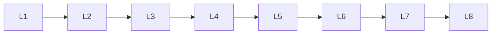

# Llm Inference

> Deep lessons for **Llm Inference** in the Large Language Models handbook.

## Lessons

| # | Lesson |
|---|--------|
| 1 | [Autoregressive Generation](01-autoregressive-generation.md) |
| 2 | [Decoding](02-decoding.md) |
| 3 | [Greedy Decoding](03-greedy-decoding.md) |
| 4 | [Beam Search](04-beam-search.md) |
| 5 | [Temperature](05-temperature.md) |
| 6 | [Top-K](06-top-k.md) |
| 7 | [Top-P](07-top-p.md) |
| 8 | [Repetition Penalty](08-repetition-penalty.md) |
| 9 | [KV Caching](09-kv-caching.md) |
| 10 | [Batch Inference](10-batch-inference.md) |

**Topic hub:** [../README.md](../README.md)
