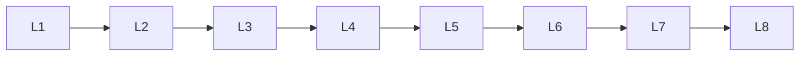

# Llm Infrastructure

> Deep lessons for **Llm Infrastructure** in the Large Language Models handbook.

## Lessons

| # | Lesson |
|---|--------|
| 1 | [GPU Computing](01-gpu-computing.md) |
| 2 | [Distributed Training](02-distributed-training.md) |
| 3 | [Model Parallelism](03-model-parallelism.md) |
| 4 | [Data Parallelism](04-data-parallelism.md) |
| 5 | [Tensor Parallelism](05-tensor-parallelism.md) |
| 6 | [Pipeline Parallelism](06-pipeline-parallelism.md) |
| 7 | [LLM Serving](07-llm-serving.md) |
| 8 | [Inference Servers](08-inference-servers.md) |
| 9 | [Model Deployment](09-model-deployment.md) |

**Topic hub:** [../README.md](../README.md)
