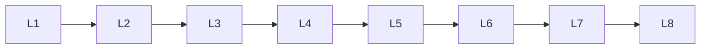

# Llm Model Families

> Deep lessons for **Llm Model Families** in the Large Language Models handbook.

## Lessons

| # | Lesson |
|---|--------|
| 1 | [GPT](01-gpt.md) |
| 2 | [LLaMA](02-llama.md) |
| 3 | [Mistral](03-mistral.md) |
| 4 | [Gemma](04-gemma.md) |
| 5 | [Qwen](05-qwen.md) |
| 6 | [DeepSeek](06-deepseek.md) |
| 7 | [Mixture-of-Experts Models](07-mixture-of-experts-models.md) |
| 8 | [Small Language Models](08-small-language-models.md) |

**Topic hub:** [../README.md](../README.md)
