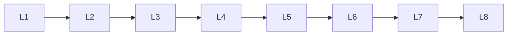

# Llm Optimization

> Deep lessons for **Llm Optimization** in the Large Language Models handbook.

## Lessons

| # | Lesson |
|---|--------|
| 1 | [Quantization](01-quantization.md) |
| 2 | [Pruning](02-pruning.md) |
| 3 | [Distillation](03-distillation.md) |
| 4 | [Model Compression](04-model-compression.md) |
| 5 | [Mixed Precision](05-mixed-precision.md) |
| 6 | [Flash Attention](06-flash-attention.md) |
| 7 | [Speculative Decoding](07-speculative-decoding.md) |
| 8 | [Inference Optimization](08-inference-optimization.md) |

**Topic hub:** [../README.md](../README.md)
