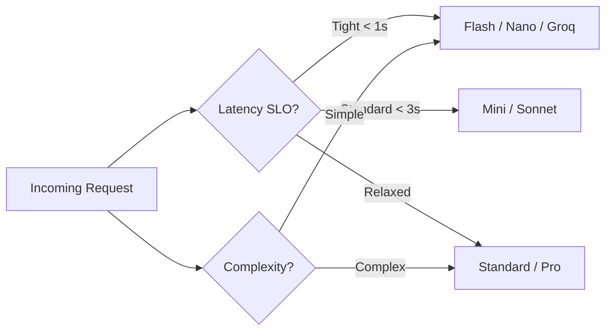

# LLM Performance Optimization

> Section 18 of this handbook — users perceive latency, not throughput. Production LLM performance requires decomposing the request lifecycle, optimizing each segment, and routing workloads to the right model and infrastructure tier.

## Table of Contents

- [Latency Anatomy](#latency-anatomy)
- [Throughput Fundamentals](#throughput-fundamentals)
- [Parallel Requests](#parallel-requests)
- [Streaming](#streaming)
- [Batch Inference](#batch-inference)
- [Prompt Caching](#prompt-caching)
- [Response Caching](#response-caching)
- [Model Routing](#model-routing)
- [Infrastructure Optimization](#infrastructure-optimization)
- [SLO Design](#slo-design)
- [Performance Checklist](#performance-checklist)
- [Common Mistakes](#common-mistakes)
- [Interview Preparation](#interview-preparation)
- [Navigation](#navigation)

---

## Latency Anatomy

Never optimize "latency" as a single number. Decompose it.

```text
Total Latency = network_rtt
              + queue_wait
              + ttft (time to first token)
              + (tpot × output_tokens)
              + post_processing
```

| Component | Driven By | Optimization Lever |
|-----------|-----------|-------------------|
| Network RTT | Geography, TLS | Regional endpoints, connection pooling |
| Queue wait | Concurrency vs capacity | Scale replicas, rate limiting |
| TTFT | Input tokens (prefill) | Shorter prompts, prompt caching |
| TPOT | Model size, hardware | Smaller model, Groq, GPU tuning |
| Post-processing | Validation, parsing | Async pipeline, stream parsing |

```python
import time


class LatencyTracker:
  def __init__(self):
    self.marks: dict[str, float] = {}

  def mark(self, label: str) -> None:
    self.marks[label] = time.perf_counter()

  def report(self) -> dict[str, float]:
    keys = list(self.marks.keys())
    return {
      f"{keys[i]}→{keys[i+1]}_ms": round(
        (self.marks[keys[i + 1]] - self.marks[keys[i]]) * 1000, 1
      )
      for i in range(len(keys) - 1)
    }
```

See [LLM Inference](llm-inference.md) for prefill vs decode and [KV Cache](kv-cache.md) for cache mechanics.

---

## Throughput Fundamentals

Throughput = requests completed per second (or tokens/sec).

| Deployment | Throughput Profile | Best For |
|------------|-------------------|----------|
| Managed API | Provider-managed scaling | Most production apps |
| vLLM / TGI (self-host) | Continuous batching | High-volume, data residency |
| Groq LPU | Ultra-high tokens/sec | Latency-critical open models |
| Edge (Phi, Ollama) | Low concurrency, fast | On-device, privacy |

### Tokens Per Second (TPS)

```text
TPS ≈ output_tokens / (ttft + tpot × output_tokens)

Example:
  TTFT = 400ms, TPOT = 30ms, output = 200 tokens
  TPS = 200 / (0.4 + 0.03 × 200) = 200 / 6.4 ≈ 31 tokens/sec
```

| Model Tier | Typical TPOT | Typical TTFT (2K input) |
|------------|-----------|------------------------|
| Nano / Flash-Lite | 10–20ms | 100–300ms |
| Mini / Flash | 20–40ms | 200–500ms |
| Standard | 30–60ms | 300–800ms |
| Reasoning | 100–500ms+ | 1–5s+ |

---

## Parallel Requests

Parallelize independent work; never parallelize dependent chains blindly.

### When to Parallelize

| Pattern | Parallel? | Example |
|---------|-----------|---------|
| Independent tool calls | Yes | Weather in NYC + LA |
| Multi-document summarization | Yes | Summarize 5 docs concurrently |
| RAG retrieval + user profile fetch | Yes | Prefetch while retrieving |
| Sequential agent steps | No | Search → read → answer |
| Dependent extractions | No | Get order ID → get details |

```python
import asyncio


async def parallel_summaries(client, documents: list[str]) -> list[str]:
  async def summarize(doc: str) -> str:
    response = await client.chat.completions.create(
      model="gpt-4.1-mini",
      messages=[
        {"role": "system", "content": "Summarize in 2 sentences."},
        {"role": "user", "content": doc},
      ],
      max_tokens=100,
    )
    return response.choices[0].message.content

  return await asyncio.gather(*[summarize(doc) for doc in documents])
```

### Concurrency Controls

```python
import asyncio

semaphore = asyncio.Semaphore(10)  # max 10 concurrent LLM calls


async def bounded_call(client, **kwargs):
  async with semaphore:
    return await client.chat.completions.create(**kwargs)
```

| Risk | Mitigation |
|------|-----------|
| Provider rate limits | Semaphore + exponential backoff |
| Cost explosion | Per-request budget check |
| Thundering herd | Jittered retries, queue |
| Connection exhaustion | HTTP connection pooling |

---

## Streaming

Streaming reduces **perceived** latency by 50–80% even when total generation time is unchanged.

### Why Streaming Matters

```text
Without streaming: user waits 4s → sees full response
With streaming:    user waits 0.4s → sees tokens incrementally
```

| Metric | Non-Streaming | Streaming |
|--------|--------------|-----------|
| Time to first visible content | Total latency | TTFT only |
| User abandonment rate | Higher | Lower |
| Cancel on disconnect | Wastes all tokens | Saves remaining tokens |

```python
from openai import AsyncOpenAI

client = AsyncOpenAI()


async def stream_chat(messages: list[dict]):
  stream = await client.chat.completions.create(
    model="gpt-4.1-mini",
    messages=messages,
    stream=True,
  )
  async for chunk in stream:
    delta = chunk.choices[0].delta.content
    if delta:
      yield delta
```

See [LLM Streaming](llm-streaming.md) for SSE, FastAPI integration, and error recovery.

### Streaming Best Practices

1. **Flush early** — send tokens to client as they arrive
2. **Handle disconnects** — cancel upstream on client close
3. **Parse incrementally** — for JSON, use streaming parsers
4. **Show progress** — typing indicators, token count for long responses
5. **Set TTFT SLO** — alert if first token exceeds threshold

---

## Batch Inference

Batch inference maximizes **throughput** at the cost of **latency**.

| Mode | Latency | Throughput | Use Case |
|------|---------|------------|----------|
| Real-time (single) | Low | Low | Chat, agents |
| Micro-batch (vLLM) | Low–medium | High | Self-hosted serving |
| Static batch | High | Medium | Offline jobs |
| Provider batch API | Hours | High | Bulk processing |

### Self-Hosted Continuous Batching

vLLM and TGI use continuous batching — new requests join mid-generation without waiting for the full batch to complete.

```text
Static batching:     [A,B,C] start together → all finish → [D,E] start
Continuous batching: A starts → B joins → C joins → A finishes → D joins
```

### When to Batch

```text
IF latency_slo < 2 seconds → real-time streaming
IF latency_slo > 1 hour     → provider batch API
IF self-hosting at scale    → vLLM with continuous batching
```

---

## Prompt Caching

Prompt caching eliminates redundant prefill computation for repeated prompt prefixes.

### How It Works

```text
Request 1: [SYSTEM + TOOLS + DOCS] + user_query_1  → full prefill
Request 2: [SYSTEM + TOOLS + DOCS] + user_query_2  → cached prefix, only prefill user_query_2
```

| Provider | Mechanism | Minimum Cache Size |
|----------|-----------|-------------------|
| OpenAI | Automatic | ~1024 tokens |
| Anthropic | `cache_control` blocks | 1024 tokens (ephemeral) |
| Gemini | Context caching API | Model-dependent |

### Prompt Structure for Caching

```python
# Optimal structure: static first, dynamic last
messages = [
  {"role": "system", "content": STATIC_SYSTEM_PROMPT},      # cached
  {"role": "system", "content": STATIC_TOOL_DEFINITIONS},   # cached
  {"role": "system", "content": STATIC_RAG_DOCUMENT},       # cached (if same doc)
  {"role": "user", "content": dynamic_user_query},          # not cached
]
```

### Cache Hit Rate Optimization

| Technique | Impact |
|-----------|--------|
| Stable system prompts (versioned, not inline) | High |
| Separate tool definitions from user messages | High |
| Per-document cache keys for RAG | Medium |
| Warm cache on deploy | Medium |
| Monitor `cached_tokens` in usage | Diagnostic |

---

## Response Caching

Response caching skips generation entirely on cache hit.

### Cache Types

| Type | Key | Hit Rate | Risk |
|------|-----|----------|------|
| Exact match | SHA-256(prompt + model + params) | Low–medium | Stale responses |
| Normalized match | Lowercase + strip whitespace | Medium | False positives |
| Semantic | Embedding cosine > threshold | Medium–high | Near-duplicate responses |
| Template | Intent + entity slots | High (FAQ) | Limited coverage |

```python
import hashlib
import json


class ResponseCache:
  def __init__(self, redis, ttl_seconds: int = 3600):
    self.redis = redis
    self.ttl = ttl_seconds

  def _key(self, prompt: str, model: str, user_id: str) -> str:
    # scope to user_id to prevent cross-user leakage
    raw = json.dumps({"p": prompt, "m": model, "u": user_id}, sort_keys=True)
    return f"llm_cache:{hashlib.sha256(raw.encode()).hexdigest()}"

  async def get(self, prompt: str, model: str, user_id: str) -> str | None:
    return await self.redis.get(self._key(prompt, model, user_id))

  async def set(self, prompt: str, model: str, user_id: str, response: str) -> None:
    await self.redis.setex(self._key(prompt, model, user_id), self.ttl, response)
```

### Cache Invalidation Rules

- Invalidate on prompt version change
- Short TTL (15m–1h) for dynamic content
- Never cache responses with tool side effects
- Bypass cache for authenticated actions (payments, deletes)

---

## Model Routing

Route requests to the fastest model that meets quality requirements.

### Routing Dimensions



### Router Implementation

```python
from dataclasses import dataclass


@dataclass
class RouteDecision:
  model: str
  max_tokens: int
  use_cache: bool
  stream: bool


def route(
  intent: str,
  input_tokens: int,
  latency_tier: str = "standard",
) -> RouteDecision:
  if intent in ("greeting", "faq", "classification"):
    return RouteDecision("gpt-4.1-nano", 50, use_cache=True, stream=False)

  if latency_tier == "fast" or input_tokens > 8000:
    return RouteDecision("gemini-2.5-flash", 500, use_cache=True, stream=True)

  if intent in ("reasoning", "code_review", "agent"):
    return RouteDecision("gpt-4.1", 2000, use_cache=False, stream=True)

  return RouteDecision("gpt-4.1-mini", 800, use_cache=True, stream=True)
```

### Fallback Chain

```python
FALLBACK_CHAIN = [
  "gpt-4.1-mini",
  "gemini-2.5-flash",
  "claude-sonnet-4",
]


async def call_with_fallback(client, messages: list[dict], **kwargs):
  last_error = None
  for model in FALLBACK_CHAIN:
    try:
      return await client.chat.completions.create(
        model=model, messages=messages, **kwargs
      )
    except Exception as e:
      last_error = e
      continue
  raise last_error
```

See [Model Comparison Guide](model-comparison-guide.md) and [OpenRouter](providers/openrouter.md).

---

## Infrastructure Optimization

### Connection Management

```python
import httpx
from openai import AsyncOpenAI

# Reuse client across requests — do NOT create per request
http_client = httpx.AsyncClient(
  limits=httpx.Limits(max_connections=100, max_keepalive_connections=20),
  timeout=httpx.Timeout(connect=5.0, read=60.0, write=10.0, pool=5.0),
)
client = AsyncOpenAI(http_client=http_client)
```

### Regional Endpoints

| Factor | Impact |
|--------|--------|
| Same-region deployment | −20–80ms RTT |
| CDN for static assets | Unrelated to LLM but affects total page load |
| Provider region selection | Match app region to API region |

### Self-Hosted Tuning (vLLM)

| Parameter | Effect |
|-----------|--------|
| `max_num_seqs` | Higher → more concurrent requests |
| `gpu_memory_utilization` | Higher → larger batches, OOM risk |
| Quantization (AWQ/GPTQ) | Faster inference, slight quality loss |
| Tensor parallelism | Multi-GPU for large models |

---

## SLO Design

Define SLOs per endpoint, not globally.

| Endpoint Type | TTFT P95 | Total P95 | Throughput |
|--------------|----------|-----------|------------|
| Chat (streaming) | < 800ms | < 5s | 50 RPS |
| Classification | < 500ms | < 1s | 200 RPS |
| Extraction | < 1s | < 3s | 30 RPS |
| Agent (multi-turn) | < 1.5s | < 15s | 10 RPS |
| Batch processing | N/A | < 4 hours | 10K docs/run |

### Alerting Thresholds

```python
SLO_ALERTS = {
  "ttft_p95_ms": 1000,
  "total_p95_ms": 8000,
  "error_rate_pct": 2.0,
  "queue_wait_p95_ms": 500,
}
```

---

## Performance Checklist

- [ ] Latency decomposed: RTT, queue, TTFT, TPOT
- [ ] Streaming enabled for all chat endpoints
- [ ] Client disconnect cancels upstream generation
- [ ] Connection pooling (single AsyncOpenAI client)
- [ ] Concurrency semaphore on LLM calls
- [ ] Prompt caching for static prefixes
- [ ] Response cache for idempotent queries
- [ ] Model routing by intent and latency tier
- [ ] Fallback chain for provider outages
- [ ] Regional endpoint alignment
- [ ] P95/P99 dashboards per endpoint
- [ ] Load tested at 2× expected traffic

---

## Common Mistakes

| Mistake | Symptom | Fix |
|---------|---------|-----|
| No streaming on chat | Users wait 3–8s blank screen | Enable SSE streaming |
| New HTTP client per request | Connection overhead, timeouts | Singleton client with pooling |
| Unbounded parallel calls | 429 rate limits, cost spikes | Semaphore (10–20) |
| Optimizing decode when prefill is slow | No improvement | Shorten input / prompt caching |
| Ignoring queue wait | Latency spikes under load | Load test, scale replicas |
| Caching without user scope | Cross-user data leak | Include user_id in cache key |
| Single model for all tasks | Slow simple queries | Route nano/flash for easy tasks |

---

## Interview Preparation

### Frequently Asked Questions

**Q1: How do you reduce perceived latency in a chat application?**

> **Strong answer:** Enable streaming so users see tokens within TTFT (~300–800ms). Show typing indicators immediately. Prefetch context (user profile, RAG) in parallel with request parsing. Use the smallest model that passes eval. Structure prompts for caching. Decompose latency to find the actual bottleneck.

**Q2: What is the difference between prompt caching and response caching?**

> **Strong answer:** Prompt caching (provider-level) avoids recomputing KV states for repeated input prefixes — reduces TTFT and cost. Response caching (application-level) stores complete outputs and skips generation entirely — reduces latency to cache lookup time (~1ms). Use both: prompt caching for shared context, response caching for repeated queries.

**Q3: How would you design a model routing system?**

> **Strong answer:** Classify intent (rule-based or nano model). Map intent + latency SLO to model tier. Implement fallback chain across providers. Track per-model latency and error rates. A/B test routing changes against eval set. Escalate on validation failure, not by default.

**Q4: How do you handle latency under 10× traffic spike?**

> **Strong answer:** Semaphore to cap concurrent LLM calls. Queue with timeout and graceful degradation. Response cache absorbs repeated queries. Downgrade model tier under pressure. Scale API replicas (your app, not the provider). Pre-warm prompt cache. Return cached FAQ for common queries.

### Real-World Scenario

**Scenario:** P95 chat latency jumps from 2s to 12s after adding RAG with 8 document chunks.

> **Discussion points:** Prefill scales with input tokens. 8 chunks ≈ 6K+ extra tokens. Profile TTFT with and without RAG. Rerank to top 3 chunks. Enable prompt caching on chunk prefix. Consider two-stage: fast retrieval model selects chunks, then generate. Set TTFT alert threshold.

---

## Navigation

### Prerequisites

- [LLM Inference](llm-inference.md) — Section 9
- [KV Cache](kv-cache.md) — Section 8
- [LLM Streaming](llm-streaming.md) — supplementary
- [Context Windows](context-windows.md) — Section 4

### — LLM Engineering

| # | Topic | Document |
|---|-------|----------|
| 1 | Introduction to LLM Engineering | [introduction-to-llm-engineering.md](introduction-to-llm-engineering.md) |
| 2 | How LLMs Work | [how-llms-work.md](how-llms-work.md) |
| 3 | Tokens and Tokenization | [tokens-and-tokenization.md](tokens-and-tokenization.md) |
| 4 | Context Windows | [context-windows.md](context-windows.md) |
| 5 | Embeddings — LLM Perspective | [embeddings-llm-perspective.md](embeddings-llm-perspective.md) |
| 6 | Transformer Intuition | [transformer-intuition.md](transformer-intuition.md) |
| 7 | Attention Mechanism | [attention-mechanism.md](attention-mechanism.md) |
| 8 | KV Cache | [kv-cache.md](kv-cache.md) |
| 9 | LLM Inference | [llm-inference.md](llm-inference.md) |
| 10 | Sampling and Decoding | [sampling-and-decoding.md](sampling-and-decoding.md) |
| 11 | Structured Outputs | [structured-outputs.md](structured-outputs.md) |
| 12 | Function Calling and Tools | [function-calling-and-tools.md](function-calling-and-tools.md) |
| — | LLM Streaming (supplementary) | [llm-streaming.md](llm-streaming.md) |
| — | Vision and Multimodal Models (supplementary) | [vision-and-multimodal-models.md](vision-and-multimodal-models.md) |
| 16 | Model Comparison Guide | [model-comparison-guide.md](model-comparison-guide.md) |
| 17 | LLM Cost Optimization | [llm-cost-optimization.md](llm-cost-optimization.md) |
| 18 | LLM Performance Optimization | **You are here** |
| 19 | LLM Security Fundamentals | [llm-security-fundamentals.md](llm-security-fundamentals.md) |
| 20 | LLM Engineering Mistakes | [llm-engineering-mistakes.md](llm-engineering-mistakes.md) |

### Provider Guides

| Provider | Document |
|----------|----------|
| OpenAI | [providers/openai.md](providers/openai.md) |
| Anthropic Claude | [providers/anthropic-claude.md](providers/anthropic-claude.md) |
| Google Gemini | [providers/google-gemini.md](providers/google-gemini.md) |
| Groq | [providers/groq.md](providers/groq.md) |
| OpenRouter | [providers/openrouter.md](providers/openrouter.md) |
| Ollama | [providers/ollama.md](providers/ollama.md) |

### Related Topics

- [LLM Cost Optimization](llm-cost-optimization.md) — Section 17
- [Inference Optimization](../inference-optimization/README.md) — advanced serving
- [FastAPI](../fastapi/README.md) — streaming endpoints

### Next Topics

- [LLM Security Fundamentals](llm-security-fundamentals.md) — secure high-performance systems
- [LLM Engineering Mistakes](llm-engineering-mistakes.md) — performance anti-patterns

---

## See Also

- [vLLM Documentation](https://docs.vllm.ai/)
- [Groq — Low Latency Inference](providers/groq.md)
- [OpenAI Streaming](https://platform.openai.com/docs/api-reference/streaming)
- [OpenAI Prompt Caching](https://platform.openai.com/docs/guides/prompt-caching)

## Changelog

| Version | Date | Changes |
|---------|------|---------|
| 1.0 | 2026-07-13 | Initial release — Section 18 |
