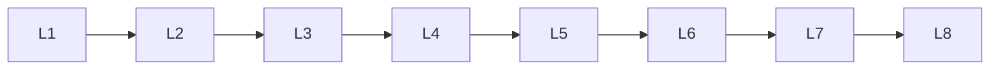

# Llm Pretraining

> Deep lessons for **Llm Pretraining** in the Large Language Models handbook.

## Lessons

| # | Lesson |
|---|--------|
| 1 | [Pretraining Data](01-pretraining-data.md) |
| 2 | [Data Collection](02-data-collection.md) |
| 3 | [Data Cleaning](03-data-cleaning.md) |
| 4 | [Data Deduplication](04-data-deduplication.md) |
| 5 | [Data Filtering](05-data-filtering.md) |
| 6 | [Causal Language Modeling](06-causal-language-modeling.md) |
| 7 | [Next-Token Prediction](07-next-token-prediction.md) |
| 8 | [Training Objectives](08-training-objectives.md) |
| 9 | [Distributed Training](09-distributed-training.md) |
| 10 | [Scaling Laws](10-scaling-laws.md) |

**Topic hub:** [../README.md](../README.md)
