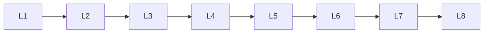

# Llm Safety

> Deep lessons for **Llm Safety** in the Large Language Models handbook.

## Lessons

| # | Lesson |
|---|--------|
| 1 | [Hallucination](01-hallucination.md) |
| 2 | [Bias](02-bias.md) |
| 3 | [Toxicity](03-toxicity.md) |
| 4 | [Prompt Injection](04-prompt-injection.md) |
| 5 | [Jailbreaking](05-jailbreaking.md) |
| 6 | [Content Safety](06-content-safety.md) |
| 7 | [Guardrails](07-guardrails.md) |
| 8 | [Alignment & Safety](08-alignment-and-safety.md) |

**Topic hub:** [../README.md](../README.md)
