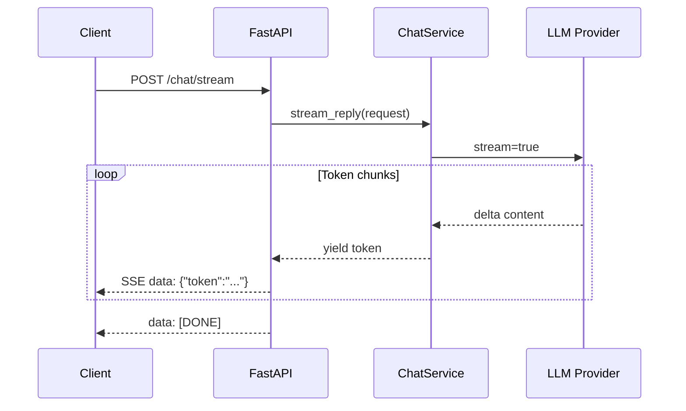

# LLM Streaming

> How to stream LLM tokens from provider APIs through your backend to clients — covering protocols, UX, FastAPI patterns, and production-grade error recovery.

## Table of Contents

- [Overview](#overview)
- [Why Stream](#why-stream)
- [Token Streaming Fundamentals](#token-streaming-fundamentals)
- [Provider Streaming APIs](#provider-streaming-apis)
- [Server-Sent Events (SSE)](#server-sent-events-sse)
- [Streaming API Design](#streaming-api-design)
- [Partial Responses and Incremental Parsing](#partial-responses-and-incremental-parsing)
- [UX Patterns for Streaming](#ux-patterns-for-streaming)
- [FastAPI Integration](#fastapi-integration)
- [Error Recovery](#error-recovery)
- [Production Usage](#production-usage)
- [Limitations](#limitations)
- [Common Mistakes](#common-mistakes)
- [Interview Preparation](#interview-preparation)
- [Navigation](#navigation)

---

## Overview

| Attribute | Value |
|-----------|-------|
| Category | LLM Integration Pattern |
| Protocols | SSE, WebSocket, raw chunked HTTP |
| Primary Use | Interactive chat, copilots, agent UIs |
| Latency Benefit | Time-to-first-token (TTFT) vs time-to-full-response |
| Backend Stack | FastAPI `StreamingResponse`, async generators |

Streaming is the default interaction model for modern AI chat interfaces.
Users perceive a 3-second full response as slow, but the same response streamed token-by-token feels responsive within 300–500 ms of the first token.

> **Production Standard:** Stream at the service layer, expose via SSE at the API layer, and cancel upstream generation when the client disconnects.

---

## Why Stream

| Metric | Blocking (non-streaming) | Streaming |
|--------|--------------------------|-----------|
| Perceived latency | Waits for full completion | First token in ~200–800 ms |
| User engagement | Spinner / blank screen | Progressive text reveal |
| Cancellation | Request timeout only | Stop on disconnect, save tokens |
| Partial use | All-or-nothing | Render markdown, tools, JSON incrementally |
| Error visibility | Single failure at end | Mid-stream error events possible |



### When Not to Stream

- Batch processing pipelines where latency is irrelevant
- Short structured outputs where parsing requires the full JSON body
- Background jobs returning `202 Accepted` with polling
- Scenarios where intermediate tokens would leak reasoning you intend to hide

---

## Token Streaming Fundamentals

### How Provider Streaming Works

LLM providers do not send individual tokens over separate HTTP requests.
They open a single HTTP connection and send a sequence of **chunks** — each chunk may contain zero or one token (or a fragment of a token for some models).

Typical chunk structure (OpenAI-compatible):

```json
{
  "id": "chatcmpl-abc123",
  "object": "chat.completion.chunk",
  "choices": [
    {
      "index": 0,
      "delta": { "content": "Hello" },
      "finish_reason": null
    }
  ]
}
```

Final chunk includes `finish_reason`: `"stop"`, `"length"`, `"tool_calls"`, or `"content_filter"`.

### Delta vs Full Content

| Field | Meaning |
|-------|---------|
| `delta.content` | Incremental text since last chunk |
| `message.content` | Full message (non-streaming only) |
| `delta.tool_calls` | Incremental function/tool call arguments |
| `usage` | Often sent only in the final chunk (provider-dependent) |

### Async Generator Pattern

```python
from collections.abc import AsyncIterator


async def stream_tokens(llm_client, messages: list[dict]) -> AsyncIterator[str]:
    async for chunk in llm_client.stream(messages=messages):
        delta = chunk.choices[0].delta.content
        if delta:
            yield delta
```

Keep extraction logic in the LLM adapter — services should receive plain strings or domain events.

---

## Provider Streaming APIs

### OpenAI Chat Completions

```python
from openai import AsyncOpenAI

client = AsyncOpenAI()

async def openai_stream(messages: list[dict]) -> AsyncIterator[str]:
    stream = await client.chat.completions.create(
        model="gpt-4.1-mini",
        messages=messages,
        stream=True,
    )
    async for chunk in stream:
        if chunk.choices and chunk.choices[0].delta.content:
            yield chunk.choices[0].delta.content
```

### Anthropic Messages API

```python
import anthropic

client = anthropic.AsyncAnthropic()

async def anthropic_stream(messages: list[dict], system: str = "") -> AsyncIterator[str]:
    async with client.messages.stream(
        model="claude-sonnet-4-20250514",
        max_tokens=1024,
        system=system,
        messages=messages,
    ) as stream:
        async for text in stream.text_stream:
            yield text
```

### OpenAI-Compatible Endpoints

Groq, OpenRouter, Ollama, and many proxies expose OpenAI-compatible streaming.
Swap `base_url` and `api_key`; keep the same `stream=True` pattern.

| Provider | Streaming Support | Notes |
|----------|-------------------|-------|
| OpenAI | Native SSE from API | `stream_options.include_usage` for token counts |
| Anthropic | `messages.stream()` | Event types: `content_block_delta`, `message_stop` |
| Google Gemini | `generate_content(stream=True)` | Chunk structure differs — normalize in adapter |
| Groq | OpenAI-compatible | Very low TTFT on supported models |
| Ollama | `/api/chat` with `stream: true` | NDJSON lines, not SSE |

---

## Server-Sent Events (SSE)

SSE is the standard transport from backend to browser for LLM streaming.

### SSE Wire Format

```text
data: {"token": "Hello"}\n\n
data: {"token": " world"}\n\n
data: [DONE]\n\n
```

Rules:

- Each event is one or more `field: value` lines terminated by a blank line (`\n\n`).
- Use `data:` for payloads; avoid multi-line JSON without escaping.
- Set `Content-Type: text/event-stream`.
- Disable proxy buffering (`X-Accel-Buffering: no` for nginx).

### SSE vs WebSocket

| | SSE | WebSocket |
|--|-----|-----------|
| Direction | Server → client | Bidirectional |
| Protocol | HTTP | WS upgrade |
| Reconnection | `EventSource` auto-reconnect | Manual |
| Firewall/proxy | Usually works | Sometimes blocked |
| Best for | Chat token streaming | Agent tool loops, voice |

For most chat UIs, SSE is sufficient.
Use WebSockets when the client must send messages over the same connection without new HTTP requests — see [FastAPI Foundation](../fastapi/fastapi-foundation.md#websocket-agent-endpoints).

### Browser Client

```javascript
const response = await fetch("/v1/chat/stream", {
  method: "POST",
  headers: { "Content-Type": "application/json" },
  body: JSON.stringify({ messages: [{ role: "user", content: "Hello" }] }),
});

const reader = response.body.getReader();
const decoder = new TextDecoder();

while (true) {
  const { done, value } = await reader.read();
  if (done) break;
  const lines = decoder.decode(value).split("\n");
  for (const line of lines) {
    if (line.startsWith("data: ") && line !== "data: [DONE]") {
      const payload = JSON.parse(line.slice(6));
      appendToken(payload.token);
    }
  }
}
```

`EventSource` only supports GET — POST-based chat requires `fetch` + `ReadableStream` as above.

---

## Streaming API Design

### Endpoint Contract

```python
from pydantic import BaseModel, Field


class ChatMessage(BaseModel):
    role: str
    content: str


class StreamChatRequest(BaseModel):
    messages: list[ChatMessage]
    model: str | None = None
    temperature: float = Field(default=0.7, ge=0, le=2)


class StreamEvent(BaseModel):
    type: str  # "token" | "error" | "metadata"
    token: str | None = None
    error: str | None = None
    usage: dict | None = None
```

### Response Headers

```python
headers = {
    "Content-Type": "text/event-stream",
    "Cache-Control": "no-cache",
    "Connection": "keep-alive",
    "X-Accel-Buffering": "no",
}
```

### Versioning

Expose streaming under the same versioned prefix as blocking endpoints: `/v1/chat/stream`.
Never change event payload shape without a version bump.

### Idempotency and Session IDs

Streaming requests are not idempotent.
Assign a `request_id` or `trace_id` at the start of the stream and include it in logs and optional `metadata` events for support debugging.

---

## Partial Responses and Incremental Parsing

### Markdown Rendering

Render markdown incrementally with care — incomplete `**bold` or unclosed code fences break parsers.

| Strategy | Approach |
|----------|----------|
| Plain text first | Render raw text, format on completion |
| Buffered markdown | Buffer until paragraph/sentence boundary |
| Incremental parser | Use a streaming-safe markdown library |
| Debounced re-render | Re-parse every 100–200 ms, not per token |

### Structured Output Streaming

When using JSON schema or tool calls, arguments arrive incrementally.

```python
async def accumulate_tool_call(stream) -> dict:
    name = ""
    arguments = ""
    async for chunk in stream:
        delta = chunk.choices[0].delta
        if delta.tool_calls:
            tc = delta.tool_calls[0]
            if tc.function.name:
                name = tc.function.name
            if tc.function.arguments:
                arguments += tc.function.arguments
    return {"name": name, "arguments": arguments}
```

Do not `json.loads()` until the stream completes or you have a validated closing brace.

### Agent Event Streams

Agent systems often multiplex event types in one stream:

```json
{"type": "token", "content": "Searching"}
{"type": "tool_call", "name": "search", "args": {"query": "..."}}
{"type": "tool_result", "output": "..."}
{"type": "token", "content": "Based on the results"}
{"type": "done", "usage": {"input_tokens": 1200, "output_tokens": 340}}
```

Use a typed event envelope so clients can branch on `type`.

---

## UX Patterns for Streaming

### Time-to-First-Token (TTFT)

TTFT dominates perceived speed.
Show a typing indicator until the first `token` event arrives — not until the HTTP response starts (TTFB).

| Phase | UI State |
|-------|----------|
| Request sent | Disable send, show spinner or "thinking" |
| First token | Hide spinner, start text reveal |
| Streaming | Cursor blink, smooth scroll-to-bottom |
| Complete | Enable send, show copy/actions |
| Error | Replace partial text or show retry banner |

### Typing Speed and Animation

Artificial delay (typewriter effect) adds latency — avoid it for power users.
Optional "smooth reveal" at 1.5× natural speed can feel polished without hurting TTFT.

### Partial Failure UX

If the stream fails mid-response:

- Keep partial content visible with an error banner
- Offer "Retry" (new request) vs "Continue" (append with follow-up) depending on product
- Never silently discard tokens the user already read

### Accessibility

- Announce new content to screen readers at sentence boundaries, not per token
- Provide a "reduce motion" mode that batches updates
- Ensure focus management does not jump on every chunk

---

## FastAPI Integration

### Minimal SSE Endpoint

```python
import json
from collections.abc import AsyncIterator

from fastapi import APIRouter, Depends, Request
from fastapi.responses import StreamingResponse

router = APIRouter()


async def sse_frames(
    request: ChatRequest,
    service: ChatService,
    http_request: Request,
) -> AsyncIterator[str]:
    try:
        async for token in service.stream_reply(request):
            if await http_request.is_disconnected():
                break
            yield f"data: {json.dumps({'type': 'token', 'token': token})}\n\n"
        yield f"data: {json.dumps({'type': 'done'})}\n\n"
    except LLMProviderError as exc:
        yield f"data: {json.dumps({'type': 'error', 'error': str(exc)})}\n\n"
    finally:
        yield "data: [DONE]\n\n"


@router.post("/chat/stream")
async def stream_chat(
    body: ChatRequest,
    http_request: Request,
    service: ChatService = Depends(get_chat_service),
) -> StreamingResponse:
    return StreamingResponse(
        sse_frames(body, service, http_request),
        media_type="text/event-stream",
        headers={"Cache-Control": "no-cache", "X-Accel-Buffering": "no"},
    )
```

### Service Layer

```python
class ChatService:
    def __init__(self, llm: LLMClient, retriever: Retriever | None = None):
        self._llm = llm
        self._retriever = retriever

    async def stream_reply(self, request: ChatRequest) -> AsyncIterator[str]:
        context = ""
        if self._retriever:
            context = await self._retriever.search(request.messages[-1].content)
        messages = self._build_messages(request.messages, context)
        async for token in self._llm.stream(messages=messages, model=request.model):
            yield token
```

### Lifespan and Client Reuse

Create the async HTTP client or SDK client once in FastAPI lifespan — not per request.
See [FastAPI Foundation](../fastapi/fastapi-foundation.md#application-factory-and-lifespan).

### nginx Configuration

```nginx
location /v1/chat/stream {
    proxy_pass http://api_upstream;
    proxy_http_version 1.1;
    proxy_set_header Connection "";
    proxy_buffering off;
    proxy_cache off;
    chunked_transfer_encoding on;
    proxy_read_timeout 300s;
}
```

Without `proxy_buffering off`, users see nothing until the buffer fills.

---

## Error Recovery

### Error Categories

| Error | When | Client Action |
|-------|------|---------------|
| Connection reset | Network drop | Retry with backoff |
| Provider 429 | Rate limit | Retry after `Retry-After` |
| Provider 5xx | Upstream outage | Fallback model or cached response |
| Mid-stream truncation | `finish_reason: length` | Offer "continue" prompt |
| Content filter | Policy violation | Show safe message, log incident |
| Client disconnect | User navigates away | Server stops generation |

### Retry Strategy

Do not automatically retry a partially delivered stream — the user may have read duplicate content.

```python
async def stream_with_fallback(
    primary: LLMClient,
    fallback: LLMClient,
    messages: list[dict],
) -> AsyncIterator[str]:
    try:
        async for token in primary.stream(messages):
            yield token
    except (RateLimitError, ServiceUnavailableError):
        async for token in fallback.stream(messages):
            yield token
```

Retry the **entire** request only if zero tokens were sent.

### Graceful SSE Error Events

Send errors as SSE data, not as HTTP 500 after streaming started — the response code is already 200.

```python
yield f"data: {json.dumps({'type': 'error', 'code': 'provider_unavailable'})}\n\n"
yield "data: [DONE]\n\n"
```

### Cancellation Propagation

```python
import asyncio


async def stream_with_cancel(llm_stream, disconnect_event: asyncio.Event):
    async for token in llm_stream:
        if disconnect_event.is_set():
            await llm_stream.aclose()  # provider-specific
            break
        yield token
```

Wire `request.is_disconnected()` to set the event in a background task.

### Logging and Observability

Log at stream end (not per token):

- `request_id`, `model`, `input_tokens`, `output_tokens`, `duration_ms`, `cancelled: bool`
- Trace the stream span in OpenTelemetry with events for first token and completion

---

## Production Usage

> **Production Standard:** Every streaming endpoint must handle disconnects, emit structured error events, log usage once per stream, and sit behind rate limiting.

### Checklist

- [ ] Async generator from service layer — no blocking I/O in the generator
- [ ] Client disconnect detection and upstream cancellation
- [ ] `X-Accel-Buffering: no` and nginx `proxy_buffering off`
- [ ] Rate limiting per user/API key before calling the LLM
- [ ] Timeout on total stream duration (e.g., 120 s)
- [ ] Token usage logged after stream completes
- [ ] No PII in per-token debug logs
- [ ] Integration tests with mocked async iterators
- [ ] Fallback model configured for provider outages

### Rate Limiting

Apply rate limits before opening the provider stream — a accepted connection that immediately 429s wastes resources and confuses clients.

### Cost Control

Streaming does not reduce cost — you pay for every output token.
Cancellation on disconnect is the primary cost saver.

### Testing

```python
import pytest
from httpx import ASGITransport, AsyncClient


@pytest.mark.asyncio
async def test_stream_returns_tokens(app, mock_llm):
    async def fake_stream(*_a, **_k):
        for t in ["Hello", " world"]:
            yield t

    mock_llm.stream = fake_stream

    transport = ASGITransport(app=app)
    async with AsyncClient(transport=transport, base_url="http://test") as client:
        async with client.stream("POST", "/v1/chat/stream", json={"messages": []}) as resp:
            body = "".join([line async for line in resp.aiter_lines()])
            assert "Hello" in body
            assert "[DONE]" in body
```

---

## Limitations

- SSE is unidirectional — client cannot send cancel signals except by closing the connection
- Some corporate proxies buffer `text/event-stream` despite headers
- Token usage may be unavailable until stream end (provider-dependent)
- Very long streams risk gateway timeouts — set `proxy_read_timeout` appropriately
- Incremental JSON parsing is error-prone — prefer full accumulation for structured outputs
- Mobile background tabs may suspend `fetch` readers — test on target platforms

---

## Common Mistakes

| Mistake | Impact | Fix |
|---------|--------|-----|
| No disconnect handling | Wasted tokens and cost | `request.is_disconnected()` |
| Logging every token | Log volume explosion | Log summary at end |
| HTTP 500 mid-stream | Client parser breaks | SSE error events |
| Sync SDK in async route | Blocks event loop | Async client + async generator |
| Buffering proxy | Frozen UI until complete | nginx `proxy_buffering off` |
| Retrying partial streams | Duplicate content | Retry only if zero tokens sent |
| Business logic in route | Untestable streams | Service-layer `stream_reply` |

---

## Interview Preparation

### Frequently Asked Questions

**Q1: Why use SSE instead of WebSockets for LLM chat?**

> **Strong answer:** Chat is predominantly server-to-client after the initial POST. SSE works over standard HTTP, auto-reconnects, and is simpler to operate. WebSockets add value for bidirectional agent loops or voice.

**Q2: How do you stop paying for tokens when the user closes the tab?**

> **Strong answer:** Detect `request.is_disconnected()` in FastAPI, cancel the async generator, and close the upstream provider stream. Log `cancelled=true` for cost analysis.

**Q3: How do you handle errors after streaming has started?**

> **Strong answer:** Emit typed SSE error events, terminate with `[DONE]`, keep partial content on the client. Do not change HTTP status mid-flight.

### Real-World Scenario

**Scenario:** Users report that chat feels frozen for 5 seconds, then all text appears at once.

> **Discussion points:** Check nginx buffering, missing `X-Accel-Buffering: no`, sync blocking in generator, or client waiting for full body instead of reading the stream incrementally.

---

## Navigation

### Prerequisites

- [FastAPI Foundation](../fastapi/fastapi-foundation.md)
- [HTTP Fundamentals for AI](../apis/http-fundamentals-for-ai.md)
- [Error Handling for AI Backends](../backend-engineering/error-handling-for-ai-backends.md)

### Related Topics

- [FastAPI Complete Guide](../fastapi/fastapi-complete-guide.md) — SSE and WebSocket depth
- [OpenAI Provider Guide](providers/openai.md)
- [Anthropic Claude Provider Guide](providers/anthropic-claude.md)

### Next Topics

- [Vision and Multimodal Models](vision-and-multimodal-models.md)
- Provider guides in [providers/](providers/)

---

## See Also

- [LLM Engineering Domain Index](README.md)
- [Backend Logging for AI](../logging/backend-logging-for-ai.md)
- [Monitoring Foundation for AI Backends](../monitoring/monitoring-foundation-for-ai-backends.md)

## Changelog

| Version | Date | Changes |
|---------|------|---------|
| 1.0 | 2026-07-13 | Initial version |
