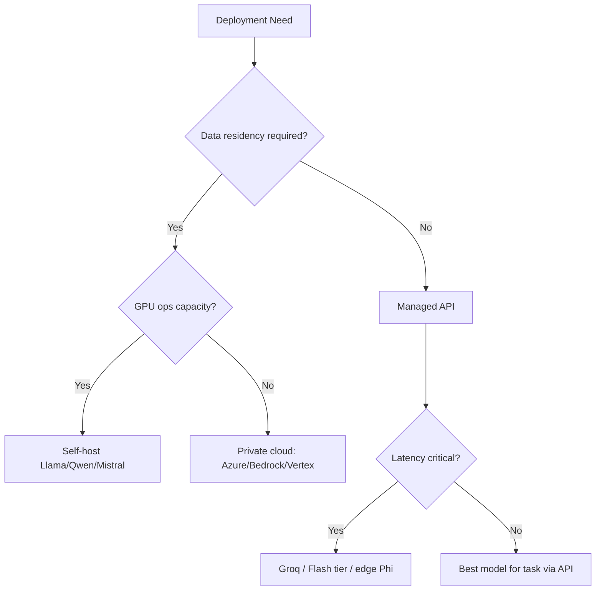

# Model Comparison Guide

> Section 16 of Phase 4 — model selection is an engineering decision, not a leaderboard contest. This guide compares the major model families across the dimensions that matter in production: capability, cost, latency, integration surface, and deployment options.

## Table of Contents

- [How to Use This Guide](#how-to-use-this-guide)
- [Model Families at a Glance](#model-families-at-a-glance)
- [Reasoning](#reasoning)
- [Coding](#coding)
- [Context Windows](#context-windows)
- [Latency](#latency)
- [Pricing](#pricing)
- [Multimodal](#multimodal)
- [Structured Outputs](#structured-outputs)
- [Tool Calling](#tool-calling)
- [Deployment Options](#deployment-options)
- [Decision Framework](#decision-framework)
- [Use Case Matrix](#use-case-matrix)
- [Provider Integration](#provider-integration)
- [Production Considerations](#production-considerations)
- [Common Mistakes](#common-mistakes)
- [Interview Preparation](#interview-preparation)
- [Navigation](#navigation)

---

## How to Use This Guide

This document compares **model families**, not every SKU. Providers ship new versions frequently — pin versions in config and re-evaluate quarterly.

| Rating Scale | Meaning |
|--------------|---------|
| **Excellent** | Top tier for the dimension; suitable as default for demanding workloads |
| **Strong** | Production-ready; minor tradeoffs vs leaders |
| **Good** | Works for many tasks; not first choice for hardest cases |
| **Moderate** | Usable with constraints; often cost or latency optimized |
| **Limited** | Niche fit or requires significant engineering to compensate |

> **Production Standard:** Choose models by **task requirements + SLOs + budget**, not benchmark hype. Run your own eval set on 50–200 real production examples before switching models.

**Indicative pricing** in this guide uses approximate API rates as of mid-2026. Always verify current pricing on provider pages before budgeting.

---

## Model Families at a Glance

| Family | Flagship Models (2026) | Primary Access | Open Weights |
|--------|------------------------|----------------|--------------|
| **GPT (OpenAI)** | GPT-4.1, GPT-4o, o3, o4-mini | [OpenAI API](providers/openai.md) | No |
| **Claude (Anthropic)** | Claude Opus 4, Sonnet 4, Haiku 4 | [Anthropic API](providers/anthropic-claude.md) | No |
| **Gemini (Google)** | Gemini 2.5 Pro, Flash, Flash-Lite | [Gemini API](providers/google-gemini.md) | No |
| **Grok (xAI)** | Grok-3, Grok-3-mini | xAI API, [OpenRouter](providers/openrouter.md) | No |
| **Llama (Meta)** | Llama 4 Scout, Maverick | Self-host, [Ollama](providers/ollama.md), cloud | Yes |
| **Qwen (Alibaba)** | Qwen 3, Qwen 2.5-Coder | Self-host, cloud APIs | Yes |
| **DeepSeek** | DeepSeek-V3, R1 | API, self-host | Yes (varies by license) |
| **Mistral** | Mistral Large, Small, Codestral | Mistral API, self-host | Partial |
| **Phi (Microsoft)** | Phi-4, Phi-4-mini | Azure, self-host, Ollama | Yes |

---

## Reasoning

Reasoning models use extended internal computation (chain-of-thought, test-time compute) for math, logic, planning, and multi-step analysis.

| Family | Reasoning Tier | Standout Models | Notes |
|--------|---------------|-----------------|-------|
| **GPT** | Excellent | o3, o4-mini, GPT-4.1 | o-series optimized for hard reasoning; higher latency and cost |
| **Claude** | Excellent | Opus 4, Sonnet 4 | Strong extended thinking; careful instruction following |
| **Gemini** | Excellent | Gemini 2.5 Pro | Deep Think mode; competitive on math and science |
| **Grok** | Strong | Grok-3 | Good general reasoning; smaller ecosystem |
| **Llama** | Good | Llama 4 Maverick | Open-weight; trails closed APIs on hardest benchmarks |
| **Qwen** | Strong | Qwen 3 235B | Competitive open reasoning; strong multilingual |
| **DeepSeek** | Excellent | DeepSeek-R1 | Exceptional cost/performance on reasoning tasks |
| **Mistral** | Good | Mistral Large | Solid; not primary choice for hardest logic |
| **Phi** | Moderate | Phi-4 | Efficient small model; limited on complex multi-step |

### Reasoning Selection Heuristics

```text
Hard reasoning (math proofs, legal analysis, agent planning)
  → o3 / Opus 4 / Gemini 2.5 Pro / DeepSeek-R1

Everyday reasoning (classification, summarization, light analysis)
  → GPT-4.1-mini / Sonnet 4 / Gemini Flash

Budget reasoning at scale
  → o4-mini / Haiku 4 / DeepSeek-V3 / Qwen 3 (self-hosted)
```

> **Interview tip:** Reasoning models trade latency and cost for accuracy. Route only complex queries to reasoning tiers — see [LLM Performance Optimization](llm-performance-optimization.md#model-routing).

---

## Coding

| Family | Coding Tier | Best For | Weaknesses |
|--------|------------|----------|------------|
| **GPT** | Excellent | Full-stack, refactoring, agents | Cost on largest models |
| **Claude** | Excellent | Large codebases, careful edits | — |
| **Gemini** | Strong | Multimodal code (screenshots, diagrams) | Tool ecosystem smaller than OpenAI |
| **Grok** | Good | General coding | Less proven in enterprise |
| **Llama** | Good | Self-hosted coding assistants | Needs tuning for your stack |
| **Qwen** | Strong | Qwen-Coder series; multilingual code | License check for commercial use |
| **DeepSeek** | Excellent | Code generation at low cost | API availability varies by region |
| **Mistral** | Strong | Codestral for completion-style tasks | Agentic coding trails leaders |
| **Phi** | Moderate | Edge/embedded code assist | Not for large-repo refactors |

### Coding Capability Matrix

| Capability | GPT | Claude | Gemini | Grok | Llama | Qwen | DeepSeek | Mistral | Phi |
|------------|-----|--------|--------|------|-------|------|----------|---------|-----|
| Single-file generation | ●●● | ●●● | ●●● | ●●○ | ●●○ | ●●● | ●●● | ●●○ | ●●○ |
| Multi-file refactoring | ●●● | ●●● | ●●○ | ●●○ | ●○○ | ●●○ | ●●○ | ●●○ | ●○○ |
| Test generation | ●●● | ●●● | ●●○ | ●●○ | ●●○ | ●●○ | ●●● | ●●○ | ●○○ |
| Bug diagnosis | ●●● | ●●● | ●●○ | ●●○ | ●●○ | ●●○ | ●●● | ●●○ | ●○○ |
| Tool/agentic coding | ●●● | ●●● | ●●○ | ●○○ | ●○○ | ●●○ | ●●○ | ●○○ | ●○○ |

Legend: ●●● Excellent · ●●○ Strong · ●○○ Good

---

## Context Windows

| Family | Max Context | Effective Context | Caching Support |
|--------|-------------|-------------------|-----------------|
| **GPT** | 128K–1M (model-dependent) | Strong to 128K | Yes — prompt caching |
| **Claude** | 200K | Strong to ~150K | Yes — prompt caching |
| **Gemini** | 1M–2M | Strong at very long context | Context caching |
| **Grok** | 128K | Good | Limited |
| **Llama** | 128K–10M (variant-dependent) | Degrades at extreme lengths | Self-managed |
| **Qwen** | 128K–1M | Good | Self-managed |
| **DeepSeek** | 128K | Good | API-dependent |
| **Mistral** | 128K | Good | Limited |
| **Phi** | 16K–128K | Moderate | Self-managed |

> **Caution:** Advertised context ≠ usable context. See [Context Windows](context-windows.md) for "lost in the middle," truncation, and budgeting strategies.

---

## Latency

| Family | Typical TTFT (chat) | Throughput | Lowest-Latency Path |
|--------|---------------------|------------|---------------------|
| **GPT** | 300ms–2s | High | GPT-4.1-mini, gpt-4o-mini |
| **Claude** | 400ms–2.5s | High | Haiku 4 |
| **Gemini** | 200ms–1.5s | Very high | Flash / Flash-Lite |
| **Grok** | 300ms–2s | Medium | Grok-3-mini |
| **Llama** | 50ms–1s (self-host) | Hardware-dependent | [Groq](providers/groq.md), local GPU |
| **Qwen** | 50ms–1s (self-host) | Hardware-dependent | Groq, vLLM |
| **DeepSeek** | 300ms–3s (API) | Medium | Smaller variants |
| **Mistral** | 200ms–1.5s | High | Mistral Small |
| **Phi** | 20ms–200ms (edge) | Very high on CPU/GPU | Local / Azure edge |

```text
Latency priority stack:
  1. Smallest model that passes eval
  2. Prompt caching (repeat system prompts)
  3. Streaming (perceived latency)
  4. Regional endpoint proximity
  5. Hardware acceleration (Groq, dedicated GPU)
```

See [LLM Performance Optimization](llm-performance-optimization.md) and [LLM Inference](llm-inference.md).

---

## Pricing

Approximate API pricing per 1M tokens (input / output) — verify before production budgeting.

| Family | Budget Tier | Mid Tier | Premium Tier |
|--------|------------|----------|--------------|
| **GPT** | $0.10 / $0.40 (4.1-nano) | $0.40 / $1.60 (4.1-mini) | $2.00 / $8.00+ (4.1, o3) |
| **Claude** | $0.25 / $1.25 (Haiku 4) | $3.00 / $15.00 (Sonnet 4) | $15.00 / $75.00 (Opus 4) |
| **Gemini** | $0.075 / $0.30 (Flash-Lite) | $0.15 / $0.60 (Flash) | $1.25 / $5.00 (2.5 Pro) |
| **Grok** | ~$0.30 / $0.50 (mini) | ~$3.00 / $15.00 (Grok-3) | — |
| **Llama** | GPU/hosting cost only | — | — |
| **Qwen** | GPU/hosting or low API | — | — |
| **DeepSeek** | ~$0.14 / $0.28 (V3) | ~$0.55 / $2.19 (R1) | — |
| **Mistral** | $0.10 / $0.30 (Small) | $2.00 / $6.00 (Large) | — |
| **Phi** | Edge compute only | — | — |

### Cost Efficiency Ranking (General Tasks)

| Rank | Family | Why |
|------|--------|-----|
| 1 | **DeepSeek** | Aggressive API pricing; strong quality |
| 2 | **Gemini Flash** | Fast + cheap for high volume |
| 3 | **GPT-4.1-mini / nano** | Mature tooling; predictable |
| 4 | **Qwen / Llama (self-host)** | Break-even at high sustained volume |
| 5 | **Claude Haiku** | Premium quality at mid cost |
| 6 | **Phi (edge)** | Ultra-cheap for simple on-device tasks |

See [LLM Cost Optimization](llm-cost-optimization.md) and [Tokens and Tokenization](tokens-and-tokenization.md).

---

## Multimodal

| Family | Vision | Audio | Video | Document OCR | Notes |
|--------|--------|-------|-------|--------------|-------|
| **GPT** | ●●● | ●●● (Whisper) | ●●○ | ●●● | GPT-4o native vision |
| **Claude** | ●●● | ●○○ | ●○○ | ●●● | Strong PDF/document analysis |
| **Gemini** | ●●● | ●●● | ●●● | ●●● | Native multimodal design |
| **Grok** | ●●○ | ●○○ | ●○○ | ●●○ | Vision available |
| **Llama** | ●●○ | ●○○ | ●○○ | ●○○ | Llama 4 multimodal variants |
| **Qwen** | ●●○ | ●●○ | ●○○ | ●●○ | Qwen-VL family |
| **DeepSeek** | ●●○ | ●○○ | ●○○ | ●●○ | Vision models available |
| **Mistral** | ●●○ | ●○○ | ●○○ | ●○○ | Pixtral for vision |
| **Phi** | ●○○ | ●○○ | ●○○ | ●○○ | Limited multimodal |

See [Vision and Multimodal Models](vision-and-multimodal-models.md).

---

## Structured Outputs

| Family | Native Schema Support | JSON Mode | Reliability Tier | Integration |
|--------|----------------------|-----------|------------------|-------------|
| **GPT** | Yes — `json_schema` | Yes | Excellent | [OpenAI](providers/openai.md) |
| **Claude** | Via tool use / structured | Partial | Strong | [Anthropic](providers/anthropic-claude.md) |
| **Gemini** | Yes — `response_schema` | Yes | Strong | [Gemini](providers/google-gemini.md) |
| **Grok** | Partial | Yes | Good | API |
| **Llama** | No (prompt + validate) | Prompt-only | Moderate | Self-host + Pydantic |
| **Qwen** | Partial (variant-dependent) | Prompt + validate | Moderate | Self-host |
| **DeepSeek** | Partial | Yes | Good | API |
| **Mistral** | Yes — `response_format` | Yes | Strong | API |
| **Phi** | No | Prompt-only | Moderate | Validate externally |

> **Production Standard:** Always validate with Pydantic regardless of provider claims. See [Structured Outputs](structured-outputs.md).

---

## Tool Calling

| Family | Native Tools | Parallel Calls | Reliability | Ecosystem |
|--------|-------------|----------------|-------------|-----------|
| **GPT** | Excellent | Yes | Excellent | Largest MCP/tool ecosystem |
| **Claude** | Excellent | Yes | Excellent | Strong tool use docs |
| **Gemini** | Strong | Yes | Strong | Growing |
| **Grok** | Good | Yes | Good | Smaller |
| **Llama** | Good (fine-tuned) | Varies | Moderate | Self-host burden |
| **Qwen** | Good | Varies | Moderate | Improving |
| **DeepSeek** | Good | Yes | Good | API |
| **Mistral** | Strong | Yes | Strong | API |
| **Phi** | Limited | No | Moderate | Edge agents only |

See [Function Calling and Tools](function-calling-and-tools.md).

---

## Deployment Options

| Family | Managed API | Private Cloud | Self-Host | Edge/On-Device |
|--------|------------|---------------|-----------|----------------|
| **GPT** | ●●● | Azure OpenAI | ✗ | ✗ |
| **Claude** | ●●● | AWS Bedrock | ✗ | ✗ |
| **Gemini** | ●●● | Vertex AI | ✗ | ✗ |
| **Grok** | ●●○ | ✗ | ✗ | ✗ |
| **Llama** | ●○○ | ●●● | ●●● | ●●○ |
| **Qwen** | ●●○ | ●●○ | ●●● | ●●○ |
| **DeepSeek** | ●●○ | ●○○ | ●●○ | ✗ |
| **Mistral** | ●●● | ●●○ | ●●○ | ●○○ |
| **Phi** | ●○○ | ●●○ | ●●● | ●●● |

### Deployment Decision Tree



---

## Decision Framework

Use this five-step framework for every model selection decision.

| Step | Question | Action |
|------|----------|--------|
| 1 | What is the task type? | Map to reasoning / coding / extraction / chat |
| 2 | What are latency SLOs? | Set TTFT and total response targets |
| 3 | What is the monthly token budget? | Estimate from [Tokens and Tokenization](tokens-and-tokenization.md) |
| 4 | What compliance constraints apply? | Data residency → self-host or private cloud |
| 5 | What is the eval pass rate? | Run 50+ production examples; pick smallest passing model |

### Model Routing Pattern

```python
from enum import Enum


class TaskComplexity(str, Enum):
  SIMPLE = "simple"      # classification, short answers
  STANDARD = "standard"  # summarization, extraction
  COMPLEX = "complex"    # multi-step reasoning, agents


ROUTING_TABLE: dict[TaskComplexity, str] = {
  TaskComplexity.SIMPLE: "gpt-4.1-nano",
  TaskComplexity.STANDARD: "gpt-4.1-mini",
  TaskComplexity.COMPLEX: "gpt-4.1",
}


def select_model(complexity: TaskComplexity, budget_exceeded: bool = False) -> str:
  if budget_exceeded and complexity == TaskComplexity.COMPLEX:
    return "gpt-4.1-mini"  # downgrade under budget pressure
  return ROUTING_TABLE[complexity]
```

---

## Use Case Matrix

| Use Case | First Choice | Alternative | Avoid |
|----------|-------------|-------------|-------|
| Customer support chat | GPT-4.1-mini, Sonnet 4 | Gemini Flash | Opus / o3 (overkill) |
| Code review agent | Claude Sonnet 4, GPT-4.1 | DeepSeek-V3 | Phi |
| Document extraction | GPT-4.1 + schema | Gemini 2.5 Pro | Free-form parsing |
| RAG answer generation | GPT-4.1-mini, Flash | Haiku 4 | Largest context model by default |
| Math / reasoning | o3, DeepSeek-R1, Opus 4 | Gemini 2.5 Pro | Small models |
| High-volume classification | Gemini Flash-Lite, 4.1-nano | Phi-4-mini | Premium tiers |
| Privacy-sensitive | Llama 4 (self-host) | Azure OpenAI | Public API with PII |
| Ultra-low latency | Groq + Llama/Qwen, Flash-Lite | Phi edge | Large reasoning models |
| Multimodal analysis | Gemini 2.5 Pro, GPT-4o | Claude | Text-only models |

---

## Provider Integration

| Need | Provider Doc | Notes |
|------|-------------|-------|
| OpenAI models | [OpenAI](providers/openai.md) | GPT, o-series, embeddings |
| Claude models | [Anthropic Claude](providers/anthropic-claude.md) | Tool use, caching |
| Gemini models | [Google Gemini](providers/google-gemini.md) | Long context, multimodal |
| Low-latency open models | [Groq](providers/groq.md) | Llama, Qwen at speed |
| Multi-provider routing | [OpenRouter](providers/openrouter.md) | Fallbacks, unified API |
| Local / air-gapped | [Ollama](providers/ollama.md) | Llama, Phi, Mistral local |

---

## Production Considerations

| Concern | Practice |
|---------|----------|
| Version pinning | Store model IDs in config; never hardcode in handlers |
| Fallback chains | Primary → secondary provider via [OpenRouter](providers/openrouter.md) |
| Eval-driven selection | Maintain golden set; re-run on model updates |
| Cost caps | Per-user and global budgets — [LLM Cost Optimization](llm-cost-optimization.md) |
| Observability | Log model, tokens, latency per request |
| Deprecation | Subscribe to provider changelog; test new versions in shadow mode |

```python
# config/models.yaml — pin versions, enable routing
models:
  default: "gpt-4.1-mini"
  reasoning: "o4-mini"
  fallback: "gemini-2.5-flash"
  self_hosted: "llama-4-scout"
```

---

## Common Mistakes

| Mistake | Impact | Fix |
|---------|--------|-----|
| Choosing largest model by default | 5–20× cost, slower | Route by task complexity |
| Ignoring self-host break-even | Wrong cost model at scale | Calculate GPU + ops vs API |
| No eval on switch | Quality regression | Golden set before migration |
| Trusting benchmark scores alone | Mismatch with your data | Domain-specific eval |
| Single provider lock-in | Outage = downtime | Abstraction + fallback |
| Ignoring context effective length | "Forgot" middle content | RAG + chunk limits |

---

## Interview Preparation

### Frequently Asked Questions

**Q1: How do you choose between GPT, Claude, and Gemini for a new product?**

> **Strong answer:** Start with requirements: latency SLO, budget, multimodal needs, data residency, and tool ecosystem. Run a 50–100 example eval on real data. Often GPT-4.1-mini or Gemini Flash wins for general chat; Claude for careful long-document work; Gemini for native multimodal. Abstract behind a provider interface and keep a fallback.

**Q2: When would you self-host Llama instead of using an API?**

> **Strong answer:** When data cannot leave your network, when sustained volume makes GPU amortization cheaper than API fees, or when you need custom fine-tunes. Factor in SRE cost: vLLM ops, monitoring, model updates. APIs win for speed-to-market and latest models.

**Q3: What dimensions matter most for model comparison in production?**

> **Strong answer:** Task-specific quality (via eval), latency (TTFT + total), cost per successful request (including retries), integration surface (structured outputs, tools), reliability/SLA, and compliance. Benchmark leaderboards are a starting point, not the decision.

**Q4: How do you handle model deprecation?**

> **Strong answer:** Pin versions in config. Monitor provider changelogs. Run shadow traffic on replacement model. Compare eval metrics. Gradual rollout with rollback. Document migration in runbooks.

### Real-World Scenario

**Scenario:** Your team debates switching from GPT-4.1 to DeepSeek-V3 for a 40% cost reduction.

> **Discussion points:** Run eval on production samples. Compare not just quality but retry rate, structured output failures, and tool call accuracy. Check data residency and API stability. Implement A/B test with cost and error dashboards. Keep fallback to GPT for failed requests.

---

## Navigation

### Prerequisites

- [Introduction to LLM Engineering](introduction-to-llm-engineering.md) — Section 1
- [How LLMs Work](how-llms-work.md) — Section 2
- [Tokens and Tokenization](tokens-and-tokenization.md) — Section 3
- [Context Windows](context-windows.md) — Section 4

### Phase 4 — LLM Engineering

| # | Topic | Document |
|---|-------|----------|
| 1 | Introduction to LLM Engineering | [introduction-to-llm-engineering.md](introduction-to-llm-engineering.md) |
| 2 | How LLMs Work | [how-llms-work.md](how-llms-work.md) |
| 3 | Tokens and Tokenization | [tokens-and-tokenization.md](tokens-and-tokenization.md) |
| 4 | Context Windows | [context-windows.md](context-windows.md) |
| 5 | Embeddings — LLM Perspective | [embeddings-llm-perspective.md](embeddings-llm-perspective.md) |
| 6 | Transformer Intuition | [transformer-intuition.md](transformer-intuition.md) |
| 7 | Attention Mechanism | [attention-mechanism.md](attention-mechanism.md) |
| 8 | KV Cache | [kv-cache.md](kv-cache.md) |
| 9 | LLM Inference | [llm-inference.md](llm-inference.md) |
| 10 | Sampling and Decoding | [sampling-and-decoding.md](sampling-and-decoding.md) |
| 11 | Structured Outputs | [structured-outputs.md](structured-outputs.md) |
| 12 | Function Calling and Tools | [function-calling-and-tools.md](function-calling-and-tools.md) |
| — | LLM Streaming (supplementary) | [llm-streaming.md](llm-streaming.md) |
| — | Vision and Multimodal Models (supplementary) | [vision-and-multimodal-models.md](vision-and-multimodal-models.md) |
| 16 | Model Comparison Guide | **You are here** |
| 17 | LLM Cost Optimization | [llm-cost-optimization.md](llm-cost-optimization.md) |
| 18 | LLM Performance Optimization | [llm-performance-optimization.md](llm-performance-optimization.md) |
| 19 | LLM Security Fundamentals | [llm-security-fundamentals.md](llm-security-fundamentals.md) |
| 20 | LLM Engineering Mistakes | [llm-engineering-mistakes.md](llm-engineering-mistakes.md) |

### Provider Guides

| Provider | Document |
|----------|----------|
| OpenAI | [providers/openai.md](providers/openai.md) |
| Anthropic Claude | [providers/anthropic-claude.md](providers/anthropic-claude.md) |
| Google Gemini | [providers/google-gemini.md](providers/google-gemini.md) |
| Groq | [providers/groq.md](providers/groq.md) |
| OpenRouter | [providers/openrouter.md](providers/openrouter.md) |
| Ollama | [providers/ollama.md](providers/ollama.md) |

### Related Topics

- [LLM Cost Optimization](llm-cost-optimization.md) — Section 17
- [LLM Performance Optimization](llm-performance-optimization.md) — Section 18
- [Model Integration](../model-integration/README.md) — advanced selection patterns

### Next Topics

- [LLM Cost Optimization](llm-cost-optimization.md) — reducing spend after model selection
- [LLM Performance Optimization](llm-performance-optimization.md) — latency and throughput tuning

---

## See Also

- [OpenAI Models](https://platform.openai.com/docs/models)
- [Anthropic Models](https://docs.anthropic.com/en/docs/about-claude/models)
- [Google Gemini Models](https://ai.google.dev/gemini-api/docs/models)
- [LMSYS Chatbot Arena](https://chat.lmsys.org/) — community benchmarks (use with caution)

## Changelog

| Version | Date | Changes |
|---------|------|---------|
| 1.0 | 2026-07-13 | Initial Phase 4 release — Section 16 |
