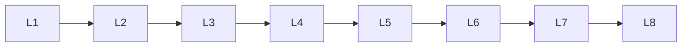

# Prompting

> Deep lessons for **Prompting** in the Large Language Models handbook.

## Lessons

| # | Lesson |
|---|--------|
| 1 | [Prompt Engineering](01-prompt-engineering.md) |
| 2 | [Zero-Shot Prompting](02-zero-shot-prompting.md) |
| 3 | [Few-Shot Prompting](03-few-shot-prompting.md) |
| 4 | [Chain-of-Thought](04-chain-of-thought.md) |
| 5 | [Role Prompting](05-role-prompting.md) |
| 6 | [Structured Prompting](06-structured-prompting.md) |
| 7 | [System/User/Assistant Messages](07-system-user-assistant-messages.md) |
| 8 | [Prompt Templates](08-prompt-templates.md) |

**Topic hub:** [../README.md](../README.md)
