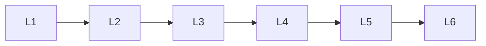

# Providers

> Deep lessons for **Providers** in the Large Language Models handbook.

## Lessons

| # | Lesson |
|---|--------|
| 1 | [Anthropic Claude](anthropic-claude.md) |
| 2 | [Google Gemini](google-gemini.md) |
| 3 | [Groq](groq.md) |
| 4 | [Ollama](ollama.md) |
| 5 | [OpenAI](openai.md) |
| 6 | [OpenRouter](openrouter.md) |

**Topic hub:** [../README.md](../README.md)
