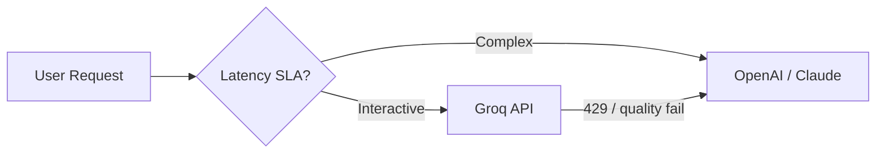

# Groq

> Production guide to Groq's inference API — ultra-low-latency LLM serving via custom LPU hardware, OpenAI-compatible endpoints, and when to use Groq in your AI stack.

## Table of Contents

- [Overview](#overview)
- [Use Cases](#use-cases)
- [Getting Started](#getting-started)
- [Models](#models)
- [Core Features](#core-features)
- [Streaming](#streaming)
- [Function Calling](#function-calling)
- [Integration Patterns](#integration-patterns)
- [API Reference Summary](#api-reference-summary)
- [Pricing and Limits](#pricing-and-limits)
- [Production Usage](#production-usage)
- [Limitations](#limitations)
- [Alternatives](#alternatives)
- [Common Mistakes](#common-mistakes)
- [Navigation](#navigation)

---

## Overview

| Attribute | Value |
|-----------|-------|
| Category | Inference Provider |
| Provider | Groq |
| Access | REST API (OpenAI-compatible) |
| Models Supported | Llama, Mixtral, Gemma, Whisper (varies) |
| Differentiator | Extremely low time-to-first-token |

Groq is not a model creator — it is an **inference platform** running open-weight models on Language Processing Units (LPUs).
The API is OpenAI-compatible, making integration a `base_url` swap for many applications.

> **Production Standard:** Use Groq for latency-sensitive paths with open models. Keep a fallback to OpenAI or Anthropic for models Groq does not host.

---

## Use Cases

| Use Case | Fit | Notes |
|----------|-----|-------|
| Real-time chat | High | TTFT often < 200 ms |
| Voice agent pipelines | High | Low latency critical |
| Classification / routing | High | Small models, fast |
| Open-weight model hosting | High | No GPU ops required |
| GPT-4 class reasoning | Low | Limited frontier models |
| Vision / multimodal | Low–Medium | Model-dependent |
| Private on-prem | Low | Cloud API only |
| Long-context 1M | Low | Model context limits apply |

---

## Getting Started

### Prerequisites

- Groq Cloud account and API key
- `GROQ_API_KEY` environment variable

### Quick Start

```bash
pip install groq
```

```python
import os

from groq import AsyncGroq

client = AsyncGroq(api_key=os.environ["GROQ_API_KEY"])

response = await client.chat.completions.create(
    model="llama-3.3-70b-versatile",
    messages=[
        {"role": "system", "content": "You are a helpful assistant."},
        {"role": "user", "content": "What is tail latency?"},
    ],
    temperature=0.3,
    max_tokens=256,
)
print(response.choices[0].message.content)
```

### OpenAI SDK Compatibility

```python
from openai import AsyncOpenAI

client = AsyncOpenAI(
    api_key=os.environ["GROQ_API_KEY"],
    base_url="https://api.groq.com/openai/v1",
)
```

Useful when your codebase already uses the OpenAI SDK everywhere.

---

## Models

Model availability changes — verify at [console.groq.com/docs/models](https://console.groq.com/docs/models).

| Model (typical) | Params | Strength |
|-----------------|--------|----------|
| `llama-3.3-70b-versatile` | 70B | General chat, tools |
| `llama-3.1-8b-instant` | 8B | Fastest, classification |
| `mixtral-8x7b-32768` | 47B MoE | Longer context MoE |
| `gemma2-9b-it` | 9B | Efficient instruction following |
| `whisper-large-v3` | — | Speech-to-text |

### Model Selection

```text
8b-instant → routing, tags, yes/no decisions
70b-versatile → user-facing chat, tool use
whisper → transcription pipeline first stage
```

---

## Core Features

### Chat Completions

Identical shape to OpenAI:

```python
response = await client.chat.completions.create(
    model="llama-3.3-70b-versatile",
    messages=messages,
    temperature=0.5,
    max_tokens=1024,
    top_p=0.9,
)
```

### JSON Mode

```python
response = await client.chat.completions.create(
    model="llama-3.3-70b-versatile",
    messages=messages,
    response_format={"type": "json_object"},
    max_tokens=1024,
)
```

Validate output with Pydantic — open models are less reliable at strict JSON than GPT-4.1.

### Speech-to-Text

```python
with open("audio.wav", "rb") as f:
    transcript = await client.audio.transcriptions.create(
        model="whisper-large-v3",
        file=f,
        response_format="verbose_json",
    )
```

---

## Streaming

Groq streaming is optimized for low TTFT — ideal for token streaming UIs.

```python
stream = await client.chat.completions.create(
    model="llama-3.3-70b-versatile",
    messages=messages,
    stream=True,
    max_tokens=1024,
)
async for chunk in stream:
    delta = chunk.choices[0].delta.content
    if delta:
        yield delta
```

See [LLM Streaming](../llm-streaming.md) for FastAPI SSE integration.

---

## Function Calling

Groq supports OpenAI-style tools on compatible models:

```python
response = await client.chat.completions.create(
    model="llama-3.3-70b-versatile",
    messages=[{"role": "user", "content": "Weather in Tokyo?"}],
    tools=[weather_tool_schema],
    tool_choice="auto",
)
```

Open-weight tool calling is less reliable than GPT-4.1 — test thoroughly and cap loop iterations.

---

## Integration Patterns

1. **Latency tier** — Groq for interactive, OpenAI for complex fallback
2. **Router** — 8b-instant classifies intent → 70b or frontier API generates
3. **OpenAI SDK + base_url** — zero code change for prototypes
4. **Whisper pipeline** — Groq transcription → any LLM for summarization
5. **Rate limit buffer** — queue requests when approaching RPM limits



---

## API Reference Summary

| Endpoint / Method | Purpose | Key Parameters |
|-------------------|---------|----------------|
| `POST /openai/v1/chat/completions` | Chat | `model`, `messages`, `stream` |
| `POST /openai/v1/audio/transcriptions` | STT | `file`, `model` |
| `POST /openai/v1/embeddings` | Embeddings | Model-dependent availability |

> Full documentation: [Groq API Docs](https://console.groq.com/docs)

---

## Pricing and Limits

| Tier | Cost | Rate Limits | Notes |
|------|------|-------------|-------|
| Free | Limited quota | Low RPM | Development |
| Pay-as-you-go | Per-token | Tier-based RPM/TPM | Very cost-competitive |

Groq rate limits are often the binding constraint — design for 429 handling.

### Rate Limit Strategy

```python
from tenacity import retry, retry_if_exception_type, stop_after_attempt, wait_exponential_jitter

class GroqRateLimitError(Exception):
    pass

@retry(
    retry=retry_if_exception_type(GroqRateLimitError),
    wait=wait_exponential_jitter(initial=1, max=60),
    stop=stop_after_attempt(5),
)
async def groq_complete(client, **kwargs):
    try:
        return await client.chat.completions.create(**kwargs)
    except Exception as exc:
        if "429" in str(exc):
            raise GroqRateLimitError from exc
        raise
```

---

## Production Usage

> **Production Standard:** Treat Groq as a performance tier, not sole provider. Implement 429 backoff, quality monitoring, and automatic fallback.

### When Groq Should Be Primary

- Chat widgets where TTFT < 300 ms is required
- High-volume classification with 8B models
- Voice pipelines where STT + LLM latency compounds

### When to Fallback

- Complex reasoning or multi-step agents
- Strict JSON schema compliance requirements
- Models not available on Groq (GPT-4.1, Claude, Gemini native)
- Rate limit exhaustion during traffic spikes

### Quality Monitoring

Open models may drift in behavior across Groq model updates.
Run periodic eval suites — same as any model change.

### Observability

Log: `provider=groq`, `model`, `latency_ms`, `ttft_ms`, `tokens`, `finish_reason`, `fallback_triggered`.

---

## Limitations

- Limited frontier model selection — no GPT-4.1 or Claude native
- Aggressive rate limits on free/low tiers
- Tool calling quality varies by model
- No enterprise VPC/private deployment (API only)
- Context windows follow underlying model limits (not 1M)
- Vision support limited to models Groq hosts with multimodal capability
- Vendor concentration — plan multi-provider architecture

---

## Alternatives

| Tool | Strengths | Weaknesses |
|------|-----------|------------|
| OpenAI | Model quality, tools | Higher latency |
| Ollama | Local, private | Self-managed hardware |
| OpenRouter | Multi-provider | Extra hop, variable latency |
| Together AI | Many open models | Latency profile differs |
| Fireworks AI | Fast inference | Different model catalog |

---

## Common Mistakes

| Mistake | Fix |
|---------|-----|
| Groq as only provider | Multi-provider fallback |
| No 429 handling | Backoff + queue |
| Expecting GPT-4 quality from 8B | Match model to task |
| Ignoring rate limit headers | Track RPM, request tier upgrade |
| Same prompts as Claude/GPT | Tune prompts for Llama family |

---

## Navigation

### Prerequisites

- [OpenAI](openai.md) — API shape reference
- [LLM Streaming](../llm-streaming.md)

### Related Topics

- [OpenRouter](openrouter.md)
- [Ollama](ollama.md)

---

## See Also

- [Error Handling for AI Backends](../../backend-engineering/error-handling-for-ai-backends.md)
- [Backend Performance for AI](../../performance-optimization/backend-performance-for-ai.md)

## Changelog

| Version | Date | Changes |
|---------|------|---------|
| 1.0 | 2026-07-13 | Initial version |
