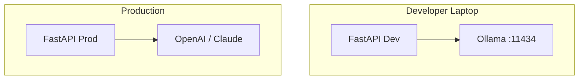

# Ollama

> Production and development guide to Ollama — run open-weight LLMs locally with simple model management, OpenAI-compatible APIs, hardware planning, and privacy-preserving AI workflows.

## Table of Contents

- [Overview](#overview)
- [Use Cases](#use-cases)
- [Getting Started](#getting-started)
- [Model Management](#model-management)
- [Core Features](#core-features)
- [Hardware Requirements](#hardware-requirements)
- [OpenAI-Compatible API](#openai-compatible-api)
- [Streaming](#streaming)
- [Multimodal Models](#multimodal-models)
- [Integration Patterns](#integration-patterns)
- [API Reference Summary](#api-reference-summary)
- [Pricing and Limits](#pricing-and-limits)
- [Production Usage](#production-usage)
- [Limitations](#limitations)
- [Alternatives](#alternatives)
- [Common Mistakes](#common-mistakes)
- [Navigation](#navigation)

---

## Overview

| Attribute | Value |
|-----------|-------|
| Category | Local Inference Runtime |
| Provider | Ollama (open source) |
| Access | Local HTTP API, CLI, Docker |
| Models Supported | Llama, Mistral, Gemma, Qwen, LLaVA, etc. |
| Differentiator | Zero-config local LLM, privacy, offline |

Ollama packages open-weight models into a local server with pull-run ergonomics similar to Docker.
It is the default choice for **local development**, **air-gapped environments**, and **edge deployments** where data cannot leave the network.

> **Production Standard:** Ollama suits edge and private deployments — not a replacement for managed APIs at web scale without dedicated GPU infrastructure and ops.

---

## Use Cases

| Use Case | Fit | Notes |
|----------|-----|-------|
| Local development | High | No API costs, offline |
| CI integration tests | High | Mock LLM with real inference |
| Air-gapped / regulated data | High | Data never leaves machine |
| Prototyping RAG | High | Fast iteration |
| Production at web scale | Low | GPU fleet required |
| Frontier model quality | Low | Open weights lag GPT-4.1/Claude |
| Multi-tenant SaaS default | Low | Cost and ops complexity |

---

## Getting Started

### Prerequisites

- macOS, Linux, or Windows (WSL2)
- NVIDIA GPU recommended (CPU-only works, slowly)
- 16 GB+ RAM for 7B models; 32 GB+ for 13B+

### Installation

```bash
# Linux
curl -fsSL https://ollama.com/install.sh | sh

# macOS
brew install ollama

# Docker
docker run -d -v ollama:/root/.ollama -p 11434:11434 --gpus all ollama/ollama
```

### Quick Start

```bash
ollama pull llama3.2
ollama run llama3.2 "Explain gradient descent in one sentence."
```

### Python Client

```bash
pip install ollama
```

```python
import ollama

response = ollama.chat(
    model="llama3.2",
    messages=[{"role": "user", "content": "What is a vector database?"}],
)
print(response["message"]["content"])
```

---

## Model Management

### Pull and List

```bash
ollama pull llama3.2:3b          # Specific tag
ollama pull mistral:7b
ollama pull llama3.2-vision:11b   # Vision model
ollama list
ollama rm llama3.2
```

### Model Tags

| Tag | Meaning |
|-----|---------|
| `latest` | Default tag (may change) |
| `3b`, `7b`, `70b` | Parameter size |
| `q4_K_M` | Quantization level (in some models) |

Pin explicit tags in production configs — `llama3.2:3b` not `llama3.2`.

### Custom Modelfiles

```dockerfile
# Modelfile
FROM llama3.2
PARAMETER temperature 0.3
PARAMETER num_ctx 8192
SYSTEM You are a code review assistant. Be concise.
```

```bash
ollama create code-reviewer -f Modelfile
```

Version Modelfiles in git — reproducible deployments.

---

## Core Features

### Chat API

```bash
curl http://localhost:11434/api/chat -d '{
  "model": "llama3.2",
  "messages": [{"role": "user", "content": "Hello"}],
  "stream": false
}'
```

### Generate (Completion)

```bash
curl http://localhost:11434/api/generate -d '{
  "model": "llama3.2",
  "prompt": "The capital of France is",
  "stream": true
}'
```

### Embeddings

```bash
curl http://localhost:11434/api/embeddings -d '{
  "model": "nomic-embed-text",
  "prompt": "Text to embed"
}'
```

Use `nomic-embed-text` or `mxbai-embed-large` for local RAG without cloud APIs.

---

## Hardware Requirements

### VRAM Guidelines (approximate)

| Model Size | Quantization | VRAM Needed | Quality |
|------------|--------------|-------------|---------|
| 3B | Q4 | 4 GB | Basic tasks |
| 7B | Q4 | 6–8 GB | Dev default |
| 13B | Q4 | 10–12 GB | Better reasoning |
| 34B | Q4 | 20–24 GB | Strong open model |
| 70B | Q4 | 40–48 GB | Requires multi-GPU or CPU offload |

### CPU-Only

Ollama runs on CPU with RAM offload — usable for 3B–7B models at 1–5 tokens/sec.
Not suitable for interactive chat at 70B scale.

### Apple Silicon

Unified memory on M-series Macs runs 7B–13B efficiently — excellent dev machine.
M3 Max 64 GB can run 34B quantized comfortably.

### Production GPU Sizing

```text
Interactive 7B chat (10 concurrent)  → 1× A10G (24 GB) or L4
Interactive 13B                      → 1× A100 40 GB
70B production                       → 2× A100 80 GB or dedicated inference server
```

Monitor `ollama ps` for loaded models — Ollama keeps models in memory until evicted.

```bash
ollama ps  # running models and VRAM usage
```

### Context Length and Memory

Larger `num_ctx` increases VRAM usage linearly.
Default 2048 may be insufficient for RAG — set explicitly in Modelfile:

```
PARAMETER num_ctx 8192
```

---

## OpenAI-Compatible API

Ollama exposes `/v1/chat/completions` compatible with the OpenAI SDK:

```python
from openai import AsyncOpenAI

client = AsyncOpenAI(
    base_url="http://localhost:11434/v1",
    api_key="ollama",  # required but ignored
)

response = await client.chat.completions.create(
    model="llama3.2",
    messages=[{"role": "user", "content": "Hello"}],
)
```

Swap `base_url` in your existing `LLMClient` for local dev — no code changes.

---

## Streaming

NDJSON streaming (native) or SSE via OpenAI-compatible endpoint:

```python
stream = await client.chat.completions.create(
    model="llama3.2",
    messages=messages,
    stream=True,
)
async for chunk in stream:
    if chunk.choices[0].delta.content:
        print(chunk.choices[0].delta.content, end="")
```

Native Ollama streaming returns newline-delimited JSON objects with `message.content` deltas.

See [LLM Streaming](../llm-streaming.md) for FastAPI SSE patterns.

---

## Multimodal Models

```bash
ollama pull llama3.2-vision:11b
```

```python
import base64

with open("screenshot.png", "rb") as f:
    image_b64 = base64.b64encode(f.read()).decode()

response = ollama.chat(
    model="llama3.2-vision:11b",
    messages=[
        {
            "role": "user",
            "content": "Describe this UI.",
            "images": [image_b64],
        }
    ],
)
```

Vision quality lags GPT-4o and Claude — suitable for dev, not precision OCR.
See [Vision and Multimodal Models](../vision-and-multimodal-models.md).

---

## Integration Patterns

1. **Dev/prod split** — Ollama locally, OpenAI in production via config
2. **CI tests** — Ollama service container in GitHub Actions (small model)
3. **Air-gapped RAG** — Ollama embeddings + Ollama chat, no external calls
4. **Edge kiosk** — Single GPU machine, Ollama Docker, local FastAPI
5. **Hybrid** — Ollama for PII-sensitive docs, cloud for general chat



### Docker Compose (Dev)

```yaml
services:
  ollama:
    image: ollama/ollama:latest
    ports:
      - "11434:11434"
    volumes:
      - ollama_data:/root/.ollama
    deploy:
      resources:
        reservations:
          devices:
            - driver: nvidia
              count: 1
              capabilities: [gpu]

  api:
    build: .
    environment:
      LLM_BASE_URL: http://ollama:11434/v1
      LLM_MODEL: llama3.2
    depends_on:
      - ollama

volumes:
  ollama_data:
```

---

## API Reference Summary

| Endpoint / Method | Purpose | Key Parameters |
|-------------------|---------|----------------|
| `POST /api/chat` | Chat | `model`, `messages`, `stream` |
| `POST /api/generate` | Completion | `model`, `prompt`, `stream` |
| `POST /api/embeddings` | Embeddings | `model`, `prompt` |
| `POST /v1/chat/completions` | OpenAI-compatible | Same as OpenAI |
| `GET /api/tags` | List models | — |
| `POST /api/pull` | Download model | `name` |

> Full documentation: [Ollama API](https://github.com/ollama/ollama/blob/main/docs/api.md)

---

## Pricing and Limits

| Tier | Cost | Rate Limits | Notes |
|------|------|-------------|-------|
| Self-hosted | Hardware + electricity only | Hardware-bound | No per-token fees |
| Ollama Cloud (if used) | Service pricing | Varies | Managed option |

### Effective Cost Model

```text
Monthly cost = GPU amortization + power + engineer ops time
Break-even vs API ≈ high sustained token volume on fixed hardware
```

For sporadic dev usage, cloud APIs are often cheaper than buying GPUs.

---

## Production Usage

> **Production Standard:** Pin model versions, monitor GPU memory, set request timeouts, run health checks, and plan model load/eviction for multi-model servers.

### Health Check

```python
import httpx

async def ollama_healthy() -> bool:
    try:
        async with httpx.AsyncClient(timeout=2.0) as client:
            r = await client.get("http://ollama:11434/api/tags")
            return r.status_code == 200
    except httpx.RequestError:
        return False
```

Include in FastAPI `/ready` — not just `/health`.

### Concurrency

Ollama processes concurrent requests but shares one model in VRAM.
High concurrency on one GPU causes queueing — limit with semaphores:

```python
import asyncio

OLLAMA_SEMAPHORE = asyncio.Semaphore(4)  # tune per GPU

async def ollama_complete(...):
    async with OLLAMA_SEMAPHORE:
        return await client.chat.completions.create(...)
```

### Security

- Bind to `127.0.0.1` or internal network only — Ollama has no built-in auth
- Put behind API gateway with authentication in production
- Never expose port 11434 to the public internet

### Model Updates

```bash
ollama pull llama3.2  # updates if newer digest available
```

Pin digests in production — unexpected pulls change behavior.

---

## Limitations

- No built-in authentication or multi-tenancy
- Single-machine scaling — horizontal scaling requires load balancer + multiple GPUs
- Open models lag frontier quality for complex reasoning
- Tool calling support varies by model
- Large models need expensive GPU hardware
- No managed SLA — you operate the infrastructure
- Vision/OCR quality below cloud multimodal APIs
- Context length limited by VRAM at runtime

---

## Alternatives

| Tool | Strengths | Weaknesses |
|------|-----------|------------|
| vLLM | High-throughput serving | More complex setup |
| llama.cpp | Minimal, embedded | Manual model management |
| Groq Cloud | Fast, no GPU ops | Data leaves network |
| LocalAI | OpenAI-compatible, many backends | Heavier configuration |
| TGI (Hugging Face) | Production serving | Kubernetes-oriented |

---

## Common Mistakes

| Mistake | Fix |
|---------|-----|
| Exposing 11434 publicly | Internal network + API auth |
| `latest` tag in prod | Pin `model:tag` |
| 70B on 8 GB GPU | Match model to VRAM |
| No concurrency limits | Semaphore per GPU |
| Expecting GPT-4 quality | Tune prompts, pick larger models |
| Ignoring cold start | Pre-load models on deploy |

---

## Navigation

### Prerequisites

- [OpenAI](openai.md) — API compatibility reference
- [LLM Streaming](../llm-streaming.md)

### Related Topics

- [Groq](groq.md) — cloud fast inference alternative
- [Vision and Multimodal Models](../vision-and-multimodal-models.md)

---

## See Also

- [Configuration and Secrets](../../foundations/configuration-and-secrets.md)
- [Docker deployment patterns](../../domains/docker/README.md)

## Changelog

| Version | Date | Changes |
|---------|------|---------|
| 1.0 | 2026-07-13 | Initial version |
