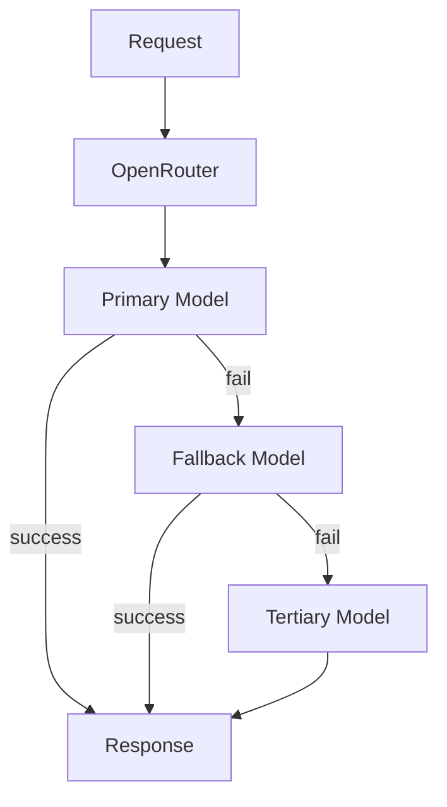

# OpenRouter

> Production guide to OpenRouter — a unified API gateway to 100+ models from OpenAI, Anthropic, Google, Meta, Mistral, and more, with OpenAI-compatible requests and intelligent routing.

## Table of Contents

- [Overview](#overview)
- [Use Cases](#use-cases)
- [Getting Started](#getting-started)
- [Model Catalog](#model-catalog)
- [Core Features](#core-features)
- [Routing and Fallbacks](#routing-and-fallbacks)
- [Streaming](#streaming)
- [Structured Outputs and Tools](#structured-outputs-and-tools)
- [Integration Patterns](#integration-patterns)
- [API Reference Summary](#api-reference-summary)
- [Pricing and Limits](#pricing-and-limits)
- [Production Usage](#production-usage)
- [Limitations](#limitations)
- [Alternatives](#alternatives)
- [Common Mistakes](#common-mistakes)
- [Navigation](#navigation)

---

## Overview

| Attribute | Value |
|-----------|-------|
| Category | LLM API Gateway / Router |
| Provider | OpenRouter |
| Access | REST API (OpenAI-compatible) |
| Models Supported | 100+ from multiple providers |
| Differentiator | Single API key, multi-provider, model fallbacks |

OpenRouter proxies requests to underlying providers (OpenAI, Anthropic, Google, Groq, etc.) through one OpenAI-compatible endpoint.
You specify models as `provider/model-name` and can configure fallbacks when a provider is down or rate-limited.

> **Production Standard:** Use OpenRouter for multi-model flexibility in development and as a fallback layer — not as a blind replacement for direct provider relationships at scale without cost analysis.

---

## Use Cases

| Use Case | Fit | Notes |
|----------|-----|-------|
| Multi-model experimentation | High | Switch models via config |
| Provider fallback | High | Automatic model routing |
| Single SDK integration | High | OpenAI client + base_url |
| Cost-optimized routing | Medium | Compare per-model pricing in dashboard |
| Enterprise compliance | Low | Extra data processor in chain |
| Lowest possible latency | Medium | Extra network hop |
| High-volume production | Medium | Direct provider may be cheaper |

---

## Getting Started

### Prerequisites

- OpenRouter account and API key
- `OPENROUTER_API_KEY` environment variable

### Quick Start

```python
import os

from openai import AsyncOpenAI

client = AsyncOpenAI(
    api_key=os.environ["OPENROUTER_API_KEY"],
    base_url="https://openrouter.ai/api/v1",
)

response = await client.chat.completions.create(
    model="anthropic/claude-sonnet-4",
    messages=[
        {"role": "user", "content": "Compare SQL and NoSQL in one paragraph."},
    ],
    extra_headers={
        "HTTP-Referer": "https://myapp.example.com",
        "X-Title": "My AI App",
    },
)
print(response.choices[0].message.content)
```

`HTTP-Referer` and `X-Title` are optional but recommended for OpenRouter rankings and analytics.

---

## Model Catalog

Models use the format `provider/model-id`.

| Model ID (examples) | Underlying | Notes |
|---------------------|------------|-------|
| `openai/gpt-4.1-mini` | OpenAI | Full GPT feature set |
| `anthropic/claude-sonnet-4` | Anthropic | Messages API translated |
| `google/gemini-2.5-flash` | Google | Multimodal |
| `meta-llama/llama-3.3-70b-instruct` | Meta via host | Open weight |
| `mistralai/mistral-large` | Mistral | EU-friendly option |

Browse live catalog: [openrouter.ai/models](https://openrouter.ai/models)

### Selecting Models

```python
# config/models.yaml
chat_default: "openai/gpt-4.1-mini"
chat_fallback: "anthropic/claude-sonnet-4"
fast_tier: "google/gemini-2.5-flash-lite"
local_equiv: "meta-llama/llama-3.3-70b-instruct"
```

Pin model IDs in configuration — OpenRouter adds/removes models frequently.

---

## Core Features

### Standard Chat Completions

Fully OpenAI-compatible:

```python
response = await client.chat.completions.create(
    model="openai/gpt-4.1-mini",
    messages=messages,
    temperature=0.3,
    max_tokens=1024,
)
```

### Provider Routing Header

```python
response = await client.chat.completions.create(
    model="meta-llama/llama-3.3-70b-instruct",
    messages=messages,
    extra_body={
        "provider": {
            "order": ["Groq", "Fireworks"],
            "allow_fallbacks": True,
        }
    },
)
```

Route to preferred inference providers for the same model weights.

### Usage and Cost Tracking

Responses include `usage` with token counts.
OpenRouter dashboard shows per-model spend — export for finance chargeback.

---

## Routing and Fallbacks

### Model Fallbacks

```python
response = await client.chat.completions.create(
    model="openai/gpt-4.1-mini",
    messages=messages,
    extra_body={
        "models": [
            "openai/gpt-4.1-mini",
            "anthropic/claude-sonnet-4",
            "google/gemini-2.5-flash",
        ]
    },
)
```

If the primary model fails (429, 503), OpenRouter tries the next in the list.

### Application-Level vs OpenRouter Fallbacks

| Layer | Control | Use When |
|-------|---------|----------|
| OpenRouter `models` array | Gateway handles | Quick resilience |
| App-level fallback | Full control | Different prompts per provider |
| Circuit breaker | Prevent cascade | Provider sustained outage |

Combine both: OpenRouter fallbacks for transient errors, app-level for quality-based routing.



---

## Streaming

```python
stream = await client.chat.completions.create(
    model="openai/gpt-4.1-mini",
    messages=messages,
    stream=True,
)
async for chunk in stream:
    if chunk.choices and chunk.choices[0].delta.content:
        yield chunk.choices[0].delta.content
```

Streaming works across most models — verify per model on the catalog.
See [LLM Streaming](../llm-streaming.md).

---

## Structured Outputs and Tools

Support depends on the underlying model:

| Feature | OpenAI models | Anthropic via OR | Open models |
|---------|---------------|------------------|-------------|
| JSON schema | Yes | Translated | Variable |
| Tool calling | Yes | Yes | Model-dependent |
| Vision | Yes | Yes | Model-dependent |

Test structured output reliability per model — do not assume GPT-4.1 behavior from Llama via OpenRouter.

---

## Integration Patterns

1. **Config-driven model selection** — change model string without code deploy
2. **Dev/prod split** — cheap models in dev, production models via same client
3. **A/B testing** — route percentage traffic to alternate models
4. **Unified observability** — one API key, log `model` field per request
5. **Direct provider escape hatch** — OpenRouter for flexibility, direct API for scale

### LLM Client Adapter

```python
class OpenRouterClient(LLMClient):
    def __init__(self, settings: Settings):
        self._client = AsyncOpenAI(
            api_key=settings.openrouter_api_key,
            base_url="https://openrouter.ai/api/v1",
        )
        self._model = settings.chat_model

    async def complete(self, messages: list[dict], **kwargs) -> LLMResponse:
        response = await self._client.chat.completions.create(
            model=self._model,
            messages=messages,
            **kwargs,
        )
        return LLMResponse.from_openai(response)
```

---

## API Reference Summary

| Endpoint / Method | Purpose | Key Parameters |
|-------------------|---------|----------------|
| `POST /api/v1/chat/completions` | Chat | `model`, `messages`, `stream` |
| `GET /api/v1/models` | List models | — |
| `GET /api/v1/generation` | Query generation stats | `id` |

> Full documentation: [OpenRouter API Docs](https://openrouter.ai/docs)

---

## Pricing and Limits

| Tier | Cost | Rate Limits | Notes |
|------|------|-------------|-------|
| Pay-as-you-go | Model price + small fee | Account-based | Varies by model |
| Credits | Pre-purchase | — | Budget caps available |

OpenRouter adds a markup over direct provider pricing — acceptable for convenience, evaluate at scale.

### Cost Comparison Workflow

1. Run eval suite on candidate models via OpenRouter
2. Measure quality, latency, cost per successful task
3. Move high-volume winner to direct provider API if markup matters

---

## Production Usage

> **Production Standard:** Log underlying model ID, handle fallbacks explicitly, set spend limits in OpenRouter dashboard, and review data processing agreements for compliance.

### Data Privacy

Requests pass through OpenRouter infrastructure before reaching providers.
Review:

- OpenRouter privacy policy and data retention
- Whether your compliance regime allows a third-party proxy
- Provider zero-retention options (may require direct API)

### Authentication

```python
class Settings(BaseSettings):
    openrouter_api_key: str
    openrouter_default_model: str = "openai/gpt-4.1-mini"
    openrouter_site_url: str = "https://myapp.example.com"
    openrouter_app_name: str = "My AI App"
```

### Error Handling

| Error | Action |
|-------|--------|
| 402 | Insufficient credits — alert billing |
| 429 | Rate limit — backoff or fallback model |
| 502 | Provider error — retry or next model in list |
| Model not found | Fix config — model ID changed |

### Spend Controls

- Set monthly credit limits in dashboard
- Alert at 80% budget threshold
- Per-environment API keys (dev vs prod)

---

## Limitations

- Additional latency hop vs direct provider
- Markup on token pricing
- Not all provider features exposed (fine-grained Anthropic caching headers, etc.)
- Model IDs change — requires maintenance
- Enterprise features (VPC, private link) not available
- Some beta features lag behind direct APIs
- Compliance-sensitive workloads may prohibit proxy layer

---

## Alternatives

| Tool | Strengths | Weaknesses |
|------|-----------|------------|
| Direct OpenAI/Anthropic | Full features, best SLAs | One provider per integration |
| LiteLLM (self-hosted) | Open source router | Operate yourself |
| Groq | Fast, cheap open models | Limited catalog |
| Azure AI Foundry | Enterprise multi-model | Azure lock-in |

---

## Common Mistakes

| Mistake | Fix |
|---------|-----|
| Hardcoded model without fallback | `models` array or config |
| Ignoring markup at scale | Cost compare vs direct |
| Assuming feature parity | Test tools/JSON per model |
| No spend limits | Dashboard credit caps |
| Compliance oversight | Review DPA before prod PII |

---

## Navigation

### Prerequisites

- [OpenAI](openai.md) — API compatibility baseline

### Related Topics

- [Groq](groq.md)
- [Anthropic Claude](anthropic-claude.md)
- [LLM Streaming](../llm-streaming.md)

---

## See Also

- [Error Handling for AI Backends](../../backend-engineering/error-handling-for-ai-backends.md)
- [Configuration and Secrets](../../foundations/configuration-and-secrets.md)

## Changelog

| Version | Date | Changes |
|---------|------|---------|
| 1.0 | 2026-07-13 | Initial version |
