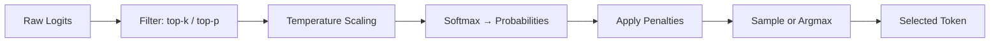
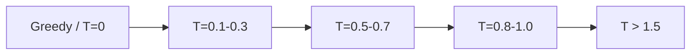

# Sampling and Decoding

> Section 10 of this handbook — every token your LLM emits is the result of a decoding decision. Master these parameters and you control the tradeoff between creativity, consistency, and cost.

## Table of Contents

- [Why Decoding Strategy Matters](#why-decoding-strategy-matters)
- [From Logits to Tokens](#from-logits-to-tokens)
- [Greedy Decoding](#greedy-decoding)
- [Beam Search](#beam-search)
- [Temperature](#temperature)
- [Top-k Sampling](#top-k-sampling)
- [Top-p (Nucleus) Sampling](#top-p-nucleus-sampling)
- [Frequency and Presence Penalties](#frequency-and-presence-penalties)
- [Max Tokens](#max-tokens)
- [Stop Sequences](#stop-sequences)
- [Randomness vs Determinism](#randomness-vs-determinism)
- [Choosing a Strategy by Task](#choosing-a-strategy-by-task)
- [Python Examples](#python-examples)
- [Production Considerations](#production-considerations)
- [Common Mistakes](#common-mistakes)
- [Interview Preparation](#interview-preparation)
- [Navigation](#navigation)

---

## Why Decoding Strategy Matters

The same model, prompt, and context can produce radically different outputs depending on decoding parameters. A customer support bot and a creative writing assistant should not share the same settings — yet many production systems ship with provider defaults and never tune them.

| Symptom | Likely Decoding Cause |
|---------|----------------------|
| Repetitive, looping output | Temperature too low + no frequency penalty |
| Nonsensical or off-topic text | Temperature too high |
| Inconsistent structured JSON | Stochastic sampling without schema constraints |
| Different output every run | Non-zero temperature without fixed seed |
| Output truncated mid-sentence | `max_tokens` too low |
| Model ignores instructions at end | No stop sequences for multi-turn leakage |

> **Production Standard:** Define decoding presets per use case (e.g., `extraction`, `chat`, `creative`) in configuration — not as magic numbers scattered through code.

---

## From Logits to Tokens

After each forward pass, the model outputs a vector of **logits** — one score per token in the vocabulary (often 50,000–150,000 values). Decoding transforms logits into a single selected token.



### Processing Order

The typical pipeline (order may vary slightly by implementation):

1. Apply **logit bias** and **penalties** (frequency, presence)
2. Filter vocabulary with **top-k** and/or **top-p**
3. Scale by **temperature**
4. Convert to probabilities via softmax
5. **Sample** stochastically or take **argmax** (greedy)

```python
import numpy as np


def logits_to_probs(
  logits: np.ndarray,
  temperature: float = 1.0,
  top_k: int | None = None,
  top_p: float | None = None,
) -> np.ndarray:
  # Step 1: Temperature scaling
  if temperature == 0:
    probs = np.zeros_like(logits, dtype=np.float64)
    probs[np.argmax(logits)] = 1.0
    return probs

  scaled = logits / temperature

  # Step 2: Top-k filter
  if top_k is not None and top_k > 0:
    top_k = min(top_k, len(scaled))
    threshold = np.partition(scaled, -top_k)[-top_k]
    scaled = np.where(scaled < threshold, -np.inf, scaled)

  # Step 3: Top-p (nucleus) filter
  if top_p is not None and 0 < top_p < 1:
    sorted_indices = np.argsort(scaled)[::-1]
    sorted_logits = scaled[sorted_indices]
    cumulative = np.cumsum(softmax(sorted_logits))
    cutoff = cumulative > top_p
    cutoff[1:] = cutoff[:-1].copy()
    cutoff[0] = False
    scaled[sorted_indices[cutoff]] = -np.inf

  return softmax(scaled)


def softmax(x: np.ndarray) -> np.ndarray:
  exp_x = np.exp(x - np.max(x))
  return exp_x / exp_x.sum()
```

---

## Greedy Decoding

**Greedy decoding** selects the highest-probability token at each step (`argmax`). It is fully deterministic (given fixed weights and input).

### Behavior

- Always picks the locally optimal token
- Fast — no sampling overhead
- Prone to repetitive loops ("the the the...")
- Cannot recover from early suboptimal choices

```python
def greedy_decode(logits: np.ndarray) -> int:
  return int(np.argmax(logits))
```

### When to Use Greedy

| Use Case | Rationale |
|----------|-----------|
| Code generation (with low temperature) | Deterministic, syntax-sensitive |
| Classification / extraction | Single correct answer expected |
| Unit tests and evals | Reproducible outputs |
| Structured data extraction | Consistency over creativity |

### When to Avoid Greedy

- Open-ended creative writing
- Brainstorming or ideation
- Dialogue that should feel natural and varied

---

## Beam Search

**Beam search** maintains the top-*k* most probable partial sequences (beams) at each step, expanding all candidates and pruning to the best *k*.

### Behavior

- Explores multiple hypotheses in parallel
- Finds higher-probability full sequences than greedy
- Computationally expensive (beam_width × decode cost)
- Output can be generic or repetitive (favors high-probability safe text)

```
Beam width = 3

Step 1: ["The" (0.4), "A" (0.3), "In" (0.2)]
Step 2: Expand each → keep top 3 of 3×vocab
...
Final: Return highest-scoring complete sequence
```

### When to Use Beam Search

| Use Case | Typical Beam Width |
|----------|-------------------|
| Machine translation | 4–6 |
| Summarization (non-LLM era) | 4–5 |
| Caption generation | 3–5 |

### When to Avoid Beam Search

- Modern chat LLMs (rarely exposed in APIs)
- Interactive chat (latency scales with beam width)
- Creative tasks (beam search favors "safe" high-probability text)
- Most production LLM API calls (OpenAI, Anthropic do not offer beam search)

> **Practical note:** Beam search is largely absent from modern chat completion APIs. Understand it for fundamentals and legacy systems, but production LLM apps use temperature + top-p instead.

---

## Temperature

**Temperature** scales logits before softmax, controlling the sharpness of the probability distribution.

### Mathematics

```
P(token_i) = exp(logit_i / T) / Σ exp(logit_j / T)
```

| Temperature | Effect | Distribution Shape |
|-------------|--------|-------------------|
| T → 0 | Greedy (argmax) | Extremely peaked |
| T = 0.1–0.3 | Focused, deterministic | Sharp |
| T = 0.7–1.0 | Balanced (common default) | Moderate |
| T > 1.0 | Creative, random | Flat |
| T > 2.0 | Often incoherent | Nearly uniform |

```python
def demonstrate_temperature(logits: np.ndarray):
  for temp in [0.0, 0.3, 0.7, 1.0, 1.5]:
    probs = logits_to_probs(logits, temperature=temp)
    top5 = np.argsort(probs)[-5:][::-1]
    print(f"T={temp}: top token prob = {probs[top5[0]]:.3f}")
```

### When to Use Each Range

| Range | Use Case |
|-------|----------|
| 0.0 | Deterministic extraction, evals, code |
| 0.1–0.3 | Factual Q&A, classification, SQL generation |
| 0.5–0.7 | General chat, balanced assistants |
| 0.8–1.0 | Creative writing, brainstorming |
| > 1.0 | Rarely useful in production |

---

## Top-k Sampling

**Top-k sampling** restricts selection to the *k* highest-probability tokens, zeroing out all others before sampling.

### Behavior

- k=1 is equivalent to greedy
- k=50 (common default) allows diversity while excluding tail noise
- Fixed k can be too restrictive (sharp distributions) or too permissive (flat distributions)

```python
def top_k_sample(logits: np.ndarray, k: int = 50, temperature: float = 0.7) -> int:
  probs = logits_to_probs(logits, temperature=temperature, top_k=k)
  return int(np.random.choice(len(probs), p=probs))
```

### When to Use Top-k

| Scenario | Recommended k |
|----------|--------------|
| Factual responses | 10–20 |
| General chat | 40–50 |
| Creative writing | 50–100 |
| With top-p | Set k high (e.g., 100) and let top-p do the filtering |

> **Modern practice:** Most engineers set top-p and leave top-k at a high value or unset. Top-p adapts to the distribution shape; top-k does not.

---

## Top-p (Nucleus) Sampling

**Top-p** (nucleus sampling) selects the smallest set of tokens whose cumulative probability exceeds *p*, then samples from that set.

### Why Top-p Is Preferred

Top-k uses a fixed number of candidates regardless of distribution shape. Top-p adapts:

- **Sharp distribution** (confident model): few tokens in nucleus → focused output
- **Flat distribution** (uncertain model): many tokens in nucleus → diverse output

```python
def top_p_sample(
  logits: np.ndarray,
  p: float = 0.9,
  temperature: float = 0.7,
) -> int:
  probs = logits_to_probs(logits, temperature=temperature, top_p=p)
  return int(np.random.choice(len(probs), p=probs))
```

### Common Values

| top_p | Effect |
|-------|--------|
| 0.1 | Very focused — near-greedy |
| 0.5 | Moderate diversity |
| 0.9 | Common default — good balance |
| 0.95 | Slightly more diverse |
| 1.0 | No nucleus filtering |

### Temperature + Top-p Interaction

These parameters work together. Common production presets:

```python
DECODING_PRESETS = {
  "deterministic": {"temperature": 0.0, "top_p": 1.0},
  "extraction": {"temperature": 0.1, "top_p": 0.5},
  "chat": {"temperature": 0.7, "top_p": 0.9},
  "creative": {"temperature": 1.0, "top_p": 0.95},
}
```

---

## Frequency and Presence Penalties

Penalties modify logits to reduce repetition. Both are supported by OpenAI-compatible APIs.

### Frequency Penalty

Reduces logits proportional to how often a token has **already appeared** in the output.

- Range: -2.0 to 2.0 (OpenAI)
- Positive values discourage repetition
- Effect accumulates — a token appearing 5 times is penalized more than one appearing once

### Presence Penalty

Reduces logits for any token that has appeared **at least once**, regardless of count.

- Range: -2.0 to 2.0
- Positive values encourage topic diversity
- Binary — first occurrence triggers the same penalty as the tenth

### Comparison

| Penalty | Penalizes | Best For |
|---------|-----------|----------|
| Frequency | Repeated tokens proportionally | Reducing "the the the" loops |
| Presence | Any re-used token equally | Encouraging new topics/vocabulary |

```python
def apply_frequency_penalty(
  logits: np.ndarray,
  generated_token_ids: list[int],
  penalty: float = 0.5,
) -> np.ndarray:
  if penalty == 0:
    return logits

  counts: dict[int, int] = {}
  for tid in generated_token_ids:
    counts[tid] = counts.get(tid, 0) + 1

  adjusted = logits.copy()
  for token_id, count in counts.items():
  # OpenAI convention: subtract penalty * count from logit
    adjusted[token_id] -= penalty * count

  return adjusted
```

### Recommended Starting Points

| Use Case | frequency_penalty | presence_penalty |
|----------|-------------------|------------------|
| General chat | 0.0 | 0.0 |
| Long-form generation | 0.3–0.5 | 0.1–0.3 |
| Repetitive model behavior | 0.5–1.0 | 0.3–0.6 |
| Structured extraction | 0.0 | 0.0 |

> **Caution:** High penalties can cause the model to avoid common function words, producing unnatural text.

---

## Max Tokens

**max_tokens** (called `max_output_tokens` or `max_completion_tokens` on some providers) sets a hard upper limit on generated tokens.

### Why It Matters

- **Cost control** — output tokens are billed per token
- **Latency control** — decode time scales linearly with output length
- **Safety** — prevents runaway generation

```python
from openai import AsyncOpenAI

client = AsyncOpenAI()


async def bounded_completion(prompt: str, max_tokens: int = 256):
  return await client.chat.completions.create(
    model="gpt-4o-mini",
    messages=[{"role": "user", "content": prompt}],
    max_tokens=max_tokens,
    temperature=0.3,
  )
```

### Setting max_tokens

| Task | Typical max_tokens |
|------|-------------------|
| Yes/no classification | 10–20 |
| Short answer Q&A | 100–256 |
| Chat message | 512–1024 |
| Document summary | 1024–4096 |
| Code generation | 2048–4096 |

### max_tokens vs Context Window

`max_tokens` limits **output only**. Total context = input tokens + output tokens ≤ model context window.

```
Context window: 128,000 tokens
Input (prompt + history): 120,000 tokens
max_tokens: 8,000          ← maximum allowed output
```

If input + max_tokens exceeds the context window, the API returns an error. Always budget input and output together.

---

## Stop Sequences

**Stop sequences** are strings that halt generation when they appear in the output. They prevent the model from continuing beyond the intended response boundary.

### Use Cases

| Stop Sequence | Purpose |
|---------------|---------|
| `"\n\nHuman:"` | Prevent model from simulating user turns |
| `"\n\n"` | End at paragraph boundary |
| `"```"` | Stop after code block |
| `"</s>"` | Custom end marker in prompts |
| `"\nUser:"` | Multi-turn format control |

```python
response = await client.chat.completions.create(
  model="gpt-4o-mini",
  messages=[{"role": "user", "content": "List 3 colors."}],
  max_tokens=100,
  stop=["\n\n", "4."],
)
```

### Stop Sequences vs EOS Token

| Mechanism | Who Controls | When It Fires |
|-----------|-------------|---------------|
| EOS token | Model | Model decides it is done |
| Stop sequences | Developer | Specific string appears in output |
| max_tokens | Developer | Token count reached |

### Provider Differences

| Provider | Parameter Name | Max Stops |
|----------|---------------|-----------|
| OpenAI | `stop` | 4 sequences |
| Anthropic | `stop_sequences` | Multiple |
| Gemini | `stopSequences` | Multiple |

---

## Randomness vs Determinism

### The Spectrum



### Deterministic Generation

```python
# Fully deterministic (greedy)
response = await client.chat.completions.create(
  model="gpt-4o-mini",
  messages=messages,
  temperature=0,
  seed=42,  # OpenAI: reproducible outputs with same seed
)
```

| Approach | Reproducibility | Quality |
|----------|----------------|---------|
| temperature=0 | High | Can be repetitive |
| temperature=0 + seed | Highest (provider-dependent) | Same input → same output |
| Low temperature + top_p=0.5 | High | Slightly more varied |

### Stochastic Generation

```python
response = await client.chat.completions.create(
  model="gpt-4o-mini",
  messages=messages,
  temperature=0.8,
  top_p=0.9,
)
```

Each call may produce different output. Desirable for creative tasks; problematic for extraction and testing.

### When to Choose Determinism

- Structured data extraction
- Automated evaluation pipelines
- Regression testing of prompts
- Code generation
- Any task with a single correct answer

### When to Choose Randomness

- Creative writing and marketing copy
- Brainstorming and ideation
- Conversational variety in chatbots
- Generating diverse synthetic training data

---

## Choosing a Strategy by Task

| Task | temperature | top_p | frequency_penalty | max_tokens |
|------|-------------|-------|-------------------|------------|
| JSON extraction | 0.0 | 1.0 | 0.0 | 500–1000 |
| SQL generation | 0.0–0.2 | 0.5 | 0.0 | 256–512 |
| Customer support chat | 0.5–0.7 | 0.9 | 0.2 | 512–1024 |
| Code completion | 0.0–0.2 | 0.5 | 0.0 | 2048 |
| Creative writing | 0.8–1.0 | 0.95 | 0.3 | 2048–4096 |
| Summarization | 0.3–0.5 | 0.8 | 0.3 | 1024 |
| Classification | 0.0 | 1.0 | 0.0 | 10–50 |
| RAG answer generation | 0.3–0.5 | 0.8 | 0.2 | 512–1024 |
| Agent tool selection | 0.0–0.3 | 0.5 | 0.0 | 256 |

> For structured outputs, prefer schema-constrained generation ([Structured Outputs](structured-outputs.md)) over tuning temperature alone.

---

## Python Examples

### Complete Decoding Configuration Class

```python
from dataclasses import dataclass
from enum import Enum


class TaskType(Enum):
  EXTRACTION = "extraction"
  CHAT = "chat"
  CREATIVE = "creative"
  CODE = "code"


@dataclass(frozen=True)
class DecodingConfig:
  temperature: float = 0.7
  top_p: float = 0.9
  top_k: int | None = None
  frequency_penalty: float = 0.0
  presence_penalty: float = 0.0
  max_tokens: int = 1024
  stop: list[str] | None = None
  seed: int | None = None

  def to_api_params(self) -> dict:
    params = {
      "temperature": self.temperature,
      "top_p": self.top_p,
      "max_tokens": self.max_tokens,
      "frequency_penalty": self.frequency_penalty,
      "presence_penalty": self.presence_penalty,
    }
    if self.stop:
      params["stop"] = self.stop
    if self.seed is not None:
      params["seed"] = self.seed
    return params


PRESETS: dict[TaskType, DecodingConfig] = {
  TaskType.EXTRACTION: DecodingConfig(
    temperature=0.0, top_p=1.0, max_tokens=500
  ),
  TaskType.CHAT: DecodingConfig(
    temperature=0.7, top_p=0.9, max_tokens=1024, frequency_penalty=0.2
  ),
  TaskType.CREATIVE: DecodingConfig(
    temperature=0.9, top_p=0.95, max_tokens=2048, presence_penalty=0.3
  ),
  TaskType.CODE: DecodingConfig(
    temperature=0.1, top_p=0.5, max_tokens=2048, stop=["\n\n\n"]
  ),
}
```

### Using Presets with OpenAI

```python
from openai import AsyncOpenAI

client = AsyncOpenAI()


async def extract_entities(text: str) -> str:
  config = PRESETS[TaskType.EXTRACTION]
  response = await client.chat.completions.create(
    model="gpt-4o-mini",
    messages=[
      {
        "role": "system",
        "content": "Extract named entities. Return JSON only.",
      },
      {"role": "user", "content": text},
    ],
    **config.to_api_params(),
  )
  return response.choices[0].message.content
```

### Using Presets with Anthropic

```python
from anthropic import AsyncAnthropic

anthropic_client = AsyncAnthropic()


async def chat_response(user_message: str) -> str:
  config = PRESETS[TaskType.CHAT]
  response = await anthropic_client.messages.create(
    model="claude-sonnet-4-20250514",
    max_tokens=config.max_tokens,
    temperature=config.temperature,
    top_p=config.top_p,
    messages=[{"role": "user", "content": user_message}],
  )
  return response.content[0].text
```

### Local Sampling Implementation

```python
import numpy as np
from numpy.typing import NDArray


class Sampler:
  def __init__(self, config: DecodingConfig):
    self.config = config

  def select(self, logits: NDArray[np.float64], history: list[int]) -> int:
    adjusted = apply_frequency_penalty(
      logits, history, self.config.frequency_penalty
    )

    if self.config.temperature == 0:
      return int(np.argmax(adjusted))

    probs = logits_to_probs(
      adjusted,
      temperature=self.config.temperature,
      top_k=self.config.top_k,
      top_p=self.config.top_p,
    )
    return int(np.random.choice(len(probs), p=probs))


# Usage in a generation loop
sampler = Sampler(PRESETS[TaskType.CHAT])
generated_ids: list[int] = []

for step in range(100):
  logits = model.forward(context + generated_ids)
  next_id = sampler.select(logits, generated_ids)
  generated_ids.append(next_id)
  if next_id == EOS_ID:
    break
```

### A/B Testing Decoding Parameters

```python
import asyncio
import hashlib


async def compare_decoding_configs(
  prompt: str,
  configs: list[DecodingConfig],
  runs_per_config: int = 3,
) -> dict:
  results = {}

  for i, config in enumerate(configs):
    outputs = []
    for run in range(runs_per_config):
      response = await client.chat.completions.create(
        model="gpt-4o-mini",
        messages=[{"role": "user", "content": prompt}],
        **config.to_api_params(),
      )
      text = response.choices[0].message.content
      outputs.append(text)

    unique = len(set(outputs))
    results[f"config_{i}"] = {
      "config": config,
      "outputs": outputs,
      "unique_outputs": unique,
      "deterministic": unique == 1,
    }

  return results
```

---

## Production Considerations

| Area | Recommendation |
|------|---------------|
| **Presets** | Define per-task decoding configs in settings, not inline |
| **Structured output** | Use schema constraints, not just temperature=0 |
| **Eval pipelines** | Fix temperature=0 and seed for reproducibility |
| **Cost** | Set max_tokens per endpoint based on actual usage data |
| **Monitoring** | Log decoding params with each request for debugging |
| **Stop sequences** | Use for multi-turn format control and code blocks |
| **Penalties** | Start at 0; increase only when repetition is observed |

```python
# Log decoding params with every LLM call
log.info(
  "llm_request",
  task_type=task.value,
  temperature=config.temperature,
  top_p=config.top_p,
  max_tokens=config.max_tokens,
)
```

---

## Common Mistakes

| Mistake | Impact | Fix |
|---------|--------|-----|
| Using default temperature for all tasks | Inconsistent quality | Task-specific presets |
| temperature=0 for creative tasks | Boring, repetitive output | Raise to 0.7–0.9 |
| High temperature for extraction | Invalid JSON, hallucinations | temperature=0 + schema constraints |
| Ignoring max_tokens | Cost and latency overruns | Set per endpoint based on data |
| top_k and top_p both very low | Overly constrained, unnatural | Use top_p alone with moderate value |
| High penalties on extraction tasks | Garbled output | Keep penalties at 0 for factual tasks |
| No stop sequences in multi-turn prompts | Model simulates user messages | Add format-specific stop sequences |
| Not using seed in evals | Non-reproducible benchmark results | Fix seed and temperature for tests |

---

## Interview Preparation

### Frequently Asked Questions

**Q1: What is the difference between temperature and top-p?**

> **Strong answer:** Temperature scales all logits uniformly, controlling overall randomness. Top-p dynamically selects the smallest token set whose cumulative probability exceeds p, adapting to the distribution shape. In practice, use them together: temperature for overall randomness, top-p to exclude low-probability tail tokens.

**Q2: When would you use temperature=0 vs a small positive value?**

> **Strong answer:** Temperature=0 for tasks requiring deterministic, reproducible output — extraction, classification, code, evals. Small positive values (0.1–0.3) when you want mostly deterministic output but need slight variation to avoid repetitive loops, such as varied phrasing in summaries.

**Q3: Explain frequency vs presence penalty.**

> **Strong answer:** Frequency penalty scales with how many times a token has appeared — it fights repeated words. Presence penalty fires once per token regardless of count — it encourages new vocabulary and topics. Use frequency for loop prevention, presence for topic diversity.

**Q4: How do you make LLM outputs reproducible for testing?**

> **Strong answer:** Set temperature=0, use a fixed seed where supported (OpenAI), pin model version, and use deterministic prompts. For structured outputs, add schema validation. Log all decoding parameters with test runs.

### Real-World Scenario

**Scenario:** Your JSON extraction endpoint returns valid JSON 85% of the time. Engineers suggest lowering temperature, but it is already at 0.

> **Discussion points:** Temperature=0 alone does not guarantee valid JSON. Switch to structured output mode with JSON Schema. Add Pydantic validation and retry on failure. Consider a two-pass approach: extract with schema, validate, retry with error feedback.

---

## Navigation

### Prerequisites

- [LLM Inference](llm-inference.md) — Section 9: prefill, decode, generation loop
- Sections 1–8 of this handbook — tokens, API basics

### Related Topics

- [Structured Outputs](structured-outputs.md) — Section 11: schema-constrained generation
- [LLM Inference](llm-inference.md) — where sampling fits in the pipeline
- [Prompt Engineering](../prompt-engineering/README.md) — prompt design for reliable outputs

### Next Topics

- [Structured Outputs](structured-outputs.md) — JSON mode and validation
- [Function Calling and Tools](function-calling-and-tools.md) — tool selection decoding

### Future Reading

- [AI Evaluation](../ai-evaluation/README.md) — evaluating output quality across decoding configs
- [Context Engineering](../context-engineering/README.md) — context management

---

## See Also

- [OpenAI API — Chat Completions Parameters](https://platform.openai.com/docs/api-reference/chat/create)
- [Anthropic API — Messages Parameters](https://docs.anthropic.com/en/api/messages)
- [Hugging Face — Generation Strategies](https://huggingface.co/docs/transformers/generation_strategies)

## Changelog

| Version | Date | Changes |
|---------|------|---------|
| 1.0 | 2026-07-13 | Initial release — Section 10 |
