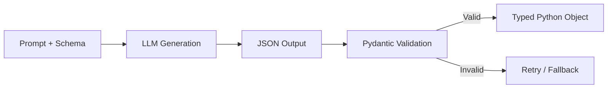
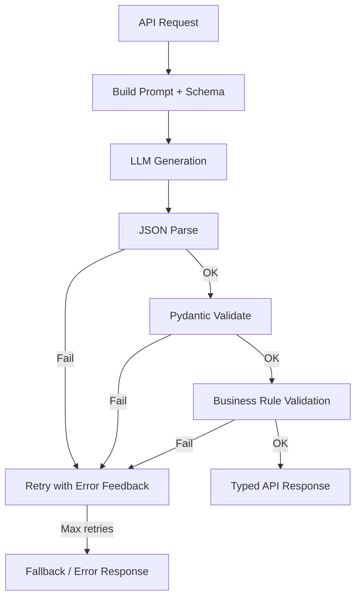

# Structured Outputs

> Section 11 of this handbook — free-form text is fine for chat, but production systems need typed, validated data. Structured outputs turn probabilistic generation into dependable contracts your application can parse and trust.

## Table of Contents

- [Why Structured Outputs Matter](#why-structured-outputs-matter)
- [The Reliability Problem](#the-reliability-problem)
- [JSON Mode](#json-mode)
- [Response Schemas](#response-schemas)
- [JSON Schema](#json-schema)
- [Pydantic Integration](#pydantic-integration)
- [OpenAI Structured Outputs](#openai-structured-outputs)
- [Anthropic Structured Outputs](#anthropic-structured-outputs)
- [Google Gemini Structured Outputs](#google-gemini-structured-outputs)
- [Validation Pipeline](#validation-pipeline)
- [Failure Handling](#failure-handling)
- [Retry Strategies](#retry-strategies)
- [Production Patterns](#production-patterns)
- [Production Considerations](#production-considerations)
- [Common Mistakes](#common-mistakes)
- [Interview Preparation](#interview-preparation)
- [Navigation](#navigation)

---

## Why Structured Outputs Matter

Every AI application eventually needs to convert LLM text into data structures: API responses, database records, tool arguments, workflow state. Parsing free-form text with regex is fragile. Structured outputs shift the contract upstream — the model is constrained to produce valid, typed data.

| Approach | Reliability | Maintenance |
|----------|------------|-------------|
| Regex parsing | Low — breaks on format changes | High |
| "Return JSON only" prompt | Medium — ~85–95% valid | Medium |
| JSON mode | Medium-high — valid JSON, wrong schema possible | Low |
| Schema-constrained generation | High — valid JSON matching schema | Low |
| Schema + Pydantic validation | Highest — typed, validated objects | Low |

> **Production Standard:** Never parse business-critical data from free-form LLM text. Use schema-constrained generation with Pydantic validation and retry-on-failure.

---

## The Reliability Problem

Even with `temperature=0`, models can produce:

- Valid JSON with wrong field names or types
- JSON wrapped in markdown code fences
- Truncated JSON when `max_tokens` is too low
- Extra commentary before or after the JSON
- Arrays when you asked for objects (and vice versa)

```python
# Typical failure modes from "just return JSON" prompting
FAILURE_EXAMPLES = [
  'Here is the result:\n```json\n{"name": "Alice"}\n```',  # markdown wrapper
  '{"name": "Alice", "age": "thirty"}',                       # wrong type
  '{"name": "Alice"',                                          # truncated
  '{"full_name": "Alice"}',                                     # wrong field name
]
```

Structured outputs address these at the generation level. Validation catches anything that slips through.

---

## JSON Mode

**JSON mode** instructs the model to produce syntactically valid JSON. It does not guarantee the JSON matches your expected schema.

### How It Works

The provider constrains token generation so the output is always parseable JSON. The model can still choose any valid JSON structure.

### OpenAI JSON Mode

```python
from openai import AsyncOpenAI
import json

client = AsyncOpenAI()


async def json_mode_example(prompt: str) -> dict:
  response = await client.chat.completions.create(
    model="gpt-4o-mini",
    messages=[
      {
        "role": "system",
        "content": "Extract person info. Return JSON with keys: name, age, email.",
      },
      {"role": "user", "content": prompt},
    ],
    response_format={"type": "json_object"},
    temperature=0,
  )

  raw = response.choices[0].message.content
  return json.loads(raw)  # guaranteed valid JSON, NOT guaranteed correct schema
```

### JSON Mode Limitations

| Guarantee | JSON Mode | Schema-Constrained |
|-----------|-----------|-------------------|
| Valid JSON syntax | Yes | Yes |
| Correct field names | No | Yes |
| Correct field types | No | Yes |
| Required fields present | No | Yes |
| Enum values respected | No | Yes |

> Use JSON mode when you need valid JSON but can tolerate schema mismatches and validate downstream. Use schema-constrained generation for production contracts.

---

## Response Schemas

A **response schema** defines the exact shape the model must produce: field names, types, required fields, descriptions, and constraints.



### Schema Design Principles

- **Descriptive field names** — `customer_email` not `e`
- **Descriptions in schema** — guide the model's content choices
- **Strict types** — use `integer` not `string` for numbers
- **Enums for constrained choices** — `["low", "medium", "high"]` not free text
- **Keep schemas flat** — deeply nested schemas reduce reliability
- **Required vs optional** — only mark truly required fields as required

---

## JSON Schema

**JSON Schema** is the standard format for describing JSON structure. All major LLM providers accept JSON Schema for structured output.

### Example Schema

```json
{
  "type": "object",
  "properties": {
    "name": {
      "type": "string",
      "description": "Full name of the person"
    },
    "age": {
      "type": "integer",
      "description": "Age in years"
    },
    "email": {
      "type": "string",
      "description": "Email address"
    },
    "sentiment": {
      "type": "string",
      "enum": ["positive", "negative", "neutral"],
      "description": "Overall sentiment of the text"
    }
  },
  "required": ["name", "sentiment"],
  "additionalProperties": false
}
```

### JSON Schema Features Supported by Providers

| Feature | OpenAI | Anthropic | Gemini |
|---------|--------|-----------|--------|
| `type` (string, integer, etc.) | Yes | Yes | Yes |
| `enum` | Yes | Yes | Yes |
| `required` | Yes | Yes | Yes |
| `description` | Yes | Yes | Yes |
| `additionalProperties: false` | Yes | Yes | Yes |
| Nested objects | Yes | Yes | Yes |
| Arrays with `items` | Yes | Yes | Yes |
| `anyOf` / `oneOf` | Limited | Limited | Limited |
| `$ref` / definitions | Limited | No | Limited |

> Check provider documentation for unsupported schema features. Complex schemas may need simplification.

---

## Pydantic Integration

**Pydantic** models are the natural schema definition layer in Python AI applications. They generate JSON Schema and validate responses in one step.

### Define Once, Use Everywhere

```python
from enum import Enum
from pydantic import BaseModel, Field, EmailStr


class Sentiment(str, Enum):
  POSITIVE = "positive"
  NEGATIVE = "negative"
  NEUTRAL = "neutral"


class PersonExtraction(BaseModel):
  name: str = Field(description="Full name of the person")
  age: int | None = Field(default=None, description="Age in years")
  email: EmailStr | None = Field(default=None, description="Email address")
  sentiment: Sentiment = Field(description="Overall sentiment of the input text")


# Generate JSON Schema for the LLM provider
schema = PersonExtraction.model_json_schema()
```

### Validation After Generation

```python
import json
from pydantic import ValidationError


def parse_and_validate(raw_json: str) -> PersonExtraction:
  data = json.loads(raw_json)
  return PersonExtraction.model_validate(data)


def safe_parse(raw_json: str) -> PersonExtraction | None:
  try:
    return parse_and_validate(raw_json)
  except (json.JSONDecodeError, ValidationError) as e:
    logger.warning("structured_output_validation_failed", error=str(e))
    return None
```

### Pydantic v2 JSON Schema for Providers

```python
def pydantic_to_openai_schema(model: type[BaseModel]) -> dict:
  json_schema = model.model_json_schema()

  # OpenAI requires additionalProperties: false on all objects
  def add_additional_properties_false(obj: dict) -> dict:
    if obj.get("type") == "object":
      obj["additionalProperties"] = False
      for prop in obj.get("properties", {}).values():
        add_additional_properties_false(prop)
    if obj.get("type") == "array" and "items" in obj:
      add_additional_properties_false(obj["items"])
    return obj

  return add_additional_properties_false(json_schema)
```

---

## OpenAI Structured Outputs

OpenAI offers **Structured Outputs** via `response_format` with `json_schema` type, constraining generation to match the provided schema.

### Basic Usage

```python
from openai import AsyncOpenAI
from pydantic import BaseModel, Field

client = AsyncOpenAI()


class SentimentAnalysis(BaseModel):
  sentiment: str = Field(description="positive, negative, or neutral")
  confidence: float = Field(description="Confidence score 0.0 to 1.0")
  key_phrases: list[str] = Field(description="Phrases that influenced the sentiment")


async def analyze_sentiment(text: str) -> SentimentAnalysis:
  response = await client.chat.completions.create(
    model="gpt-4o-mini",
    messages=[
      {"role": "system", "content": "Analyze the sentiment of the given text."},
      {"role": "user", "content": text},
    ],
    response_format={
      "type": "json_schema",
      "json_schema": {
        "name": "sentiment_analysis",
        "strict": True,
        "schema": SentimentAnalysis.model_json_schema(),
      },
    },
    temperature=0,
  )

  raw = response.choices[0].message.content
  return SentimentAnalysis.model_validate_json(raw)
```

### OpenAI Request / Response

**Request (simplified):**

```json
{
  "model": "gpt-4o-mini",
  "messages": [
    {"role": "system", "content": "Extract order details."},
    {"role": "user", "content": "I want 2 coffees and a muffin, delivery to 123 Main St."}
  ],
  "response_format": {
    "type": "json_schema",
    "json_schema": {
      "name": "order",
      "strict": true,
      "schema": {
        "type": "object",
        "properties": {
          "items": {
            "type": "array",
            "items": {
              "type": "object",
              "properties": {
                "name": {"type": "string"},
                "quantity": {"type": "integer"}
              },
              "required": ["name", "quantity"],
              "additionalProperties": false
            }
          },
          "delivery_address": {"type": "string"}
        },
        "required": ["items"],
        "additionalProperties": false
      }
    }
  },
  "temperature": 0
}
```

**Response:**

```json
{
  "id": "chatcmpl-abc123",
  "choices": [{
    "message": {
      "role": "assistant",
      "content": "{\"items\": [{\"name\": \"coffee\", \"quantity\": 2}, {\"name\": \"muffin\", \"quantity\": 1}], \"delivery_address\": \"123 Main St\"}"
    },
    "finish_reason": "stop"
  }],
  "usage": {"prompt_tokens": 85, "completion_tokens": 42, "total_tokens": 127}
}
```

### OpenAI Structured Outputs with Tools

Structured outputs and function calling can coexist. The model returns either a structured response or tool calls, depending on the task.

---

## Anthropic Structured Outputs

Anthropic supports structured outputs through **tool use** with a single forced tool, or via the `output_format` parameter on newer API versions.

### Approach 1: Forced Tool Use

Define a tool whose `input_schema` matches your desired output structure. Force the model to call it.

```python
from anthropic import AsyncAnthropic
from pydantic import BaseModel, Field

client = AsyncAnthropic()


class ProductReview(BaseModel):
  rating: int = Field(ge=1, le=5, description="Star rating 1-5")
  summary: str = Field(description="One-sentence review summary")
  pros: list[str] = Field(description="Positive aspects")
  cons: list[str] = Field(description="Negative aspects")


async def extract_review(review_text: str) -> ProductReview:
  response = await client.messages.create(
    model="claude-sonnet-4-20250514",
    max_tokens=1024,
    temperature=0,
    tools=[{
      "name": "submit_review",
      "description": "Submit the extracted product review analysis",
      "input_schema": ProductReview.model_json_schema(),
    }],
    tool_choice={"type": "tool", "name": "submit_review"},
    messages=[{
      "role": "user",
      "content": f"Analyze this review:\n\n{review_text}",
    }],
  )

  tool_block = next(b for b in response.content if b.type == "tool_use")
  return ProductReview.model_validate(tool_block.input)
```

### Anthropic Request / Response

**Request (simplified):**

```json
{
  "model": "claude-sonnet-4-20250514",
  "max_tokens": 1024,
  "temperature": 0,
  "tools": [{
    "name": "submit_review",
    "description": "Submit the extracted product review analysis",
    "input_schema": {
      "type": "object",
      "properties": {
        "rating": {"type": "integer", "description": "Star rating 1-5"},
        "summary": {"type": "string", "description": "One-sentence review summary"},
        "pros": {"type": "array", "items": {"type": "string"}},
        "cons": {"type": "array", "items": {"type": "string"}}
      },
      "required": ["rating", "summary", "pros", "cons"]
    }
  }],
  "tool_choice": {"type": "tool", "name": "submit_review"},
  "messages": [{"role": "user", "content": "Analyze this review: Great product but shipping was slow."}]
}
```

**Response:**

```json
{
  "id": "msg_abc123",
  "content": [{
    "type": "tool_use",
    "id": "toolu_xyz",
    "name": "submit_review",
    "input": {
      "rating": 4,
      "summary": "Good product quality undermined by slow shipping.",
      "pros": ["Great product quality"],
      "cons": ["Slow shipping"]
    }
  }],
  "stop_reason": "tool_use",
  "usage": {"input_tokens": 120, "output_tokens": 65}
}
```

### Approach 2: System Prompt with JSON Instructions

For simpler cases, instruct Claude to return JSON and validate with Pydantic. Less reliable than forced tool use but simpler.

```python
async def extract_simple(text: str) -> ProductReview:
  response = await client.messages.create(
    model="claude-sonnet-4-20250514",
    max_tokens=1024,
    system="Respond with valid JSON only. No markdown, no commentary.",
    messages=[{
      "role": "user",
      "content": (
        f"Extract review data from:\n{text}\n\n"
        f"Return JSON matching this schema:\n"
        f"{ProductReview.model_json_schema()}"
      ),
    }],
    temperature=0,
  )
  return ProductReview.model_validate_json(response.content[0].text)
```

---

## Google Gemini Structured Outputs

Gemini supports structured output via `response_schema` in the generation config.

### Basic Usage

```python
import google.generativeai as genai
from pydantic import BaseModel, Field

genai.configure(api_key="your-api-key")


class EventExtraction(BaseModel):
  event_name: str = Field(description="Name of the event")
  date: str = Field(description="Date in ISO 8601 format")
  location: str | None = Field(default=None, description="Event location")
  attendees: list[str] = Field(default_factory=list, description="Named attendees")


async def extract_event(text: str) -> EventExtraction:
  model = genai.GenerativeModel(
    model_name="gemini-2.0-flash",
    generation_config=genai.GenerationConfig(
      response_mime_type="application/json",
      response_schema=EventExtraction,
      temperature=0,
    ),
  )

  response = await model.generate_content_async(
    f"Extract event details from:\n\n{text}"
  )
  return EventExtraction.model_validate_json(response.text)
```

### Gemini Request / Response (REST API)

**Request:**

```json
{
  "contents": [{
    "parts": [{"text": "Extract event details from: Team standup on March 15 at 10am in Room B with Alice and Bob."}]
  }],
  "generationConfig": {
    "responseMimeType": "application/json",
    "responseSchema": {
      "type": "OBJECT",
      "properties": {
        "event_name": {"type": "STRING", "description": "Name of the event"},
        "date": {"type": "STRING", "description": "Date in ISO 8601 format"},
        "location": {"type": "STRING", "description": "Event location"},
        "attendees": {
          "type": "ARRAY",
          "items": {"type": "STRING"},
          "description": "Named attendees"
        }
      },
      "required": ["event_name", "date"]
    },
    "temperature": 0
  }
}
```

**Response:**

```json
{
  "candidates": [{
    "content": {
      "parts": [{
        "text": "{\"event_name\": \"Team standup\", \"date\": \"2026-03-15\", \"location\": \"Room B\", \"attendees\": [\"Alice\", \"Bob\"]}"
      }]
    },
    "finishReason": "STOP"
  }],
  "usageMetadata": {
    "promptTokenCount": 45,
    "candidatesTokenCount": 38,
    "totalTokenCount": 83
  }
}
```

---

## Validation Pipeline

A production structured output pipeline has multiple validation layers.



### Complete Pipeline Implementation

```python
import json
from dataclasses import dataclass
from typing import TypeVar

from pydantic import BaseModel, ValidationError

T = TypeVar("T", bound=BaseModel)


@dataclass
class StructuredOutputConfig:
  max_retries: int = 3
  model: str = "gpt-4o-mini"
  temperature: float = 0


class StructuredOutputService:
  def __init__(self, client, config: StructuredOutputConfig | None = None):
    self.client = client
    self.config = config or StructuredOutputConfig()

  async def generate(
    self,
    prompt: str,
    response_model: type[T],
    system: str = "",
  ) -> T:
    messages = []
    if system:
      messages.append({"role": "system", "content": system})
    messages.append({"role": "user", "content": prompt})

    last_error: str | None = None

    for attempt in range(self.config.max_retries):
      if last_error:
        messages.append({
          "role": "user",
          "content": (
            f"Your previous response failed validation:\n{last_error}\n"
            f"Return valid JSON matching the schema."
          ),
        })

      response = await self.client.chat.completions.create(
        model=self.config.model,
        messages=messages,
        response_format={
          "type": "json_schema",
          "json_schema": {
            "name": response_model.__name__,
            "strict": True,
            "schema": response_model.model_json_schema(),
          },
        },
        temperature=self.config.temperature,
      )

      raw = response.choices[0].message.content

      try:
        return response_model.model_validate_json(raw)
      except (json.JSONDecodeError, ValidationError) as e:
        last_error = str(e)
        continue

    raise StructuredOutputError(
      f"Failed after {self.config.max_retries} attempts: {last_error}"
    )


class StructuredOutputError(Exception):
  pass
```

### Business Rule Validation

Pydantic validates structure and types. Business rules validate semantics.

```python
from pydantic import BaseModel, field_validator


class OrderExtraction(BaseModel):
  items: list[dict]
  total_amount: float
  currency: str = "USD"

  @field_validator("total_amount")
  @classmethod
  def total_must_be_positive(cls, v: float) -> float:
    if v <= 0:
      raise ValueError("total_amount must be positive")
    return v

  @field_validator("items")
  @classmethod
  def items_not_empty(cls, v: list) -> list:
    if not v:
      raise ValueError("order must have at least one item")
    return v
```

---

## Failure Handling

### Failure Categories

| Category | Example | Strategy |
|----------|---------|----------|
| JSON parse error | Truncated output | Retry with higher max_tokens |
| Schema validation error | Wrong field type | Retry with error feedback |
| Missing required field | `email` absent | Retry with explicit field reminder |
| Business rule violation | Negative price | Retry or reject |
| Provider error | Rate limit, timeout | Exponential backoff |
| Persistent failure | 3 retries exhausted | Fallback model or graceful error |

### Error Feedback Retry

Sending the validation error back to the model on retry significantly improves success rates:

```python
async def retry_with_feedback(
  client,
  messages: list[dict],
  response_model: type[BaseModel],
  raw_response: str,
  error: str,
) -> BaseModel:
  messages.append({"role": "assistant", "content": raw_response})
  messages.append({
    "role": "user",
    "content": (
      f"Validation error: {error}\n"
      f"Fix the JSON to match the schema exactly."
    ),
  })

  response = await client.chat.completions.create(
    model="gpt-4o-mini",
    messages=messages,
    response_format={
      "type": "json_schema",
      "json_schema": {
        "name": response_model.__name__,
        "strict": True,
        "schema": response_model.model_json_schema(),
      },
    },
    temperature=0,
  )

  return response_model.model_validate_json(
    response.choices[0].message.content
  )
```

---

## Retry Strategies

```python
import asyncio
from dataclasses import dataclass


@dataclass
class RetryPolicy:
  max_attempts: int = 3
  base_delay_seconds: float = 0.5
  max_delay_seconds: float = 5.0


async def with_retry(
  fn,
  policy: RetryPolicy,
  is_retryable=lambda e: True,
):
  last_exception = None

  for attempt in range(policy.max_attempts):
    try:
      return await fn()
    except Exception as e:
      last_exception = e
      if not is_retryable(e) or attempt == policy.max_attempts - 1:
        raise

      delay = min(
        policy.base_delay_seconds * (2 ** attempt),
        policy.max_delay_seconds,
      )
      await asyncio.sleep(delay)

  raise last_exception
```

### Multi-Provider Fallback

```python
async def generate_with_fallback(
  prompt: str,
  response_model: type[BaseModel],
) -> BaseModel:
  providers = [openai_service, anthropic_service, gemini_service]

  for provider in providers:
    try:
      return await provider.generate(prompt, response_model)
    except (StructuredOutputError, Exception) as e:
      logger.warning("provider_failed", provider=provider.name, error=str(e))
      continue

  raise AllProvidersFailedError("All structured output providers failed")
```

---

## Production Patterns

### Pattern 1: Extract-Then-Act

```python
class ActionPlan(BaseModel):
  action: str
  parameters: dict
  confidence: float


async def extract_and_execute(user_message: str):
  plan = await structured_service.generate(
    prompt=user_message,
    response_model=ActionPlan,
    system="Extract the user's intended action and parameters.",
  )

  if plan.confidence < 0.7:
    return {"status": "clarification_needed", "plan": plan}

  result = await execute_action(plan.action, plan.parameters)
  return {"status": "success", "result": result}
```

### Pattern 2: Structured RAG Response

```python
class RAGAnswer(BaseModel):
  answer: str = Field(description="Answer based only on provided context")
  sources: list[str] = Field(description="Source document IDs used")
  confidence: float = Field(ge=0, le=1)


async def structured_rag(query: str, context: str) -> RAGAnswer:
  return await structured_service.generate(
    prompt=f"Context:\n{context}\n\nQuestion: {query}",
    response_model=RAGAnswer,
    system="Answer using only the provided context. Cite source IDs.",
  )
```

### Pattern 3: Multi-Step Extraction Pipeline

```python
class DocumentMetadata(BaseModel):
  title: str
  author: str | None
  date: str | None
  document_type: str


class DocumentSummary(BaseModel):
  summary: str
  key_points: list[str]
  metadata: DocumentMetadata


async def extract_document(doc_text: str) -> DocumentSummary:
  # Step 1: Extract metadata
  metadata = await structured_service.generate(
    prompt=doc_text[:2000],
    response_model=DocumentMetadata,
    system="Extract document metadata.",
  )

  # Step 2: Generate summary with metadata context
  return await structured_service.generate(
    prompt=doc_text,
    response_model=DocumentSummary,
    system=f"Summarize this document. Metadata: {metadata.model_dump_json()}",
  )
```

---

## Production Considerations

| Area | Recommendation |
|------|---------------|
| **Schema design** | Flat, descriptive, minimal required fields |
| **Validation** | Pydantic v2 at API boundary |
| **Retries** | 2–3 attempts with error feedback |
| **Fallback** | Secondary provider or degraded response |
| **Monitoring** | Track validation failure rate per schema |
| **max_tokens** | Size for expected output + 20% buffer |
| **temperature** | Always 0 for structured extraction |
| **Testing** | Golden tests with fixed prompts and schema validation |
| **Versioning** | Version schemas; support migration |

### Metrics to Track

```python
# Key metrics for structured output health
METRICS = [
  "structured_output_success_rate",      # % passing Pydantic validation on first try
  "structured_output_retry_rate",        # % requiring retries
  "structured_output_latency_p95",       # including retries
  "structured_output_schema_errors",     # by field name
  "structured_output_provider_failures", # by provider
]
```

---

## Common Mistakes

| Mistake | Impact | Fix |
|---------|--------|-----|
| "Return JSON" without schema constraints | 10–15% parse failures | Use schema-constrained generation |
| No Pydantic validation after generation | Silent type errors in downstream code | Validate at API boundary |
| Overly complex nested schemas | Lower reliability | Flatten; split into steps |
| No retry on validation failure | Unnecessary user-facing errors | Retry with error feedback (2–3x) |
| max_tokens too low for schema | Truncated JSON | Calculate from schema size + buffer |
| Same schema for extraction and generation | Wrong field population | Separate schemas per task |
| Ignoring provider schema limitations | API errors at runtime | Test schema against provider docs |
| No monitoring of failure rates | Silent degradation | Track validation success rate |

---

## Interview Preparation

### Frequently Asked Questions

**Q1: What is the difference between JSON mode and structured outputs?**

> **Strong answer:** JSON mode guarantees syntactically valid JSON but not any particular structure. Structured outputs (schema-constrained generation) guarantee the output matches a provided JSON Schema — correct field names, types, and required fields. For production, always prefer schema-constrained.

**Q2: How do you handle structured output failures in production?**

> **Strong answer:** Layer defenses: schema-constrained generation first, Pydantic validation second, retry with error feedback (2–3 attempts), then fallback to a secondary provider or graceful degradation. Monitor validation failure rates and alert on increases.

**Q3: How would you implement structured outputs across multiple providers?**

> **Strong answer:** Define Pydantic models as the single source of truth. Generate JSON Schema from Pydantic. Adapt to each provider: OpenAI `response_format.json_schema`, Anthropic forced tool use, Gemini `response_schema`. Abstract behind a service interface so the application code is provider-agnostic.

**Q4: When would you split extraction into multiple LLM calls?**

> **Strong answer:** When the schema is complex (nested objects, many fields), when different fields require different context (metadata from header, summary from body), or when reliability drops below threshold for a single-call approach. Multi-step extraction trades latency for reliability.

### Real-World Scenario

**Scenario:** Your invoice extraction endpoint works at 97% accuracy in testing but drops to 82% in production with real-world invoices.

> **Discussion points:** Production invoices have varied formats. Review failure cases — are they schema validation errors or semantic errors? Add few-shot examples to the prompt. Simplify schema. Implement retry with feedback. Consider a two-pass approach: classify document type first, then extract with type-specific schema. Monitor per-field error rates to identify weak fields.

---

## Navigation

### Prerequisites

- [Sampling and Decoding](sampling-and-decoding.md) — Section 10: temperature, determinism
- [LLM Inference](llm-inference.md) — Section 9: generation loop
- [Validation for AI APIs](../backend-engineering/validation-for-ai-apis.md) — Pydantic patterns

### Related Topics

- [Function Calling and Tools](function-calling-and-tools.md) — Section 12: tool schemas overlap with structured outputs
- [Prompt Engineering](../prompt-engineering/README.md) — prompt design for extraction
- [Backend Fundamentals for AI](../backend-engineering/backend-fundamentals-for-ai.md) — API response models

### Next Topics

- [Function Calling and Tools](function-calling-and-tools.md) — extending structured output to tool orchestration
- [AI Evaluation](../ai-evaluation/README.md) — measuring extraction accuracy

### Future Reading

- [RAG](../rag/README.md) — structured answers with retrieval
- [AI Workflows](../ai-workflows/README.md) — multi-step extraction pipelines

---

## See Also

- [OpenAI Structured Outputs Guide](https://platform.openai.com/docs/guides/structured-outputs)
- [Anthropic Tool Use Documentation](https://docs.anthropic.com/en/docs/build-with-claude/tool-use)
- [Gemini Structured Output](https://ai.google.dev/gemini-api/docs/structured-output)
- [Pydantic v2 Documentation](https://docs.pydantic.dev/latest/)

## Changelog

| Version | Date | Changes |
|---------|------|---------|
| 1.0 | 2026-07-13 | Initial release — Section 11 |
