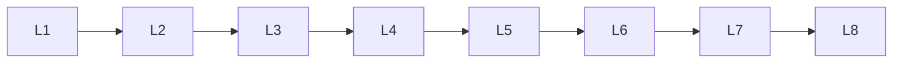

# Tokenization

> Deep lessons for **Tokenization** in the Large Language Models handbook.

## Lessons

| # | Lesson |
|---|--------|
| 1 | [Tokenization](01-tokenization.md) |
| 2 | [Subword Tokenization](02-subword-tokenization.md) |
| 3 | [BPE](03-bpe.md) |
| 4 | [WordPiece](04-wordpiece.md) |
| 5 | [SentencePiece](05-sentencepiece.md) |
| 6 | [Token Vocabulary](06-token-vocabulary.md) |
| 7 | [Special Tokens](07-special-tokens.md) |
| 8 | [Token Embeddings](08-token-embeddings.md) |

**Topic hub:** [../README.md](../README.md)
