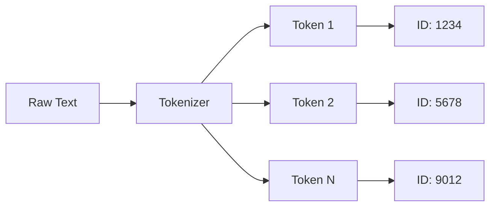
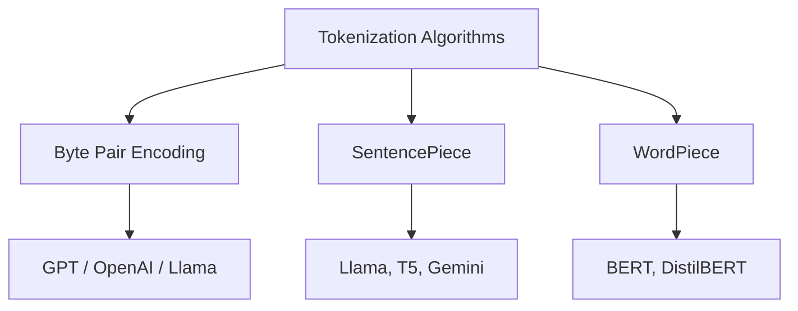
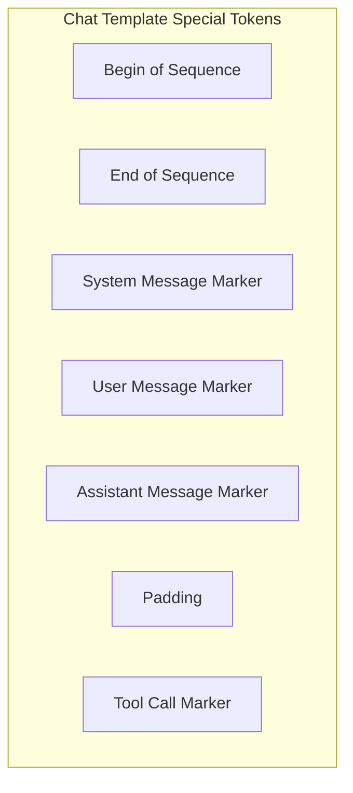
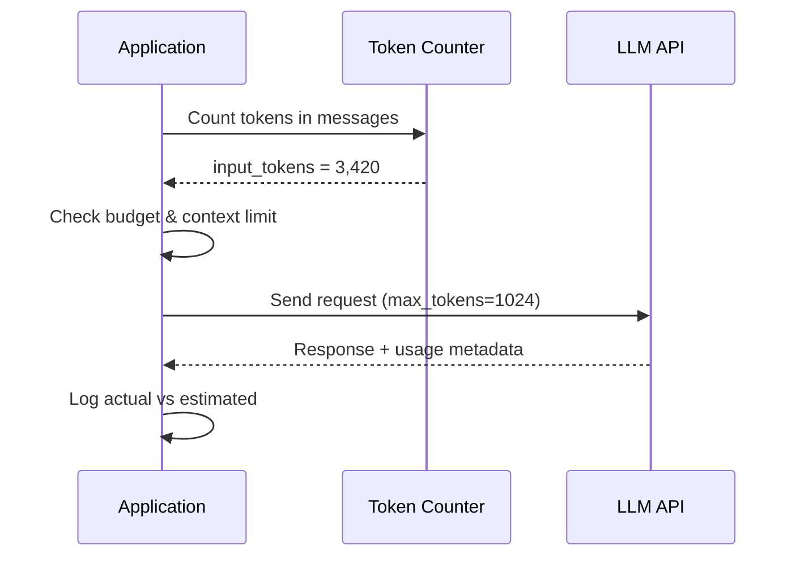
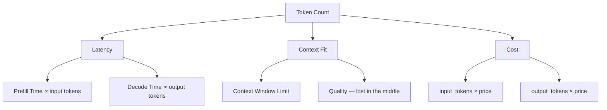

# Tokens and Tokenization

> Tokens are the atomic unit of LLM billing, latency, and context limits — mastering tokenization is non-negotiable for production LLM engineering.

## Table of Contents

- [Overview](#overview)
- [What Is a Token?](#what-is-a-token)
- [Why Tokenization Exists](#why-tokenization-exists)
- [Tokenization Algorithms](#tokenization-algorithms)
- [Byte Pair Encoding (BPE)](#byte-pair-encoding-bpe)
- [SentencePiece](#sentencepiece)
- [WordPiece](#wordpiece)
- [Tokenizer Comparison](#tokenizer-comparison)
- [Special Tokens](#special-tokens)
- [Token Limits and Context Windows](#token-limits-and-context-windows)
- [Counting Tokens](#counting-tokens)
- [Cost Calculation](#cost-calculation)
- [Stop Sequences](#stop-sequences)
- [Provider Examples](#provider-examples)
- [Impact on Latency, Context, and Pricing](#impact-on-latency-context-and-pricing)
- [Why It Matters](#why-it-matters)
- [Production Considerations](#production-considerations)
- [Performance Considerations](#performance-considerations)
- [Cost Considerations](#cost-considerations)
- [Security Considerations](#security-considerations)
- [Best Practices](#best-practices)
- [Common Mistakes](#common-mistakes)
- [Python Examples](#python-examples)
- [Interview Preparation](#interview-preparation)
- [Navigation](#navigation)

---

## Overview

Every LLM API call is measured in **tokens**, not characters or words. Tokenization determines how your text is split, how much you pay, whether you fit in the context window, and how fast the model responds.

This document covers the algorithms (BPE, SentencePiece, WordPiece), practical counting and cost math, special tokens, stop sequences, and provider-specific behavior.

> **Prerequisites:** [Introduction to LLM Engineering](introduction-to-llm-engineering.md) · [How LLMs Work](how-llms-work.md) · [Phase 3 Backend Engineering](../backend-engineering/README.md)

---

## What Is a Token?

A **token** is the smallest unit of text a language model processes. It may be a whole word, a subword fragment, a punctuation mark, or even a single byte.

```
"unbelievable" → ["un", "believ", "able"]     # 3 tokens
"Hello!"       → ["Hello", "!"]               # 2 tokens
"def foo():"    → ["def", " foo", "():", "\n"]  # varies by tokenizer
```

### Tokens vs Words vs Characters

| Unit | Example: "internationalization" | Count |
|------|--------------------------------|-------|
| Characters | i-n-t-e-r-n-a-t-i-o-n-a-l-i-z-a-t-i-o-n | 20 |
| Words | internationalization | 1 |
| **Tokens (GPT-4)** | international, ization | 2 |
| **Tokens (aggressive BPE)** | inter, national, ization | 3 |

**Rule of thumb for English:** 1 token ≈ 4 characters ≈ 0.75 words. This varies by language and content type.



---

## Why Tokenization Exists

Language models operate on fixed-size vocabularies (32K–200K entries). Tokenization bridges unlimited natural language and finite vocabulary.

| Challenge | Tokenization Solution |
|-----------|----------------------|
| Infinite possible words | Split rare words into known subwords |
| Multiple languages | Byte-level fallback handles any Unicode |
| Code and symbols | Frequent patterns become single tokens |
| Consistent input size | Predictable sequence lengths for batching |
| Out-of-vocabulary words | Subword units compose unseen words |

Without subword tokenization, every new word (names, typos, neologisms) would be an unknown token. BPE and friends solve this by building words from pieces.

---

## Tokenization Algorithms



| Algorithm | Training Approach | Used By |
|-----------|------------------|---------|
| **BPE** | Merge most frequent byte pairs iteratively | GPT-2/3/4, Llama, Claude (similar) |
| **SentencePiece** | Unigram or BPE on raw text (no pre-split) | Llama, T5, Gemini, multilingual models |
| **WordPiece** | Merge pairs maximizing likelihood | BERT, DistilBERT (encoder models) |

---

## Byte Pair Encoding (BPE)

BPE is the dominant algorithm for decoder-only LLMs. It starts with individual bytes and iteratively merges the most frequent adjacent pairs.

### Training Process (Simplified)

1. Start with individual bytes as the vocabulary.
2. Count all adjacent byte pairs in the training corpus.
3. Merge the most frequent pair into a new token.
4. Repeat until vocabulary reaches target size (e.g., 100,256).

### Example Merge Sequence

```
Initial:  ['l', 'o', 'w']  ['l', 'o', 'w', 'e', 'r']  ['n', 'e', 'w', 'e', 's', 't']

Merge 'e'+'s' → 'es':
          ['l', 'o', 'w']  ['l', 'o', 'w', 'e', 'r']  ['n', 'e', 'w', 'es', 't']

Merge 'es'+'t' → 'est':
          ['l', 'o', 'w']  ['l', 'o', 'w', 'e', 'r']  ['n', 'e', 'w', 'est']

Merge 'l'+'o' → 'lo':
          ['lo', 'w']  ['lo', 'w', 'e', 'r']  ['n', 'e', 'w', 'est']
```

### Encoding (Inference)

Greedy longest-match: scan text left-to-right, match longest known token at each position.

```python
# Conceptual BPE encoding
text = "lowest"
# Vocabulary contains: "lo", "w", "e", "est", "low", ...
# Result: ["low", "est"] → 2 tokens
```

### OpenAI Tokenizers

| Encoding | Models | Vocab Size |
|----------|--------|------------|
| `cl100k_base` | GPT-4, GPT-3.5-turbo, text-embedding-3 | 100,256 |
| `o200k_base` | GPT-4o, GPT-4o-mini | 200,000+ |
| `p50k_base` | Codex, text-davinci-003 (legacy) | 50,257 |

---

## SentencePiece

SentencePiece (Google) tokenizes raw text directly — no pre-tokenization by whitespace. This handles languages without clear word boundaries (Japanese, Chinese, Thai).

### Key Properties

| Property | Benefit |
|----------|---------|
| Language-agnostic | Works on any Unicode text |
| Reversible | Can decode tokens back to exact original text |
| Subword regularization | Optional sampling during training for robustness |
| Whitespace handling | Space attached to next token (like BPE `\u0120`) |

### Llama Tokenizer

Llama models use SentencePiece with a vocab of 128,256 tokens. Special tokens (`<|begin_of_text|>`, `<|eot_id|>`) are part of the vocabulary.

```
<|begin_of_text|>Hello world<|eot_id|>
```

---

## WordPiece

WordPiece (used by BERT) is similar to BPE but selects merges based on **likelihood** of the training data, not just frequency.

| Aspect | BPE | WordPiece |
|--------|-----|-----------|
| Merge criterion | Most frequent pair | Highest likelihood increase |
| Continuation marker | None | `##` prefix (e.g., `play`, `##ing`) |
| Primary use | Generation (GPT) | Understanding (BERT) |

For production LLM engineering, you will primarily encounter BPE and SentencePiece. WordPiece matters for [embedding models](../embeddings/README.md) used in RAG retrieval.

---

## Tokenizer Comparison

| Feature | GPT (BPE) | Llama (SentencePiece) | Claude |
|---------|-----------|----------------------|--------|
| Vocab size | ~100K–200K | 128,256 | Proprietary |
| Space handling | Leading space on word tokens | Similar | Similar |
| Code efficiency | Good (frequent patterns merged) | Good | Good |
| Multilingual | Moderate | Strong | Strong |
| Counting library | `tiktoken` | `transformers` tokenizer | API / approximation |

> **Critical rule:** Never assume tokens are interchangeable across models. The same text produces different token counts on GPT-4 vs Llama vs Claude.

### Cross-Model Token Count Example

| Text | GPT-4o (approx.) | Llama 3 (approx.) |
|------|-----------------|-------------------|
| `"Hello, world!"` | 4 | 4 |
| `"The quick brown fox"` | 4 | 5 |
| Python function (20 lines) | 150–250 | 160–270 |
| JSON API response (1KB) | 200–350 | 210–380 |

Always count with the tokenizer for the model you are calling.

---

## Special Tokens

Special tokens are reserved IDs with semantic meaning beyond regular text.



### Common Special Tokens

| Token | Purpose | Example |
|-------|---------|---------|
| `<\|endoftext\|>` | End of sequence (GPT) | Stops generation |
| `<\|im_start\|>`, `<\|im_end\|>` | Message boundaries (ChatML) | Role formatting |
| `<\|begin_of_text\|>` | Sequence start (Llama 3) | Prompt prefix |
| `<\|eot_id\|>` | End of turn (Llama 3) | Turn boundary |
| `[INST]`, `[/INST]` | Instruction markers (Llama 2) | User/assistant separation |
| `<\|python_tag\|>` | Tool/function markers | Agent tool calling |

### Why Special Tokens Matter

1. **They count toward your token budget** — Chat templates add 10–50+ hidden tokens per request.
2. **They control generation** — EOS token stops autoregressive loop.
3. **They structure multi-turn** — Incorrect formatting degrades quality.
4. **They enable tool use** — Models trained to emit specific tokens for function calls.

---

## Token Limits and Context Windows

Every model has a maximum context window measured in tokens.

| Model | Context Window | Input + Output Shared? |
|-------|---------------|----------------------|
| GPT-4o | 128K | Yes — total must fit |
| GPT-4o-mini | 128K | Yes |
| Claude 3.5 Sonnet | 200K | Yes |
| Llama 3.1 8B | 128K | Yes |
| Gemini 1.5 Pro | 1M+ | Yes |

```
available_for_output = context_window - input_tokens
```

If input = 127,000 tokens on a 128K model, you have only 1,024 tokens for output.

See [Context Windows](context-windows.md) for management strategies.

---

## Counting Tokens

Accurate token counting before API calls prevents failures and enables budget enforcement.

### Methods

| Method | Accuracy | When to Use |
|--------|----------|-------------|
| Provider tokenizer (`tiktoken`) | Exact for OpenAI | Pre-flight checks, cost estimation |
| HuggingFace tokenizer | Exact for open models | Self-hosted Llama/Mistral |
| Provider API (tokenize endpoint) | Exact | Anthropic, some providers |
| Character heuristic (÷4) | Approximate | Quick estimates only |
| API response `usage` field | Exact (post-call) | Billing reconciliation |

### Pre-Flight vs Post-Call



---

## Cost Calculation

LLM pricing is per-token, with separate rates for input and output.

### Formula

```
total_cost = (input_tokens × input_price_per_1M) / 1_000_000
           + (output_tokens × output_price_per_1M) / 1_000_000
```

### Example: GPT-4o-mini (Illustrative Pricing)

| Component | Tokens | Rate ($/1M) | Cost |
|-----------|--------|-------------|------|
| Input (system + history + user) | 3,500 | $0.15 | $0.000525 |
| Output (assistant reply) | 450 | $0.60 | $0.000270 |
| **Total per request** | 3,950 | — | **$0.000795** |

At 100,000 requests/day: **~$79.50/day** or **~$2,385/month**.

### Cost Estimation Table

| Daily Requests | Avg Input Tokens | Avg Output Tokens | Model | Est. Monthly Cost |
|---------------|-----------------|-------------------|-------|-------------------|
| 1,000 | 2,000 | 500 | GPT-4o-mini | ~$24 |
| 10,000 | 2,000 | 500 | GPT-4o-mini | ~$240 |
| 1,000 | 5,000 | 2,000 | GPT-4o | ~$450 |
| 100,000 | 1,000 | 300 | GPT-4o-mini | ~$1,350 |

### Hidden Token Costs

| Source | Extra Tokens | Mitigation |
|--------|-------------|------------|
| Chat template formatting | 10–50 per request | Prompt caching (where available) |
| Tool definitions in system prompt | 100–2,000+ | Minimize tool schemas |
| RAG chunks | 500–8,000+ | Relevance filtering, top-k limits |
| Conversation history | Grows linearly | Summarization, sliding window |
| Retry on failure | Full re-count | Smart retry, idempotency |

---

## Stop Sequences

**Stop sequences** are strings or tokens that halt autoregressive generation when encountered.

### Use Cases

| Use Case | Stop Sequence | Why |
|----------|--------------|-----|
| Prevent role confusion | `"\n\nUser:"` | Stop before model generates fake user message |
| Agent tool loops | `"</tool_call>"` | End after tool invocation |
| JSON extraction | `"}\n\n"` | Stop after JSON object (careful with nesting) |
| Code blocks | `"```\n\n"` | Stop after code fence |
| Multi-turn simulation | `"Human:"`, `"Assistant:"` | Prevent runaway dialog |

### Stop Sequences vs max_tokens

| Mechanism | Behavior |
|-----------|----------|
| `max_tokens` | Hard cap on output token count |
| `stop` | Soft stop when sequence appears (may not include stop string in output) |
| EOS token | Model-generated end-of-sequence |

Use both: `max_tokens` as safety net, `stop` for semantic boundaries.

---

## Provider Examples

### OpenAI (tiktoken)

```python
import tiktoken

enc = tiktoken.encoding_for_model("gpt-4o-mini")
text = "Hello, how many tokens am I?"
tokens = enc.encode(text)
print(f"Token count: {len(tokens)}")
print(f"Token IDs: {tokens}")
print(f"Decoded: {[enc.decode([t]) for t in tokens]}")
```

### OpenAI Chat Messages

```python
import tiktoken

def count_message_tokens(messages: list[dict], model: str = "gpt-4o-mini") -> int:
    enc = tiktoken.encoding_for_model(model)
    tokens_per_message = 3  # every message has overhead
    tokens_per_name = 1
    total = 0
    for message in messages:
        total += tokens_per_message
        for key, value in message.items():
            total += len(enc.encode(str(value)))
            if key == "name":
                total += tokens_per_name
    total += 3  # every reply is primed with assistant start
    return total
```

### Anthropic

```python
# Anthropic provides a token counting API
import anthropic

client = anthropic.Anthropic()

count = client.messages.count_tokens(
    model="claude-sonnet-4-20250514",
    messages=[{"role": "user", "content": "Hello, Claude!"}],
)
print(f"Input tokens: {count.input_tokens}")
```

### HuggingFace (Llama / Open Models)

```python
from transformers import AutoTokenizer

tokenizer = AutoTokenizer.from_pretrained("meta-llama/Meta-Llama-3-8B-Instruct")
text = "Explain tokenization briefly."
tokens = tokenizer.encode(text)
print(f"Token count: {len(tokens)}")
```

---

## Impact on Latency, Context, and Pricing



### Latency Impact

| Token Category | Latency Effect |
|---------------|---------------|
| Input tokens | Linear prefill time — more tokens = slower TTFT |
| Output tokens | Linear decode time — each token adds ~20–80ms |
| Special/formatting tokens | Same as regular — still processed |

### Context Impact

| Scenario | Token Impact |
|----------|-------------|
| 50-turn conversation | History may exceed window — truncation needed |
| RAG with 10 chunks × 500 tokens | 5,000 tokens before user question |
| Large system prompt (tools + instructions) | 2,000–5,000 tokens fixed overhead |
| Code files in context | Code tokenizes less efficiently than prose |

### Pricing Impact

| Optimization | Token Savings | Savings Type |
|-------------|--------------|--------------|
| Shorter system prompt | 100–1,000 per request | Input |
| History summarization | 500–10,000 per request | Input |
| Cheaper model for routing | N/A | Per-token rate |
| Lower max_tokens | 50–2,000 per response | Output |
| Response caching | 100% on cache hit | Both |

---

## Why It Matters

Token ignorance is the single most common source of LLM production failures.

| Without Token Awareness | Consequence |
|------------------------|-------------|
| No pre-flight counting | 400 errors when context exceeded |
| Character-based limits | Wrong — 8K chars ≠ 8K tokens |
| Ignoring chat template overhead | Surprise context overflow |
| No cost tracking | Budget blowout |
| Wrong tokenizer for model | Inaccurate estimates |
| No stop sequences | Runaway generation, 10× expected cost |

---

## Production Considerations

| Area | Practice |
|------|----------|
| **Pre-flight validation** | Count tokens before every LLM call |
| **Budget enforcement** | Per-user/per-request token limits |
| **Tokenizer per model** | Map model → tokenizer in config |
| **Usage logging** | Log estimated vs actual tokens |
| **Alerting** | Alert when daily token spend exceeds threshold |
| **max_tokens defaults** | Set per endpoint, not globally |
| **Stop sequences** | Define per use case in config |

```python
from pydantic_settings import BaseSettings


class TokenBudgetSettings(BaseSettings):
    max_input_tokens: int = 120_000
    max_output_tokens: int = 4_096
    daily_user_token_limit: int = 500_000
    alert_daily_spend_usd: float = 100.0

    model_config = {"env_prefix": "TOKEN_"}
```

---

## Performance Considerations

| Technique | Performance Benefit |
|-----------|-------------------|
| Count tokens before call | Avoid wasted API round-trip on overflow |
| Trim input to budget | Faster prefill |
| Limit output tokens | Faster total response |
| Cache token counts for static prompts | Skip re-counting system prompt |
| Batch count for bulk operations | Amortize tokenizer overhead |

Token counting with `tiktoken` is fast (~1ms for typical prompts). The cost of not counting is far higher than the cost of counting.

---

## Cost Considerations

| Strategy | Implementation |
|----------|---------------|
| **Model routing** | Simple queries → cheap model (fewer $/token) |
| **Prompt compression** | Remove redundant instructions |
| **History summarization** | Replace 20 turns with 1 summary |
| **RAG top-k tuning** | Fewer chunks = fewer input tokens |
| **Output length control** | Tight `max_tokens`, concise system prompt |
| **Caching** | OpenAI prompt caching for repeated prefixes |
| **Batch API** | 50% discount for non-real-time workloads |

---

## Security Considerations

| Risk | Token-Related Vector | Mitigation |
|------|---------------------|------------|
| Token smuggling | Hidden Unicode chars inflate or alter tokenization | Normalize input (NFKC) |
| Prompt injection via tokens | Special token strings in user input | Sanitize user content |
| Cost DoS | Attacker sends max-size prompts | Per-request token limits, rate limiting |
| Data leakage in logs | Full prompts logged with PII | Log token counts, not content |
| Encoding attacks | Adversarial byte sequences | Validate UTF-8, reject malformed input |

---

## Best Practices

1. **Always count with the correct tokenizer** — Never use character heuristics for enforcement.
2. **Budget input and output separately** — They have different prices and limits.
3. **Account for chat template overhead** — Add 3–5 tokens per message plus formatting.
4. **Set `max_tokens` per endpoint** — Classification: 50–100. Chat: 1024–4096. Long-form: 4096+.
5. **Use stop sequences for agents** — Prevent infinite generation loops.
6. **Log token usage on every call** — `input_tokens`, `output_tokens`, `model`, `request_id`.
7. **Monitor token trends** — Alert on anomalies (sudden 3× increase = bug or attack).
8. **Test tokenization of your domain** — Code, JSON, and medical text tokenize differently.
9. **Reserve headroom** — Target 90% of context window, not 100%.
10. **Re-count after prompt changes** — Template edits can add hundreds of tokens.

---

## Common Mistakes

| Mistake | Impact | Fix |
|---------|--------|-----|
| Using `len(text)` as token count | Wrong budget, context overflow | Use `tiktoken` or provider counter |
| Same token count across models | Wrong estimates | Model-specific tokenizer |
| Ignoring special tokens in count | Unexpected overflow | Count full formatted messages |
| No `max_tokens` set | Unbounded cost | Always set explicit limit |
| `max_tokens` too low for JSON | Truncated, unparseable output | Test minimum needed tokens |
| Not checking `finish_reason` | Miss truncated responses | Handle `length` finish reason |
| Giant system prompt | High fixed cost per request | Audit and compress system prompt |
| Counting tokens after the call only | Failed requests waste time | Pre-flight count |
| Stop sequence too broad | Premature generation stop | Test stop sequences carefully |
| Not normalizing Unicode input | Inconsistent tokenization | NFKC normalization |

---

## Python Examples

### Production Token Budget Manager

```python
from dataclasses import dataclass
import tiktoken


@dataclass
class TokenBudget:
    context_window: int
    max_output_tokens: int
    reserved_for_output: int = 0

    @property
    def max_input_tokens(self) -> int:
        return self.context_window - self.max_output_tokens


class TokenBudgetManager:
    def __init__(self, model: str, max_output_tokens: int = 4096):
        self._enc = tiktoken.encoding_for_model(model)
        self._budget = TokenBudget(
            context_window=128_000,
            max_output_tokens=max_output_tokens,
        )

    def count(self, text: str) -> int:
        return len(self._enc.encode(text))

    def count_messages(self, messages: list[dict]) -> int:
        total = 3  # reply priming
        for msg in messages:
            total += 3  # message overhead
            for value in msg.values():
                total += self.count(str(value))
        return total

    def fits(self, messages: list[dict]) -> bool:
        return self.count_messages(messages) <= self._budget.max_input_tokens

    def truncate_to_fit(self, messages: list[dict]) -> list[dict]:
        if self.fits(messages):
            return messages
        system = [m for m in messages if m["role"] == "system"]
        rest = [m for m in messages if m["role"] != "system"]
        while rest and not self.fits(system + rest):
            rest.pop(0)  # remove oldest non-system message
        return system + rest
```

### Cost Calculator

```python
from dataclasses import dataclass


@dataclass
class ModelPricing:
    input_per_1m: float
    output_per_1m: float


PRICING: dict[str, ModelPricing] = {
    "gpt-4o-mini": ModelPricing(input_per_1m=0.15, output_per_1m=0.60),
    "gpt-4o": ModelPricing(input_per_1m=2.50, output_per_1m=10.00),
}


def estimate_cost(
    model: str,
    input_tokens: int,
    output_tokens: int,
) -> float:
    pricing = PRICING[model]
    input_cost = (input_tokens / 1_000_000) * pricing.input_per_1m
    output_cost = (output_tokens / 1_000_000) * pricing.output_per_1m
    return input_cost + output_cost


def project_monthly_cost(
    model: str,
    daily_requests: int,
    avg_input: int,
    avg_output: int,
) -> float:
    per_request = estimate_cost(model, avg_input, avg_output)
    return per_request * daily_requests * 30
```

### Stop Sequence Configuration

```python
from dataclasses import dataclass, field


@dataclass
class GenerationConfig:
    max_tokens: int = 1024
    temperature: float = 0.7
    stop_sequences: list[str] = field(default_factory=list)


STOP_PROFILES: dict[str, GenerationConfig] = {
    "chat": GenerationConfig(
        max_tokens=2048,
        stop_sequences=["\n\nUser:", "\n\nHuman:"],
    ),
    "json_extraction": GenerationConfig(
        max_tokens=500,
        temperature=0.0,
        stop_sequences=[],
    ),
    "agent_tool": GenerationConfig(
        max_tokens=1024,
        stop_sequences=["</tool_call>", "<|endoftext|>"],
    ),
}
```

### Usage Tracking Middleware

```python
import logging
import time
from dataclasses import dataclass

logger = logging.getLogger("llm.usage")


@dataclass
class UsageRecord:
    request_id: str
    model: str
    input_tokens: int
    output_tokens: int
    latency_ms: float
    estimated_cost_usd: float


def log_usage(record: UsageRecord) -> None:
    logger.info(
        "llm_call_completed",
        extra={
            "request_id": record.request_id,
            "model": record.model,
            "input_tokens": record.input_tokens,
            "output_tokens": record.output_tokens,
            "total_tokens": record.input_tokens + record.output_tokens,
            "latency_ms": record.latency_ms,
            "estimated_cost_usd": record.estimated_cost_usd,
        },
    )
```

---

## Interview Preparation

### Frequently Asked Questions

**Q1: What is a token and how does it differ from a word?**

> **Strong answer:** A token is the atomic unit an LLM processes — a subword, word, or character fragment mapped to an integer ID. Words can be one or multiple tokens. English averages ~0.75 words per token. Code and non-English text have different ratios.

**Q2: Explain BPE tokenization.**

> **Strong answer:** Byte Pair Encoding starts with bytes, iteratively merges the most frequent adjacent pairs into new vocabulary entries until reaching target vocab size. At inference, text is split using greedy longest-match against the learned vocabulary. Used by GPT and most decoder models.

**Q3: How do you estimate LLM API cost?**

> **Strong answer:** Count input and output tokens with the model-specific tokenizer. Multiply by per-million-token rates (input and output priced separately). Factor in hidden costs: chat template tokens, tool definitions, RAG chunks, and conversation history. Project: daily_requests × per_request_cost × 30.

**Q4: Why does the same text produce different token counts on different models?**

> **Strong answer:** Each model has its own tokenizer with different vocabulary and merge rules. BPE vs SentencePiece, different vocab sizes, and different training corpora all affect how text is split. Always use the target model's tokenizer.

**Q5: What are stop sequences and when do you use them?**

> **Strong answer:** Stop sequences halt generation when the model outputs a matching string. Use them to prevent role confusion in agents, end tool call loops, and bound output semantically. Always combine with max_tokens as a hard safety cap.

### Real-World Scenario

**Scenario:** Your API returns 400 errors for long conversations but short ones work fine.

> **Discussion points:** Context window exceeded. Count total tokens (system + history + user + reserved output). Implement pre-flight counting. Add history truncation (sliding window or summarization). Reserve output token headroom. Log token counts to identify growth pattern.

---

## Navigation

### Prerequisites

- [Introduction to LLM Engineering](introduction-to-llm-engineering.md)
- [How LLMs Work](how-llms-work.md)
- [Phase 3 Backend Engineering](../backend-engineering/README.md)

### Phase 4 — LLM Engineering

| # | Topic | Document |
|---|-------|----------|
| 1 | Introduction to LLM Engineering | [introduction-to-llm-engineering.md](introduction-to-llm-engineering.md) |
| 2 | How LLMs Work | [how-llms-work.md](how-llms-work.md) |
| 3 | Tokens and Tokenization | **You are here** |
| 4 | Context Windows | [context-windows.md](context-windows.md) |

### Related Topics

- [Context Windows](context-windows.md) — managing token budgets across conversation history
- [Embeddings](../embeddings/README.md) — embedding model tokenization for RAG
- [HTTP Clients for AI Backends](../backend-engineering/http-clients-for-ai-backends.md) — API integration

### Next Topics

- [Context Windows](context-windows.md) — truncation, sliding windows, compression

---

## See Also

- [OpenAI Tokenizer](https://platform.openai.com/tokenizer)
- [tiktoken Documentation](https://github.com/openai/tiktoken)
- [SentencePiece GitHub](https://github.com/google/sentencepiece)

## Changelog

| Version | Date | Changes |
|---------|------|---------|
| 1.0 | 2026-07-13 | Initial Phase 4 Section 3 release |
