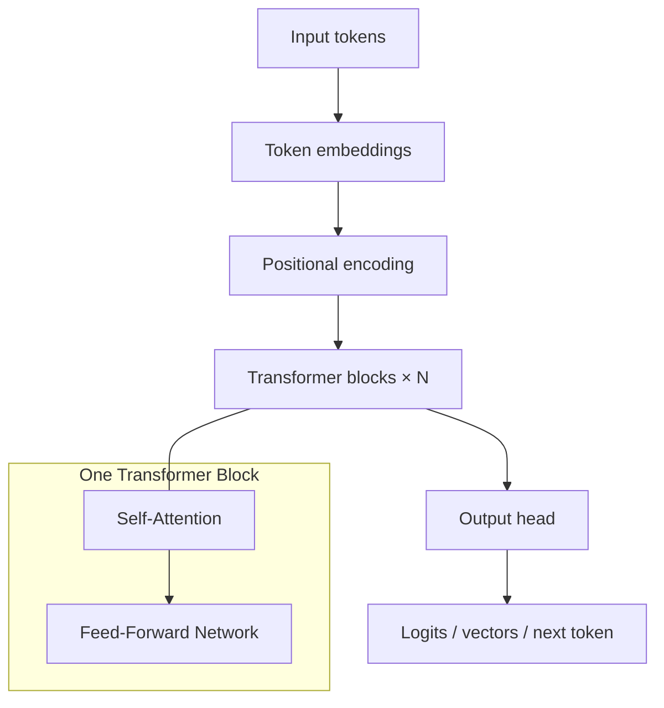
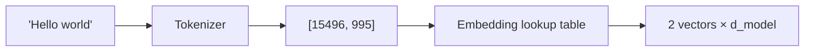
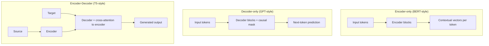
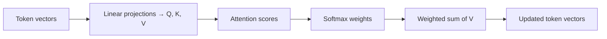
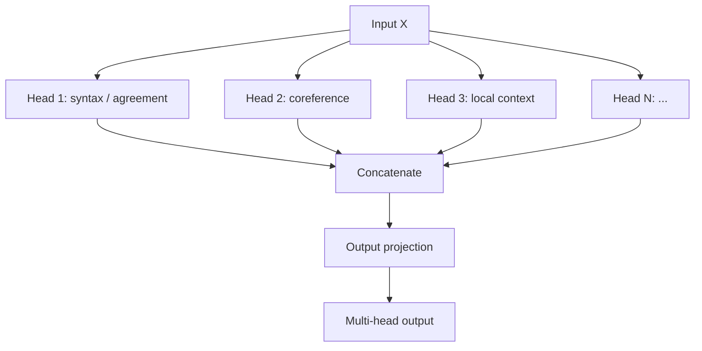
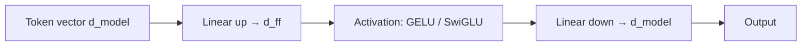
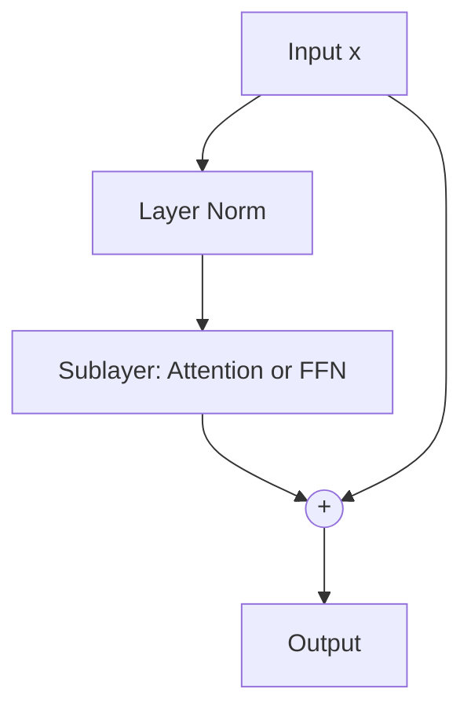
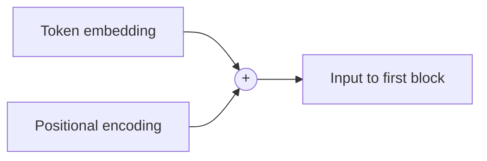
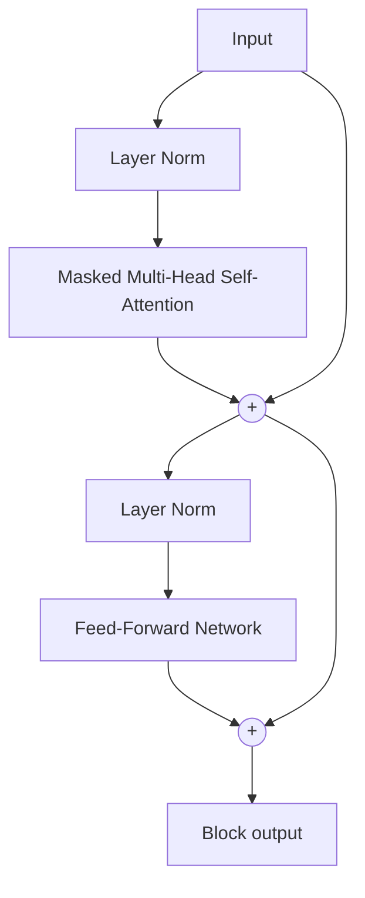
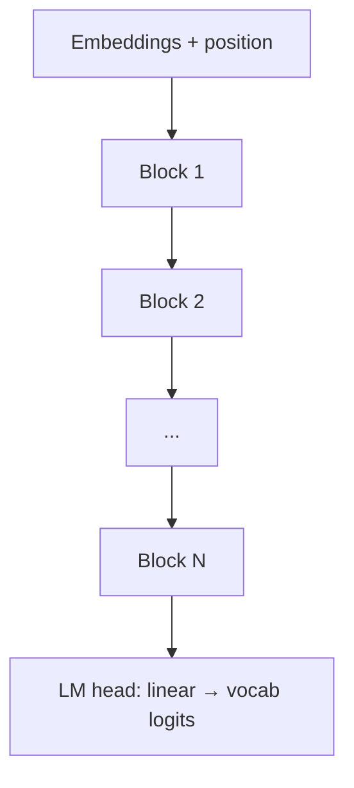

# Transformer Intuition for Engineers

> **Section 6 of this handbook: LLM Fundamentals.** You do not need to implement a transformer from scratch to ship production AI systems — but you do need a mental model of how tokens flow through layers, why attention exists, and what encoder vs decoder means when you choose models and APIs.

## Table of Contents

- [Why Engineers Need Transformer Intuition](#why-engineers-need-transformer-intuition)
- [The Big Picture](#the-big-picture)
- [Tokenization and Embeddings (Recap)](#tokenization-and-embeddings-recap)
- [Encoder vs Decoder vs Encoder-Decoder](#encoder-vs-decoder-vs-encoder-decoder)
- [Self-Attention in One Paragraph](#self-attention-in-one-paragraph)
- [Multi-Head Attention](#multi-head-attention)
- [Feed-Forward Network (FFN)](#feed-forward-network-ffn)
- [Residual Connections](#residual-connections)
- [Layer Normalization](#layer-normalization)
- [Positional Information](#positional-information)
- [A Single Transformer Block](#a-single-transformer-block)
- [Stacking Blocks into a Model](#stacking-blocks-into-a-model)
- [Engineering Implications](#engineering-implications)
- [Model Families and Architectures](#model-families-and-architectures)
- [Common Mistakes](#common-mistakes)
- [Interview Preparation](#interview-preparation)
- [Navigation](#navigation)

---

## Why Engineers Need Transformer Intuition

When you call an LLM API, you are invoking a **stack of transformer blocks** trained on internet-scale text. Understanding the architecture helps you:

| Engineering Decision | Transformer Concept Involved |
|---------------------|------------------------------|
| Why context has a limit | Attention is O(n²) in sequence length |
| Encoder vs decoder APIs | Different block types, different tasks |
| Why embeddings work | Encoder produces dense representations |
| Why generation is slow | Autoregressive decoding through decoder blocks |
| Why long prompts cost more | Prefill runs full attention over all tokens |
| Model selection | Architecture family affects tool use, coding, reasoning |

> **Production Standard:** You are not training transformers — you are **integrating** them. Focus on data flow, bottlenecks, and failure modes, not backpropagation derivations.

---

## The Big Picture

The transformer (Vaswani et al., 2017) replaced recurrence with **attention** — letting every token directly interact with every other token in parallel.

**Core idea:** Each layer refines token representations by (1) attending to other tokens and (2) applying a non-linear transformation.

---

## Tokenization and Embeddings (Recap)

Before transformer layers run, raw text becomes integers (token IDs), then dense vectors.

| Stage | Output | Engineering Note |
|-------|--------|-----------------|
| Tokenization | List of token IDs | Vocabulary is model-specific; affects cost |
| Embedding lookup | Matrix of shape `[seq_len, d_model]` | `d_model` is hidden dimension (e.g., 4096) |
| Positional info | Added or injected | See [Positional Information](#positional-information) |

See [How LLMs Work](how-llms-work.md) for tokenization and context window details. See [Embeddings — LLM Perspective](embeddings-llm-perspective.md) for how encoder outputs become retrieval vectors.

---

## Encoder vs Decoder vs Encoder-Decoder

Different transformer configurations serve different tasks.

| Architecture | Attention Pattern | Primary Use | Example Models |
|-------------|------------------|-------------|----------------|
| **Encoder-only** | Bidirectional — every token sees all tokens | Classification, embeddings, NER | BERT, RoBERTa, embedding models |
| **Decoder-only** | Causal — token sees only past tokens | Text generation, chat, code | GPT-4, Claude, Llama |
| **Encoder-decoder** | Encoder bidirectional; decoder cross-attends to encoder | Translation, summarization | T5, BART, early translation models |

### What AI Engineers Mostly Use

| API / Product | Underlying Architecture |
|--------------|------------------------|
| Chat completions (GPT, Claude, Llama) | Decoder-only |
| Embedding APIs | Encoder-only (or encoder slice) |
| Some summarization endpoints | Encoder-decoder or long-context decoder |

> **Key insight:** Your chat LLM is almost certainly **decoder-only**. It generates left-to-right, one token at a time, with a causal mask preventing it from "seeing the future."

---

## Self-Attention in One Paragraph

**Self-attention** lets each token build a new representation by taking a weighted sum of all other tokens' representations. Weights come from compatibility scores between **Query**, **Key**, and **Value** projections (covered in depth in [Attention Mechanism](attention-mechanism.md)).

**Why it matters:** A pronoun can directly attend to its antecedent 500 tokens earlier — something recurrent networks struggled with.

**Cost:** For sequence length `n`, attention computes an `n × n` score matrix per head per layer. This is the root of context-length and prefill cost.

---

## Multi-Head Attention

Instead of one attention operation, transformers run **multiple heads in parallel** — each learning different relationship patterns.

| Concept | Engineering Intuition |
|---------|----------------------|
| `num_heads` | Parallel attention patterns (e.g., 32 heads) |
| `head_dim` | `d_model / num_heads` — dimension per head |
| Concatenation | Heads recombined to full `d_model` width |
| Output projection | Mixes head outputs back into unified representation |

You rarely tune head count — it is fixed per model. But knowing heads exist explains why transformers capture diverse linguistic relations without explicit parsing.

---

## Feed-Forward Network (FFN)

After attention, each token passes through the same **position-wise feed-forward network** — typically two linear layers with a non-linearity in between.

| Parameter | Typical Value | Note |
|-----------|--------------|------|
| `d_model` | 2048–8192 | Hidden dimension |
| `d_ff` | 4 × d_model (varies) | FFN inner dimension — often the largest parameter block |
| Activation | GELU, SwiGLU | Modern LLMs favor SwiGLU variants |

**Intuition:** Attention mixes information *between* tokens. FFN transforms each token's representation *independently* — adding capacity for memorization and non-linear feature extraction.

**Engineering impact:** FFN layers dominate parameter count. Inference optimizations (quantization, MoE) often target FFN computations.

---

## Residual Connections

Each sub-layer (attention, FFN) uses a **residual** (skip) connection:

\[
\text{output} = \text{LayerNorm}(x + \text{Sublayer}(x))
\]

or in **Pre-LN** variants (common in modern LLMs):

\[
\text{output} = x + \text{Sublayer}(\text{LayerNorm}(x))
\]

| Benefit | Explanation |
|---------|-------------|
| Gradient flow | Enables training very deep stacks (80+ layers) |
| Identity path | Layer can learn small refinements, not full remapping |
| Stability | Reduces vanishing gradient problems |

For inference, residuals mean each block *refines* representations incrementally — generation quality emerges from depth.

---

## Layer Normalization

**Layer normalization** stabilizes activations by normalizing across the feature dimension for each token.

| Aspect | Detail |
|--------|--------|
| What is normalized | Features within a single token vector |
| Learnable params | Scale (γ) and shift (β) per feature |
| Placement | Pre-LN (before sublayer) or Post-LN (after residual) — modern LLMs prefer Pre-LN |

You do not configure layer norm at API level — but it is why transformers train stably at scale and why exported model weights include norm parameters.

---

## Positional Information

Attention alone is **permutation-invariant** — it has no inherent sense of token order. Transformers inject position information explicitly.

### Common Approaches

| Method | How It Works | Used In |
|--------|-------------|---------|
| Sinusoidal | Fixed sin/cos functions of position | Original Transformer |
| Learned absolute | Trainable embedding per position index | Early GPT, BERT |
| **RoPE** (Rotary) | Rotate Q/K by position-dependent angles | Llama, Mistral, many modern LLMs |
| **ALiBi** | Add linear bias to attention scores by distance | Some long-context models |

### Engineering Implications

| Topic | Impact |
|-------|--------|
| Context extension | RoPE scaling (NTK, YaRN) lets models exceed training length — with quality tradeoffs |
| Position sensitivity | Models may degrade on very long contexts even within window |
| Prompt structure | Order of examples in few-shot prompts matters — positions are encoded |

---

## A Single Transformer Block

Putting it together — a standard **decoder block** (simplified):

**Encoder block** omits the causal mask. **Encoder-decoder** adds a cross-attention sublayer between self-attention and FFN (decoder attends to encoder outputs).

| Sub-layer | Purpose |
|-----------|---------|
| Masked self-attention | Mix prior tokens only (decoder) |
| Cross-attention | Decoder queries encoder memory (seq2seq) |
| FFN | Per-token non-linear transform |

---

## Stacking Blocks into a Model

Production LLMs stack dozens of identical (or MoE-variant) blocks.

| Hyperparameter | Example (Llama 3 8B) | Effect |
|---------------|---------------------|--------|
| `num_layers` | 32 | Depth — more reasoning capacity |
| `d_model` | 4096 | Width of representations |
| `num_heads` | 32 | Parallel attention patterns |
| `vocab_size` | 128k | Token vocabulary size |
| `context_length` | 8k–128k+ | Max positions (architecture + training) |

**Parameters scale roughly with:** `num_layers × d_model²` (attention and FFN dominate).

---

## Engineering Implications

### Latency and Cost

| Phase | What Happens | Cost Driver |
|-------|-------------|-------------|
| Prefill | Process entire prompt through all layers | O(n²) attention per layer |
| Decode | Generate one token at a time | Linear in context length per step (with KV cache) |

See [KV Cache](kv-cache.md) for how inference engines avoid recomputing keys and values.

### Context Window

The advertised context window (128k, 1M) is an architectural and training constraint — not a guarantee of uniform quality. Attention dilutes over very long spans; see [Attention Mechanism](attention-mechanism.md).

### Model Selection

| Need | Architecture Bias |
|------|------------------|
| Chat / agents | Decoder-only, instruction-tuned |
| Semantic search | Encoder or embedding-specialized |
| Structured extraction | Decoder with JSON mode / constrained decoding |

### Observability

Log `input_tokens`, `output_tokens`, `time_to_first_token`, and `tokens_per_second`. These map directly to transformer prefill and decode behavior.

---

## Model Families and Architectures

| Family | Architecture Notes | Engineering Note |
|--------|-----------------|-----------------|
| GPT series | Decoder-only, causal | Default mental model for chat APIs |
| Llama / Mistral | Decoder-only, RoPE, SwiGLU | Popular open weights; self-host friendly |
| BERT / embedding models | Encoder-only | Use via embedding endpoints |
| Mixture of Experts (MoE) | Sparse FFN activation | Fewer active params per token; routing complexity |
| Mamba / SSM (non-transformer) | State-space models | Alternative architecture; different scaling |

> **Trend:** Decoder-only transformers dominate generative AI. Encoder-only remains essential for embeddings. Know which you are calling.

---

## Common Mistakes

| Mistake | Reality |
|---------|---------|
| "Transformers understand like humans" | They are next-token predictors with rich statistical structure |
| "Longer context = same quality at all positions" | Attention dilution and training length matter |
| "Encoder and decoder are interchangeable" | Different masks, different APIs, different tasks |
| Ignoring prefill vs decode | Latency profile is bimodal — optimize each separately |
| Assuming open weights = same API behavior | Inference stack (vLLM, TGI) affects throughput |

---

## Interview Preparation

### Conceptual Questions

**Q1: Explain the transformer at a high level.**

> **Strong answer:** Input tokens are embedded, position information is added, then passed through stacked blocks. Each block has multi-head self-attention (tokens exchange information) and a feed-forward network (per-token transform), with residuals and layer norm. Decoder models add causal masking for generation.

**Q2: What is the difference between encoder and decoder transformers?**

> **Strong answer:** Encoders use bidirectional attention — every token sees every token — ideal for understanding tasks and embeddings. Decoders use causal masking — each token sees only prior tokens — required for autoregressive generation. Chat LLMs are decoder-only.

**Q3: Why do we need positional encoding?**

> **Strong answer:** Attention is permutation-invariant. Without position info, word order is lost. RoPE, learned embeddings, or ALiBi inject order so the model distinguishes "dog bites man" from "man bites dog."

**Q4: What is the role of the feed-forward network?**

> **Strong answer:** After attention mixes information across tokens, the FFN applies the same non-linear transformation to each token independently. It provides most of the model's parameter capacity and memorization ability.

**Q5: Why does context length affect cost and latency?**

> **Strong answer:** Self-attention computes pairwise relationships — O(n²) in sequence length during prefill. Longer prompts mean more compute per forward pass. Decoding also grows with context unless KV caching optimizes reuse.

### System Design Prompt

**Your team wants to self-host a 70B decoder model. What architecture concepts inform your infra decision?**

> **Discussion points:** GPU memory for weights + KV cache, prefill vs decode batching, tensor parallelism for large `d_model`, context length vs memory, quantization impact on FFN layers, throughput vs latency tradeoffs.

### Whiteboard Exercise

**Draw a single transformer decoder block with residual connections.**

> **Evaluation:** Masked multi-head attention → residual → layer norm → FFN → residual → layer norm. Mention causal mask on attention.

---

## Navigation

### Prerequisites

- [How LLMs Work (Practical)](how-llms-work.md) — Sections 1–4: tokens, context, sampling
- [Embeddings — LLM Perspective](embeddings-llm-perspective.md) — Section 5: vectors and similarity

### LLM Fundamentals (This Series)

| Section | Document | Topic |
|---------|----------|-------|
| 1–4 | [How LLMs Work](how-llms-work.md) | Tokens, context, temperature, APIs |
| 5 | [Embeddings — LLM Perspective](embeddings-llm-perspective.md) | Vectors and similarity |
| **6** | **This document** | Transformer architecture |
| 7 | [Attention Mechanism](attention-mechanism.md) | Q/K/V deep dive |
| 8 | [KV Cache](kv-cache.md) | Inference optimization |

### Related Topics

- [Attention Mechanism](attention-mechanism.md) — next in series; mathematical and engineering detail
- [KV Cache](kv-cache.md) — how production inference avoids redundant computation
- [Inference Optimization](../inference-optimization/README.md) — quantization, batching, serving

### Next Topics

- [Attention Mechanism](attention-mechanism.md) — Q/K/V, scores, cross-attention, long context

---

## See Also

- [LLM Engineering Domain Index](README.md)
- [Learning Roadmap](../../meta/roadmap.md): LLM Fundamentals

## Changelog

| Version | Date | Changes |
|---------|------|---------|
| 1.0 | 2026-07-13 | Initial version — Section 6: transformer intuition |
