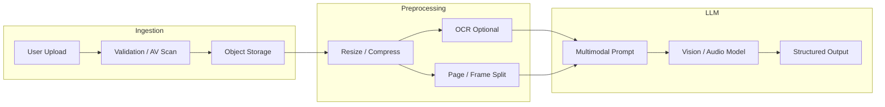
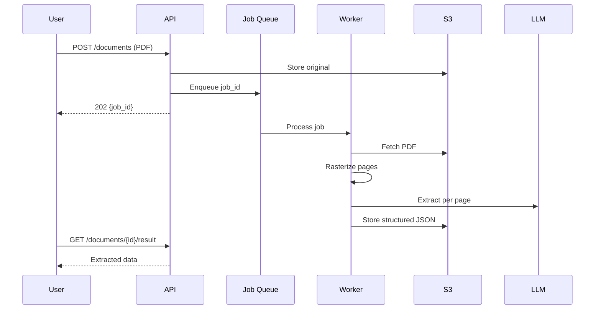

# Vision and Multimodal Models

> Engineering guide to vision, audio, and video inputs with LLMs — input formats, prompting strategies, OCR pipelines, and production workflows for document and media AI.

## Table of Contents

- [Overview](#overview)
- [Use Cases](#use-cases)
- [Multimodal Model Landscape](#multimodal-model-landscape)
- [Input Formats and Encoding](#input-formats-and-encoding)
- [Vision and Image Understanding](#vision-and-image-understanding)
- [OCR and Document Processing](#ocr-and-document-processing)
- [Audio Input and Speech](#audio-input-and-speech)
- [Video Understanding](#video-understanding)
- [Multimodal Prompting](#multimodal-prompting)
- [Engineering Workflows](#engineering-workflows)
- [Integration Patterns](#integration-patterns)
- [Production Usage](#production-usage)
- [Limitations](#limitations)
- [Common Mistakes](#common-mistakes)
- [Interview Preparation](#interview-preparation)
- [Navigation](#navigation)

---

## Overview

| Attribute | Value |
|-----------|-------|
| Category | Multimodal LLM Integration |
| Modalities | Text, image, audio, video, PDF |
| Primary APIs | Chat completions with content parts, dedicated vision/audio endpoints |
| Key Constraint | Context window consumed by pixels and frames, not just tokens |
| Typical Stack | Object storage → preprocessing → base64/URL → LLM API |

Multimodal models accept more than text — they reason over images, hear audio, and (increasingly) process video frames.
The engineering challenge is not calling the API; it is **preparing inputs**, **managing cost and latency**, and **validating outputs** reliably.

> **Production Standard:** Preprocess media in a dedicated pipeline stage. Never pass raw user uploads directly to the LLM without validation, resizing, and virus scanning.

---

## Use Cases

| Use Case | Fit | Notes |
|----------|-----|-------|
| Document Q&A (PDF, scans) | High | Combine OCR + vision or native PDF input |
| UI/screenshot analysis | High | Strong on GPT-4o, Claude, Gemini vision |
| Receipt/invoice extraction | High | Structured output + validation |
| Medical imaging | Low–Medium | Regulatory constraints; rarely production-ready |
| Real-time video analysis | Medium | Frame sampling + cost control |
| Speech-to-text + reasoning | High | Whisper/transcribe → LLM or native audio input |
| Image generation | N/A (separate) | DALL·E, Imagen — different API surface |
| RAG over images | Medium | Embed captions or use multimodal embeddings |

---

## Multimodal Model Landscape

| Provider | Vision | Audio In | Video | Native PDF | Notes |
|----------|--------|----------|-------|------------|-------|
| OpenAI | GPT-4o, o-series | Whisper + gpt-4o-audio | Limited / frame-based | Via file API | Strong general vision |
| Anthropic | Claude Sonnet/Opus | No native | Frame extraction | Convert to images | Excellent document understanding |
| Google Gemini | Gemini 2.x | Native audio | Native video upload | Supported | Long context, competitive pricing |
| Ollama (local) | LLaVA, Llama 3.2 Vision | Model-dependent | Frame extraction | Convert locally | Privacy, hardware limits |



---

## Input Formats and Encoding

### Image Representation

| Method | When to Use | Trade-off |
|--------|-------------|-----------|
| Base64 inline | Small images, few per request | Inflates payload ~33%, JSON size limits |
| HTTPS URL | Large images, CDN-hosted | Provider fetches URL; must be publicly reachable or signed |
| File API upload | PDFs, large assets, reuse across calls | Extra upload step; lower repeat transfer cost |
| Pre-signed S3/GCS URL | Production default | Time-limited access, no public bucket |

### Supported Image Types

Most providers accept `image/jpeg`, `image/png`, `image/webp`, and `image/gif` (first frame).
Reject exotic formats at validation — convert server-side with Pillow or ImageMagick.

### Size and Resolution Limits

| Provider (typical) | Max images/request | Resolution guidance |
|------------------|--------------------|---------------------|
| OpenAI | 500 (practical: <20) | Short side ≤ 2048 px; tile internally |
| Anthropic | 100 | Max 5 MB per image; auto-resize |
| Gemini | Model-dependent | 3072×3072 typical max |

Downscale before sending — a 4000×3000 phone photo rarely improves accuracy over 1568×1568.

```python
from io import BytesIO

from PIL import Image


def prepare_image(raw: bytes, max_side: int = 1568) -> bytes:
    img = Image.open(BytesIO(raw))
    img.thumbnail((max_side, max_side), Image.Resampling.LANCZOS)
    buf = BytesIO()
    img.save(buf, format="JPEG", quality=85, optimize=True)
    return buf.getvalue()
```

### Audio Formats

Common inputs: `mp3`, `wav`, `m4a`, `webm`, `flac`.
Normalize to mono 16 kHz PCM for speech models when preprocessing locally.

### Video Strategy

Full-video upload is expensive and slow.
Production pattern: extract keyframes (1 fps or scene-change detection), caption each frame or batch, then synthesize.

---

## Vision and Image Understanding

### OpenAI-Style Content Parts

```python
messages = [
    {
        "role": "user",
        "content": [
            {"type": "text", "text": "What is in this image?"},
            {
                "type": "image_url",
                "image_url": {"url": "https://cdn.example.com/photo.jpg", "detail": "high"},
            },
        ],
    }
]
```

`detail`: `"low"` (faster, cheaper, 512px) vs `"high"` (more tiles, better for fine text).

### Anthropic Image Blocks

```python
import base64

messages = [
    {
        "role": "user",
        "content": [
            {
                "type": "image",
                "source": {
                    "type": "base64",
                    "media_type": "image/jpeg",
                    "data": base64.b64encode(image_bytes).decode(),
                },
            },
            {"type": "text", "text": "Extract the table as JSON."},
        ],
    }
]
```

### Capability Matrix

| Task | Vision Model | Dedicated OCR |
|------|--------------|---------------|
| Scene description | Excellent | Overkill |
| Handwriting | Good | Better with OCR + LLM |
| Dense tables | Good | Hybrid often wins |
| Charts/graphs | Good | Validate numeric extraction |
| ID documents | Good | Add PII guardrails |

---

## OCR and Document Processing

### Pipeline Options

| Approach | Description | Best For |
|----------|-------------|----------|
| Native vision | Send page image directly to LLM | Quick prototypes, mixed layouts |
| OCR → text LLM | Tesseract, Azure DI, Google Document AI → text | High-volume, cost-sensitive |
| Hybrid | OCR for text + vision for layout/diagrams | Complex PDFs, forms |
| Structured extraction | Vision + JSON schema output | Invoices, contracts |

### PDF Handling

```python
# Option A: rasterize pages (pdf2image)
from pdf2image import convert_from_bytes

pages = convert_from_bytes(pdf_bytes, dpi=200)
for i, page in enumerate(pages):
    jpeg = page_to_jpeg(page)
    # send each page as image content part

# Option B: provider file API (OpenAI)
# Upload PDF once, reference file_id in subsequent messages
```

| DPI | Trade-off |
|-----|-----------|
| 150 | Fast, sufficient for printed text |
| 200 | Default for production OCR |
| 300+ | Diminishing returns, large payloads |

### OCR + LLM Pattern

```python
async def extract_invoice(image_bytes: bytes, ocr: OCRService, llm: LLMClient) -> dict:
    raw_text = await ocr.extract_text(image_bytes)
    prompt = f"""Extract invoice fields as JSON from this OCR text.
OCR may contain errors — correct obvious mistakes.

OCR TEXT:
{raw_text}
"""
    return await llm.complete_json(prompt, schema=InvoiceSchema)
```

Validate extracted fields with business rules (date ranges, checksums, vendor allowlists).

---

## Audio Input and Speech

### Transcription-First Pattern

```python
# OpenAI Whisper API
transcript = await client.audio.transcriptions.create(
    model="whisper-1",
    file=audio_file,
    response_format="verbose_json",
)
text = transcript.text
# Pass text to chat model for summarization, intent, etc.
```

### Native Audio Models

Some models accept audio directly in the chat message (e.g., `gpt-4o-audio-preview`, Gemini audio).
Use when you need prosody, speaker diarization hints, or non-speech sounds.

| Pattern | Latency | Cost | Use Case |
|---------|---------|------|----------|
| Whisper → text LLM | Two API calls | Lower model cost | Meetings, podcasts |
| Native audio LLM | Single call | Higher | Interactive voice agents |
| Streaming STT + LLM | Real-time | Complex infra | Voice copilots |

### Chunking Long Audio

Split audio > 25 MB (Whisper limit) or > 10 minutes with overlap:

```python
def chunk_audio(path: str, chunk_seconds: int = 600, overlap: int = 5) -> list[str]:
    # return list of temp file paths
    ...
```

Stitch transcripts with timestamp metadata; deduplicate overlap regions.

---

## Video Understanding

### Frame Extraction Workflow

```python
import cv2


def extract_keyframes(video_path: str, every_n_seconds: int = 2) -> list[bytes]:
    cap = cv2.VideoCapture(video_path)
    fps = cap.get(cv2.CAP_PROP_FPS)
    interval = int(fps * every_n_seconds)
    frames = []
    idx = 0
    while cap.isOpened():
        ret, frame = cap.read()
        if not ret:
            break
        if idx % interval == 0:
            frames.append(encode_jpeg(frame))
        idx += 1
    cap.release()
    return frames
```

### Prompting Over Frames

```python
content = [{"type": "text", "text": "Summarize this video. Frames are in chronological order."}]
for i, frame in enumerate(frames[:30]):  # cap frame count
    content.append({
        "type": "image_url",
        "image_url": {"url": f"data:image/jpeg;base64,{b64encode(frame).decode()}"},
    })
```

Cap frames sent — 30 frames at high detail can exceed context and budget.

### Gemini Native Video

Gemini supports video file upload with temporal understanding — prefer for holistic video Q&A when available.
Still apply duration limits and cost caps.

---

## Multimodal Prompting

### Structure the Instruction

```text
You are a document extraction assistant.

TASK: Extract all line items from the invoice image.

RULES:
- Return valid JSON matching the provided schema.
- If a field is illegible, use null — do not guess.
- Amounts must include currency code.

OUTPUT: JSON only, no markdown fences.
```

Place the instruction **after** images for some models (Claude often performs better with text last for extraction tasks) — **test both orderings** for your model.

### Few-Shot with Images

Include 1–2 example image + expected output pairs for consistent formatting.
Store few-shot assets in versioned object storage, not inline in code.

### Chain of Thought for Vision

For complex diagrams: "First describe what you see, then answer the question."
Use hidden reasoning models (o-series) when accuracy matters more than showing steps.

### Grounding and Hallucination Control

| Technique | Purpose |
|-----------|---------|
| "Only use visible information" | Reduce invented fields |
| JSON schema + validation | Reject invalid structure |
| Confidence per field | Flag low-confidence for human review |
| Second-pass verification | Smaller model checks extraction |

---

## Engineering Workflows

### Document Ingestion Pipeline



See [File Handling for AI](../backend-engineering/file-handling-for-ai.md) for upload patterns.

### Synchronous vs Async

| Mode | When |
|------|------|
| Sync (< 10 s) | Single image Q&A, screenshot analysis |
| Async (202 + poll/webhook) | Multi-page PDF, video, batch OCR |
| Streaming | Interactive vision chat with progressive text |

### Caching

Cache by content hash for idempotent extractions:

```python
cache_key = f"extract:v1:{sha256(image_bytes).hexdigest()}"
```

Invalidate on prompt version change — include prompt version in the key.

---

## Integration Patterns

### 1. Image Q&A Endpoint

FastAPI accepts upload, preprocesses, calls vision model, returns answer.
Rate-limit by image size and count.

### 2. RAG with Visual Documents

- Ingest: OCR each page → chunk text → embed
- Optional: store page thumbnails linked to chunks
- Query: text retrieval → include source page image in multimodal context

### 3. Human-in-the-Loop Extraction

LLM proposes structured data → queue for review if confidence < threshold → commit to database on approval.

### 4. Agent with Vision Tools

Agent calls `capture_screenshot` or `read_document` tool → tool returns image or text → model reasons over result.
Prefer tools over stuffing all images into every turn.

---

## Production Usage

> **Production Standard:** Validate file type and size, scan for malware, resize media, redact PII before logging, and enforce per-tenant quotas on multimodal requests.

### Security

- Reject polyglot files and executables masquerading as images
- Strip EXIF GPS and device metadata before storage
- Never log base64 image payloads
- Signed URLs with short TTL for provider fetches

### Cost Control

| Lever | Action |
|-------|--------|
| Resolution | Downscale before API call |
| Detail level | Use `low` for classification, `high` for OCR |
| Batching | Group pages only when layout spans pages |
| Model tier | Mini/Flash for classification, Pro for extraction |
| Caching | Hash-based dedup on identical uploads |

### Observability

Log per request: `modality`, `file_size_bytes`, `page_count`, `model`, `input_tokens`, `output_tokens`, `latency_ms`, `prompt_version`.

### Compliance

Medical, legal, and financial document pipelines may require:

- Data residency (EU-only processing)
- No training on customer data (enterprise API terms)
- Retention limits on stored images
- Audit trail for human corrections

---

## Limitations

- Vision models hallucinate text that is not in the image — always validate extractions
- Handwriting and low-contrast scans remain error-prone
- Video understanding via frames loses audio and motion context
- Context windows fill quickly with high-detail images
- Latency scales with image count and resolution
- Local multimodal models require significant GPU memory (see [Ollama](providers/ollama.md))
- Regulatory restrictions may prohibit cloud processing of certain document types

---

## Common Mistakes

| Mistake | Impact | Fix |
|---------|--------|-----|
| Sending full-resolution photos | Cost, latency, timeouts | Resize server-side |
| No file validation | Security risk | Magic-byte check + size limit |
| OCR skipped for bulk docs | High vision API cost | Hybrid OCR pipeline |
| All pages in one request | Context overflow | Page-by-page with merge |
| Trusting extracted numbers | Financial errors | Schema validation + rules |
| EXIF in logs | PII leak | Strip metadata |
| One prompt for all doc types | Poor accuracy | Per-template prompts |

---

## Interview Preparation

### Frequently Asked Questions

**Q1: How would you build a PDF Q&A system?**

> **Strong answer:** Upload to object storage, async job queue, rasterize or use native PDF support, chunk/OCR pages, embed for retrieval or direct vision Q&A per page, structured citations back to page numbers.

**Q2: When do you use OCR vs native vision?**

> **Strong answer:** OCR for high-volume text-heavy docs (cost, speed). Vision for layout, diagrams, handwriting, or mixed content. Hybrid for forms with checkboxes and tables.

**Q3: How do you prevent hallucinated invoice fields?**

> **Strong answer:** JSON schema validation, business rules, confidence thresholds, human review queue, optional second-pass verification, never auto-pay on LLM output alone.

### Real-World Scenario

**Scenario:** A startup sends 300 DPI full-page scans of 50-page contracts in a single API call and hits timeouts.

> **Discussion points:** Page splitting, DPI reduction, async processing, per-page extraction, merge strategy, cost estimate per document.

---

## Navigation

### Prerequisites

- [LLM Streaming](llm-streaming.md)
- [File Handling for AI](../backend-engineering/file-handling-for-ai.md)

### Related Topics

- [OpenAI Provider Guide](providers/openai.md)
- [Google Gemini Provider Guide](providers/google-gemini.md)
- [Anthropic Claude Provider Guide](providers/anthropic-claude.md)

### Next Topics

- [Embeddings](../../domains/embeddings/README.md) — multimodal embeddings
- [RAG Systems](../../domains/rag/README.md) — document retrieval pipelines

---

## See Also

- [LLM Engineering Domain Index](README.md)
- [Validation for AI APIs](../backend-engineering/validation-for-ai-apis.md)
- [Security for AI Backends](../security/security-for-ai-backends.md)

## Changelog

| Version | Date | Changes |
|---------|------|---------|
| 1.0 | 2026-07-13 | Initial version |
