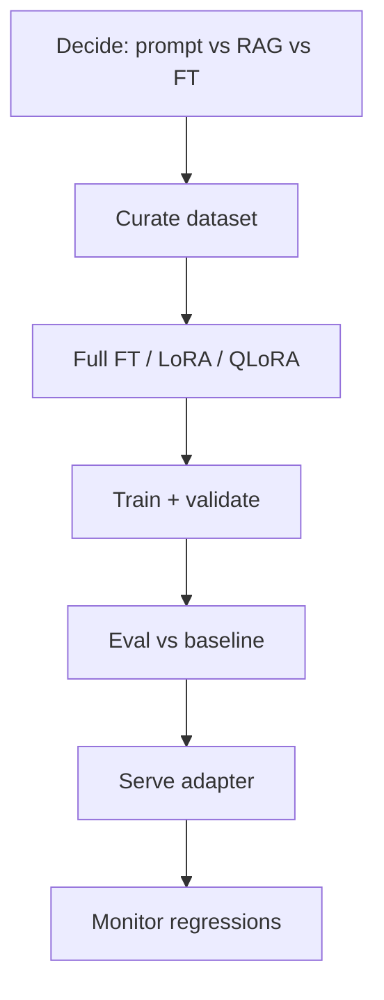

# LLM Fine-Tuning

> Adapting pretrained LLMs with your data — when to fine-tune, how LoRA/QLoRA work, and how to evaluate adapters safely.

**Prerequisites:** [Large Language Models](../llm-engineering/README.md) · [Deep Learning](../deep-learning/README.md)  
**Unlocks:** [LLM Evaluation](../ai-evaluation/README.md) · [MLOps & LLMOps](../mlops-llmops/README.md)

---

## Definition

**Fine-tuning** updates (a subset of) a pretrained model's weights on task- or domain-specific data so behavior changes beyond what prompting alone achieves. Parameter-efficient methods (LoRA/QLoRA) adapt small adapter matrices instead of full fine-tuning.

---

## Learning path

---

## Documents

| # | Topic | Document |
|---|-------|----------|
| 1 | When to fine-tune | [when-to-fine-tune.md](when-to-fine-tune.md) |
| 2 | Fine-tuning methods | [fine-tuning-methods.md](fine-tuning-methods.md) |
| 3 | Dataset & eval for FT | [fine-tuning-data-and-eval.md](fine-tuning-data-and-eval.md) |

---

## Related topics

- [RAG](../rag/README.md) (often better for knowledge)
- [Prompt Engineering](../prompt-engineering/README.md)
- [LLM Evaluation](../ai-evaluation/README.md)

---

## See also

- [Domains overview](../README.md)
- [Learning Roadmap](../../meta/roadmap.md)
- [Master Index](../../meta/indexes/MASTER-INDEX.md)
