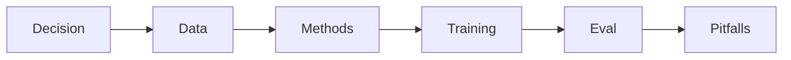

# LLM Fine-Tuning

> Specialize models with data, PEFT, alignment, eval gates, and adapter serving — nested Handbooks curriculum.

**Prerequisites:** [Large Language Models](../llm-engineering/README.md) · [Prompt Engineering](../prompt-engineering/README.md)  
**Unlocks:** [LLM Evaluation](../ai-evaluation/README.md) · [MLOps & LLMOps](../mlops-llmops/README.md)

Start with a section hub below (or expand the topic in the left sidebar).

---

## Sections

| # | Section | What you will learn | Hub |
|---|---------|---------------------|-----|
| 1 | **Decision** | When FT is justified | [decision/](decision/README.md) |
| 2 | **Data** | Datasets and cleaning | [data/](data/README.md) |
| 3 | **Methods** | FT and alignment methods | [methods/](methods/README.md) |
| 4 | **Training Ops** | Configs, artifacts, GPUs | [training-ops/](training-ops/README.md) |
| 5 | **Eval & Deploy** | Gates and serving | [eval-and-deploy/](eval-and-deploy/README.md) |
| 6 | **Pitfalls** | Forgetting, overfit, legal | [pitfalls/](pitfalls/README.md) |

---

## Hierarchy

### Decision

| # | Topic |
|---|-------|
| 1 | [When to Fine-Tune](decision/01-when-to-fine-tune.md) |
| 2 | [PE vs RAG vs Fine-Tuning](decision/02-pe-vs-rag-vs-ft.md) |
| 3 | [ROI and Readiness Checklist](decision/03-roi-and-readiness.md) |

### Data

| # | Topic |
|---|-------|
| 1 | [SFT Datasets](data/01-sft-datasets.md) |
| 2 | [Preference and Alignment Data](data/02-preference-data.md) |
| 3 | [Cleaning and Leakage Control](data/03-cleaning-and-leakage.md) |

### Methods

| # | Topic |
|---|-------|
| 1 | [Fine-Tuning Methods Overview](methods/01-fine-tuning-methods.md) |
| 2 | [LoRA and QLoRA](methods/02-lora-and-qlora.md) |
| 3 | [Adapters and Full Fine-Tuning](methods/03-adapters-and-full-ft.md) |
| 4 | [DPO, ORPO, and RLHF Overview](methods/04-dpo-orpo-rlhf.md) |

### Training Ops

| # | Topic |
|---|-------|
| 1 | [Training Configs](training-ops/01-training-configs.md) |
| 2 | [Checkpoints and Artifacts](training-ops/02-checkpoints-and-artifacts.md) |
| 3 | [GPUs and Training Cost](training-ops/03-gpus-and-cost.md) |

### Eval & Deploy

| # | Topic |
|---|-------|
| 1 | [Fine-Tuning Data and Eval](eval-and-deploy/01-fine-tuning-data-and-eval.md) |
| 2 | [Regression vs Base Model](eval-and-deploy/02-regression-vs-base.md) |
| 3 | [Serving Adapters](eval-and-deploy/03-serving-adapters.md) |

### Pitfalls

| # | Topic |
|---|-------|
| 1 | [Catastrophic Forgetting](pitfalls/01-catastrophic-forgetting.md) |
| 2 | [Overfitting Style and Spurious Patterns](pitfalls/02-overfit-style.md) |
| 3 | [License and Data Risk](pitfalls/03-license-and-data-risk.md) |

---

## Definition

**LLM fine-tuning** updates model weights (or adapters) so behavior matches a target domain, style, or policy better than prompting and retrieval alone.

---

## Related topics

- [Domains overview](../README.md)
- [Master Index](../../meta/indexes/MASTER-INDEX.md)
