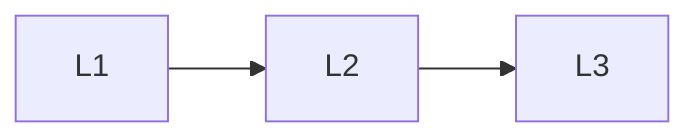

# Data

> Section of the **llm-fine-tuning** handbook.

## Lessons

| # | Lesson |
|---|--------|
| 1 | [SFT Datasets](01-sft-datasets.md) |
| 2 | [Preference and Alignment Data](02-preference-data.md) |
| 3 | [Cleaning and Leakage Control](03-cleaning-and-leakage.md) |

**Topic hub:** [../README.md](../README.md)
