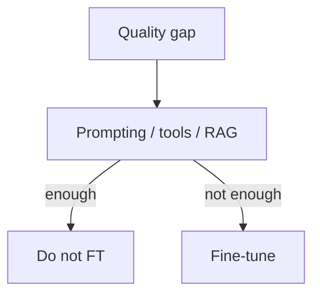

# When to Fine-Tune

> Choosing fine-tuning only when prompting, tooling, and retrieval cannot meet quality, latency, or style constraints at acceptable cost.

## Table of Contents

- [Overview](#overview)
- [Definition](#definition)
- [Why It Matters](#why-it-matters)
- [Uses](#uses)
- [How It Works](#how-it-works)
- [Worked Example](#worked-example)
- [Python Examples](#python-examples)
- [Production Considerations](#production-considerations)
- [Performance Considerations](#performance-considerations)
- [Cost Considerations](#cost-considerations)
- [Security Considerations](#security-considerations)
- [Best Practices](#best-practices)
- [Common Mistakes](#common-mistakes)
- [Interview Preparation](#interview-preparation)
- [Navigation](#navigation)

---

## Overview

This lesson covers **When to Fine-Tune** inside the `decision` section of the `llm-fine-tuning` handbook. Treat it as production engineering guidance: clear definitions, when to apply the idea, system shape, and code you can adapt.

---

## Definition

**When to Fine-Tune** — Choosing fine-tuning only when prompting, tooling, and retrieval cannot meet quality, latency, or style constraints at acceptable cost.

---

## Why It Matters

Fine-tuning is expensive to run and maintain. A decision framework prevents premature specialization and sunk-cost model forks.

Without a clear model for this topic, teams ship demos that fail under load, cost, or correctness pressure.

---

## Uses

| Use case | How this applies |
|----------|------------------|
| Style lock-in | Brand voice that prompting cannot hold |
| Domain jargon | Consistent internal taxonomies |
| Latency | Smaller specialized model vs huge prompted one |

---

## How It Works

Compare PE, RAG, and FT on the same eval set. Fine-tune only if the gap remains after strong baselines.



---

## Worked Example

Support bot SKU accuracy is 70% with RAG; after FT on ticket pairs, 92% on a smaller model.

---

## Python Examples

```python
from dataclasses import dataclass

@dataclass
class FTDecision:
    pe_score: float
    rag_score: float
    latency_ms: float
    label_budget: int

def should_fine_tune(d: FTDecision) -> bool:
    baseline = max(d.pe_score, d.rag_score)
    if baseline >= 0.9:
        return False
    if d.label_budget < 500:
        return False
    if d.latency_ms > 800 and baseline < 0.85:
        return True
    return baseline < 0.8

```

---

## Production Considerations

- Log request IDs across orchestration steps.
- Fail closed on auth and policy; degrade only where product explicitly allows it.
- Keep feature flags for prompt/model swaps.

## Performance Considerations

- Bound concurrency to the model provider.
- Stream when UX needs time-to-first-token.
- Cache stable sub-results carefully with invalidation rules.

## Cost Considerations

- Track tokens and tool calls per feature / tenant.
- Prefer smaller models for routers and classifiers.
- Cap max tokens and tool-loop iterations.

## Security Considerations

- Never put secrets in prompts.
- Treat model output as untrusted until validated.
- Enforce tenant isolation on retrieval and tools.

---

## Best Practices

1. Prefer explicit interfaces over prompt-only business logic.
2. Measure latency, cost, and quality together.
3. Keep prompts and configs versioned.

---

## Common Mistakes

- Shipping without golden evals.
- Hiding critical state only inside the model context.
- No timeouts or budget limits on model calls.

---

## Interview Preparation

**Q: What belongs in the app vs the prompt?**

A: Deterministic rules, auth, billing, and validation stay in code; stylistic and interpretive behavior can live in prompts.

**Q: How do you roll out a change safely?**

A: Version it, shadow or A/B on a slice, watch eval + online metrics, keep a one-click rollback.

---

## Navigation

- **Section hub:** [README](README.md)
- **Topic hub:** [../README.md](../README.md)
