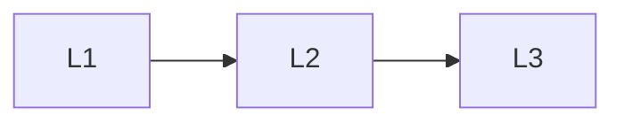

# Decision

> Section of the **llm-fine-tuning** handbook.

## Lessons

| # | Lesson |
|---|--------|
| 1 | [When to Fine-Tune](01-when-to-fine-tune.md) |
| 2 | [PE vs RAG vs Fine-Tuning](02-pe-vs-rag-vs-ft.md) |
| 3 | [ROI and Readiness Checklist](03-roi-and-readiness.md) |

**Topic hub:** [../README.md](../README.md)
