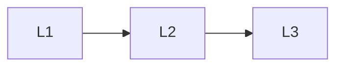

# Eval & Deploy

> Section of the **llm-fine-tuning** handbook.

## Lessons

| # | Lesson |
|---|--------|
| 1 | [Fine-Tuning Data and Eval](01-fine-tuning-data-and-eval.md) |
| 2 | [Regression vs Base Model](02-regression-vs-base.md) |
| 3 | [Serving Adapters](03-serving-adapters.md) |

**Topic hub:** [../README.md](../README.md)
