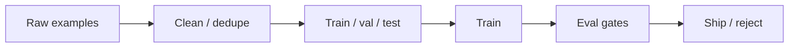

# Fine-Tuning Data and Evaluation

> Dataset quality, splits, and gates before shipping an adapter.

## Definition

FT data should be clean, representative, and de-duplicated against eval. Include instructions, inputs, and high-quality targets. Evaluate with task metrics plus general regression suites (safety, core skills).

## Why it matters

Models learn your data bugs. Quiet label errors become confident product errors.

## How it works

## Key principles

1. **Gold > volume** — 1k clean beats 50k messy.
2. **Regression suites** — Don't only test the new skill.
3. **License & privacy** — Training data is a compliance surface.

## Common applications

| Application | Description |
|-------------|-------------|
| SFT corpora | Internal playbooks rewritten as chat |
| Synthetic data | Generate then human-filter |
| Continuous FT | Only with strong gates |

## Common mistakes

- Training on eval prompts
- No safety regression tests

## Further reading

- [LLM Evaluation](../ai-evaluation/README.md)
- [MLOps & LLMOps](../mlops-llmops/README.md)
